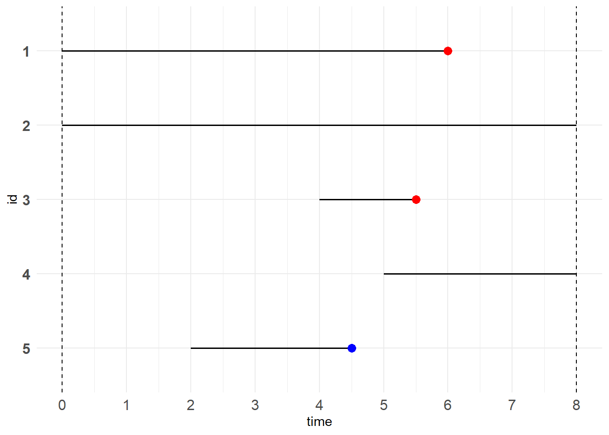

# 生存分析 {#survival}

生存分析方法研究一个感兴趣的事件发生的时间。该事件可以是死亡、离婚、戒烟、设备故障等等。因此，“生存”二字不应与狭义上的“死亡”绑定，应当将“生存”视作一种“持续”，“死亡”则对应“事件的发生”。

## 基本概念 {#survival_1}

### 生存数据 {#survival_1_1}

在随访期（观察期）内，我们关心研究对象生存了多长时间，感兴趣的事件是否有发生。因此，每一个研究对象都可以由**生存时间、生存结局**这两个指标去描述。

在实践中，我们不可能有无限的时间去持续观察样本，因此会设置一段观察期。**生存时间**指的是样本自被观察起直到目标事件发生或者观察期止、中途丢失的持续时间，无论该样本是一开始就在还是中途加入。

若样本在观察期内确实发生了我们感兴趣的事件，那么我们可以记录该样本的**生存时间**及**生存结局**，不妨将其**生存结局**记为**1**(failure)。而对于那些在观察期内目标事件尚未发生或中途丢失的样本，我们同样可以记录其**生存时间**，并将其**生存结局**记为**0**(censoring)，称之为**删失**。

下面给出示例。

(\#fig:survival-p1)生存数据示例

图中红点代表目标事件的发生，蓝点代表样本丢失。由图可知第一个和第三个观测对象的**生存结局**是**1**，其余对象的**生存结局**是**0**。

| id | 生存时间 | 生存结局 |
|:--:|:--------:|:--------:|
| 1  |   6.0    |    1     |
| 2  |   8.0    |    0     |
| 3  |   1.5    |    1     |
| 4  |   3.0    |    0     |
| 5  |   2.5    |    0     |

### 删失 {#survival_1_2}

当我们无法准确获取研究对象自被观察起**至目标事件发生**的生存时间，便称这样的数据为**删失数据**，对应的生存时间为**不完全生存时间或截尾值**。

**删失**的原因有很多：

- 观察期结束了目标事件都还没有发生
- 观察对象失联，中途丢失
- 观察对象终止于其他事件
- ...
   
   例如我们对“肺癌”感兴趣，但患者还患有其他疾病，可能因其他疾病而死亡。
   
**删失**的类型可分为如下三种：

1. 右删失

   真正的生存时间大于或等于观测到的生存时间。
   
   例如研究对象直至观测期满都未发生目标事件，或者研究对象中途退出研究，我们不知道目标事件会在之后的什么时候发生，但至少比我们观测到的生存时间要长。
   
2. 左删失

   真正的生存时间小于或等于观测到的生存时间。
   
   例如想测试某个零件的使用寿命，但该零件内部已经有裂痕存在，因此实际观测到的使用寿命一定比新零件的使用寿命要短。
   
3. 区间删失

   只知道目标事件是在某个时间段内发生的，但不知道具体时间。
   
   例如核酸检验，第一次阴性，第二次阳性，那大概就是在这个时间段内被感染了，但不知道什么时候被感染。

### 函数 {#survival_1_3}

1. 生存函数

   记$T$为代表生存时间的随机变量，则其密度函数$f(t)$为
   
   $$
   f(t)=\lim_{\Delta t \rightarrow 0} \frac{P(t \leq T \leq t+\Delta t)}{\Delta t} (\#eq:eq1)
   $$
   
   记其累积分布函数为
   
   $$
   F(t)=P(T \leq t) (\#eq:eq2)
   $$
   
   定义**生存函数**为
   
   $$
   S(t)=P(T \gt t)=1-F(t) (\#eq:eq3)
   $$
   
   > $T \gt t$具有“生存”的意味
   
2. 危险函数

   $$
   \begin{aligned}
   h(t)&=\lim_{\Delta t \rightarrow 0}\frac{P(t \leq T \leq t+\Delta t \mid T \geq t)}{\Delta t} \\
   &= \lim_{\Delta t \rightarrow 0}\frac{F(t+\Delta t)-F(t)}{(1-F(t))\Delta t} \\
   &= \frac{f(t)}{S(t)} \\
   &= \frac{d}{dt}(-\ln S(t))
   \end{aligned} (\#eq:eq4)
   $$
   
   由定义可知，危险函数代表了即时事件发生率。
   
   故累积危险函数为
   
   $$
   H(t)=\int_0^t h(u)du=-\ln S(t)  (\#eq:eq5)
   $$

> 生存函数和危险函数、累积危险函数可以互相推导得到

----------

参考资料

1. https://zhuanlan.zhihu.com/p/497968260

## 算法复现 {#survival_2}

本节内容是对Simon等人[@survival_1]论文的复现。

### 符号与目标 {#survival_2_1}

#### 符号 {#survival_2_1_1}

1. $(y_i,x_i,\delta_i)$

   $y_i$：生存时间
   
   $x_i$：解释变量的向量，$x_i=(x_{i1},\cdots,x_{ip})$
   
   $\delta_i$：若为0，则为右删失数据；若为1，则为failure
   
2. $t_1<t_2<\cdots<t_m$ & $j(i)$

   $t_1<t_2<\cdots<t_m$：在$y$中选取$\delta=1$的数据，进行升序排列
   
   > 注意是从1到m
   
   $j(i)$：$t_i$对应的观测对象$j$
   
3. $R_i$

   满足$t_i \leq y_j$的$j$的集合
   
4. $\hat \eta=X\tilde \beta$

5. $z(\tilde \eta)=\tilde \eta-\mathcal{l}''(\tilde \eta)^{-1}l'(\tilde \eta)$

6. $C(\tilde \eta, \tilde \beta)$

   与$\beta$无关的项
   
7. $w(\tilde \eta)_i$

   $l''(\tilde \eta)$的第$i$个对角线元素
   
8. $C_k$

   满足$t_i \lt y_k$的$i$的集合
   
9. $D_i$

   对于有“结”的情况，failure time为$t_i$的集合

10. $\omega_i$
   
   权重
   
11. $d_i=\sum_{j \in D_i}\omega_j$

   failure time为$t_i$的观测对象的权重和
   

   

