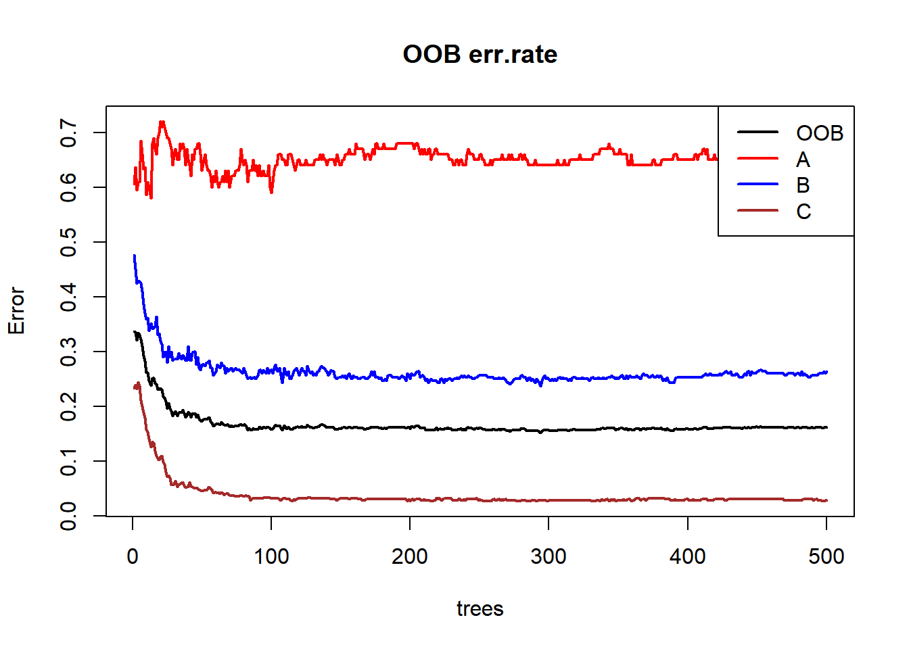
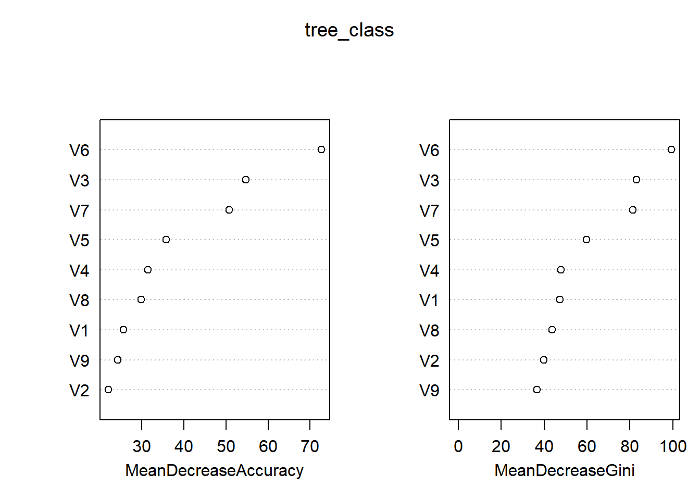
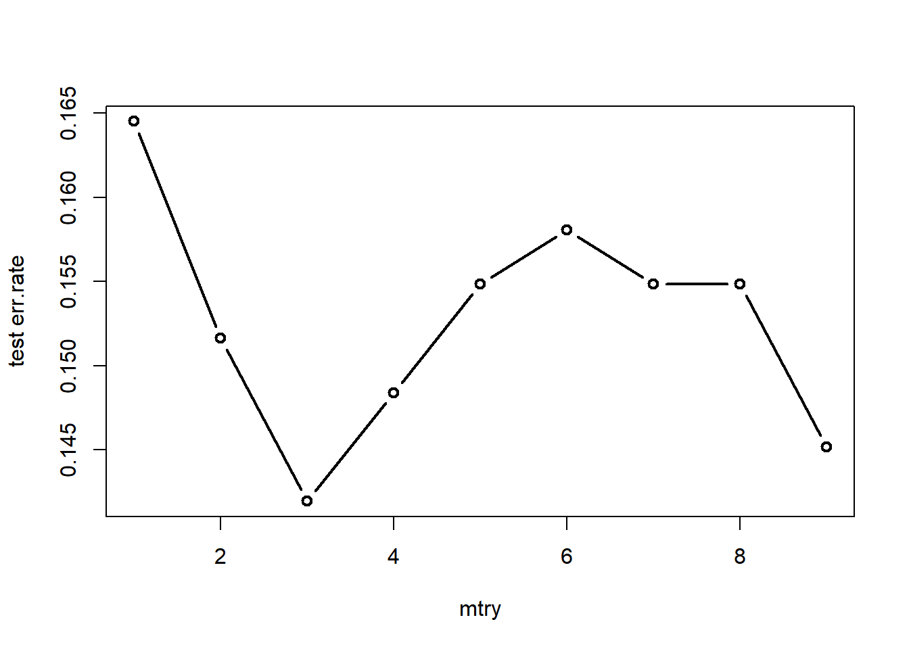
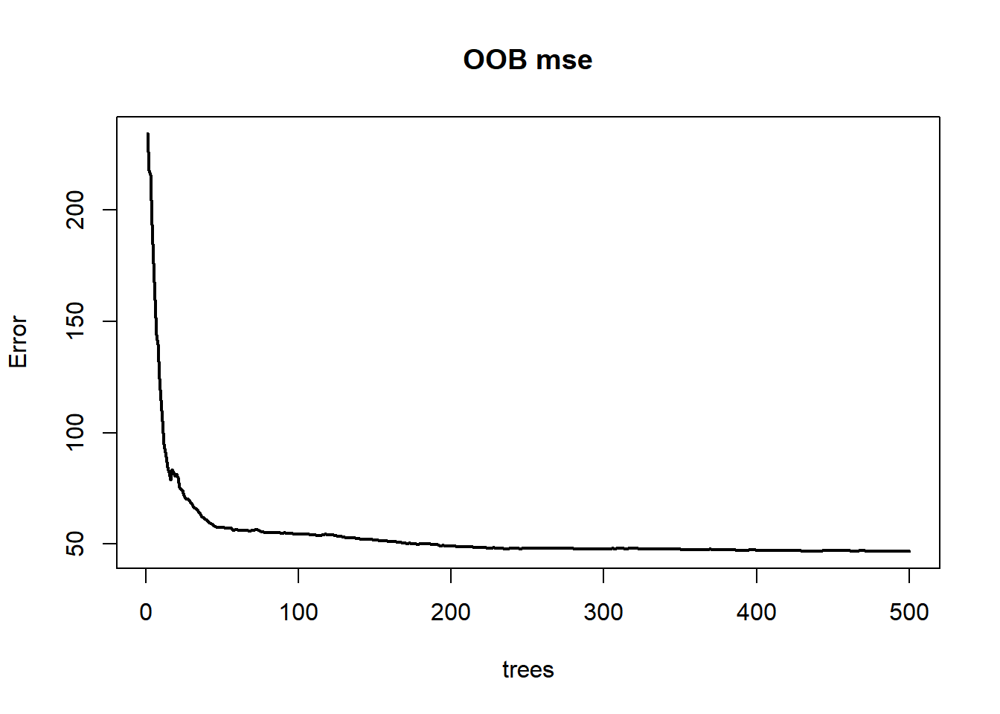
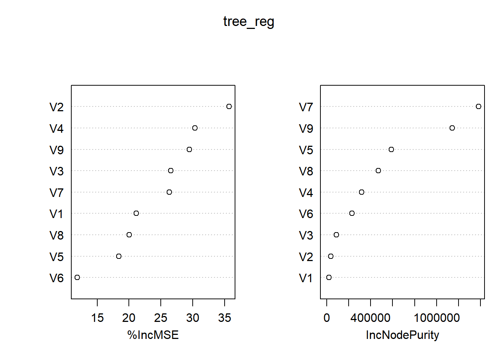
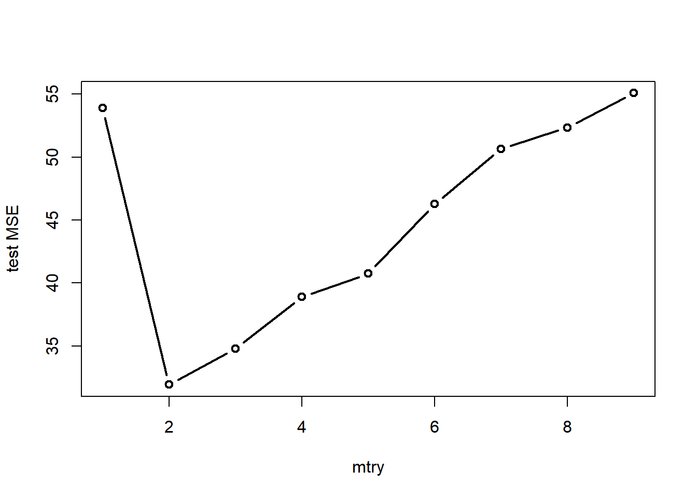

# 决策树与随机森林 {#tree}

决策树(Decision Tree)可用于分类和回归任务。决策树从根结点出发，在一定的判断标准下，决策树在每个内部结点上寻找合适的特征来划分样本，使得划分后的结点之间具有最大的区分度。对内部结点重复上述操作，便可得到多层结点，直至达到各个叶结点（终止结点）。

随机森林(random forest)是一种集成学习方法，主要用于分类和回归任务。“森林”意味着该模型是以决策树为基学习器，通过综合多个基学习器的结果来改善模型性能；“随机”意味着该模型不仅采用bootstrap法获得随机训练集，还在所有属性的一个随机子集中选择最优属性进行划分。

-----

参考资料

- 李高荣：《统计学习（R语言版）》

- 周志华：《机器学习》

## 决策树 {#tree_1}

### 分类树 {#tree_1_1}

分类树考虑响应变量为分类变量的情形，以叶结点处数量最多的类别作为叶结点的类别标签。首先考虑决策树是如何“生长”的，也就是根据什么准则来分裂结点。我们总是希望分裂后的结点中的样本尽可能的属于同一类别，即该结点有着较高的“纯度”。**一言以蔽之，划分的过程就是从混乱走向有序的过程。**

1. 信息增益

   考虑在结点$D$中的所有样本共属于$M$个类别，考虑信息熵$Ent(D)$
   
   $$
   \textrm{Ent}(D)=-\sum_{m=1}^Mp_m \log_2p_m (\#eq:tree-eq1)
   $$
   
   如何理解信息熵？可以这样简单理解：对于不确定的、离谱的事情，人们就会拿不准，从而产生疑惑，想要知道更多的信息，此时信息熵就大；而对于确定的、理所应当的事情，人们就会很有把握，不会多问，此时信息熵就小。举个例子，一枚正常硬币猜正反，无论猜正面朝上还是猜反面朝上，概率都是0.5，因此只能瞎猜，没有什么把握。但对于一枚有特殊倾向的硬币，即正面朝上概率为0.9，那么大家自然都会猜正面朝上，并且有很大的把握。**因此，信息熵是对不确定性的度量，信息熵越大，越不确定。**
   
   由此可得**信息增益**的定义：
   
   $$
   \textrm{Gain}(D,x)=\textrm{Ent}(D)-\sum_{v=1}^V\frac{n_v}{n}\textrm{Ent}(D^v) (\#eq:tree-eq2)
   $$
   
   其中$x$表示某个特征，$V$表示该特征有多少个取值，$n$和$n_v$分别表示原结点与各个分支结点的样本量。
   
   > 若$x$是连续变量，则可将其离散化，并且连续变量可以在后续划分中进一步细分，而离散变量只能使用一次。
   
   我们要寻求合适的特征使得划分后的子结点与原结点相比信息熵平均下降得最多。这就是信息增益的准则。
   
2. 增益率

   信息增益准则对取值数目较多的特征有所偏好。由此引入**增益率**，其定义为
   
   $$
   \textrm{Gain_ratio}(D,x)=\frac{\textrm{Gain}(D,x)}{\textrm{IV(x)}} (\#eq:tree-eq3)
   $$
   
   其中
   
   $$
   \textrm{IV}(x)=-\sum_{v=1}^V\frac{n_v}{n}\textrm{log}_2\frac{n_v}{n} (\#eq:tree-eq4)
   $$
   
   事实上，$\textrm{IV}(x)$就是信息熵的形式，可以视作某种对$x$取值数量的惩罚。
   
3. 基尼系数

   定义基尼系数
   
   $$
   \textrm{Gini}(D)=\sum_{m=1}^Mp_m(1-p_m)=1-\sum_{m=1}^Mp_m^2 (\#eq:tree-eq5) 
   $$
   
   直观来看，基尼系数衡量的就是从结点$D$中随机抽取两个样本，其类别不一致的概率。因此基尼系数越小，该结点纯度越高。
   


正如园艺里需要对植物进行修剪一样，决策树也能进行**剪枝**。决策树的剪枝策略分为**预剪枝**和**后剪枝**。

- 预剪枝

   在决策树的生成过程中，对每个结点在分裂前进行估计，若对该结点划分不能提高泛化能力，则停止划分并将该结点设置为叶结点。
   
   **预剪枝降低了过拟合的风险，但存在欠拟合的可能。**
   
- 后剪枝

   先完整地生成决策树，然后自下而上地对所有非叶结点进行考察。若将该非叶结点替换为叶结点后能够提升泛化性能，则进行替换。
   
   **后剪枝消耗的时间比预剪枝长，但欠拟合的风险较小，其泛化性能往往优于预剪枝策略。**
   


### 回归树 {#tree_1_2}

回归树考虑响应变量为连续变量的情形，以叶结点的响应变量平均值作为该叶结点的预测值。

回归树划分结点的准则多种多样，但都是类似的，如最小化平方误差MSE、最小化均方根误差RMSE、最小化平均绝对误差MAE等。

同样，回归树也能进行**剪枝**操作。

- 预剪枝

   回归树的预剪枝策略可以设置一个样本量阈值，当结点分裂后的样本量小于该阈值，则不进行分裂。
   
- 后剪枝

   后剪枝可以采取**代价复杂性剪枝**的策略，即先生成一棵完整的树，然后考虑如下的惩罚残差平方和函数
   
   $$
   \textrm{SSE}+\lambda|T|  (\#eq:tree-eq6) 
   $$
   
   其中$|T|$表示该棵决策树叶结点的数量。$\lambda$的值可通过交叉验证的方法进行确定。

## 随机森林 {#tree_2}

在介绍随机森林前，先介绍**装袋法Bagging**。

Bagging基于自助采样法bootstrap来抽取多个具有相同样本量的训练集，然后在各个训练集上对基学习器进行训练，最终将这些基学习器结合起来。而对于那些没有被纳入到训练集中的样本，可以作为测试集来计算测试误差，称为**袋外误差OOB-error**。

> 结合策略可以是投票法、简单平均法、加权平均法等策略。

随机森林，顾名思义，基于Bagging的方法构建多棵决策树形成森林，其“随机”不仅体现在训练集的随机，还体现在每棵决策树的初始特征也是随机选取的。这使得随机森林相较决策树有更加优秀的泛化能力。

## R实现 {#tree_3}

### 决策树 {#tree_3_1}

`rpart`包中的`rpart()`函数可以用来构建回归树和分类树。

> 树的形式为二叉树

1. `rpart()`参数

   - formula
   
      模型公式，看看谁是响应变量谁是预测变量。
      
   - data
   
      数据框。
      
   - weights
   
      设置权重。
      
   - subset
   
      指示数据框中的哪些样本会被用于建模。
      
   - na.action
   
      如何对待缺失值。默认使用`na.rpart()`函数，即删除缺失响应变量的样本或者缺失所有预测变量的样本（缺失部分预测变量也会被保留）。
      
   - method
   
      可选值为`anova`、`poisson`、`class`、`exp`。其中`anova`对应构建回归树，`class`对应构建分类树。
      
   - model
   
      是否在结果中保存模型框架。
      
      > 感觉用不上
      
   - x
   
      是否在结果中保存预测变量，默认为`FALSE`。
      
   - y 
   
      是否在结果中保存响应变量，默认为`TRUE`。
      
   - parms
   
      添加到分裂函数中的额外参数。对于回归树而言，不用额外添加。对于分类树，可传入一个列表，列表中分为三个元素：`prior`、`loss`、`split`，分别表示先验概率（正数，且总和需为1）、损失矩阵（规定了错分时的损失，要求对角线元素为0，非对角线元素为正）、划分标准（可选值为基尼系数`gini`、信息增益`information`）。
      
   - control
   
      为`rpart.control()`函数以列表形式传入的参数。
      
      > 详情建议问ai，懒癌犯了0.0
      
   - cost
   
      一个向量长度为预测变量数的非负向量，在拆分预测变量时用作缩放比例，默认为1。若该值越大，则对应预测变量的重要性程度越低。在量纲不一致的情形，该参数可用于减轻量纲带来的影响，因为算法会倾向于选择尺度较大的预测变量。
      
2. 其余函数

   - `rpart.control()`
   
      可更为细致地控制决策树的生长逻辑，如设置结点的最小训练样本数。
      
   - `prune()`
   
      用于剪枝。
      
   - `predict()`
   
      用于预测。
      
   - `rpart.plot`包
   
      用于绘制决策树的结果，是对`plot.rpart()`函数的拓展。

------

下面实战一下。

1. 分类任务

写到这不想写了，太晚了，有时间在补充。
 

### 随机森林 {#tree_3_2}

`randomForest`包是R中专门用来构建随机森林模型的包。下面将详细介绍包中的核心函数`randomForest()`，并罗列其余函数的作用。

1. 用途

   该函数使用Breiman的随机森林算法进行回归与分类任务。
   
2. 参数

   - x
   
      存储预测变量的数据框或矩阵。
      
   - y
   
      响应变量向量。若为因子型变量，则视为分类树，否则视为回归树。若为省略，则为无监督模式。
      
   - xtest
   
      预测变量的测试集，为数据框或矩阵格式。
      
   - ytest
   
      响应变量的测试集，向量格式。
      
   - ntree
   
      决策树的数目，默认为500。
      
   - mtry
   
      随机属性子集的大小。分类任务为属性总量的平方根，回归任务为属性总量三分之一。
      
   - weights
   
      权重向量，在采样时为训练集中的不同观测点设置权重。
      
   - replace
   
      是否为有放回抽样，默认为`TRUE`。
      
   - classwt
   
      在分类任务中，设置类的先验概率。注意传入的是一个向量，向量的分量表示不同类别的比例，这些分量无须加总为1。
      
   - cutoff
   
      在分类任务中，设置投票法的阈值，即超过多少比例才认为该观测点属于特定的一类。
      
   - strata
   
      一个被用于分层抽样的因子型变量。
      
   - sampsize
   
      样本容量。在分类任务中，若其为与`strata`相同长度的向量，则表示不同层的样本容量。
      
   - nodesize
   
      表示叶结点位置的最小样本数，默认分类任务为1，回归任务为5。
      
   - maxnodes
   
      表示叶结点的最大个数，若不指定，则决策树将会尽可能地生长。
      
   - importance
   
      是否评估预测变量的重要性，默认为`FALSE`。
      
   - localImp
   
      是否需要计算重要性度量，默认为`FALSE`。若为`TRUE`，则会覆盖掉`importance`参数。
      
      > 该参数和`importance`参数的区别貌似在于前者用于局部重要性度量，后者用于全局重要性度量。
      
   - nPerm
   
      在回归任务中，该参数用于评估变量重要性时对每棵树的袋外数据进行排列的次数。
      
   - proximity
   
      是否计算观测点之间的相似度。
      
   - oob.prox
   
      是否计算袋外数据观测点之间的相似度。
      
   - norm.votes
   
      在分类任务中，若为`TRUE`，则以比例形式展示最终的投票结果；若为`FALSE`，则展示原始票数。默认为`TRUE`。
      
   - do.trace
   
      是否在控制台输出详细的运行过程，默认为`FALSE`。若为整数，则表示每构建多少棵树就输出一次详情。
      
   - keep.forest
   
      是否在输出结果中保留森林。若给定了`xtest`，则默认为`FALSE`。
      
   - corr.bias
   
      在回归任务中，是否对回归结果进行偏差校正。
      
      > 该参数是实验性的，风险自担。
      
   - keep.inbag
   
      是否返回$n \times ntree$矩阵用以记录哪些观测点在哪棵树中被使用。
   

3. 输出

   - call
   
      模型的输入信息。
      
   - type
   
      树的类别，回归任务还是分类任务还是无监督模式。
      
   - predicted
   
      基于袋外样本的预测值。
   
   - importance
   
      重要性度量矩阵，返回所有变量的平均下降精度、平均下降基尼系数或者平均下降MSE。
      
   - importanceSD
   
      重要性度量的标准误矩阵。
      
   - localImp
   
      局部重要性度量矩阵，返回变量对观测点重要性的度量。
      
   - ntree
   
      决策树的数量。
      
   - mtry
   
      每个结点上随机属性子集的大小。
      
   - forest
   
      包含整个森林的列表。当`randomForest()`处于无监督模式或者`keep.forest`为`FALSE`时为NULL值。
      
   - err.rate
   
      在分类任务中，第i棵树及之前所有树在袋外数据中的分类错误率。
      
   - confusion
   
      在分类任务中，分类结果的混淆矩阵。
      
   - votes
   
      在分类任务中，显示得票比例或者得票数。
      
   - oob.times
   
      观测点归为袋外数据的次数。
      
   - proximity
   
      接近度矩阵，根据观测点在同一结点出现的频率来计算观测点之间的相似性。
      
   - mse
   
      回归任务中的均方误差。
      
   - rsq
   
      伪R方，$1-\frac{mse}{Var(y)}$
      
   - test
   
      若在输入中给出了测试集的数据，则在结果中会以列表形式存储关于测试集的有关结果。

`randomForest`包中的其余函数的作用如下表所示。


|        函数名        |                 用途                 |
|:--------------------:|:------------------------------------:|
|     classCenter      |          返回不同类别的原型          |
|       combine        |      将多个森林合并为一个大森林      |
|       getTree        |        从森林中提取一棵决策树        |
|         grow         |           为森林新添决策树           |
|      importance      |          提取变量重要性度量          |
|      imports85       |        一个UCI机器学习数据集         |
|        margin        |          计算或绘制分类边界          |
|       MDSplot        |      绘制接近度矩阵的多维尺度图      |
|     na.roughfix      |     利用中位数或众数来估算缺失值     |
|       outlier        |       根据接近度矩阵计算离群点       |
|     partialPlot      |             绘制偏依赖图             |
|  plot.randomForest   |   绘制随机森林的分类错误率或者MSE    |
| predict.randomForest |           用测试集进行预测           |
|        treecv        |      利用交叉验证法进行特征选择      |
|      treeImpute      | 利用接近度矩阵来估算自变量中的缺失值 |
|       treeNews       |     查看randomForest包的更新文件     |
|       treesize       |    查看每棵树的叶结点数或总结点数    |
|       tunetree       |      调优以寻找mtry的最优参数值      |
|      varImpPlot      |        可视化变量的重要性度量        |
|       varUsed        |   查看随机森林实际用到了哪些自变量   |

------

下面生成随机数据供随机森林进行模拟。


``` r
library(tidyverse)
library(randomForest)
library(MASS)  # 用到多元正态随机数
```

首先自定义函数，用于生成模拟数据。


``` r
# 自定义函数——生成多元正态数据
gen_data <- function(level, size, mu, sigma) {
    # 初始化数据框
    df = data.frame()

    # 生成每个类别的数据
    for (i in 1:level) {
        # 生成类别标签
        category_label = rep(LETTERS[i], size[i])

        # 生成数据
        category_data = as.data.frame(mvrnorm(n = size[i], mu = mu[[i]], Sigma = sigma[[i]]))

        # 添加类别标签
        category_data$category = factor(category_label)

        # 将数据添加到数据框
        df = rbind(df, category_data)
    }

    # 返回数据框
    return(df)
}
```


``` r
# 自定义函数——生成协方差矩阵
gen_sigma <- function(n) {
    # 生成一个n x n的随机矩阵
    L = matrix(runif(n * n, min = 1, max = 2), ncol = n)
    diag(L) = abs(diag(L))  # 确保对角线上的元素为正

    # 填充上三角部分为0
    L[upper.tri(L)] = 0

    # 计算Cholesky分解
    A = L %*% t(L)

    return(A)
}
```

1. 分类任务

这里生成具有3个水平的响应变量和9个预测变量。注意到不同类别之间的样本量存在一定的差异。


``` r
set.seed(123)
mu <- list(runif(9, min = 1, max = 4), runif(9, min = 1, max = 4), runif(9, min = 1,
    max = 4))
sigma <- list(gen_sigma(9), gen_sigma(9), gen_sigma(9))
df_train <- gen_data(level = 3, size = c(100, 300, 600), mu = mu, sigma = sigma)
df_test <- gen_data(level = 3, size = c(30, 100, 180), mu = mu, sigma = sigma)
```

接着运行模型。


``` r
tree_class <- randomForest(x = df_train[, -10], y = df_train$category, importance = T)
print(tree_class)
```

```
## 
## Call:
##  randomForest(x = df_train[, -10], y = df_train$category, importance = T) 
##                Type of random forest: classification
##                      Number of trees: 500
## No. of variables tried at each split: 3
## 
##         OOB estimate of  error rate: 16.2%
## Confusion matrix:
##    A   B   C class.error
## A 34  35  31  0.66000000
## B  3 221  76  0.26333333
## C  0  17 583  0.02833333
```

可以看到，袋外数据的分类错误率为16.2%。其中A类的分类错误率高达66%，这可能和训练集中的类别比例有关。

进一步地，绘制出分类错误率随决策树增加的变化趋势，可以更清晰地看到分类错误率的收敛情况。


``` r
plot(tree_class, col=c('black','red','blue','brown'), 
    lty=1, lwd=2, main='OOB err.rate')
legend('topright', legend=colnames(tree_class$err.rate), 
      col=c('black','red','blue','brown'),
      lty=1, lwd=2)
```

<div class="figure" style="text-align: center">

<p class="caption">(\#fig:tree-p1)袋外数据的分类错误率</p>
</div>

再来看看不同特征的重要程度。对于一棵树，在随机打乱某个特征的值的顺序之后，可以作差得到前后预测精度的下降情况，对于所有树取平均即可得到平均下降精度(MDA)。显然，如果MDA越大，说明该特征就越重要。同理，平均下降基尼系数(MDI)通过计算每个特征在所有树上节点分裂时导致的基尼系数平均下降量来评估特征的重要性。基尼系数反映了不纯度，下降得越多说明结点越容易从“不纯”走向了“纯”，意味着该特征在区分不同类别时能够较为显著地发挥作用。由图可知，两种评价准则得到的结果较为一致。


``` r
varImpPlot(tree_class)
```

<div class="figure" style="text-align: center">

<p class="caption">(\#fig:tree-p2)分类_重要性度量</p>
</div>

下面关注如何缓解类不平衡问题及如何选取最优参数`mtry`。

注意到训练集中类别的比例为1:3:6，存在一定程度的类不平衡问题。对此，在运行随机森林模型时可以设置`classwt`参数来设定各个类别的先验概率。


``` r
tree_class_prior <- randomForest(x = df_train[, -10], y = df_train$category, importance = T,
    proximity = T, classwt = c(1, 3, 6))
print(tree_class_prior)
```

```
## 
## Call:
##  randomForest(x = df_train[, -10], y = df_train$category, classwt = c(1,      3, 6), importance = T, proximity = T) 
##                Type of random forest: classification
##                      Number of trees: 500
## No. of variables tried at each split: 3
## 
##         OOB estimate of  error rate: 15.8%
## Confusion matrix:
##    A   B   C class.error
## A 32  37  31        0.68
## B  5 228  67        0.24
## C  0  18 582        0.03
```

而对于参数`mtry`的选取，除了可以使用`randomForest`包自带的`tunetree()`函数进行调参，还可以自己写个循环，直接根据测试集来选取最优参数。


``` r
err.rate <- c(1:9)
for (i in 1:9) {
    tree = randomForest(x = df_train[, -10], y = df_train$category, mtry = i)
    fit_test = predict(tree, df_test[, -10])
    err.rate[i] <- sum(fit_test != df_test$category)/nrow(df_test)
}
plot(1:9, err.rate, type = "b", lwd = 2, xlab = "mtry", ylab = "test err.rate")
```

<div class="figure" style="text-align: center">

<p class="caption">(\#fig:tree-p3)分类_mtry调优</p>
</div>

由图可知，当mtry=3时，在测试集上的袋外数据分类错误率达到最小，为14.2%。

2. 回归任务

这里首先生成自变量数据，然后在自变量的线性组合的基础上添加噪声，得到因变量数据。


``` r
set.seed(111)
mu <- list(runif(9, min = 1, max = 4))
sigma <- list(gen_sigma(9))
df_train <- gen_data(level = 1, size = c(1000), mu = mu, sigma = sigma)
df_train$epsilon <- rnorm(1000, sd = 3)
df_train <- df_train %>%
    mutate(y = 2 * V1 + 3 * V2 + V3 + 4 * V4 + 3 * V5 + V6 + 2 * V7 + 3 * V8 + 4 *
        V9 + epsilon)

df_test <- gen_data(level = 1, size = c(100), mu = mu, sigma = sigma)
df_test$epsilon <- rnorm(100, sd = 3)
df_test <- df_test %>%
    mutate(y = 2 * V1 + 3 * V2 + V3 + 4 * V4 + 3 * V5 + V6 + 2 * V7 + 3 * V8 + 4 *
        V9 + epsilon)
```

接着直接运行模型。


``` r
tree_reg <- randomForest(x = df_train[, 1:9], y = df_train$y, importance = T)
print(tree_reg)
```

```
## 
## Call:
##  randomForest(x = df_train[, 1:9], y = df_train$y, importance = T) 
##                Type of random forest: regression
##                      Number of trees: 500
## No. of variables tried at each split: 3
## 
##           Mean of squared residuals: 46.75519
##                     % Var explained: 98.91
```

从结果中可以看到，均方误差为46.7551872，自变量能解释的变异程度为98.91%。

进一步地，下面给出了模型的袋外数据MSE。


``` r
plot(tree_reg, main='OOB mse', lwd=2)
```

<div class="figure" style="text-align: center">

<p class="caption">(\#fig:tree-p4)袋外数据MSE</p>
</div>

再来看看特征的重要性度量。其中`%IncMSE`表示重排某个特征前后袋外数据MSE的上升百分比，上升的幅度越大，说明该特征对模型更加重要。`IncNodePurity`则表示结点分列时残差平方和的下降情况。


``` r
varImpPlot(tree_reg)
```

<div class="figure" style="text-align: center">

<p class="caption">(\#fig:tree-p5)回归_重要性度量</p>
</div>

最后，给模型参数`mtry`调调优。


``` r
mse <- c(1:9)
for (i in 1:9) {
    tree = randomForest(x = df_train[, 1:9], y = df_train$y, mtry = i)
    fit_test = predict(tree, df_test[, 1:9])
    mse[i] <- sum((fit_test - df_test$y)^2)/nrow(df_test)
}
plot(1:9, mse, type = "b", lwd = 2, xlab = "mtry", ylab = "test MSE")
```

<div class="figure" style="text-align: center">

<p class="caption">(\#fig:tree-p6)回归_mtry调优</p>
</div>

由图可知，当mtry=2时，在测试集上的袋外数据MSE达到最小，为31.9。
