# Manim {#manim}

`Manim`是Python的一个数学动画库，作者为“3Blue1Brown”。3Blue1Brown的[视频](https://space.bilibili.com/88461692?spm_id_from=333.337.0.0)非常精良，这种将知识与可视化结合的方式令人着迷。了解到他的动画均是由`Manim`制作，故开始上手学习。

本部分内容主要参考[Manim社区文档](https://docs.manim.community/en/stable/index.html)。

除了Manim社区文档，还有热心网友提供该文档的[中文版](https://github.com/MarkHoo/manim-docs-zh-hans)，同时你还可以在b站搜索相关的教程进行学习。

> 学习心得：
> 
> 建议先去了解python中关于“类”的知识点。
>
> 在我看完Manim社区文档“Quickstart”部分后，秉持着“用时再学”的原则,便直接开始上手创建自己的动画。但很可惜的是，虽然我知道我想表达什么，但对于制作动画而言还是过于宽泛了。在面对这一庞大的工程时，我难以形成一份具体的视频脚本，也就导致了我寸步难行。究其原因，我缺乏视频制作经验，以及缺乏对工具的了解（知识的贫穷限制了视频制作的想象力）。

> 2024.9.28
> 
> 终于将第一个Manim视频做完了。在掌握一定基础之后，发挥想象力，先将视频脚本构想出来，然后再去问AI或者翻找官方文档中的参考手册去看看有没有相应的办法，自己再捣鼓捣鼓就出来了。所以在“文本”这一节之后的所有内容就是提及自己用到的方法（例如物体移动、视角移动等），不做详尽的描述（做不完的）。
> 
> 在“[Manim动画](#animation)”这章我会提供我的Manim动画源码。


## 安装与创建 {#manim_1}

安装教程较多，大家可以自行搜索。这里就说说安装过程中遇到的问题，笔者用的是pycharm。

1. <u>在pycharm中运行示例代码，报错说是找不到ffmpeg。</u>这里可以参考(https://cloud.tencent.com/developer/article/1702673)

2. <u>运行示例代码后没有报错，但也没有视频。</u>打开终端，看路径是否与动画文件所在的路径一致，如果不一致，可以右键动画文件，在“打开于”中找到“终端”，此时终端的路径也会变为动画文件所在的文件夹中。之后在终端处输入命令`manim -pql example.py Example`即可。

附上使用的示例：


``` r
# example.py
from manim import *

class Example(Scene):
    def construct(self):
        t1=Text('你好！Manim')
        self.add(t1)
        self.wait(1)
        self.play(t1.animate.shift(UP*3))

        circle=Circle().set_color(BLUE)
        self.play(FadeIn(circle))
        self.play(circle.animate.set_fill(BLUE, opacity=0.5), run_time=1)
        self.wait(1)

        square=Square().set_color(RED).set_fill(RED, opacity=0.5)
        self.play(ReplacementTransform(circle, square, run_time=1))
        self.play(square.animate.set_fill(RED, opacity=0))
        self.wait(1)
```

<div class="figure" style="text-align: center">
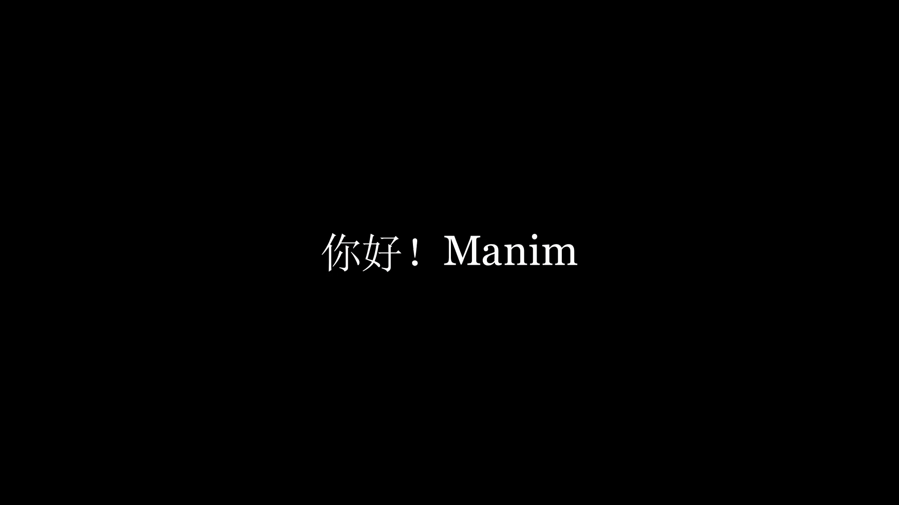
<p class="caption">(\#fig:manim-p1)示例</p>
</div>

## 初识Manim {#manim_2}

Manim最核心的三个部分为**Mobjects**、**Animations**、**Scenes**，即数学对象、动画、场景。

还是以上一节的代码为例。

我们创建了文本`Text`、圆形`Circle`、正方形`Square`，他们都是Mobjects。同时，我们用`.animate`方法将Mobjects的其他方法动画化（如平移`.shift()`、填充`.set_fill()`），用`FadeIn()`类完成渐入的动画效果，用`ReplacementTransform()`类完成将圆变换为正方形的动画效果。而所有这些都得在Scenes上进行，也就是将Mobjects添加`.add()`到画布上，或者在画布上完成动画效果`.play()`，并且所有的代码都得定义在`construct()`方法之中，而这个方法又属于一个继承了`Scene`类的类（这里是Example类）中。

其余细节可以查看代码中的注释。


``` r
# example.py
from manim import *

class Example(Scene):
    def construct(self):
        # 创建文本对象
        t1=Text('你好！Manim')
        # 将文本对象添加到画布中，默认在画面中心
        self.add(t1)
        # 视频等待1s
        self.wait(1)
        # 将文本上移三个单位这一行为动画化
        self.play(t1.animate.shift(UP*3))   # UP为常量，表示向上平移一个单位，同理有DOWN、LEFT、RIGHT等

        # 创建圆形对象并设置边框颜色
        circle=Circle().set_color(BLUE)     # BLUE为常量，表示蓝色，同理有RED、GREEN等
        # 为圆形对象播放渐入动画
        self.play(FadeIn(circle))
        # 将圆形对象设置填充色这一行为动画化，不透明度为0.5，持续时间为1s
        self.play(circle.animate.set_fill(BLUE, opacity=0.5), run_time=1)
        self.wait(1)

        # 创建正方形对象，并设置边框颜色和填充色
        square=Square().set_color(RED).set_fill(RED, opacity=0.5)
        # 实现从圆形变换为正方形的动画
        # ReplacementTransform表示变换前后对象主体变为后者，即样子变了，名字也变了
        # 如果是Transform(circle, square)则表示不更改对象主体，变换后依旧是前者，即样子变了但名字不变
        self.play(ReplacementTransform(circle, square, run_time=1))
        # 由于是ReplacementTransform，则主体变为正方形，故对正方形填充颜色这一行为进行动画化
        self.play(square.animate.set_fill(RED, opacity=0))
        self.wait(1)
```

再来说说输出命令`manim -pql example.py Example`。`manim`是必带的，`-pql`表示以低画质`-ql`制作视频，并在代码运行后预览`-p`动画，也就是会直接跳出视频来，不用去生成的文件夹里面找。之后再跟上python文件名`example.py`和你创建的类名`Example`即可。

## 输出设置 {#manim_3}

### 输出文件夹 {#manim_3_1}

在2.2节中，当你运行`manim -pql example.py Example`之后，就会在同目录中生成media文件夹，里面根据不同的数据类型设置了不同文件夹，如文本、视频、图片等等。你可以在videos文件夹下找到对应的文件名，从中可以找到最终的成片。而在partial_movie_files文件夹中则存放着一小段一小段的视频，可以发现最终的视频就是由这些不同的小视频组合在一起的。

### 片段 {#manim_3_2}

借助`self.next_section()`，你可以手动设置切片位置，使得除了生成完整视频外，还能生成不同视频片段，这些视频片段存储在与成片同目录的sections文件夹中。需要注意的是，每个视频片段不能仅有一帧内容，也就是说需要包含动画变换或者`self.wait()`。一旦引入了`self.next_section()`，事实上，你可以不用在`def construct(self):`的下一行紧跟`self.next_section()`，因为他会自动生成。这就好比剪一张纸条，`self.next_section()`的位置就是要剪开的位置，你是不需要在最开始那剪一刀的。

`next_section()`有三个参数：`name`、`type`、`skip_animations`。

- name

   字符串，该片段的名称，视频片段的文件名结构为“类名_编号_name”。
   
- type

   字符串，官方文档并没有介绍其用处，目前我只知道他的默认值为`DefaultSectionType`类的`NORMAL`属性。
   
- skip_animations

   布尔值，是否跳过该片段内的所有动画内容（包括`self.wait()`），默认为False。若为True，则在成片中并没有该段切片，但sections文件夹中依然会保留该段切片。

注意当你使用`self.next_section()`时，需要使用`manim -pql --save_sections example.py Example`才能将片段保存在sections文件夹中。
   

``` r
from manim import *

class Example(Scene):
    def construct(self):
        t1 = Text('你好！Manim')
        self.add(t1)
        self.wait(1)
        self.play(t1.animate.shift(UP * 3))

        self.next_section('part_1')

        circle = Circle().set_color(BLUE)
        self.play(FadeIn(circle))
        self.play(circle.animate.set_fill(BLUE, opacity=0.5), run_time=1)
        self.wait(1)

        self.next_section('part_2', skip_animations=True)

        square = Square().set_color(RED).set_fill(RED, opacity=0.5)
        self.play(ReplacementTransform(circle, square, run_time=1))
        self.play(square.animate.set_fill(RED, opacity=0))
        self.wait(1)
```

### 命令行标志 {#manim_3_3}

对于`manim -pql example.py Example`，其结构为`manim [OPTIONS] FILE [SCENES]`。

`OPTIONS`就是一些参数标志，例如`-p`表示在渲染后预览视频，`-ql`代表分辨率854x480及15 FPS。更多的参数设置请参见[第2.4.1节](#manim_4_1)

`SCENES`为你创建的类名。如果一个文件中仅有一个类，则可以省略该类名。如果有多个类，则指定输出特定类，类与类之间用空格隔开，如`manim -pql example.py ExampleOne ExampleTwo`。如果要输出所有的类，可以不用一一指名，直接在`OPTIONS`中使用`-a`标志即可。注意，一个类就相当于一个成片，一次性输出多个类意味着输出多个独立的成片。
   
## 配置 {#manim_4}

Manim有着非常广泛的配置系统，可以根据调整命令行参数(command-line interface, CLI)、更改ManimConfig类属性、创建配置文件。其中最为常用的就是调整命令行参数。

### 命令行参数 {#manim_4_1}

Manim中最为常用的命令就是`render`，也就是渲染命令。其一般的格式为`manim render [OPTIONS] FILE [SCENES]`。如果没有详细指名命令的话，则Manim默认使用`render`命令，也就是我们常见的`manim [OPTIONS] FILE [SCENES]`。

在终端处输入`manim --help`后，就可以发现除了`render`外的其他命令及选项，通过`manim [command]`或`manim [command] --help`查询详情。这里主要介绍`render`命令的相关设置。在终端处输入`manim render --help`即可查看渲染命令的一些参数设置，如下所示。


``` default
Manim Community v0.18.1

Usage: manim render [OPTIONS] FILE [SCENE_NAMES]...

  Render SCENE(S) from the input FILE.

  FILE is the file path of the script or a config file.

  SCENES is an optional list of scenes in the file.

Global options:
  -c, --config_file TEXT         Specify the configuration file to use for
                                 render settings.
  --custom_folders               Use the folders defined in the [custom_folders]
                                 section of the config file to define the output
                                 folder structure.
  --disable_caching              Disable the use of the cache (still generates
                                 cache files).
  --flush_cache                  Remove cached partial movie files.
  --tex_template TEXT            Specify a custom TeX template file.
  -v, --verbosity [DEBUG|INFO|WARNING|ERROR|CRITICAL]
                                 Verbosity of CLI output. Changes ffmpeg log
                                 level unless 5+.
  --notify_outdated_version / --silent
                                 Display warnings for outdated installation.
  --enable_gui                   Enable GUI interaction.
  --gui_location TEXT            Starting location for the GUI.
  --fullscreen                   Expand the window to its maximum possible size.
  --enable_wireframe             Enable wireframe debugging mode in opengl.
  --force_window                 Force window to open when using the opengl
                                 renderer, intended for debugging as it may
                                 impact performance
  --dry_run                      Renders animations without outputting image or
                                 video files and disables the window
  --no_latex_cleanup             Prevents deletion of .aux, .dvi, and .log files
                                 produced by Tex and MathTex.
  --preview_command TEXT         The command used to preview the output file
                                 (for example vlc for video files)

Output options:
  -o, --output_file TEXT         Specify the filename(s) of the rendered
                                 scene(s).
  -0, --zero_pad INTEGER RANGE   Zero padding for PNG file names.  [0<=x<=9]
  --write_to_movie               Write the video rendered with opengl to a file.
  --media_dir PATH               Path to store rendered videos and latex.
  --log_dir PATH                 Path to store render logs.
  --log_to_file                  Log terminal output to file.

Render Options:
  -n, --from_animation_number TEXT
                                 Start rendering from n_0 until n_1. If n_1 is
                                 left unspecified, renders all scenes after n_0.
  -a, --write_all                Render all scenes in the input file.
  --format [png|gif|mp4|webm|mov]
  -s, --save_last_frame          Render and save only the last frame of a scene
                                 as a PNG image.
  -q, --quality [l|m|h|p|k]      Render quality at the follow resolution
                                 framerates, respectively: 854x480 15FPS,
                                 1280x720 30FPS, 1920x1080 60FPS, 2560x1440
                                 60FPS, 3840x2160 60FPS
  -r, --resolution TEXT          Resolution in "W,H" for when 16:9 aspect ratio
                                 isn't possible.
  --fps, --frame_rate FLOAT      Render at this frame rate.
  --renderer [cairo|opengl]      Select a renderer for your Scene.
  -g, --save_pngs                Save each frame as png (Deprecated).
  -i, --save_as_gif              Save as a gif (Deprecated).
  --save_sections                Save section videos in addition to movie file.
  -t, --transparent              Render scenes with alpha channel.
  --use_projection_fill_shaders  Use shaders for OpenGLVMobject fill which are
                                 compatible with transformation matrices.
  --use_projection_stroke_shaders
                                 Use shaders for OpenGLVMobject stroke which are
                                 compatible with transformation matrices.

Ease of access options:
  --progress_bar [display|leave|none]
                                 Display progress bars and/or keep them
                                 displayed.
  -p, --preview                  Preview the Scene's animation. OpenGL does a
                                 live preview in a popup window. Cairo opens the
                                 rendered video file in the system default media
                                 player.
  -f, --show_in_file_browser     Show the output file in the file browser.
  --jupyter                      Using jupyter notebook magic.

Other options:
  --help                         Show this message and exit.

Made with <3 by Manim Community developers.
```

> 虽然选项挺多的，但实际考察后，对我来说估计只能用到其中一部分。
> 
> 下面是一些例子。
> 
> manim -pql -o 样例 demo.py Example    输出的视频文件名称为“样例”
> 
> manim -pql -n 1,4 demo.py Example    只渲染第2个到第4个动画
> 
> manim -apql demo.py    输出demo.py文件中所有的类
>
> manim -pql --format gif demo.py Example    输出格式为gif
>
> manim -pqh --progress_bar display demo.py Example  视频质量高，并显示渲染进度条
> 
> manim -pql -r 1920,1080 --fps 54 demo.py Example    设置分辨率为1920x1080，帧率为54FPS

### ManimConfig类 {#manim_4_2}

通过更改`config`对象的属性是确定Manim全局配置最直接的方式。`config`对象在`ManimConfig`类中，主要有两种方式（官方文档中建议第一种方式）来设置属性，如下所示。


``` r
from manim import *
  
config.background_color = WHITE
config["background_color"] = WHITE

...
```

`config`对象的所有属性如下所示。需要注意的是，`ManimConfig`具有内部一致性，更改了某项属性就会影响与其相关联的属性，例如更改y轴的半径`frame_y_radius`就会影响到画面的高度`frame_height`。

> 平面直角坐标系的原点处于画面中心，向上是y轴正半轴，向右是x轴正半轴


``` r
['aspect_ratio', 'assets_dir', 'background_color', 'background_opacity',
'bottom', 'custom_folders', 'disable_caching', 'dry_run',
'ffmpeg_loglevel', 'flush_cache', 'frame_height', 'frame_rate',
'frame_size', 'frame_width', 'frame_x_radius', 'frame_y_radius',
'from_animation_number', 'fullscreen', 'images_dir', 'input_file', 'left_side',
'log_dir', 'log_to_file', 'max_files_cached', 'media_dir', 'media_width',
'movie_file_extension', 'notify_outdated_version', 'output_file', 'partial_movie_dir',
'pixel_height', 'pixel_width', 'plugins', 'preview',
'progress_bar', 'quality', 'right_side', 'save_as_gif', 'save_last_frame',
'save_pngs', 'scene_names', 'show_in_file_browser', 'sound', 'tex_dir',
'tex_template', 'tex_template_file', 'text_dir', 'top', 'transparent',
'upto_animation_number', 'use_opengl_renderer', 'verbosity', 'video_dir',
'window_position', 'window_monitor', 'window_size', 'write_all', 'write_to_movie',
'enable_wireframe', 'force_window']
```

### 配置文件 {#manim_4_3}

配置文件中你可以先创建一个`.txt`文件，在其中进行设置之后，再修改后缀名为`.cfg`即可创建配置文件，而且这个配置文件必须命名为`manim.cfg`。在配置文件中，必须把`[CLI]`放在第一行，之后再根据前一节的`config`对象的属性进行设置，设置方法如下所示。注意这里的属性必须为全称，部分属性不能向命令行参数那样简写！


``` r
[CLI]
background_color = WHITE
```

在这个例子中，我们将背景色改成了白色。之后需将该文件放置在**与脚本文件的相同目录中**。当你按常规方法（如`manim -pql demo.py Example`）输出视频时，Manim会自动找到`.cfg`文件进行配置并反映在视频当中。

上述这种放在与脚本文件相同目录中的配置文件叫做“folder-wide config file”，其作用范围就是在一个文件夹内。如果你有多个视频需要产出，而且他们恰好需要有共同的配置，此时你可以选择将该配置文件放置在特定的文件夹中，从而作用在多个视频中，此种配置文件即“user-wide config file”，也就是针对用户而言的。配置文件在不同系统中要放置在不同地方，具体如下所示。其中`UserDirectory`就是你的主文件夹。

> 我的`UserDirectory`就是在C盘里，需要在“查看”里勾选“隐藏的项目”才能找到下面的文件夹。


``` r
Windows: UserDirectory/AppData/Roaming/Manim/manim.cfg

MacOS: UserDirectory/.config/manim/manim.cfg

Linux: UserDirectory/.config/manim/manim.cfg
```

总体而言，调整命令行参数最为便捷，而后两种方法则有更多的选项可供选择。而且各个配置方式的优先级从低到高如下所示。所谓“优先级”就是如果各个配置方式中存在冲突的部分，则以优先级较高的方式为准。

1. Library-wide config file

   默认的配置。

2. user-wide config file, if it exists

   在主文件夹的配置文件

3. folder-wide config file, if it exists OR custom config file, if passed via --config_file

   与脚本文件相同目录的配置文件

4. other CLI flags

   其余命令行标志

5. any programmatic changes made after the config system is set

   ManimConfig类

## 文本 {#manim_5}

Manim中的文本主要可以分为两类，分别是非LaTeX文本和LaTeX文本。前者使用Pango，归为`text_mobject`类；后者用LaTeX，归为`Tex_mobject`类。非LaTeX文本有三种：`Text`、`MarkupText`、`Paragraph`。LaTeX有五种：`Tex`、`MathTex`、`Title`、`BulletedList`、`SingleStringMathTex`（不谈）。除此之外，还有`code_mobject`类的代码文本及`numbers`类的数字型文本。

### Text {#manim_5_1}

```
class Text(text, fill_opacity=1.0, stroke_width=0, *, color=ManimColor('#FFFFFF'), font_size=48, line_spacing=-1, font='', slant='NORMAL', weight='NORMAL', t2c=None, t2f=None, t2g=None, t2s=None, t2w=None, gradient=None, tab_width=4, warn_missing_font=True, height=None, width=None, should_center=True, disable_ligatures=False, use_svg_cache=False, **kwargs)
```

<table>
<caption>(\#tab:t1)Text类的方法与属性</caption>
 <thead>
  <tr>
   <th style="text-align:center;"> 方法 </th>
   <th style="text-align:center;"> 属性 </th>
  </tr>
 </thead>
<tbody>
  <tr>
   <td style="text-align:center;"> font_list </td>
   <td style="text-align:center;"> animate </td>
  </tr>
  <tr>
   <td style="text-align:center;"> init_colors </td>
   <td style="text-align:center;"> animation_overrides </td>
  </tr>
  <tr>
   <td style="text-align:center;">  </td>
   <td style="text-align:center;"> color </td>
  </tr>
  <tr>
   <td style="text-align:center;">  </td>
   <td style="text-align:center;"> depth </td>
  </tr>
  <tr>
   <td style="text-align:center;">  </td>
   <td style="text-align:center;"> fill_color </td>
  </tr>
  <tr>
   <td style="text-align:center;">  </td>
   <td style="text-align:center;"> font_size </td>
  </tr>
  <tr>
   <td style="text-align:center;">  </td>
   <td style="text-align:center;"> hash_seed </td>
  </tr>
  <tr>
   <td style="text-align:center;">  </td>
   <td style="text-align:center;"> height </td>
  </tr>
  <tr>
   <td style="text-align:center;">  </td>
   <td style="text-align:center;"> n_points_per_curve </td>
  </tr>
  <tr>
   <td style="text-align:center;">  </td>
   <td style="text-align:center;"> sheen_factor </td>
  </tr>
  <tr>
   <td style="text-align:center;">  </td>
   <td style="text-align:center;"> stroke_color </td>
  </tr>
  <tr>
   <td style="text-align:center;">  </td>
   <td style="text-align:center;"> width </td>
  </tr>
</tbody>
</table>

> 继承自`SVGMobject`

生成文本的最简单方法是使用`Text`类。除了输出英文字母，它还能输出非英文字母的语言，例如中文、日文、韩文。示例如下所示。

> 官方文档中介绍的就是中、日、韩语言都能显示，但我实操的时候发现韩语显示不出。这也无伤大雅，我估计我只用得到到英语和中文。


``` r
from manim import *

class Example(Scene):
    def construct(self):
        text_1 = Text("Hello world", font_size=100)
        text_2 = Text("你好，世界", font_size=100)
        text_3 = Text("こんにちは，せかい", font_size=100)
        text_4 = Text("안녕, 세계", font_size=100)

        self.add(text_1.shift(UP*2))
        self.add(text_2.next_to(text_1, DOWN))
        self.add(text_3.next_to(text_2, DOWN))
        self.add(text_4.next_to(text_3, DOWN))
```

<div class="figure" style="text-align: center">

<p class="caption">(\#fig:manim-p2)各语言文本示例</p>
</div>

- 字体

   首先你得知道你能使用哪些字体，使用下面的代码查看你能使用的字体。
   
   
   ``` r
   import manimpango
   print(manimpango.list_fonts())
   ```
   
   然后，为`font`参数赋值即可选择对应字体，如`Text('Hello', font='Times New Roman')`
   
- 斜体和粗细

   - slant

      参数`slant`控制斜体，可选值为`NORMAL`、`ITALIC`、`OBLIQUE`。后两个都表示斜体，但`ITALIC`表示'Roman Style'，`OBLIQUE`表示'Italic Style'，存在细微区别。如`Text("Hello world", slant=ITALIC)`。

   - weight

      参数`weight`控制字体粗细，粗细程度从小到大为`THIN`、`ULTRALIGHT`、`LIGHT`、`BOOK`、`NORMAL`、`MEDIUM`、`SEMIBOLD`、`BOLD`、`ULTRABOLD`、`HEAVY`、`ULTRAHEAVY`。如`Text("Hello world", weight=BOLD)`。
   
   
   ``` r
   from manim import *
   
   class Example(Scene):
       def construct(self):
           t_1 = Text("Hello world", slant=ITALIC)
           t_2 = Text("Hello world", weight=BOLD)
   
           self.add(t_1.shift(UP))
           self.add(t_2.next_to(t_1, DOWN))
   ```

<div class="figure" style="text-align: center">
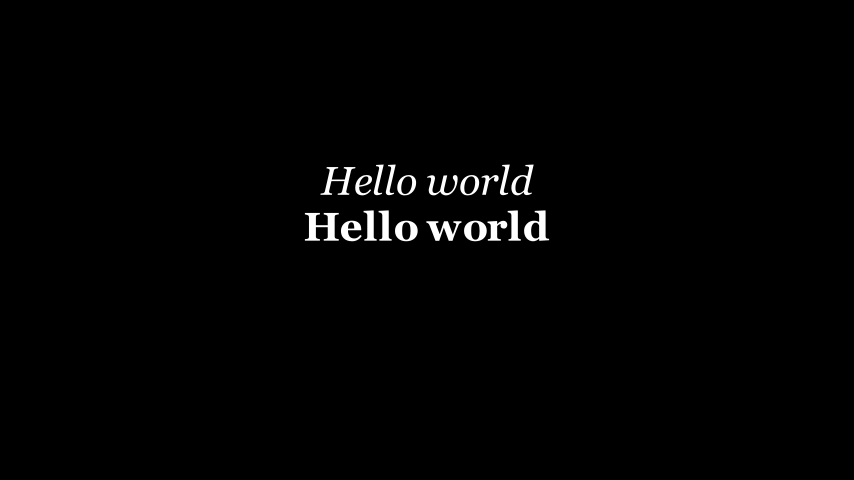
<p class="caption">(\#fig:manim-p3)斜体与粗细示例</p>
</div>
   
- 颜色
   
   - 纯色
   
      纯色可通过`color`参数为文本设置颜色，例如`Text('Hello World', color=BLUE)`。
   
   - 渐变色

      渐变色可通过`gradient`参数进行设置。`gradient`参数接受一个元组，里面每个元素都是颜色常量，并且其顺序决定了渐变顺序。例如`Text('Hello World', gradient=(BLUE, YELLOW, RED))`。
      
   - 自定义文本颜色
   
      有时你可能相对文本中的部分文字设置特定的颜色或者渐变色，此时你可以使用`t2c`和`t2g`进行个性化设置。
      
      `t2c`参数用来设置部分文本的纯色。你可以为其传入一个字典，用切片的方式定位目标文本或者直接传入目标文本来进行上色。例如`Text('Hello World', t2c={'[1:4]':BLUE, 'rld':RED})`。
      
      `t2g`参数用来设置部分文本的渐变色。同理，也是接收一个字典，只不过这里的值要变为元组。例如`Text('明天你还在这里吗', t2g={'[1:4]': (BLUE, YELLOW), '这里': (YELLOW, RED)})`。
      
      > `t2g`可能存在bug，会导致不能对目标文本进行渐变色设置，可能整个文本都会被设置渐变色。如下面的t_4。
   
      > 能被切片的方式选择字符说明`Text()`字符串对象是可迭代的、可被索引的。

   
   ``` r
   from manim import *
   
   class Example(Scene):
       def construct(self):
           t_1 = Text('Hello World', color=BLUE)
           t_2 = Text('Hello World', gradient=(BLUE, YELLOW, RED))
           t_3 = Text('Hello World', t2c={'[1:4]':BLUE, 'rld':RED})
           t_4 = Text('Hello World', t2g={'[1:4]':(BLUE, YELLOW), 'rld':(YELLOW ,RED)})
           t_5 = Text('明天你还在这里吗', t2g={'[1:4]': (BLUE, YELLOW), '这里': (YELLOW, RED)})
   
           self.add(t_1.shift(2*UP))
           self.add(t_2.next_to(t_1, DOWN))
           self.add(t_3.next_to(t_2, DOWN))
           self.add(t_4.next_to(t_3, DOWN))
           self.add(t_5.next_to(t_4, DOWN))
   ```

<div class="figure" style="text-align: center">
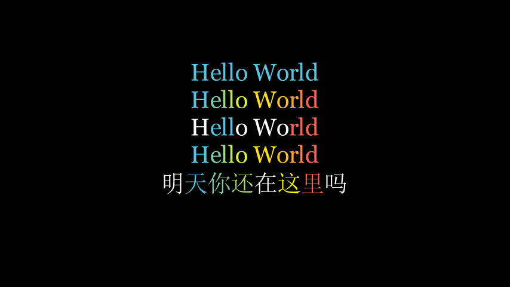
<p class="caption">(\#fig:manim-p4)文本颜色</p>
</div>

- 大小

   - font_size
   
      `font_size`是`Text()`的参数值(默认为`font_size=48`)，可直接在`Text()`中设定，如`Text('Hello World', font_size=50)`。
      
   - scale
   
      `scale`是`Text()`的属性，用于调整字体大小的倍数，如`Text('Hello World').scale(0.5)`表示默认大小的0.5倍。
      
   
   ``` r
   from manim import *
   
   class Example(Scene):
       def construct(self):
           t_1 = Text('Hello World', font_size=50)
           t_2 = Text('Hello World').scale(0.5)
   
           self.add(t_1.shift(UP))
           self.add(t_2.next_to(t_1, DOWN))
   ```

<div class="figure" style="text-align: center">
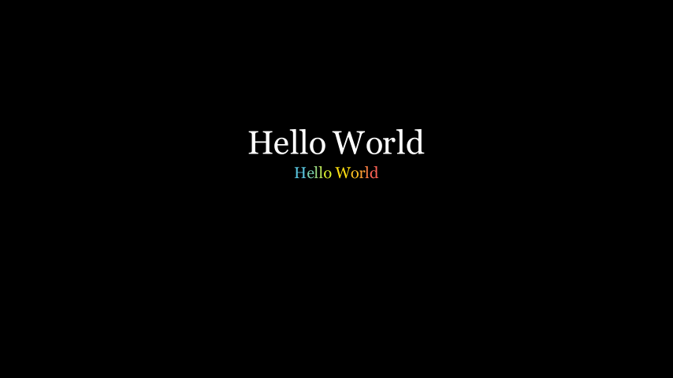
<p class="caption">(\#fig:manim-p5)文本颜色</p>
</div>

> 貌似这里也有bug，t_2被设置了渐变色。

- 行间距与换行

   在字符串中可以添加`\n`实现换行效果，并通过`Text()`中的`line_spacing`来调整行间距，如下所示。

   
   ``` r
   from manim import *
   
   class Example(Scene):
       def construct(self):
           t_1 = Text('Hello\nWorld', line_spacing=3)
           t_2 = Text('Hello\nWorld')
   
           group = VGroup(t_1, t_2)
   
           self.add(group.arrange(LEFT))
   ```

<div class="figure" style="text-align: center">
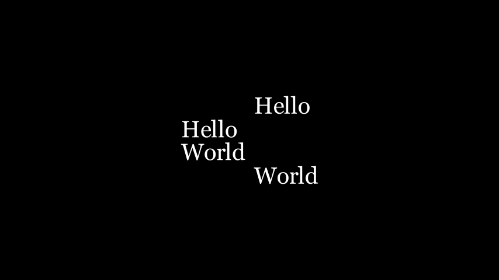
<p class="caption">(\#fig:manim-p6)行间距与换行</p>
</div>

### MarkupText {#manim_5_2}


``` default
class MarkupText(text, fill_opacity=1, stroke_width=0, color=None, font_size=48, line_spacing=-1, font='', slant='NORMAL', weight='NORMAL', justify=False, gradient=None, tab_width=4, height=None, width=None, should_center=True, disable_ligatures=False, warn_missing_font=True, **kwargs)
```

<table>
<caption>(\#tab:manim_t2)MarkupText类的方法与属性</caption>
 <thead>
  <tr>
   <th style="text-align:center;"> 方法 </th>
   <th style="text-align:center;"> 属性 </th>
  </tr>
 </thead>
<tbody>
  <tr>
   <td style="text-align:center;"> font_list </td>
   <td style="text-align:center;"> animate </td>
  </tr>
  <tr>
   <td style="text-align:center;">  </td>
   <td style="text-align:center;"> animation_overrides </td>
  </tr>
  <tr>
   <td style="text-align:center;">  </td>
   <td style="text-align:center;"> color </td>
  </tr>
  <tr>
   <td style="text-align:center;">  </td>
   <td style="text-align:center;"> depth </td>
  </tr>
  <tr>
   <td style="text-align:center;">  </td>
   <td style="text-align:center;"> fill_color </td>
  </tr>
  <tr>
   <td style="text-align:center;">  </td>
   <td style="text-align:center;"> font_size </td>
  </tr>
  <tr>
   <td style="text-align:center;">  </td>
   <td style="text-align:center;"> hash_seed </td>
  </tr>
  <tr>
   <td style="text-align:center;">  </td>
   <td style="text-align:center;"> height </td>
  </tr>
  <tr>
   <td style="text-align:center;">  </td>
   <td style="text-align:center;"> n_points_per_curve </td>
  </tr>
  <tr>
   <td style="text-align:center;">  </td>
   <td style="text-align:center;"> sheen_factor </td>
  </tr>
  <tr>
   <td style="text-align:center;">  </td>
   <td style="text-align:center;"> stroke_color </td>
  </tr>
  <tr>
   <td style="text-align:center;">  </td>
   <td style="text-align:center;"> width </td>
  </tr>
</tbody>
</table>

> 继承自`SVGMobject`

MarkupText即使用了PangoMarkup的标记文本，和html语言类似，他允许使用“标签”来直接修改对应“标签”内的文本样式。

> PangoMarkup is a small markup language like html and it helps you avoid using “range of characters” while coloring or styling a piece a Text.

下面罗列了一些常见的标签：


``` default
<b>bold</b>, <i>italic</i> and <b><i>bold+italic</i></b>

<ul>underline</ul> and <s>strike through</s>

<tt>typewriter font</tt>

<big>bigger font</big> and <small>smaller font</small>

<sup>superscript</sup> and <sub>subscript</sub>

<span underline="double" underline_color="green">double underline</span>

<span underline="error">error underline</span>

<span overline="single" overline_color="green">overline</span>

<span strikethrough="true" strikethrough_color="red">strikethrough</span>

<span font_family="sans">temporary change of font</span>

<span foreground="red">temporary change of color</span>

<span fgcolor="red">temporary change of color</span>

<gradient from="YELLOW" to="RED">temporary gradient</gradient>
```

> `<tt>`标签内的字体就像打字机打出来的一样
> 
> `<sup>`和`<sub>`分别表示上标和下标
> 
> foreground和fgcolor都是作用于文本颜色（貌似效果一样？）

在`<span>`标签里可以使用十六进制颜色(如`#ff0000`)或者CSS命名颜色(如`Coral`)。如果你想在其中继续使用Manim的颜色常量，那么你就得在字符串前添加`f`，以格式化的形式嵌入颜色常量(如`MarkupText(f'<span fgcolor="{RED}">Hello</span>')`)。


``` r
from manim import *

class Example(Scene):
    def construct(self):
        t_1 = MarkupText('Do you need <tt>help</tt>?')
        t_2 = MarkupText('H<sub>2</sub>O and OH<sup>+</sup>')
        t_3 = MarkupText('<span foreground="red">Hello</span>')
        t_4 = MarkupText('<span fgcolor="red">Hello</span>')
        t_5 = MarkupText('<span fgcolor="#ff0000">Hello</span>')
        t_6 = MarkupText('<span fgcolor="Coral">Hello</span>')
        t_7 = MarkupText(f'<span fgcolor="{RED}">Hello</span>')

        group = VGroup(t_1, t_2, t_3, t_4, t_5, t_6, t_7)
        self.add(group.arrange(DOWN))
```

<div class="figure" style="text-align: center">
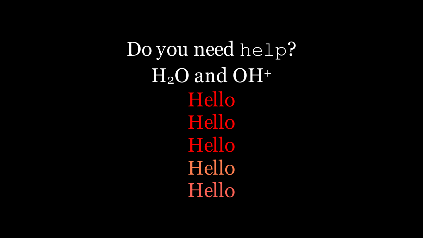
<p class="caption">(\#fig:manim-p7)span示例</p>
</div>

`<gradient>`支持十六进制颜色或者Manim自带的颜色常量。但`<gradient>`在实际应用中稍显复杂。对于带连字`ligatures`（姑且翻译为“连字”吧，有些语言会把两个或者多个字符视为一个字符，也就是连字）的语言，`<gradient>`有时并不能正确识别渐变色的起始字符与终止字符，起始字符和终止字符可能会提前或推迟。对此，你可以使用`<gradient>`的`offset`属性来调整起始字符和结束字符的位置。例如`offset='1'`表示起始字符提前一个位置；`offset='1,2'`表示起始字符提前一个位置，终止字符提前两个位置；又如`offset=',-1'`表示终止字符推迟一个位置。对于不依赖连字`ligatures`的语言，你可以直接在`MarkupText()`中设置`disable_ligatures=True`。

> 貌似中文可以不用考虑“连字”问题，英语的话可能会遇到
> 
> 当你在一个字符串中使用了`<gradient>`，并同时使用了`overline`或`underline`或`strikethrough`，你可能需要使用`offset`进行适当调整。


``` r
from manim import *

class Example(Scene):
    def construct(self):
        t_1 = MarkupText('我想打<gradient from="BLUE" to="GREEN">羽毛球</gradient>')
        t_2 = MarkupText('hello <gradient from="RED" to="YELLOW">world</gradient> bye')
        t_3 = MarkupText('hello <gradient from="RED" to="YELLOW" offset="1,2">world</gradient> bye')
        t_4 = MarkupText('<span underline="double" underline_color="green">Do</span> <gradient from="RED" to="YELLOW">you need</gradient> help?')
        t_5 = MarkupText('<span underline="double" underline_color="green">Do</span> <gradient from="RED" to="YELLOW" offset="-2">you need</gradient> help?')
        t_6 = MarkupText('<span underline="single" underline_color="green">Do</span> <gradient from="RED" to="YELLOW" offset="-1">you need</gradient> help?')

        group = VGroup(t_1, t_2, t_3, t_4, t_5, t_6)
        self.add(group.arrange(DOWN))
```

<div class="figure" style="text-align: center">

<p class="caption">(\#fig:manim-p8)gradient示例</p>
</div>

如果你需要在文本中使用`<`、`>`和`&`，得进行转义，用`&lt;`、`&gt`、`&amp;`依次替代。

`MarkupText()`中的参数`justify=True`能够实现文本左右对齐，如下面所示。


``` r
from manim import *

class Example(Scene):
    def construct(self):
        ipsum_text = (
            "Lorem ipsum dolor sit amet, consectetur adipiscing elit."
            "Praesent feugiat metus sit amet iaculis pulvinar. Nulla posuere "
            "quam a ex aliquam, eleifend consectetur tellus viverra. Aliquam "
            "fermentum interdum justo, nec rutrum elit pretium ac. Nam quis "
            "leo pulvinar, dignissim est at, venenatis nisi."
        )
        justified_text = MarkupText(ipsum_text, justify=True).scale(0.4)
        not_justified_text = MarkupText(ipsum_text, justify=False).scale(0.4)
        just_title = Title("Justified")
        njust_title = Title("Not Justified")
        self.add(njust_title, not_justified_text)
        self.play(
            FadeOut(not_justified_text),
            FadeIn(justified_text),
            FadeOut(njust_title),
            FadeIn(just_title),
            run_time=5
        )
        self.wait(1)
```

> python会自动将圆括号中的几个连续无间隔字符串拼接在一起。

### Paragraph {#manim_5_3}

```
class Paragraph(*text, line_spacing=-1, alignment=None, **kwargs)
```

<table>
<caption>(\#tab:manim_t3)Paragraph类的方法与属性</caption>
 <thead>
  <tr>
   <th style="text-align:center;"> 方法 </th>
   <th style="text-align:center;"> 属性 </th>
  </tr>
 </thead>
<tbody>
  <tr>
   <td style="text-align:center;">  </td>
   <td style="text-align:center;"> animate </td>
  </tr>
  <tr>
   <td style="text-align:center;">  </td>
   <td style="text-align:center;"> animation_overrides </td>
  </tr>
  <tr>
   <td style="text-align:center;">  </td>
   <td style="text-align:center;"> color </td>
  </tr>
  <tr>
   <td style="text-align:center;">  </td>
   <td style="text-align:center;"> depth </td>
  </tr>
  <tr>
   <td style="text-align:center;">  </td>
   <td style="text-align:center;"> fill_color </td>
  </tr>
  <tr>
   <td style="text-align:center;">  </td>
   <td style="text-align:center;"> height </td>
  </tr>
  <tr>
   <td style="text-align:center;">  </td>
   <td style="text-align:center;"> n_points_per_curve </td>
  </tr>
  <tr>
   <td style="text-align:center;">  </td>
   <td style="text-align:center;"> sheen_factor </td>
  </tr>
  <tr>
   <td style="text-align:center;">  </td>
   <td style="text-align:center;"> stroke_color </td>
  </tr>
  <tr>
   <td style="text-align:center;">  </td>
   <td style="text-align:center;"> width </td>
  </tr>
</tbody>
</table>

> 继承自`VGroup`

`Paragraph`适合用于大段文本，它将每一行视作`VGroup`的一个元素。`Paragraph`主要接收`text`、`line_spacing`、`alignment`这三个参数。

- text

   每一行的内容将作为独立的字符串输入进去，例如`Paragraph('再见了妈妈', '我今晚就要远航', '别为我担心')`就表示第一行为“再见了妈妈”，第二行为“我今晚就要远航”，第三行就是“别为我担心”。
   
- line_spacing

   控制行间距，默认为-1，表示自动调整行间距。
   
- alignment

   对齐方式，默认为`None`，可选值为`'center'`、`'left'`、`'right'`。
   

``` r
from manim import *

class Example(Scene):
    def construct(self):
        paragraph = Paragraph('再见了妈妈', '我今晚就要远航', '别为我担心',
                              alignment = 'center', line_spacing = 2)
        paragraph.color = '#FFB6C1'

        self.add(paragraph)
```

<div class="figure" style="text-align: center">
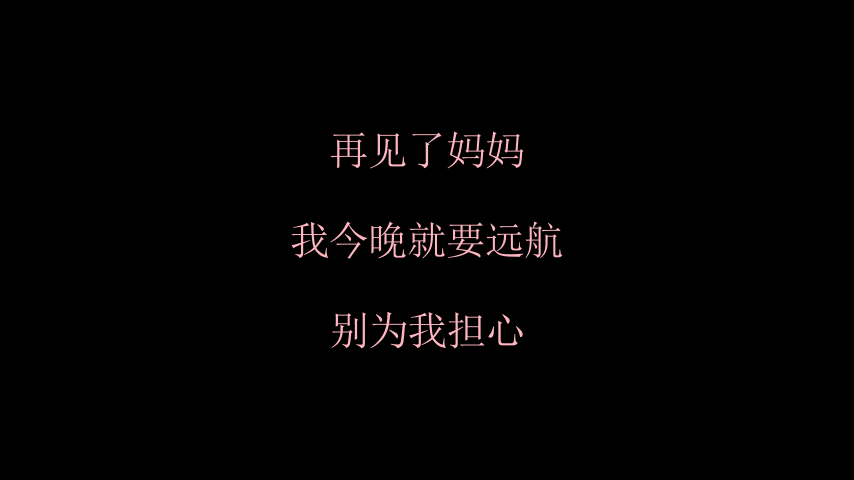
<p class="caption">(\#fig:manim-p9)Paragraph示例</p>
</div>

### Tex {#manim_5_4}

```
class Tex(*tex_strings, arg_separator='', tex_environment='center', **kwargs)
```

<table>
<caption>(\#tab:manim_t4)Tex类的方法与属性</caption>
 <thead>
  <tr>
   <th style="text-align:center;"> 方法 </th>
   <th style="text-align:center;"> 属性 </th>
  </tr>
 </thead>
<tbody>
  <tr>
   <td style="text-align:center;">  </td>
   <td style="text-align:center;"> animate </td>
  </tr>
  <tr>
   <td style="text-align:center;">  </td>
   <td style="text-align:center;"> animation_overrides </td>
  </tr>
  <tr>
   <td style="text-align:center;">  </td>
   <td style="text-align:center;"> color </td>
  </tr>
  <tr>
   <td style="text-align:center;">  </td>
   <td style="text-align:center;"> depth </td>
  </tr>
  <tr>
   <td style="text-align:center;">  </td>
   <td style="text-align:center;"> fill_color </td>
  </tr>
  <tr>
   <td style="text-align:center;">  </td>
   <td style="text-align:center;"> font_size </td>
  </tr>
  <tr>
   <td style="text-align:center;">  </td>
   <td style="text-align:center;"> hash_seed </td>
  </tr>
  <tr>
   <td style="text-align:center;">  </td>
   <td style="text-align:center;"> height </td>
  </tr>
  <tr>
   <td style="text-align:center;">  </td>
   <td style="text-align:center;"> n_points_per_curve </td>
  </tr>
  <tr>
   <td style="text-align:center;">  </td>
   <td style="text-align:center;"> sheen_factor </td>
  </tr>
  <tr>
   <td style="text-align:center;">  </td>
   <td style="text-align:center;"> stroke_color </td>
  </tr>
  <tr>
   <td style="text-align:center;">  </td>
   <td style="text-align:center;"> width </td>
  </tr>
</tbody>
</table>

> 继承自`MathTex`
> 
> 在`Tex()`中也可像`Text()`一样直接设置`color`、`font_size`等参数。因为往上有相同的父类

使用`Tex()`即可插入LaTeX。由于LaTeX经常使用特殊字符（例如'\\'），这在python中也具有特殊意义，所以推荐使用`Tex(r'字符串')`来输入字符串。


``` r
from manim import *

class Example(Scene):
    def construct(self):
        t1 = Tex('Hello', 'World', 'Bye', arg_separator='-')

        self.add(t1)
```

<div class="figure" style="text-align: center">
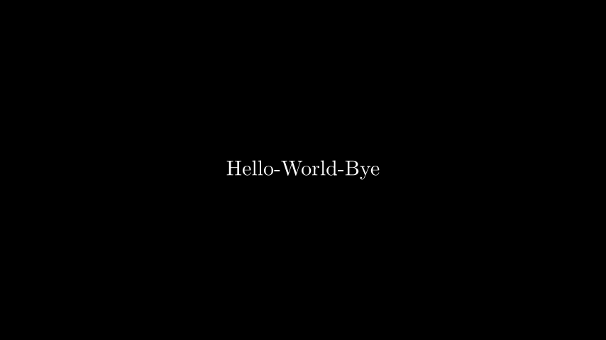
<p class="caption">(\#fig:manim-p10)Tex示例</p>
</div>

### MathTex {#manim_5_5}

```
class MathTex(*tex_strings, arg_separator=' ', substrings_to_isolate=None, tex_to_color_map=None, tex_environment='align*', **kwargs)
```

<table>
<caption>(\#tab:manim_t5)MathTex类的方法与属性</caption>
 <thead>
  <tr>
   <th style="text-align:center;"> 方法 </th>
   <th style="text-align:center;"> 属性 </th>
  </tr>
 </thead>
<tbody>
  <tr>
   <td style="text-align:center;"> get_part_by_tex </td>
   <td style="text-align:center;"> animate </td>
  </tr>
  <tr>
   <td style="text-align:center;"> get_parts_by_tex </td>
   <td style="text-align:center;"> animation_overrides </td>
  </tr>
  <tr>
   <td style="text-align:center;"> index_of_part </td>
   <td style="text-align:center;"> color </td>
  </tr>
  <tr>
   <td style="text-align:center;"> index_of_part_by_tex </td>
   <td style="text-align:center;"> depth </td>
  </tr>
  <tr>
   <td style="text-align:center;"> set_color_by_tex </td>
   <td style="text-align:center;"> fill_color </td>
  </tr>
  <tr>
   <td style="text-align:center;"> set_color_by_tex_to_color_map </td>
   <td style="text-align:center;"> font_size </td>
  </tr>
  <tr>
   <td style="text-align:center;"> set_opacity_by_tex </td>
   <td style="text-align:center;"> hash_seed </td>
  </tr>
  <tr>
   <td style="text-align:center;"> sort_alphabetically </td>
   <td style="text-align:center;"> height </td>
  </tr>
  <tr>
   <td style="text-align:center;">  </td>
   <td style="text-align:center;"> n_points_per_curve </td>
  </tr>
  <tr>
   <td style="text-align:center;">  </td>
   <td style="text-align:center;"> sheen_factor </td>
  </tr>
  <tr>
   <td style="text-align:center;">  </td>
   <td style="text-align:center;"> stroke_color </td>
  </tr>
  <tr>
   <td style="text-align:center;">  </td>
   <td style="text-align:center;"> width </td>
  </tr>
</tbody>
</table>

> 继承自`SingleStringMathTex`
> 
> 关于如何编辑数学公式大家可以参考这篇[博客](https://www.cnblogs.com/syqwq/p/15190115.html)。

`MathTex()`中的字符串默认处在数学环境中，对应有`Tex(r'$字符串$')`，相当于是数学公式的`Tex()`简写。


``` r
from manim import *

class Example(Scene):
    def construct(self):
        t1 = MathTex(r'f(k)={n \choose k}p^{k}(1-p)^{n-k}')
        t2 = Tex(r'$f(k)={n \choose k}p^{k}(1-p)^{n-k}$')

        self.add(t1.shift(UP))
        self.add(t2.shift(DOWN))
```

<div class="figure" style="text-align: center">
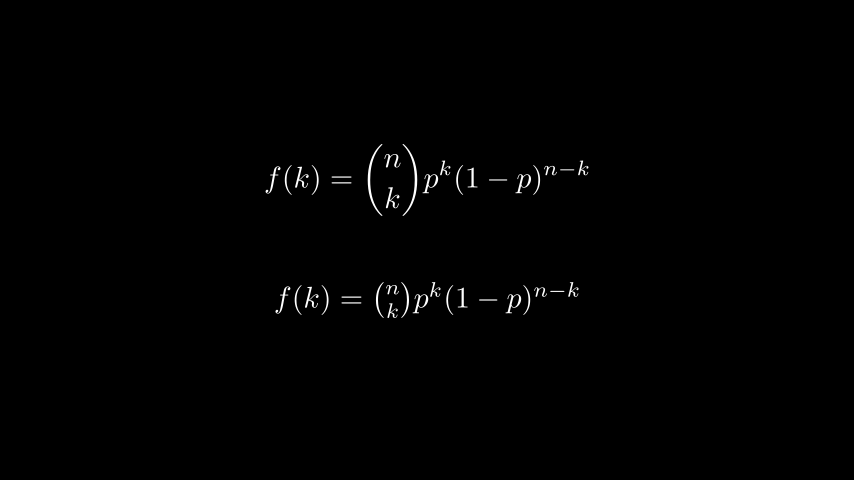
<p class="caption">(\#fig:manim-p11)MathTex示例</p>
</div>

- 字符串上色

   `MathTex`能够接收多个字符串，最后会用`arg_separator`参数（默认为空格）将其隔开。对此，可以通过索引或者字符匹配（匹配的结果是对应的完整字符串）来选中特定的字符串进行设置，如下所示：

   > `Tex()`也同样适用，毕竟其父类就是`MathTex()`。

   
   ``` r
   from manim import *
   
   class Example(Scene):
       def construct(self):
           tex_1 = Tex('Hello', r'$\bigstar$', r'\LaTeX', font_size=58)
           tex_1[1].set_color(RED)
   
           tex_2 = MathTex(r'\sum_{i=0}^n i^2', '=', r'\frac{(n^2+n)(2n+1)}{6}', font_size=58)
           tex_2.set_color_by_tex('i=', RED)
   
           self.add(tex_1.shift(UP))
           self.add(tex_2.shift(DOWN))
   ```

<div class="figure" style="text-align: center">
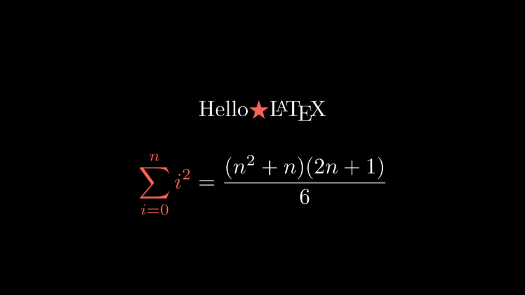
<p class="caption">(\#fig:manim-p12)子字符串上色示例</p>
</div>

- 目标字符上色

   如果想要匹配某个字符而不是字符所在的整个字符串，则可以用到`substrings_to_isolate`参数，它能够在`set_color_by_tex`时将目标字符串单独分离出来。或者用两对花括号`{{.}}`将目标字符框起来也能起到同样作用。二者如下所示：

   
   ``` r
   from manim import *
   
   class Example(Scene):
       def construct(self):
           e_1 = MathTex(
               r'e^x = x^0 + x^1 + \frac{1}{2} x^2 + \frac{1}{6} x^3 + \cdots + \frac{1}{n!} x^n + \cdots'
        )
           e_1.set_color_by_tex('x', BLUE)
   
           e_2 = MathTex(
               r'e^x = x^0 + x^1 + \frac{1}{2} x^2 + \frac{1}{6} x^3 + \cdots + \frac{1}{n!} x^n + \cdots',
               substrings_to_isolate='x'
           )
           e_2.set_color_by_tex('x', BLUE)
   
           e_3 = MathTex(
               r'e^{{x}} = {{x}}^0 + {{x}}^1 + \frac{1}{2} {{x}}^2 + \frac{1}{6} {{x}}^3 + \cdots + \frac{1}{n!} {{x}}^n + \cdots'
           )
           e_3.set_color_by_tex('x', BLUE)
   
           group=VGroup(e_1, e_2, e_3)
   
           self.add(group.arrange(DOWN))
   ```

<div class="figure" style="text-align: center">
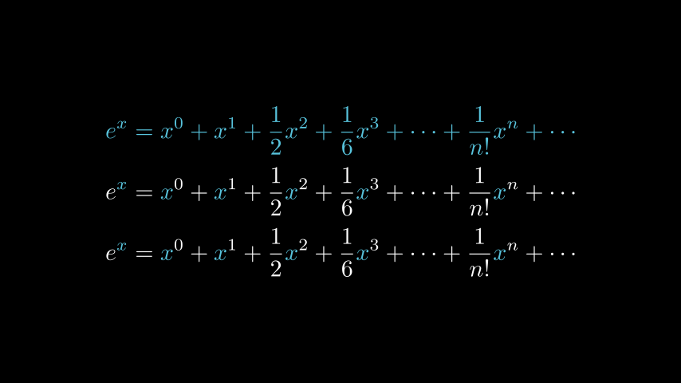
<p class="caption">(\#fig:manim-p13)目标字符上色示例</p>
</div>

除了多个字符串的索引，还可以对一个字符串（即Mobject对象）中的不同组成部分进行索引。`index_labels()`能够显示Mobject对象的组成部分的索引，如下所示：


``` r
from manim import *

class Example(Scene):
    def construct(self):
        text = MathTex(r"\binom{2n}{n+2}", font_size=96)

        # MathTex中仅有一个字符串，所以只索引了第一项
        # 若有多个字符串则可以通过对应的索引选中目标字符串
        self.add(index_labels(text[0]))

        text[0][1:3].set_color(YELLOW)
        text[0][3:6].set_color(RED)
        self.add(text)
```

<div class="figure" style="text-align: center">
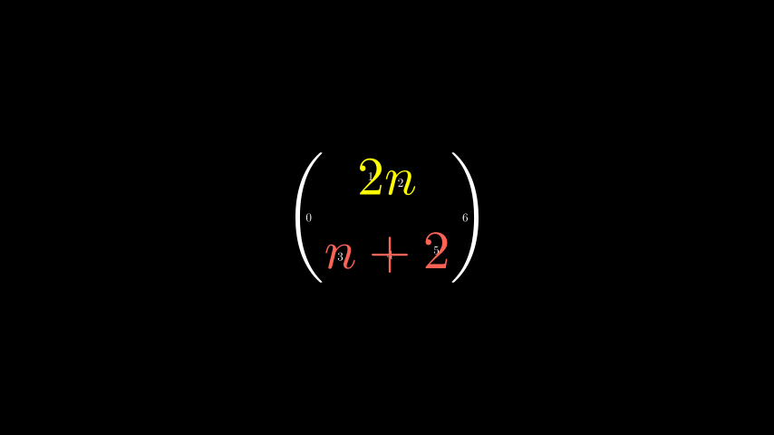
<p class="caption">(\#fig:manim-p14)目标字符上色示例</p>
</div>

- 字体

`MathTex()`可通过`tex_template`参数来修改字体。在`TexFontTemplates`类中有诸多字体可供选择，通过提取其属性值来进行赋值，例如`tex_template = TexFontTemplates.french_cursive`。可选字体如[官网所示](https://docs.manim.community/en/stable/reference/manim.utils.tex_templates.TexFontTemplates.html#manim.utils.tex_templates.TexFontTemplates)。

### Title {#manim_5_6}

```
class Title(*text_parts, include_underline=True, match_underline_width_to_text=False, underline_buff=0.25, **kwargs)
```

<table>
<caption>(\#tab:manim_t6)Title类的方法与属性</caption>
 <thead>
  <tr>
   <th style="text-align:center;"> 方法 </th>
   <th style="text-align:center;"> 属性 </th>
  </tr>
 </thead>
<tbody>
  <tr>
   <td style="text-align:center;">  </td>
   <td style="text-align:center;"> animate </td>
  </tr>
  <tr>
   <td style="text-align:center;">  </td>
   <td style="text-align:center;"> animation_overrides </td>
  </tr>
  <tr>
   <td style="text-align:center;">  </td>
   <td style="text-align:center;"> color </td>
  </tr>
  <tr>
   <td style="text-align:center;">  </td>
   <td style="text-align:center;"> depth </td>
  </tr>
  <tr>
   <td style="text-align:center;">  </td>
   <td style="text-align:center;"> fill_color </td>
  </tr>
  <tr>
   <td style="text-align:center;">  </td>
   <td style="text-align:center;"> font_size </td>
  </tr>
  <tr>
   <td style="text-align:center;">  </td>
   <td style="text-align:center;"> hash_seed </td>
  </tr>
  <tr>
   <td style="text-align:center;">  </td>
   <td style="text-align:center;"> height </td>
  </tr>
  <tr>
   <td style="text-align:center;">  </td>
   <td style="text-align:center;"> n_points_per_curve </td>
  </tr>
  <tr>
   <td style="text-align:center;">  </td>
   <td style="text-align:center;"> sheen_factor </td>
  </tr>
  <tr>
   <td style="text-align:center;">  </td>
   <td style="text-align:center;"> stroke_color </td>
  </tr>
  <tr>
   <td style="text-align:center;">  </td>
   <td style="text-align:center;"> width </td>
  </tr>
</tbody>
</table>

> 继承自`Tex`

`Title`的作用就是在画面正上方显示标题。如果你想在标题中输入中文，那么一定要设置`tex_template`参数，并为其赋值为`tex_template = TexTemplateLibrary.ctex`。

> `Tex`若想显示中文也得这样设置，但一般用`Text`来显示中文会更多。


``` r
from manim import *

class Example(Scene):
    def construct(self):
        banner = ManimBanner()
        title = Title('Hello你好', tex_template=TexTemplateLibrary.ctex, match_underline_width_to_text=True)
        self.add(banner, title)
```

<div class="figure" style="text-align: center">
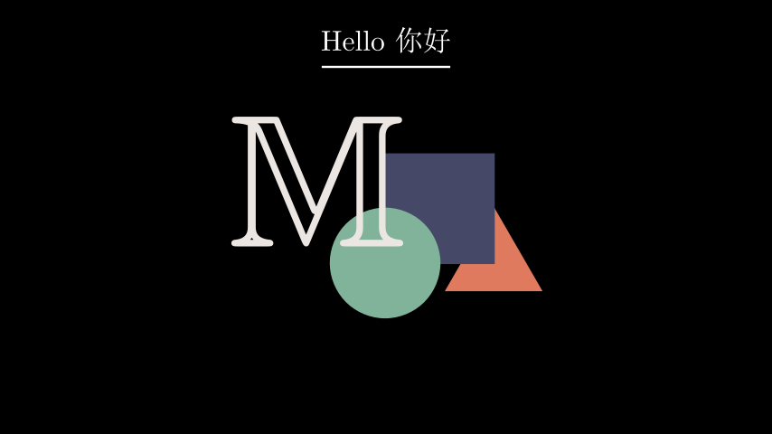
<p class="caption">(\#fig:manim-p15)Title示例</p>
</div>

### BulletedList {#manim_5_7}

```
class BulletedList(*items, buff=0.5, dot_scale_factor=2, tex_environment=None, **kwargs)
```

<table>
<caption>(\#tab:manim_t7)Title类的方法与属性</caption>
 <thead>
  <tr>
   <th style="text-align:center;"> 方法 </th>
   <th style="text-align:center;"> 属性 </th>
  </tr>
 </thead>
<tbody>
  <tr>
   <td style="text-align:center;"> fade_all_but </td>
   <td style="text-align:center;"> animate </td>
  </tr>
  <tr>
   <td style="text-align:center;">  </td>
   <td style="text-align:center;"> animation_overrides </td>
  </tr>
  <tr>
   <td style="text-align:center;">  </td>
   <td style="text-align:center;"> color </td>
  </tr>
  <tr>
   <td style="text-align:center;">  </td>
   <td style="text-align:center;"> depth </td>
  </tr>
  <tr>
   <td style="text-align:center;">  </td>
   <td style="text-align:center;"> fill_color </td>
  </tr>
  <tr>
   <td style="text-align:center;">  </td>
   <td style="text-align:center;"> font_size </td>
  </tr>
  <tr>
   <td style="text-align:center;">  </td>
   <td style="text-align:center;"> hash_seed </td>
  </tr>
  <tr>
   <td style="text-align:center;">  </td>
   <td style="text-align:center;"> height </td>
  </tr>
  <tr>
   <td style="text-align:center;">  </td>
   <td style="text-align:center;"> n_points_per_curve </td>
  </tr>
  <tr>
   <td style="text-align:center;">  </td>
   <td style="text-align:center;"> sheen_factor </td>
  </tr>
  <tr>
   <td style="text-align:center;">  </td>
   <td style="text-align:center;"> stroke_color </td>
  </tr>
  <tr>
   <td style="text-align:center;">  </td>
   <td style="text-align:center;"> width </td>
  </tr>
</tbody>
</table>

> 继承自`Tex`

`BulletedList`实际上就是markdown中的无序列表。


``` r
from manim import *

class Example(Scene):
    def construct(self):
        blist = BulletedList('项目 1', '项目 2', '项目 3', height=2, width=2, tex_template=TexTemplateLibrary.ctex)
        blist.set_color_by_tex('1', RED)
        blist.set_color_by_tex('2', GREEN)
        blist.set_color_by_tex('3', BLUE)
        self.add(blist)
```

<div class="figure" style="text-align: center">
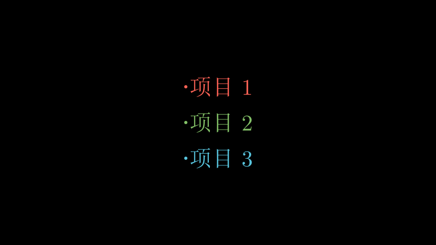
<p class="caption">(\#fig:manim-p16)BulletedList示例</p>
</div>

## 内置颜色 {#manim_6}

参考知乎的这篇[文章](https://zhuanlan.zhihu.com/p/640277422)。

## 物体的位置与移动 {#manim_7}

1. .next_to()

2. .move_to()

3. .shift()

4. MoveToTarget()

## 动画 {#manim_8}

1. Succession()

   动画有先后顺序，前一个完成再接下一个

## 镜头视角 {#manim_9}

1. self.camera.frame.animate.shift()

   仅能在`MovingCameraScene`类下使用，而不是Scene类。

## 存储对象 {#manim_10}

1. Group()

2. VGroup()

3. self.mobjects

## 成品 {#manim_11}

1. [最小二乘与投影矩阵](#animation_1)

