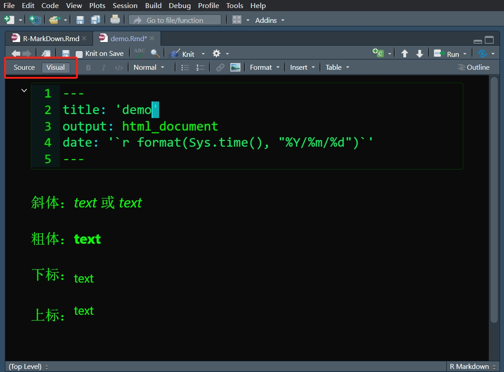
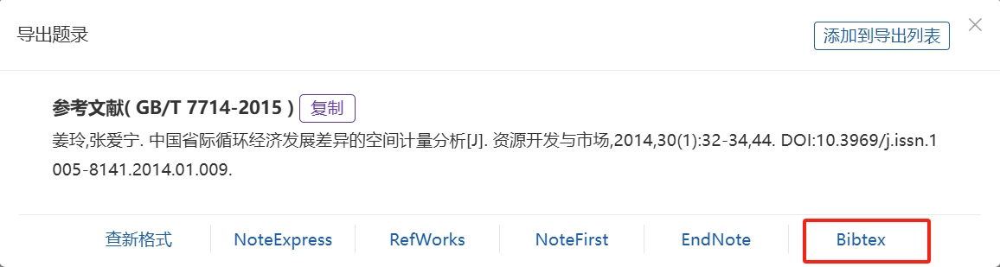
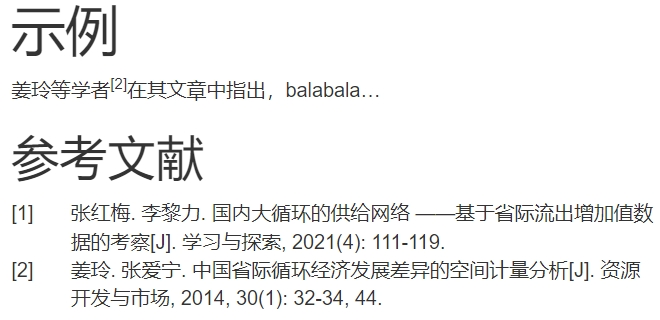

# (PART) 专项 {.unnumbered}

# R Markdown {#rmd}

本部分内容为本人根据[*R Markdown: The Definitive Guide*](https://bookdown.org/yihui/rmarkdown/)、[R Markdown Cookbook](https://bookdown.org/yihui/rmarkdown-cookbook/)、[Pandoc手册（Markdown）](https://pandoc.org/MANUAL.html#pandocs-markdown)、[markdown官方教程](https://markdown.com.cn/)、[R Markdown入门教程](https://cosx.org/2021/04/rmarkdown-introduction)及各路资料整理所得。个人建议按照 统计之都入门教程 \> Markdown教程 \> Guide = Cookbook \> Pandoc手册 的顺序进行阅读，其中**Guide**和**Cookbook**值得精读。

主要参考内容如下：

[R Markdown: The Definitive Guide](https://bookdown.org/yihui/rmarkdown/)

[R Markdown Cookbook](https://bookdown.org/yihui/rmarkdown-cookbook/)

[Pandoc手册（Markdown）](https://pandoc.org/MANUAL.html#pandocs-markdown)

[markdown官方教程](https://markdown.com.cn/)

[R Markdown入门教程](https://cosx.org/2021/04/rmarkdown-introduction)

[knitr_options](https://yihui.org/knitr/options/)

[knitr文档](https://cloud.r-project.org/web/packages/knitr/knitr.pdf)

[kableExtra文档](https://mirrors.sjtug.sjtu.edu.cn/cran/web/packages/kableExtra/index.html)

[如何编辑数学公式](https://www.cnblogs.com/syqwq/p/15190115.html)


## 安装与创建 {#rmd_1}

首先需要下载**rmarkdown**包，可直接在RStudio中下载。


``` r
install.packages('rmarkdown') 
```

如果你想将R Markdown文件输出为PDF文件，你需要额外安装**TinyTeX**包(<https://yihui.org/tinytex/>)，并进行下载，这可能需要等待一会儿。


``` r
install.packages('tinytex')
tinytex::install_tinytex()
```

当需要的包下载完后，可按如下顺序创建R MarkDown文件：File -\> New File -\> R MarkDown。 在弹窗左侧是类型（文档、演示、shiny、其他模板），右侧则是更加细致的选项，如标题、作者、日期及输出格式，点击'OK'即可完成创建。注意R Markdown文件的后缀名为`.Rmd`。

<div class="figure" style="text-align: center">

<p class="caption">(\#fig:rmd-p1)创建RMD文件</p>
</div>

在完成创建后，可以在工作栏处找到'knit'（旁边有蓝色毛线圈的那个），点击即可输出为特定的文档。或者在控制台用函数`rmarkdown::render()`来输出，只要输入要导出的RMD文件及导出格式即可。

## 初识RMD {#rmd_2}

R Markdown，顾名思义，是R和Markdown的组合。Markdown是一种标记语言，允许人们用易读易写的纯文本格式编写文档。而R Markdown则是Markdown的扩展，是一种结合了R代码（也可以结合其他语言的代码）、Markdown以及结果的强大工具，它允许用户在一个文档中同时编写文本、插入R代码并执行，然后将结果（如数据摘要、统计图表等）直接嵌入文档中。

R Markdown主要依靠**knitr**包和**Pandoc**来完成工作，其工作流如下所示。**knitr**是[谢益辉](https://yihui.org/)大神开发的一个用R来优雅、灵活、快速地生成动态报告的包。**Pandoc**是一个文档转换工具，它可以将文档从一种格式转换为另一种格式，同时保留文档的格式和结构。

<div class="figure" style="text-align: center">

<p class="caption">(\#fig:rmd-p2)工作流</p>
</div>

RMD文档由三部分组成：元数据（metadata）、文本与代码。

元数据出现在文档开头，由'- - -'隔开，用来控制标题、作者、日期、输出格式等基础信息。特别是输出格式这一部分，在后面的章节会再次提及。值得注意的是，元数据是用YAML的语法编写，在具体编辑的时候要注意**缩进**以及适当换行，并且使用': '来隔开键与值（注意空格）。如果你想了解更多，可查阅[Pandoc](https://pandoc.org/MANUAL.html#metadata-blocks)手册。

在设置好元数据后，你就可以利用markdown语法来进行创作了。这一部分将在[1.3节](#rmd_3)介绍。

代码可以分为两个部分。一个是内联（inline）代码，首尾用反引号（键盘左上角）来将代码括起来，即 `` `code` ``[^1] ，如果你想用R来运行内联代码的话，可以用`` `r code` ``。另一个是代码块（code chunk），首尾用三个反引号隔开（注意换行）或缩进四个空格来表示纯代码，如果你想用R来运行代码块的话，可以改为```` ```{r} code ``` ````[^2]，注意`{r}`后面得换行。关于代码块的设置将会在[1.3.7节](#rmd_3_7)详细介绍。

[^1]: 当你想在反引号内使用n个反引号时，需要在外部用n+1个反引号括起来，即n+1原则。这里code左右各有一个反引号，那么在外部左右应该各有两个反引号。

[^2]: 事实上，这里涉及到如何展示r内联代码本身或者r代码块本身的问题，可以参考[这里](https://bookdown.org/yihui/rmarkdown-cookbook/verbatim-code-chunks.html)。

以上就是RMD的基本组成。接下来可以尝试着自己创建一个RMD文档并输出为HTML。


```` default
--- 
title: "demo" 
author: "lkj" 
date: "`r format(Sys.time(), "%Y/%m/%d")`" 
output: html_document 
---

利用`ggplot2`包绘制iris数据集

```{r} 
library(ggplot2) 
ggplot(iris,aes(x=Sepal.Length,y=Sepal.Width,color=Species))+ 
  geom_point() 
``` 
 
iris数据集共有`r nrow(iris)`个观测值
````

你输出的结果应该如下所示。

<div class="figure" style="text-align: center">

<p class="caption">(\#fig:rmd-p3)用ggplot2绘制图片</p>
</div>

在RStudio中，RMD除了直接编辑代码的**Source**模式，还有类似Word这种所见即所得的**Visual**模式。在**Visual**模式中，你可以直接观察到RMD的效果，并且可以在工具栏处找到插入图片、表格、emoji等功能，更多的功能等待你自行探索。

<div class="figure" style="text-align: center">

<p class="caption">(\#fig:rmd-p4)Source模式与Visual模式</p>
</div>

## 语法介绍 {#rmd_3}

下面介绍个人认为较为常用语法，在内容上会有所缩减，若想了解更为全面的语法，建议优先查看[markdown官方教程](https://markdown.com.cn/)，再以其他教程或手册的内容作为补充。

### 标题 {#rmd_3_1}

n个'\#'代表第n级标题，注意'\#'后面跟空格。


``` default
# 一级标题
这是一级标题

## 二级标题
这是二级标题

### 三级标题
这是三级标题
```

<div class="figure" style="text-align: center">

<p class="caption">(\#fig:rmd-p5)不同等级的标题</p>
</div>

除了标题等级外，还可以为标题添加标识符，即`# 标题{#标识符}`。通过分配标识符，你就可以在文中进行[交叉引用](#rmd_4_8)来跳转到对应的章节，只需在特定的地方使用`[关键词](#标识符)`即可。

特别地，你可以使用`{-}`或`{.unnumbered}`来表示不给该标题编号。这些未编号的标题主要为那些非主体部分的章节，例如前言、参考文献等等。如果你既不想为标题编号，又不想其出现在目录中，你可以设置`{.unlisted .unnumbered}`。


``` default
### 鸢尾花 {#iris}

详见[鸢尾花](#iris)
```

<div class="figure" style="text-align: center">

<p class="caption">(\#fig:rmd-p6)标题标识符</p>
</div>

### 字体样式 {#rmd_3_2}


``` default
斜体：_text_ 或 *text*

粗体：**text**

斜体+粗体：***text***或___text___

斜体+粗体（强调内部）：t***ex***t

下标：~text~

上标：^text^

删除线：~~text~~
```

<div class="figure" style="text-align: center">

<p class="caption">(\#fig:rmd-p7)字体样式</p>
</div>

### 换行 {#rmd_3_3}

平时的换行习惯（直接按回车键）是不起作用的。你可以在第一段后面加两个及以上空格后再按回车键。或者按两下回车键，即RMD中段落与段落之间存在一个空行。**注意若没有换行在有些时候将会影响显示的结果**。


``` default
# 法一
第一行。空格空格
第二行

# 法二
第一行

第二行
```

### 链接 {#rmd_3_4}

超链接就是`[text](link)`的形式。图片链接（其实就是插入图片）则是``，注意多了个`!`。

无论是超链接还是图片链接，都可以设置悬浮文本（就是鼠标放上去会有文本显示），悬浮文本`'text'`放在`link`或者`path`后面，中间**空格**相隔即可。

此外，你还可以设置图片超链接（即点击图片进行跳转），只要把图片链接的形式放到超链接中的`text`处即可。

如果你直接在文本中写入URL，那么他会自动转为超链接。


``` default
超链接：[谢益辉](https://yihui.org/)

超链接+悬浮文本：[谢益辉](https://yihui.org/ '博客')

超链接+斜体：*[谢益辉](https://yihui.org/)*

超链接+粗体：**[谢益辉](https://yihui.org/)**

图片链接（插入图片）+悬浮文本：


图片超链接：

[](https://yihui.org/)

URL：https://yihui.org/
```

<div class="figure" style="text-align: center">

<p class="caption">(\#fig:rmd-p8)链接</p>
</div>

### 引用 {#rmd_3_5}

块引用，跟在'\>'后面的文本即为块引用，注意换行时也需要有'\>'。嵌套块引用则跟在两个'\>'后面。

脚注，第一种写法是`text^[footnote]`，第二种写法是`text[^1]`并隔开一行`[^1]:footnote`。实际上，第二种写法的脚注`[^1]:footnote`可以放在除块内（列表、块引用等）以外的任何地方，并且可以使用除数字外的其他唯一标识来区分，最终脚注会按先后顺序自动排序。


``` default
文本

> 这是块引用
>
> 这也是块引用
>
>> 这是嵌套块引用

文本^[这是脚注]

文本[^1]

[^1]: 这也是脚注
```

<div class="figure" style="text-align: center">

<p class="caption">(\#fig:rmd-p9)块引用与脚注</p>
</div>

### 列表 {#rmd_3_6}

无序列表：`* text`或`- text`或`+ text`。注意空格。另起一行缩进两个或两个以上空格表示子列表。

有序列表：`1. text`、`2. text`等等。另起一行缩进三个或三个以上空格表示子列表。

列表嵌套段落/块引用/代码块/图片：上下空行，前面缩进三个空格。

任务列表：`- [x] text`。其中x表示是否打钩，注意空格。任务列表具有交互性。

定义列表：首行定义术语，另起一行冒号+一个空格+定义。

**列表需与周围内容用空行隔开**。


``` default
无序列表：

- 项目1
  - 子项目1
- 项目2

有序列表：

1. 项目1
2. 项目2
   1. 项目2_1

列表嵌套段落（其他同）:

- 项目1

   段落

- 项目2

任务列表：

- [x] 任务1
- [ ] 任务2

定义列表：

项目一
: 定义1

项目二
: 定义2
```

<div class="figure" style="text-align: center">

<p class="caption">(\#fig:rmd-p10)列表</p>
</div>

### 代码 {#rmd_3_7}

内联代码和代码块的基本介绍已经在[1.2节](#rmd_2)有所提及。接下来介绍r代码块的具体设置。

**knitr**包使得R能够和Markdown有机结合在一起。在**knitr**包中提供了丰富的参数选项，这里仅介绍较为常见的一些设置，完整内容请参考[官网](https://yihui.org/knitr/options/)。

代码块的设置可以写在`{r}`中（**必须写在同一行**），形如`{r label, tag=value}`。也可以写在代码块内的`#|`后面，如下所示。


```` default
```{r}
#| label
#| tag=value

code
```
````

------------------------------------------------------------------------

-   label

    设置该代码块的标签（**注意是在r的空格后面，并且label不用带引号**）。也可以同`tag=value`一样进行设置，此时形如`{r, label='text', tag=value}`，注意有逗号。**注意名称中不要包含空格、下划线和点，路径也是。**

-   eval

    是否运行代码块，默认为`TRUE`。可以输入数值型向量，例如`c(1,3)`表示运行第1、3行代码，`-c(1,3)`表示运行除了第1、3行以外的所有代码。

-   echo

    是否呈现源代码，默认为`TRUE`。可以输入数值型向量，例如`1:5`表示呈现第1至5行代码，`-1`表示呈现除了第1行以外的所有源代码。

-   results

    用来控制如何呈现文本输出结果，默认为`'markup'`，字符串。可选值为`'markup'`、`'asis'`、`'hold'`、`'hide'`。

    -   markup

        根据输出格式，用适当的环境来标记文本输出。例如在HTML中，输出结果就是被包含在框框里面。

        
        ``` r
        # results='markup'
        cat('被包在围栏里\n')
        ```
        
        ```
        ## 被包在围栏里
        ```
        
        ``` r
        print('被包在围栏里')
        ```
        
        ```
        ## [1] "被包在围栏里"
        ```

    -   asis

        对输出结果不进行任何标记，该怎样就怎样。

        
        ``` r
        # results='asis'
        cat('该怎样就怎样\n')
        ```
        
        该怎样就怎样
        
        ``` r
        print('该怎样就怎样')
        ```
        
        [1] "该怎样就怎样"

    -   hold

        等所有代码呈现完之后再统一呈现结果。

        
        ``` r
        # results='hold'
        cat('统一呈现结果\n')
        print('统一呈现结果')
        ```
        
        ```
        ## 统一呈现结果
        ## [1] "统一呈现结果"
        ```

    -   hide

        隐藏文本输出结果。`'hide'`等价于`FALSE`表示。

        
        ``` r
        # results='hide'
        cat('你看不到我\n')
        print('你看不到我')
        ```

-   collapse

    如果可以的话，是否将源代码和输出结果放在同一个块中，默认为`FALSE`。

    *一般的输出结果就和`results='markup'`的示例一样*

    
    ``` r
    # collapse=TRUE
    cat('在同一个块中\n')
    ## 在同一个块中
    print('在同一个块中\n')
    ## [1] "在同一个块中\n"
    ```

-   include

    是否将源代码和结果显示出来，默认为`TRUE`。

-   warning

    是否在输出结果中显示警告信息，默认为`TRUE`。若为`FALSE`，则不显示；若为`NA`，则警告信息将会被打印在控制台。

-   message

    是否在输出结果中显示提示信息，默认为`TRUE`。

-   error

    是否在遇到错误时继续运行后面的代码，默认为`FALSE`。若为`FALSE`，则遇到错误就停止，并且错误也会显示在控制台里。若为`TRUE`，则即使遇到错误也会继续运行后面的代码。除了`TRUE`和`FALSE`选项，还可以输入数字`0`、`1`、`2`。`0`如同`TRUE`，`2`如同`FALSE`，而`1`则表示在遇到错误时停止，但不会再控制台里报错。

-   tidy

    是否格式化输出R代码，默认为`FALSE`。若为`TRUE`，则使用**formatR**包（得提前下载）的`tidy_source()`函数来对R代码进行格式化处理，也就是用**formatR**包的风格来呈现源代码。

    
    ``` r
    # tidy=FALSE
    if(TRUE){1} else {2}
    ```

    
    ``` r
    # tidy=TRUE
    if (TRUE) {
        1
    } else {
        2
    }
    ```

-   tidy.opts

    为`tidy`传递参数，列表。

-   prompt

    是否为R代码添加提示符，默认为`FALSE`。若为`TRUE`，则会在行首添加'\>'和'+'符号。

    
    ``` r
    > # prompt=TRUE
    > if (TRUE) {
    +     1
    + } else {
    +     2
    + }
    ```

-   comment

    用以控制输出结果的前缀，默认为'\##'。你可以用`comment=''`来将'\##'去掉。

    
    ``` r
    # comment='##'
    if(TRUE){1} else {2}
    ```
    
    ```
    ## [1] 1
    ```

    
    ``` r
    # comment=''
    if(TRUE){1} else {2}
    ```
    
    ```
    [1] 1
    ```

-   highlight

    是否高亮语法，默认为`TRUE`。

-   cache

    是否对该代码块进行缓存，默认为`FALSE`。对于缓存的代码块，将会生成一个文件夹来存储信息。在第二次使用时将会跳过该代码块，而从文件夹中提取信息，除非该代码块有所改动。

------------------------------------------------------------------------

### 表格 {#rmd_3_8}

你可以在**Visual**模式中，找到工具栏里的'Insert'选项来插入表格。

你也可以使用Markdown语法来创建表格。用三个及以上的'-'来创建标题，并用'\|'隔开每列，向左右两侧添加':'来实现对齐（示例中依次是左对齐、居中、右对齐）。


``` r
|col1|col2|col3|
|:---|:---:|---:|
|text|text|text|
```

而**knitr**包提供了`kable()`函数来较为方便地控制表格。`kable()`能够将矩阵或数据框转化为表格，但仅能在HTML、PDF、Word中使用。注意`kable()`无法精细地设置单元格样式或合并单元格。


``` r
kable(x, format, digits = getOption("digits"), row.names = NA,
  col.names = NA, align, caption = NULL, label = NULL,
  format.args = list(), escape = TRUE, ...)
```

------------------------------------------------------------------------

-   x

    矩阵或数据框。

-   format

    设置表格样式，字符串。可选值有`'pipe'`、`'simple'`、`'latex'`、`'html'`、`'rst'`、`'jira'`、`'org'`。注意可选值应当与文档的输出格式相匹配，`'pipe'`和`'simple'`适用于所有输出格式，RMD文件默认使用`'pipe'`。如果你只需要一种非默认的表格样式，你可以在全局设置中设置表格样式，如`options(knitr.table.format = 'html')`。

    
    ``` r
    kable(iris[1:2,], format='pipe')
    ```
    
    
    
    | Sepal.Length| Sepal.Width| Petal.Length| Petal.Width|Species |
    |------------:|-----------:|------------:|-----------:|:-------|
    |          5.1|         3.5|          1.4|         0.2|setosa  |
    |          4.9|         3.0|          1.4|         0.2|setosa  |
    
    ``` r
    kable(iris[1:2,], format='simple')
    ```
    
    
    
     Sepal.Length   Sepal.Width   Petal.Length   Petal.Width  Species 
    -------------  ------------  -------------  ------------  --------
              5.1           3.5            1.4           0.2  setosa  
              4.9           3.0            1.4           0.2  setosa  

-   digits

    保留小数点位数，数值或数值向量。若为数值向量，则根据数值向量长度从第一列开始对应过去，例如表格有5列，数字向量长度为3，则仅对前三列生效。若遇到字符串型的列，可以在数值向量中设置0或`NA`。

-   format.args

    为`format()`传递参数来格式化数值，列表。例如可以对数值采用科学计数法，或者每隔三位用','隔开。

    
    ``` r
    df = data.frame(x = c(12345,12138),y = c(13548987,13548581))
    kable(df, format.args=list(scientific=TRUE))
    ```
    
    
    
    |          x|            y|
    |----------:|------------:|
    | 1.2345e+04| 1.354899e+07|
    | 1.2138e+04| 1.354858e+07|

    
    ``` r
    df = data.frame(x = c(12345, 12138),y = c(13548987, 13548581))
    kable(df, format.args = list(big.mark = ','))
    ```
    
    
    
    |      x|          y|
    |------:|----------:|
    | 12,345| 13,548,987|
    | 12,138| 13,548,581|

-   row.names

    是否包含行名，默认为`TRUE`。默认情况下，如果行名既不是`NULL`也不等于`1:nrow(x)`，则包含行名。

-   col.names

    表格的列名，字符串向量。

-   align

    对齐方式，字符串或字符串向量。可选值为`'l'`、`'c'`、`'r'`，分别为左对齐、居中对齐、右对齐。默认为数值型列右对齐，其余列左对齐。除了设置字符串向量来确定每一列的对齐方式，你还可以输入一个多字符的字符串，例如`align='lcrr'`等价于`align=c('l','c','r','r')`。

-   caption

    设置表格标题，字符串。注意`kable()`并不能让表格标题居中，你需要求助别的包（如**kableExtra**包）或者在HTML中自定义样式。

-   label

    设置表格的索引标签，字符串。若不想设置标签，则`label = NA`。

-   escape

    当输出HTML或Latex的表格时，是否对特殊字符进行转义，默认为`TRUE`。

------------------------------------------------------------------------

有时表格中会出现缺失值，默认用`NA`展示。你可以在全局设置中设置缺失值的替换值，如`options(knitr.kable.NA = '-')`


``` r
df = data.frame(x = c(123, NA),y = c(NA, 15))
options(knitr.kable.NA = '—')
kable(df)
```


|   x|  y|
|---:|--:|
| 123|  —|
|   —| 15|

如果你想并排放置两个表格，那么你可以使用`kables()`（仅适用于HTML及PDF），该函数的`x`参数接收列表，列表中的每个元素均为`kable()`对象，其余参数同`kable()`。


``` r
kables(
  list(
    kable(iris[1:2,1:2], caption = '鸢尾花'),
    kable(mtcars[1:3,1:3], caption = '车车')
    ),
  caption = '两个表格并排'
  )
```


<table class="kable_wrapper">
<caption>(\#tab:unnamed-chunk-29)两个表格并排</caption>
<tbody>
  <tr>
   <td> 

Table: (\#tab:unnamed-chunk-29)鸢尾花

| Sepal.Length| Sepal.Width|
|------------:|-----------:|
|          5.1|         3.5|
|          4.9|         3.0|

 </td>
   <td> 

Table: (\#tab:unnamed-chunk-29)车车

|              |  mpg| cyl| disp|
|:-------------|----:|---:|----:|
|Mazda RX4     | 21.0|   6|  160|
|Mazda RX4 Wag | 21.0|   6|  160|
|Datsun 710    | 22.8|   4|  108|

 </td>
  </tr>
</tbody>
</table>

如果你想在`for`循环中生成表格，那么你可以采取如下的办法。**注意`results='asis'`、`print()`是必需的**。末尾的`cat('\n')`是为了更好地区分打印出来的表格，否则有些时候就会弄混。


``` r
for (i in 1:2) {
  print(knitr::kable(iris[1:2,]))
  cat('\n')
}
```


| Sepal.Length| Sepal.Width| Petal.Length| Petal.Width|Species |
|------------:|-----------:|------------:|-----------:|:-------|
|          5.1|         3.5|          1.4|         0.2|setosa  |
|          4.9|         3.0|          1.4|         0.2|setosa  |


| Sepal.Length| Sepal.Width| Petal.Length| Petal.Width|Species |
|------------:|-----------:|------------:|-----------:|:-------|
|          5.1|         3.5|          1.4|         0.2|setosa  |
|          4.9|         3.0|          1.4|         0.2|setosa  |


``` r
# 如果没有results='asis'、print()
# 直接就打印不出来了
for (i in 1:2) {
  knitr::kable(iris[1:2,])
  cat('\n')
}
```

虽然`kable()`相较Markdown语法创建表格更为方便，但仍有不足之处。**kableExtra**包则进一步拓展了`kable()`，大家可翻阅[相关资料](https://cran.r-project.org/web/packages/kableExtra/index.html)增进了解。

### 图片 {#rmd_3_9}

在[1.3.4节](#rmd_3_4)已经介绍了如何插入图片以及如何为图片设置超链接。这里介绍**knitr**包对图片的设置。

**knitr**包支持两种方式生成图片：一是由R绘制得到，二是从本地插入。前者是在r代码块中输入绘图代码即可完成，例如图\@ref(fig:rmd-p2)。后者通过为`knitr::include_graphics()`函数提供图片路径即可从本地插入图片。同代码块一样，二者都可以在`{r, tag=value}`中对图片进行设置。

------------------------------------------------------------------------

-   fig.width/fig.height

    图像的宽/高，单位为英寸，默认均为`7`。

-   fig.dim

    是`fig.width`和`fig.height`的简写，即`fig.dim=c(4,5)`等价于`fig.width=4`和`fig.height=5`。

-   fig.asp

    图像的高度除以宽度，即高宽比。当设置好高度（宽度）时，可根据高宽比来控制对应的宽度（高度）。

-   out.width/out.height

    不同于`fig.width`和`fig.height`设置图像本身的宽度与高度，`out.width`和`out.height`控制图像在**输出文档**中的宽度与高度。对于不同的输出格式，可取不同的值。例如对于HTML，可以将图片的宽度设置为`out.width='300px'`，也就是宽为300像素。或者有`out.width='75%'`，即图片宽度占页面宽度的75%。图\@ref(fig:rmd-p1)就是`out.width='75%'`，你可以对该图点击右键，选择'检查'，即可在页面源码处看到该参数。

-   out.extra

    为特定的输出文档传入额外的参数，字符串。例如在HTML中，`out.extra`的值将会被传入到``标签中，如`out.extra='style="border:5px solid orange;"'`（css的内联样式）将会为图片添加宽为5像素的橙色边框。

-   dpi

    每英寸的点数，默认为`72`。dpi越大，图像越清晰（dpi x 英寸 = 像素）。

-   fig.align

    对齐方式，可选值为`'default'`、`'left'`、`' right'`、`'center'`，默认为`'default'`，表示不会做任何对齐调整。
    
    *注：该选项不适用`word`输出。*

-   fig.cap

    图片标题。

-   fig.link

    为图片添加的超链接，字符串。

-   fig.alt

    在HTML输出中，为图片添加alt属性，字符串。当图片无法正常显示时，将显示该段文本描述。如果提供了`fig.cap`，则其赋值给`fig.alt`。

-   fig.env

    LaTex中插图的类型，默认为`'figure'`。

-   fig.scap

    LaTex中的短标题。

-   fig.lp

    图片的标签前缀，默认为`'fig:'`。实际上，图片的真实标签由该前缀和代码块的标签组合而成。图片的完整标签可用于索引。*(不建议修改，可能会影响到[交叉引用](#rmd_4_8))*

-   fig.id

    在HTML输出中，是否为图片在``标签中添加唯一标识的id属性，默认为`NULL`。默认id值将由`fig.lp`、`chunk label`、`fig.cur`组成。其中`fig.cur`是隐藏的选项，表示图片当前的次序号。

-   fig.pos

    用于`\begin{figure}[]`的图片位置参数，可选值为`'H'`（放置在当前位置，即尽可能靠近代码块）、`'t'`（放置在页面顶部）、`'b'`（放置在页面底部）、`'p'`（放置在单独一面）、`'!H'`（强制放置在当前位置），默认为`''`。（只针对pdf）

-   fig.path

    为生成的图片设置存储路径，默认为`'figure/'`，即与当前RMD文件同目录的figure文件夹里。代码块的标签`label`及生成的次序将会成为图片的存储名称。完整路径形如`'figure/label-1.png'`。

-   fig.keep

    哪些图片需要被展示，可选值为`'high'`、`'none'`、`'all'`、`'first'`、`'last'`及数值向量，默认为`'high'`。

    -   high

        仅展示高级绘图命令（例如产生新图的命令）的结果，低级绘图命令（例如增添细节的命令）会被作用到已有的图片之中。

        
        ``` r
        # fig.keep = 'high'
        # 高级绘图命令，如plot()
        plot(1)
        # 低级绘图命令，如abline()
        abline(0, 1)
        abline(1,-1)
        ```
        
        

    -   none

        不展示任何图片。

        
        ``` r
        # fig.keep = 'none'
        # 高级绘图命令，如plot()
        plot(1)
        # 低级绘图命令，如abline()
        abline(0, 1)
        abline(1,-1)
        ```

    -   all

        展示所有图片，低级绘图命令会另外产生新的图片。

        
        ``` r
        # fig.keep = 'all'
        # 高级绘图命令，如plot()
        plot(1)
        ```
        
        
        
        ``` r
        # 低级绘图命令，如abline()
        abline(0, 1)
        ```
        
        
        
        ``` r
        abline(1,-1)
        ```
        
        

    -   first

        只展示第一幅图。

        
        ``` r
        # fig.keep = 'first'
        # 高级绘图命令，如plot()
        plot(1)
        ```
        
        
        
        ``` r
        # 低级绘图命令，如abline()
        abline(0, 1)
        abline(1,-1)
        ```

    -   last

        只展示最后一幅图。

        
        ``` r
        # fig.keep = 'last'
        # 高级绘图命令，如plot()
        plot(1)
        # 低级绘图命令，如abline()
        abline(0, 1)
        abline(1,-1)
        ```
        
        

    -   数值向量

        以数值向量为索引展示对应的图片。

        
        ``` r
        # fig.keep = c(2)
        # 高级绘图命令，如plot()
        plot(1)
        # 低级绘图命令，如abline()
        abline(0, 1)
        ```
        
        
        
        ``` r
        abline(1,-1)
        ```

-   fig.show

    如何呈现图片，可选值为`'asis'`、`'hold'`、`'animate'`、`'hide'`，默认为`'asis'`。

    -   asis

        图片跟在对应的代码后面。

        
        ``` r
        # fig.show = 'asis'
        plot(1)
        abline(0,1)
        ```
        
        
        
        ``` r
        plot(1)
        abline(1,-1)
        ```
        
        

    -   hold

        所有图片等代码块运行完后再出现。

        
        ``` r
        # fig.show = 'hold'
        plot(1)
        abline(0,1)
        plot(1)
        abline(1,-1)
        ```
        
        

    -   animate

        以动画的形式展示图片，详见`animation.hook`。

        
        ``` r
        # fig.show = 'animate'
        # animation.hook = 'gifski'
        plot(1)
        abline(0,1)
        ```
        
        ``` r
        plot(1)
        abline(1,-1)
        ```
        
        

    -   hide

        并不展示图片。

        
        ``` r
        # fig.show = 'hide'
        plot(1)
        abline(0,1)
        ```
        
        ``` r
        plot(1)
        abline(1,-1)
        ```

-   animation.hook

    在HTML中用何种方式生成动画，可选值为`'ffmpeg'`、`'gifski'`，默认为\`'ffmpeg'。前者生成WebM视频，后者生成gif动图。

    > 在选择`'ffmpeg'`时，系统报错`Could not find ffmpeg command.You should either change the animation.fun hook option or install ffmpeg with libvpx enabled.`，需要配置相应的环境。由于之前在下载**gganimate**包时同时安装了**gifski**包，所以选择`'gifski'`能够正常生成动图。
    >
    > 个人观点：如果想表达这种具有变化性特征的一系列图片或者数据，gif动图或者其他包（如**shiny**，**gganimate**）已经能较好地满足需求了。如果想要以视频的形式呈现的话，可以尝试利用HTML语法来插入视频。

-   interval

    帧之间的间隔秒数，默认为1。

-   dev

    图形设备，默认LaTex为`'pdf'`，HTML/Markdown为`'png'`。图像大小总是以英寸（inches）为单位。代码块选项`dev`、`fig.ext`、`fig.width`、`fig.height`、`dpi`的值可以为向量，表示对同一内容生成不同规格的图。

-   dev.args

    以列表的形式为特定的`dev`传入更为详细的参数。如果`dev`为向量，则为嵌套列表。

-   fig.ext

    文件扩展名。如果你为同一内容的同一图形设备（不同图形设备自然有不同后缀名）生成多种不同规格的图片，那么新生成的图片将会覆盖掉旧的图片。此时，你需要为其添加不同的扩展名。例如`dev=c('png'),fig.width = c(10, 6)`仅会生成一幅图，而`dev=c('png'), fig.width = c(10, 6), fig.ext=c('1.png', '2.png')`将会生成两幅扩展名分别为'1.png'和'2.png'的图片。

------------------------------------------------------------------------

### 数学公式 {#rmd_3_10}

关于如何编辑数学公式大家可以参考这篇[博客](https://www.cnblogs.com/syqwq/p/15190115.html)。

## 文档元素 {#rmd_4}

### 分割线 {#rmd_4_1}

三个及以上的`*`或`-`或`_`，注意需用空格与周边内容隔开。


``` r
text

-----
   
text

-----
   
text
```

### 转义符 {#rmd_4_2}

对于特殊字符，可以在其前面添加`\`进行转义。例如`\_text\_`将会输出为'\_text\_'而非斜体。又如markdown中多个空格将会被视为一个空格，你也可以在每个空格前添加反斜杠使其保留下来。

### 分页符 {#rmd_4_3}

添加`\newpage`即可，注意上下要空行。

（[Cookbook](https://bookdown.org/yihui/rmarkdown-cookbook/pagebreaks.html)中说是HTML输出也能起作用，但貌似不太行😭）

> It is a LaTeX command, but the rmarkdown package is able to recognize it for both LaTeX output formats and a few non-LaTeX output formats including HTML, Word, and ODT.

### 设置动态标题 {#rmd_4_4}

在元数据的`title`中，你可以添加内联代码来实现动态输入信息的效果。


``` default
---
title: "基于`r nrow(iris)`条鸢尾花数据的分析"
---
```

当标题所需的动态元素在正文中产生时，你可以不用一开始就在元数据处设置`title`，直到你所需的元素出现即可。


```` default
---
author: lkj
date: 2024/7/17
output: bookdown::html_document2
---

这里是正文

```{r}
x <- runif(1, min=1, max=100)
```
---
title: "震惊！`r round(x, 2)`%的人竟干过这种事！"
---

这里是正文
````

### 自动更新时间 {#rmd_4_5}

和上一节的设置一样，只需在元数据的`date`处设置相应的内联代码即可。


``` default
---
date: "`r format(Sys.time(),'%Y-%m-%d')`",
---
```

### 获取元数据信息 {#rmd_4_6}

当rmarkdown文件完成编译时，所有的元数据信息将会被存储在`rmarkdown::metadata`这一列表对象当中。你可以在r代码块中提取该列表包含的元数据信息，例如`rmarkdown::metadata$title`表示获取元数据中的标题信息。

### 参考文献 {#rmd_4_7}

要想在文末添加参考文献，可以在元数据处写入`bibliography`，并在后面添加你的`.bib`文件。`.bib`文件是用于管理参考文献的文件，不同类型的参考文献有不同的格式要求，可参考[知乎的这篇文章](https://zhuanlan.zhihu.com/p/609189102)。

有些时候，你可能需要不同格式的参考文献，这就得依靠`.csl`文件来设置参考文献的格式。你需要在元数据处的`csl`声明你用的`.csl`文件。你可以在[zotero](https://www.zotero.org/styles)查询你想要的格式并下载对应的`.csl`文件，或者在[这里](https://editor.citationstyles.org)自定义格式（我还没试过）。

下面介绍具体使用方法：

1.  打开[zotero](https://www.zotero.org/styles)，以'china'（或者'chinese'）为关键词进行搜索，点击相应的链接即可下载对应的`.csl`文件。这里下载'china'关键词下的`China National Standard GB/T 7714-2015 (numeric, 中文)`文件。
2.  将`.csl`文件放在与`.Rmd`文件相同的目录中。（例如`.css`文件也是得和`.Rmd`文件同目录）
3.  在文献资源平台上找到需要的参考文献，并导出`Bibtex`引用格式。这里以“万方”为例。

<div class="figure" style="text-align: center">

<p class="caption">(\#fig:rmd-p11)点击引用</p>
</div>

<div class="figure" style="text-align: center">

<p class="caption">(\#fig:rmd-p12)点击Bibtex</p>
</div>

4.  将下载来的文件放到`.Rmd`文件所在的目录中。我下载过来的文件是`.txt`格式，如果有其他文献，那么可以下载过来后粘贴到同一个`.txt`文件中，并将其重命名为`reference.bib`，之后便可在元数据处写入`bibliography: reference.bib`及`csl: china-national-standard-gb-t-7714-2015-numeric.csl`。

    
    ``` r
    @article{姜玲,
    author={姜玲 and 张爱宁},
    title={ 中国省际循环经济发展差异的空间计量分析 },
    organization={甘肃省科学技术情报研究所 and 甘肃省科学技术情报研究所},
    journal={资源开发与市场},
    year={2014},
    volume={30},
    number={1},
    pages={32-34,44},
    month={1},
    }
    
    @article{张红梅,
    author={张红梅 and 李黎力},
    title={ 国内大循环的供给网络 ——基于省际流出增加值数据的考察 },
    organization={北京语言大学 and 中国人民大学},
    journal={学习与探索},
    year={2021},
    volume={},
    number={4},
    pages={111-119},
    month={4},
    }
    ```

5.  在正文处使用`[@key]`即可引用对应的文献，其中`key`就是第一个逗号前的内容（如果太长则可以任意修改，只要是唯一的就行）。

6.  如果有些文献在文中没有直接引用，则默认不显示这些参考文献。除非你在元数据的`notice`处声明了`'@key'`，不同文献之间用逗号隔开。或者直接`notice: '@*'`表示显示所有的参考文献。


``` r
---
title: "示例"
output: html_document
bibliography: reference.bib
csl: china-national-standard-gb-t-7714-2015-numeric.csl
notice: '@张红梅'
---

姜玲等学者[@姜玲]在其文章中指出，balabala...

# 参考文献
```

<div class="figure" style="text-align: center">

<p class="caption">(\#fig:rmd-p13)参考文献示例</p>
</div>

> 事实上，如果你经常阅读文献，那么下载专门的文献管理工具将会是更好的选择，例如`Zotero`。

当生成完参考文献后，其默认会被放在文档的末端。如果要改变其位置，例如你还需在参考文献后添加附录，你可以使用`<div id="refs"></div>`来控制参考文献的位置，该html语句在哪参考文献就在哪。这条语句在其他文档输出中也有效，例如PDF。

### 交叉引用 {#rmd_4_8}

交叉引用允许你在文档中能够跳转到目标章节、图、表、公式等等。

首先实现章节的跳转，有如下三种方法：

-   `[目标标题]`
-   `[文本][目标标题]`
-   `[文本](#目标标题的标识符)`

而其余元素的交叉引用需要满足相应的条件才能实现：

-   使用`bookdown`的文件输出格式[^01-rmarkdown-2]，例如从一般的`output: html_document`变为`output: bookdown::html_document2`，同理，还有`pdf_document2`、`word_document2`
-   图表需要有标题。在`bookdown`下的输出文档，有标题的图表才能被编号。没有编号是不能交叉引用的。
-   相应的代码块或公式也需要有标签。代码块的标签详见[第1.3.7节](#rmd_3_7)，公式的标签只要在输入的公式后面跟上`(\#eq:label)`即可。

[^01-rmarkdown-2]: 所以我是打算就直接用`bookdown`下面的文件输出格式了，功能会比一般的文件输出格式要多

满足条件之后，就可以按`\@ref(type:label)`的形式进行交叉引用，其中`type`可替换为`fig`、`tab`、`eq`等，分别代表图、表、公式，`label`就是代码块或者公式的标签。例如我这里输入`\@ref(fig:rmd-p13)`就会出现\@ref(fig:rmd-p13)。这个只是图片的编号，所以我真实的输入会是`图\@ref(fig:rmd-p13)`，即图\@ref(fig:rmd-p13)。

> 既然提到了`bookdown`有关的输出文档，还是说一下，关于`bookdown`的配置文件有不少，例如`_output.yml`、`_bookdown.yml`，我没精力去详细介绍，因为这又是一个填不完的坑，建议你查询[官方文档](https://bookdown.org/yihui/bookdown/usage.html)。你可以在`.Rmd`文件（例如`html_document2`类型的输出格式）的同目录中添加`_bookdown.yml`文件，在该文件中输入下述内容（注意缩进），就能够使图表标题的前缀从字母`fig`或`tab`变成你自定义的文本。
>
> | language:
> |   label:
> |     fig: "图 "
> |     tab: "表 "

### 多位作者 {#rmd_4_9}

如果一篇文档有多位作者的话，那么可以直接以字符串的形式输入，例如`author: '小明，小红，小刚'`（有无引号均可）。或许你想为每位作者附加一些基本信息，那么你可以尝试无序列表及脚注，如下所示：


``` r
# 无序列表，每位作者单独一行
author: 
  - 小明，基本信息
  - 小红，基本信息

# 脚注，在脚注处标明额外信息
author: '小明^[基本信息]， 小红^[基本信息]'
# 使用脚注时注意和上标作区分，逗号后面空格隔开即可
```

### 将模型输出为公式 {#rmd_4_10}

`equatiomatic`包的`extract_eq`能够将拟合的模型输出为公式，如下所示:


``` r
model <- lm(Sepal.Length~Sepal.Width, data=iris)
equatiomatic::extract_eq(model)                  # 提取公式
```

$$
\operatorname{Sepal.Length} = \alpha + \beta_{1}(\operatorname{Sepal.Width}) + \epsilon
$$

``` r
equatiomatic::extract_eq(model, use_coefs=TRUE)  # 提取具体数值的公式
```

$$
\operatorname{\widehat{Sepal.Length}} = 6.53 - 0.22(\operatorname{Sepal.Width})
$$

> 如何为提取出来的公式编号尚不清楚，如果不能的话还是手动输入吧😂

### 流程图 {#rmd_4_11}

`DiagrammeR`包利用`graphviz`或`mermaid`来绘制流程图，对应的函数分别为`grViz`和`mermaid`。两个函数都得以字符串的形式来接收对应风格的绘图语言。关于选择何种函数就见仁见智了，二者示例如下：


``` r
DiagrammeR::grViz("digraph {
  graph [layout = dot, rankdir = LR]
  
  node [shape = box]        
  rec1 [label = 'Step 1 打开冰箱']
  rec2 [label = 'Step 2 塞入大象']
  rec3 [label = 'Step 3 关上冰箱']
  
  rec1 -> rec2 -> rec3
  }",
  width=400, height=100)
```

```{=html}
<div id="htmlwidget-f4f3a12c0e8575f1bb1d" style="width:400px;height:100px;" class="grViz html-widget"></div>
<script type="application/json" data-for="htmlwidget-f4f3a12c0e8575f1bb1d">{"x":{"diagram":"digraph {\n  graph [layout = dot, rankdir = LR]\n  \n  node [shape = box]        \n  rec1 [label = \"Step 1 打开冰箱\"]\n  rec2 [label = \"Step 2 塞入大象\"]\n  rec3 [label = \"Step 3 关上冰箱\"]\n  \n  rec1 -> rec2 -> rec3\n  }","config":{"engine":"dot","options":null}},"evals":[],"jsHooks":[]}</script>
```

``` r
DiagrammeR::mermaid('
  graph LR
  node_1[Step 1 打开冰箱] --> node_2[Step 2 塞入大象]
  node_2[Step 2 塞入大象] --> node_3[Step 3 关上冰箱]
  ',
  width=400, height=100)
```

```{=html}
<div id="htmlwidget-263839c7a5c07c3bc65a" style="width:400px;height:100px;" class="DiagrammeR html-widget"></div>
<script type="application/json" data-for="htmlwidget-263839c7a5c07c3bc65a">{"x":{"diagram":"\n  graph LR\n  node_1[Step 1 打开冰箱] --> node_2[Step 2 塞入大象]\n  node_2[Step 2 塞入大象] --> node_3[Step 3 关上冰箱]\n  "},"evals":[],"jsHooks":[]}</script>
```

相关语法介绍可详见`graphviz`[官网](https://www.graphviz.org/doc/info/lang.html)和`mermaid`[官网](https://mermaid.nodejs.cn/syntax/flowchart.html)（有中英文官网，这个是中文的）。

> `mermaid`官网还介绍了其他类型的图形，例如甘特图、桑基图。

### 注释 {#rmd_4_12}

在编辑`.Rmd`文件时，如果需要注释，可以使用HTML的注释语法`<!--注释-->`（注释内容可跨行）。也可以选中要注释的内容，使用快捷键`Ctrl + Shift + C`进行注释。

### 缩进 {#rmd_4_13}

在markdown中，如果你想用空格来表示缩进，这将会是徒劳的。在开头使用'\| '后即可正常保留空格（四个空格对应一个汉字符）及之后的换行符。注意'| '后面跟了个空格。


``` r
> |     昨天是你
> | 今天是我
> |     明天又是谁
```

> |     昨天是你
> | 今天是我
> |     明天又是谁

### 字体颜色 {#rmd_4_14}

对于HTML输出，可以用形如`<span style='color: red'>text</span>`的方式来对`text`设置字体颜色。

对于PDF输出，可以用形如`\textcolor{red}{text}`的方式来对`text`设置字体颜色。

甚至可以使用自定义函数来格式化输出文本。你只需用内联代码的形式输入该自定义函数及目标参数即可。


``` r
colorize <- function(x, color) {
    sprintf("<span style='color: %s;'>%s</span>", color, x)
}
```

## HTML文档 {#rmd_5}

rmarkdown中兼容HTML语法，这里仅补充Markdown语法未涉及到的部分。

如何查看网页元素：在一个HTML页面中，单击右键后选择'检查'（或者直接按'F12'），然后就会跳出网页元素界面。在单击左上角的按钮后，你就可以移到网页元素上查看相应的源码。

<div class="figure" style="text-align: center">

<p class="caption">(\#fig:rmd-p14)查询网页元素</p>
</div>

### 标签 {#rmd_5_1}

-   超链接标签

    在rmarkdown中写入`[text](link)`默认为`<a href="link">text</a>`，其中`href`表示超链接。若你想让超链接在新标签页打开，有如下三种方法：

    -   直接在`<a>`标签中修改

        `<a href="link" target="_blank">text</a>`，其中`target="_blank"`表示跳转方式为在新标签页打开。这只针对一个超链接。

    -   添加`<base target="_blank">`

        在正文开头处添加`<base target="_blank">`，即可让该HTML页面中的所有超链接均在新标签页中打开。

    -   lua过滤器

        你现在看到的这本笔记是由**bookdown**将一个个HTML文档组合而成，所以我采用了lua过滤器，使得Pandoc在编译文档时能够自行为所有超链接添加`target="_blank"`属性。请参考下述lua文件（新建txt文件，扩展名改成'.lua'即可）。

        
        ``` r
        function Link(el)  
          if el.tag == 'Link' then  
            el.attributes.target = "_blank"  
          end  
          return el  
        end  
          
        return {  
          {Link = Link}  
        }
        ```

        同时你需要在YAML中声明。

        
        ``` r
        # 对于gitbook就是在_output.yml中
        bookdown::gitbook:
         pandoc_args: ["--lua-filter=/path/to/your/lua_filter.lua"]
           
        # 对于普通rmarkdown文件就是在开头的YAML中
        output: 
          html_document：
            pandoc_args: ["--lua-filter=/path/to/your/lua_filter.lua"]
        ```

        关于lua过滤器详情可参考[Pandoc Lua Filters](https://pandoc.org/lua-filters.html)

        除了添加网页的超链接外，还能提供本地文件的下载链接，形如`<a href='path/to/your/file.zip'>下载文件</a>`

-   下划线标签

    `<u>text</u>`

### 目录 {#rmd_5_2}

在HTML输出中，你可以在元数据处声明添加目录（table of contents，toc）及相关设置。

*注意布尔值得用小写，且冒号后面得有空格*

-   toc: true/false

    是否生成目录。

-   toc_float: true/false

    是否设置悬浮目录。若为`true`，则目录会在页面的左侧一栏，跟随页面移动；若为`false`，则目录将会固定在文档开头。

    还可以为其添加更为细致参数，`collapsed`和`smooth_scroll`。

    -   collapsed: true/false

        默认为`true`。若为`true`，则目录将会被折叠；若为`false`，则目录会被完全展开。

    -   smooth_scroll: true/false

        默认为`true`。当你点击目录时，若为`true`，则会丝滑地滚动到目标位置；若为`false`，则会生硬地跳转到目标位置。

-   toc_depth: int

    整数，设置目录深度。例如若为`3`，则最多只显示到三级标题。


``` r
---
title: 'TOC'
output: 
  html_document:
    toc: true
    toc_depth: 3
    toc_float: 
      collapsed: true
      smooth_scroll: true
---
```

### 外观 {#rmd_5_3}

和目录一样，你可以在元数据处声明主题、语法高亮及CSS样式。

-   theme

    控制文档的主题。除了默认`default`外，其余可选值为`bootstrap`、`cerulean`、`cosmo`、`darkly`、`flatly`、`journal`、`lumen`、`paper`、`readable`、`sandstone`、`simplex`、`spacelab`、`united`、`yeti`，还可以传入`null`不使用任何主题。

    > 个人青睐`default`。

    
    ``` r
    ---
    title: 'theme'
    output:
      html_document: 
        theme: default
    ---
    ```

-   highlight

    控制语法高亮的样式。除了默认`default`外，其余可选值为`tango`、`pygments`、`kate`、`monochrome`、`espresso`、`zenburn`、`haddock`、`breezedark`、`textmate`，还可以传入`null`不使用任何语法高亮。

    > 个人青睐`textmate`。

    
    ``` r
    ---
    title: 'theme'
    output:
      html_document: 
        highlight: textmate
    ---
    ```

-   css

    css样式既可以在主题和语法高亮设置好之后对特定部分起作用，也可以另辟蹊径（为`theme`和`highlight`传入`null`），即完全的自定义。

    引入css样式有如下几种方法：
    
       1. 内联样式，即直接添加在HTML的标签里，如`<h1 style='text-align:center'>一级标题</h1>'>`表示居中的一级标题。
       2. 内部样式，在正文开头处将自定义样式写在`<style>自定义样式</style>`标签内。
       3. 外部引入，在元数据处即可声明引入外部的`.css`文件（一般名为'style.css'）。第三种方法便于管理，因此较为常用。
       
       
       ``` r
       ---
       title: 'css_style'
       output: 
       html_document: 
         css: style.css
       ---
       ```
    
       4. 嵌入代码块，即将代码块的引擎更换为`css`，并在内部定义css样式。
       
       
       ```` default
       ```{css, echo=FALSE}
       p.caption {
         color: #777;
         margin-top: 10px;
       }
       ```
       ````

    你可以在网页源码中找到文本、图片、表格等元素所处的标签，然后通过css样式来对其进行自定义。网上关于css样式的文章还是挺多的，例如你可以在[CSDN](https://www.csdn.net/)里查询相关资料，这里就不再赘述了。

### 选项卡 {#rmd_5_4}

`# 标题{.tabset}`会将其所有的子章节转变为选项卡，你可以在不同选项卡之间切换。在`.tabset`后面，你可以接着添加属性`.tabset-pills`和属性`.tabset-fade`。前者会让选项卡的背景变为深蓝色，后者会让选项卡的内容渐入（**注意属性之间得用空格隔开**）。一般情况下，会默认显示第一个选项卡。如果你想优先显示某一个选项卡，那么你可以在对应的子章节标题后面添加'{.active}'。当你结束编辑选项卡时，需要输入与上级标题同样多的`#`与`{-}`


``` default
### 上级标题 {.tabset .tabset-pills .tabset-fade}

#### 选项卡1

正文

#### 选项卡2

表格

#### 选项卡3 {.active}

图片

### {-}
```

<div class="figure" style="text-align: center">

<p class="caption">(\#fig:rmd-p15)选项卡</p>
</div>

### 表格 {#rmd_5_5}

你可以在元数据处用`df_print`声明用哪种方式呈现表格，可选值有`default`、`kable`、`tibble`、`paged`和自定义函数，其中`default`为`data.frame`类型的表格。这些可选值本质就是调用相应的函数来打印表格。


``` r
---
title: 'df_print'
output: 
  html_document: 
    df_print: kable
---
```

-   df_print: default

    等价于调用`data.frame()`函数来输出表格。

    
    ``` r
    # df_print: default
    data.frame(head(iris))
    ```
    
    ```
    ##   Sepal.Length Sepal.Width Petal.Length Petal.Width Species
    ## 1          5.1         3.5          1.4         0.2  setosa
    ## 2          4.9         3.0          1.4         0.2  setosa
    ## 3          4.7         3.2          1.3         0.2  setosa
    ## 4          4.6         3.1          1.5         0.2  setosa
    ## 5          5.0         3.6          1.4         0.2  setosa
    ## 6          5.4         3.9          1.7         0.4  setosa
    ```

-   df_print: kable

    等价于调用`knitr::kable()`函数来输出表格。

    
    ``` r
    # df_print: kable
    knitr::kable(head(iris))
    ```
    
    
    
    | Sepal.Length| Sepal.Width| Petal.Length| Petal.Width|Species |
    |------------:|-----------:|------------:|-----------:|:-------|
    |          5.1|         3.5|          1.4|         0.2|setosa  |
    |          4.9|         3.0|          1.4|         0.2|setosa  |
    |          4.7|         3.2|          1.3|         0.2|setosa  |
    |          4.6|         3.1|          1.5|         0.2|setosa  |
    |          5.0|         3.6|          1.4|         0.2|setosa  |
    |          5.4|         3.9|          1.7|         0.4|setosa  |

-   df_print: tibble

    等价于调用`tibble::tibble()`函数来输出表格。

    
    ``` r
    # df_print: tibble
    tibble::tibble(head(iris))
    ```
    
    ```
    ## # A tibble: 6 × 5
    ##   Sepal.Length Sepal.Width Petal.Length Petal.Width Species
    ##          <dbl>       <dbl>        <dbl>       <dbl> <fct>  
    ## 1          5.1         3.5          1.4         0.2 setosa 
    ## 2          4.9         3            1.4         0.2 setosa 
    ## 3          4.7         3.2          1.3         0.2 setosa 
    ## 4          4.6         3.1          1.5         0.2 setosa 
    ## 5          5           3.6          1.4         0.2 setosa 
    ## 6          5.4         3.9          1.7         0.4 setosa
    ```

-   df_print: paged

    等价于调用`rmarkdown::paged_table()`函数来输出表格。

    
    ``` r
    # df_print: paged
    rmarkdown::paged_table(iris)
    ```
    
    <div data-pagedtable="false">
      <script data-pagedtable-source type="application/json">
    {"columns":[{"label":["Sepal.Length"],"name":[1],"type":["dbl"],"align":["right"]},{"label":["Sepal.Width"],"name":[2],"type":["dbl"],"align":["right"]},{"label":["Petal.Length"],"name":[3],"type":["dbl"],"align":["right"]},{"label":["Petal.Width"],"name":[4],"type":["dbl"],"align":["right"]},{"label":["Species"],"name":[5],"type":["fct"],"align":["left"]}],"data":[{"1":"5.1","2":"3.5","3":"1.4","4":"0.2","5":"setosa"},{"1":"4.9","2":"3.0","3":"1.4","4":"0.2","5":"setosa"},{"1":"4.7","2":"3.2","3":"1.3","4":"0.2","5":"setosa"},{"1":"4.6","2":"3.1","3":"1.5","4":"0.2","5":"setosa"},{"1":"5.0","2":"3.6","3":"1.4","4":"0.2","5":"setosa"},{"1":"5.4","2":"3.9","3":"1.7","4":"0.4","5":"setosa"},{"1":"4.6","2":"3.4","3":"1.4","4":"0.3","5":"setosa"},{"1":"5.0","2":"3.4","3":"1.5","4":"0.2","5":"setosa"},{"1":"4.4","2":"2.9","3":"1.4","4":"0.2","5":"setosa"},{"1":"4.9","2":"3.1","3":"1.5","4":"0.1","5":"setosa"},{"1":"5.4","2":"3.7","3":"1.5","4":"0.2","5":"setosa"},{"1":"4.8","2":"3.4","3":"1.6","4":"0.2","5":"setosa"},{"1":"4.8","2":"3.0","3":"1.4","4":"0.1","5":"setosa"},{"1":"4.3","2":"3.0","3":"1.1","4":"0.1","5":"setosa"},{"1":"5.8","2":"4.0","3":"1.2","4":"0.2","5":"setosa"},{"1":"5.7","2":"4.4","3":"1.5","4":"0.4","5":"setosa"},{"1":"5.4","2":"3.9","3":"1.3","4":"0.4","5":"setosa"},{"1":"5.1","2":"3.5","3":"1.4","4":"0.3","5":"setosa"},{"1":"5.7","2":"3.8","3":"1.7","4":"0.3","5":"setosa"},{"1":"5.1","2":"3.8","3":"1.5","4":"0.3","5":"setosa"},{"1":"5.4","2":"3.4","3":"1.7","4":"0.2","5":"setosa"},{"1":"5.1","2":"3.7","3":"1.5","4":"0.4","5":"setosa"},{"1":"4.6","2":"3.6","3":"1.0","4":"0.2","5":"setosa"},{"1":"5.1","2":"3.3","3":"1.7","4":"0.5","5":"setosa"},{"1":"4.8","2":"3.4","3":"1.9","4":"0.2","5":"setosa"},{"1":"5.0","2":"3.0","3":"1.6","4":"0.2","5":"setosa"},{"1":"5.0","2":"3.4","3":"1.6","4":"0.4","5":"setosa"},{"1":"5.2","2":"3.5","3":"1.5","4":"0.2","5":"setosa"},{"1":"5.2","2":"3.4","3":"1.4","4":"0.2","5":"setosa"},{"1":"4.7","2":"3.2","3":"1.6","4":"0.2","5":"setosa"},{"1":"4.8","2":"3.1","3":"1.6","4":"0.2","5":"setosa"},{"1":"5.4","2":"3.4","3":"1.5","4":"0.4","5":"setosa"},{"1":"5.2","2":"4.1","3":"1.5","4":"0.1","5":"setosa"},{"1":"5.5","2":"4.2","3":"1.4","4":"0.2","5":"setosa"},{"1":"4.9","2":"3.1","3":"1.5","4":"0.2","5":"setosa"},{"1":"5.0","2":"3.2","3":"1.2","4":"0.2","5":"setosa"},{"1":"5.5","2":"3.5","3":"1.3","4":"0.2","5":"setosa"},{"1":"4.9","2":"3.6","3":"1.4","4":"0.1","5":"setosa"},{"1":"4.4","2":"3.0","3":"1.3","4":"0.2","5":"setosa"},{"1":"5.1","2":"3.4","3":"1.5","4":"0.2","5":"setosa"},{"1":"5.0","2":"3.5","3":"1.3","4":"0.3","5":"setosa"},{"1":"4.5","2":"2.3","3":"1.3","4":"0.3","5":"setosa"},{"1":"4.4","2":"3.2","3":"1.3","4":"0.2","5":"setosa"},{"1":"5.0","2":"3.5","3":"1.6","4":"0.6","5":"setosa"},{"1":"5.1","2":"3.8","3":"1.9","4":"0.4","5":"setosa"},{"1":"4.8","2":"3.0","3":"1.4","4":"0.3","5":"setosa"},{"1":"5.1","2":"3.8","3":"1.6","4":"0.2","5":"setosa"},{"1":"4.6","2":"3.2","3":"1.4","4":"0.2","5":"setosa"},{"1":"5.3","2":"3.7","3":"1.5","4":"0.2","5":"setosa"},{"1":"5.0","2":"3.3","3":"1.4","4":"0.2","5":"setosa"},{"1":"7.0","2":"3.2","3":"4.7","4":"1.4","5":"versicolor"},{"1":"6.4","2":"3.2","3":"4.5","4":"1.5","5":"versicolor"},{"1":"6.9","2":"3.1","3":"4.9","4":"1.5","5":"versicolor"},{"1":"5.5","2":"2.3","3":"4.0","4":"1.3","5":"versicolor"},{"1":"6.5","2":"2.8","3":"4.6","4":"1.5","5":"versicolor"},{"1":"5.7","2":"2.8","3":"4.5","4":"1.3","5":"versicolor"},{"1":"6.3","2":"3.3","3":"4.7","4":"1.6","5":"versicolor"},{"1":"4.9","2":"2.4","3":"3.3","4":"1.0","5":"versicolor"},{"1":"6.6","2":"2.9","3":"4.6","4":"1.3","5":"versicolor"},{"1":"5.2","2":"2.7","3":"3.9","4":"1.4","5":"versicolor"},{"1":"5.0","2":"2.0","3":"3.5","4":"1.0","5":"versicolor"},{"1":"5.9","2":"3.0","3":"4.2","4":"1.5","5":"versicolor"},{"1":"6.0","2":"2.2","3":"4.0","4":"1.0","5":"versicolor"},{"1":"6.1","2":"2.9","3":"4.7","4":"1.4","5":"versicolor"},{"1":"5.6","2":"2.9","3":"3.6","4":"1.3","5":"versicolor"},{"1":"6.7","2":"3.1","3":"4.4","4":"1.4","5":"versicolor"},{"1":"5.6","2":"3.0","3":"4.5","4":"1.5","5":"versicolor"},{"1":"5.8","2":"2.7","3":"4.1","4":"1.0","5":"versicolor"},{"1":"6.2","2":"2.2","3":"4.5","4":"1.5","5":"versicolor"},{"1":"5.6","2":"2.5","3":"3.9","4":"1.1","5":"versicolor"},{"1":"5.9","2":"3.2","3":"4.8","4":"1.8","5":"versicolor"},{"1":"6.1","2":"2.8","3":"4.0","4":"1.3","5":"versicolor"},{"1":"6.3","2":"2.5","3":"4.9","4":"1.5","5":"versicolor"},{"1":"6.1","2":"2.8","3":"4.7","4":"1.2","5":"versicolor"},{"1":"6.4","2":"2.9","3":"4.3","4":"1.3","5":"versicolor"},{"1":"6.6","2":"3.0","3":"4.4","4":"1.4","5":"versicolor"},{"1":"6.8","2":"2.8","3":"4.8","4":"1.4","5":"versicolor"},{"1":"6.7","2":"3.0","3":"5.0","4":"1.7","5":"versicolor"},{"1":"6.0","2":"2.9","3":"4.5","4":"1.5","5":"versicolor"},{"1":"5.7","2":"2.6","3":"3.5","4":"1.0","5":"versicolor"},{"1":"5.5","2":"2.4","3":"3.8","4":"1.1","5":"versicolor"},{"1":"5.5","2":"2.4","3":"3.7","4":"1.0","5":"versicolor"},{"1":"5.8","2":"2.7","3":"3.9","4":"1.2","5":"versicolor"},{"1":"6.0","2":"2.7","3":"5.1","4":"1.6","5":"versicolor"},{"1":"5.4","2":"3.0","3":"4.5","4":"1.5","5":"versicolor"},{"1":"6.0","2":"3.4","3":"4.5","4":"1.6","5":"versicolor"},{"1":"6.7","2":"3.1","3":"4.7","4":"1.5","5":"versicolor"},{"1":"6.3","2":"2.3","3":"4.4","4":"1.3","5":"versicolor"},{"1":"5.6","2":"3.0","3":"4.1","4":"1.3","5":"versicolor"},{"1":"5.5","2":"2.5","3":"4.0","4":"1.3","5":"versicolor"},{"1":"5.5","2":"2.6","3":"4.4","4":"1.2","5":"versicolor"},{"1":"6.1","2":"3.0","3":"4.6","4":"1.4","5":"versicolor"},{"1":"5.8","2":"2.6","3":"4.0","4":"1.2","5":"versicolor"},{"1":"5.0","2":"2.3","3":"3.3","4":"1.0","5":"versicolor"},{"1":"5.6","2":"2.7","3":"4.2","4":"1.3","5":"versicolor"},{"1":"5.7","2":"3.0","3":"4.2","4":"1.2","5":"versicolor"},{"1":"5.7","2":"2.9","3":"4.2","4":"1.3","5":"versicolor"},{"1":"6.2","2":"2.9","3":"4.3","4":"1.3","5":"versicolor"},{"1":"5.1","2":"2.5","3":"3.0","4":"1.1","5":"versicolor"},{"1":"5.7","2":"2.8","3":"4.1","4":"1.3","5":"versicolor"},{"1":"6.3","2":"3.3","3":"6.0","4":"2.5","5":"virginica"},{"1":"5.8","2":"2.7","3":"5.1","4":"1.9","5":"virginica"},{"1":"7.1","2":"3.0","3":"5.9","4":"2.1","5":"virginica"},{"1":"6.3","2":"2.9","3":"5.6","4":"1.8","5":"virginica"},{"1":"6.5","2":"3.0","3":"5.8","4":"2.2","5":"virginica"},{"1":"7.6","2":"3.0","3":"6.6","4":"2.1","5":"virginica"},{"1":"4.9","2":"2.5","3":"4.5","4":"1.7","5":"virginica"},{"1":"7.3","2":"2.9","3":"6.3","4":"1.8","5":"virginica"},{"1":"6.7","2":"2.5","3":"5.8","4":"1.8","5":"virginica"},{"1":"7.2","2":"3.6","3":"6.1","4":"2.5","5":"virginica"},{"1":"6.5","2":"3.2","3":"5.1","4":"2.0","5":"virginica"},{"1":"6.4","2":"2.7","3":"5.3","4":"1.9","5":"virginica"},{"1":"6.8","2":"3.0","3":"5.5","4":"2.1","5":"virginica"},{"1":"5.7","2":"2.5","3":"5.0","4":"2.0","5":"virginica"},{"1":"5.8","2":"2.8","3":"5.1","4":"2.4","5":"virginica"},{"1":"6.4","2":"3.2","3":"5.3","4":"2.3","5":"virginica"},{"1":"6.5","2":"3.0","3":"5.5","4":"1.8","5":"virginica"},{"1":"7.7","2":"3.8","3":"6.7","4":"2.2","5":"virginica"},{"1":"7.7","2":"2.6","3":"6.9","4":"2.3","5":"virginica"},{"1":"6.0","2":"2.2","3":"5.0","4":"1.5","5":"virginica"},{"1":"6.9","2":"3.2","3":"5.7","4":"2.3","5":"virginica"},{"1":"5.6","2":"2.8","3":"4.9","4":"2.0","5":"virginica"},{"1":"7.7","2":"2.8","3":"6.7","4":"2.0","5":"virginica"},{"1":"6.3","2":"2.7","3":"4.9","4":"1.8","5":"virginica"},{"1":"6.7","2":"3.3","3":"5.7","4":"2.1","5":"virginica"},{"1":"7.2","2":"3.2","3":"6.0","4":"1.8","5":"virginica"},{"1":"6.2","2":"2.8","3":"4.8","4":"1.8","5":"virginica"},{"1":"6.1","2":"3.0","3":"4.9","4":"1.8","5":"virginica"},{"1":"6.4","2":"2.8","3":"5.6","4":"2.1","5":"virginica"},{"1":"7.2","2":"3.0","3":"5.8","4":"1.6","5":"virginica"},{"1":"7.4","2":"2.8","3":"6.1","4":"1.9","5":"virginica"},{"1":"7.9","2":"3.8","3":"6.4","4":"2.0","5":"virginica"},{"1":"6.4","2":"2.8","3":"5.6","4":"2.2","5":"virginica"},{"1":"6.3","2":"2.8","3":"5.1","4":"1.5","5":"virginica"},{"1":"6.1","2":"2.6","3":"5.6","4":"1.4","5":"virginica"},{"1":"7.7","2":"3.0","3":"6.1","4":"2.3","5":"virginica"},{"1":"6.3","2":"3.4","3":"5.6","4":"2.4","5":"virginica"},{"1":"6.4","2":"3.1","3":"5.5","4":"1.8","5":"virginica"},{"1":"6.0","2":"3.0","3":"4.8","4":"1.8","5":"virginica"},{"1":"6.9","2":"3.1","3":"5.4","4":"2.1","5":"virginica"},{"1":"6.7","2":"3.1","3":"5.6","4":"2.4","5":"virginica"},{"1":"6.9","2":"3.1","3":"5.1","4":"2.3","5":"virginica"},{"1":"5.8","2":"2.7","3":"5.1","4":"1.9","5":"virginica"},{"1":"6.8","2":"3.2","3":"5.9","4":"2.3","5":"virginica"},{"1":"6.7","2":"3.3","3":"5.7","4":"2.5","5":"virginica"},{"1":"6.7","2":"3.0","3":"5.2","4":"2.3","5":"virginica"},{"1":"6.3","2":"2.5","3":"5.0","4":"1.9","5":"virginica"},{"1":"6.5","2":"3.0","3":"5.2","4":"2.0","5":"virginica"},{"1":"6.2","2":"3.4","3":"5.4","4":"2.3","5":"virginica"},{"1":"5.9","2":"3.0","3":"5.1","4":"1.8","5":"virginica"}],"options":{"columns":{"min":{},"max":[10]},"rows":{"min":[10],"max":[10]},"pages":{}}}
      </script>
    </div>

    `df_print: paged`还可以同代码块一样在`{r}`中添加额外的参数来进行精细化输出。相应的参数如下：

    
    |      选项      |          用途          | 默认值 |
    |:--------------:|:----------------------:|:------:|
    |   max.print    |     打印行数的上限     |  1000  |
    |   rows.print   |      每页展示几行      |   10   |
    |   cols.print   |      每页展示几列      |   10   |
    | cols.min.print |    每页至少展示几列    |   -    |
    |  pages.print   | 表格下方有几个索引页数 |   -    |
    |  paged.print   |    是否使用分页表格    |  TRUE  |
    | rownames.print |     是否要打印行名     |  TRUE  |

> 个人感觉，从观感上来看，首先就可以排除掉`default`和`tibble`了，剩下`kable`和`paged`。我试过了，`kable`不能像`paged`一样在`{r}`中添加额外的参数，加之`df_print`的本质是调用函数，所以我打算放弃掉`df_print`这个选项，直接在打印表格时用`knitr::kable()`或者`rmarkdown::paged_table()`来进行精细化输出。

### 代码块及其输出 {#rmd_5_6}

#### 代码块输出代码块 {#rmd_5_6_1}

有时会遇到输出```` ```{r} code ``` ````的需求，这就需要用如下的代码块进行包裹。注意最外层的反引号数量总是比内部的反引号数量多。


````` default
````{verbatim}
```{r}
code
```
````
`````


#### 样式 {#rmd_5_6_2}

代码块及其输出的样式可以在`{r}`中进行设置。其中，`class.source`用于控制代码块的样式，`class.output`用于控制文本输出的样式。部分可选样式如下：`"bg-primary"`、`"bg-success"`、`"bg-info"`、`"bg-warning"`、`"bg-danger"`。

或者，你也可以自定义CSS样式（如何引入css样式[详见1.5.3节](#rmd_5_3)），为代码块或输出分配新的类名。

<div class="figure" style="text-align: center">

<p class="caption">(\#fig:rmd-p16)自定义代码块及其输出样式</p>
</div>

在代码块的设置中，`echo`允许在文档中是否呈现源码。但有些时候，你可能一开始需要隐藏代码，而在有需要的时候再显现出来。这就得依靠在元数据处的`code_folding`选项。当`code_folding: show`时，会显示所有的代码；当`code_folding: hide`时，会隐藏所有的代码。无论是显示还是隐藏，在文档开头处以及各个代码块旁边都会提供选项，来让你手动选择是'显示'还是'隐藏'代码。


``` r
---
title: 'code_folding'
output: 
  html_document: 
    code_folding: hide
---
```

当然，`code_folding`选项是对所有代码块而言的，你可以针对性地让某些代码块隐藏或展示。在`{r}`中，当`code_folding: hide`时，你可以通过`class.source='fold-show'`来让该代码块展示出来；当`code_folding: show`时，你可以通过`class.source='fold-hide'`来让该代码块隐藏起来。遗憾的是，`code_folding`只能够控制部分引擎的代码块（例如`{r}`、`{python}`、`{stan}`...），并不能控制`{css}`，此时，只需要在`{css}`中传入`class.source='foldable'`即可，即`{css, class.source='foldable'}`。

你也可以为代码块及其输出添加滚动条来限制它的高度。在HTML输出中，你可以在`{css}`代码块中添加`max-height`和`overflow-y`来限制代码块的高度及添加竖向滚动条。


```` default
```{css, echo=FALSE}
pre {
  max-height: 300px;
  overflow-y: auto;
}

pre[class] {
  max-height: 100px;
}
```
````

由于代码块的内容一般是被包含在`<pre class='r'></pre>`，其输出则是被包含在`<pre></pre>`里。因此上面的`{css}`样式表达的意思是对于所有的`<pre>`标签，限定最大高度为300px，同时添加竖向滚动条，而对于拥有类属性的`<pre>`标签，则限定最大高度为100px，也就是将前面的300px限定高度给覆盖掉了。最终呈现的效果就是代码块及其输出如果超过它们的限定高度，则都会添加竖向滚动条，其中代码块的限定高度为100px，输出的限定高度为300px。当然，你也可以自定义新的类，对特定的代码块（`class.source`）或输出（`class.output`）添加竖向滚动条。


```` default
```{css, echo=FALSE}
.scroll-style {
  max-height: 300px;
  overflow-y: auto;
}
```
````

### 添加HTML文件 {#rmd_5_7}

你可以自行创建相关的HTML文件，在用rmarkdown输出核心HTML文件前导入这些HTML文件，从而丰富核心HTML文件的内容。

-   in_header

    在HTML文件的`<head>`部分中包含的内容。这通常用于添加自定义css样式或元数据。

-   before_body

    在HTML文件的`<body>`标签之前包含的内容。这可以用于添加自定义的HTML、JavaScript或其他内容。

-   after_body

    在HTML文件的`<body>`标签之后包含的内容。这同样可以用于添加自定义的HTML、JavaScript或其他内容。

**注意HTML文件应当与`.Rmd`文件处于同一个目录中**


``` r
---
title: 'includes'
output:
  html_document:
    includes:
      in_header: header.html
      before_body: doc_prefix.html
      after_body: doc_suffix.html
---
```

### Pandoc参数 {#rmd_5_8}

有时候你需要使用Pandoc的内容来丰富你的输出文件，可能这些内容并不会在元数据处有专门的选项供你选择。此时，你可以通过`pandoc_args`来传入你需要的内容。这在[1.5.1节](#rmd_5_1)中介绍lua过滤器时已经有所提及。更多的内容请参考[Pandoc手册](https://pandoc.org/MANUAL.html)。

### 共享选项 {#rmd_5_9}

可能你的多个rmarkdown文件都会有相同的`output`设置，此时，你可以在同一个目录下新建`_output.yml`文件。在该文件中，和平时的rmarkdown文件不同，你不需要有`---`和`output`，直接写相应的选项即可。示例如下：


``` r
html_document:
  toc: true
  toc_float: true
  toc_depth: 3
  highlight: textmate
  pandoc_args: ["--lua-filter=lua_filter.lua"]
```

### 下载文件 {#rmd_5_10}

你可以在元数据处声明`code_download: true`，来为读者提供一个下载按钮，从而下载HTML文件的源代码，即`.Rmd`文件。


``` r
output:
  html_document:
    code_download: true
```

除了下载源代码外，还可以下载任意文件。在第[1.5.1节](#rmd_5_1)已经提及到利用超链接来提供下载链接，这里将介绍如何利用`xfun`包中的函数提供下载链接。在使用前需要有这些包提供支持。


``` r
xfun::pkg_load2(c("htmltools", "mime"))
```

`xfun::embed_file()`、`xfun::embed_files()`、`xfun::embed_dir()`分别用于在html文档中嵌入单个文件、多个文件、文件夹。使用时直接放在r代码块中运行即可。一般而言，对于这三个函数，你只需要用到`path`、`name`、`text`这三个参数。
   
- path

   提供文件路径或者文件夹路径。若为多个文件`embed_files()`，则提供字符串向量，其中每个元素为对应文件的路径。
   
- name

   下载文件的名称。一般默认即可，如果需要重命名的话，注意不要忘了文件名的后缀，下载多个文件或者文件夹时需要以压缩包的形式，如`.zip`。

- text

   超链接的文本。

## PDF文档 {#rmd_6}

在输出pdf文档之前，得先确保你已经安装了`tinytex`包，详见[第1.1节](#rmd_1)。

### 中文文档 {#rmd_6_1}

一般而言，大家会在pdf中使用中文和英文。如果你在元数据处将输出格式设定为`output: pdf_document`，很遗憾，即使你在文档中写有中文也不会正常输出。

对此，你需要下载`rticles`包。下载完成后，在新建rmarkdown文件时选中`From Template`，从中找到`CTeX Documents`模板即可。

<div class="figure" style="text-align: center">

<p class="caption">(\#fig:rmd-p17)中文文档模板</p>
</div>

新建文件中已经将元数据设置好了，之后你只要根据需要适当修改即可。

### 目录 {#rmd_6_2}

你可以通过`toc`选项来设置目录，并根据`toc_depth`选项来控制目录深度（默认为2），即最多展示到第几级标题。`number_sections`控制是否为标题编号。

### 图与表 {#rmd_6_3}

在元数据处，可以预先设置一些关于图片的参数。

- fig_width/fig_height

   用于控制图片的宽度与高度，默认为6.5x4.5。
   
- fig_crop

   控制是否启用`pdfcrop`，若系统中有，则默认为`true`。
   
   > [官方文档](https://bookdown.org/yihui/rmarkdown/pdf-document.html)介绍可通过`tinytex::tlmgr_install("pdfcrop")`进行下载，并需配合`ghostscript`使用。
   > 
   > 这一块我并不了解，仅仅是将`pdfcrop`和`ghostscript`下载过来罢了，不知道具体的使用方法。

- fig_caption

   在渲染图片时是否生成标题，默认为`true`。
   
- dev

   用于渲染图片的图形设备，默认为`pdf`。
   
   > 即使设置了`dev: png`，在正文中导入`.jpg`图片也能正常显示。


``` default
output:
  rticles::ctex:
    fig_width: 7
    fig_height: 6
    fig_caption: true
    dev: pdf
    fig_crop: true
```

除了在元数据处设置一些参数，还可以再代码块中进行设置，这在[第1.3.9节](#rmd_3_9)已经介绍过了。这里重新提及仅针对latex的相关设置。

- out.width/out.height

   控制图片在输出文档中的宽与高，会进行适当放缩（与物理意义上的`fig.width`与`fig.height`略有不同）。对于latex输出，可以设置为`0.8\\linewidth`、`3in`、`8cm`、`40%`（等价于`0.4\\linewidth`）。

- out.extra

   对于latex输出，`out.extra`表示的额外参数将会被输入到`\includegraphics[]`中，例如`out.extra='angle=90'`表示图片旋转90度。

- resize.width/resize.height

   参数值将会被输入到`\resizebox{}{}`中，用于调整TikZ图形的大小。
   
- fig.env

   设置图片环境，例如`fig.env = 'marginfigure'`在latex中表示`\begin{marginfigure}`。这个选项要求与`fig.cap`配合使用，即图片得有标题。

   > 很遗憾，当`output`为`ctex`时会报错，而当`output`为`pdf_document`时则正常，不知原因。

- fig.scap

   短标题，其参数值会被输入到`\caption[]`中，通常会在“List of Figures”中展示。
   
   > 在元数据处设置`lof: true`就可以召唤出插图清单了。注意`lof: true`不在`output`里面，而是与它同一个级别。
   
- fig.lp

   将被输入到`\label{}`中的图片标签前缀。

- fig.pos

   用于`\begin{figure}[]`的图片位置参数，可选值为`'H'`（放置在当前位置，即尽可能靠近代码块）、`'t'`（放置在页面顶部）、`'b'`（放置在页面底部）、`'p'`（放置在单独一面）、`'!H'`（强制放置在当前位置），默认为`''`。
   
- fig.ncol、fig.subcap、fig.sep


而对于表格，和[html文档](#rmd_5_5)类似，可在元数据处指定表格的打印形式，可选值有`default`、`kable`、`tibble`、和自定义函数。

### 语法高亮 {#rmd_6_4}

同[第1.5.3节](#rmd_5_3)中的语法高亮。
   


