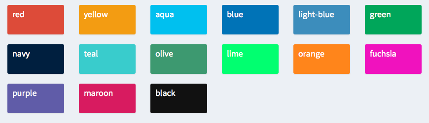

# Shiny {#shiny}

**Shiny**是R中用于构建网页应用程序的一个框架，能够为用户呈现交互式数据分析结果。无需HTML、CSS或者JavaScript等知识，你就可以基于R代码搭建出任何人都可见的数据可视化网页。

本章节内容基于[Mastering Shiny](https://mastering-shiny.org/index.html)。

同时大家也可以参考[shiny官网](https://shiny.posit.co/r/articles/)了解更多学习资料。

## 初始Shiny {#shiny_1}

下面是一段demo。


``` r
library(shiny)
ui <- fluidPage(
  selectInput("dataset", label = "Dataset", choices = ls("package:datasets")),
  verbatimTextOutput("summary"),
  tableOutput("table")
)
server <- function(input, output, session) {
  # Create a reactive expression
  dataset <- reactive({
    get(input$dataset, "package:datasets")
  })

  output$summary <- renderPrint({
    # Use a reactive expression by calling it like a function
    summary(dataset())
  })
  
  output$table <- renderTable({
    dataset()
  })
}
shinyApp(ui, server)
```

由四部分组成：导包、`ui`、`server`、以及`shinyApp`。

其中`ui`用于网页的ui设计，`server`用于背后的数据分析，`shinyApp`用于搭建shiny应用。

那么该如何创建shiny文件呢？

1. 新建脚本文件，完成代码后保存文件，脚本文件会自动识别出这是一个shiny应用，此时你的工具栏中的`Run`按钮会变为`Run App`

2. File -> New File -> Shiny Web App

3. File -> New Project -> New Directory -> Shiny Application

至此，你可点击`Run App`按钮运行文件，或者使用`Ctrl+Shift+Enter`运行。

注意到，当你运行shiny应用时会弹出一个窗口，并且控制台处会出现类似`Listening on http://127.0.0.1:4674`的反馈。**你可以直接将该URL复制到你的网页浏览器中，这样别人也可以看到你的应用，当然前提是你的shiny应用仍在运行中**。

shiny应用是一直在运行的，你可以通过控制台右上角的红色停止按钮判断。当你点击该按钮，或者关闭shiny应用窗口时，方可停止。在停止之前，你不能在控制台中执行任何新命令。

## UI设计 {#shiny_2}

更多的输入与输出组件参见[shiny官网](https://shiny.posit.co/r/components/)。

### 输入 {#shiny_2_1}


``` default
sliderInput("min", "Limit (minimum)", value = 50, min = 0, max = 100)
```

对于形如`selectInput()`的函数，都是将你的信息传递给server的组件。这类组件的基本参数为ID、标签及其余参数。其中ID是组件的唯一标识符，用于后续调用（这里的ID是`min`，后续在server函数中通过`input$min`来调用该组件的输入值）。标签是该组件呈现给用户时所用的标签（这里的标签为`Limit (minimum)`，也就是页面中滑条的标签）。其余参数往往是与组件类型相关的参数（这里`value=50`表示默认值，`min`与`max`则是滑条的上下限）。

> ID是一个非常重要的概念，大多数的对象都可以设置ID，这样在server处就能够通过`input$id`来获取对应的输入


``` r
ui <- fluidPage(
  textInput("name", "What's your name?"),
  passwordInput("password", "What's your password?"),
  textAreaInput("story", "Tell me about yourself", rows = 3)
)
```

#### 文本类组件 {#shiny_2_1_1}

1. textInput()

   适合单行文本输入

2. passwordInput()

   适合密码类文本输入

3. textAreaInput()

   适合多行文本输入

#### 数值类组件 {#shiny_2_1_2}

1. numericInput()

   输入单个数值

2. sliderInput()

   滑块选取数值。特别的，当默认值是一个长度为2的向量时，滑块条变成范围取值（双向），而非单个数值（单向）
   
#### 日期类组件 {#shiny_2_1_3}

1. dateInput()

   输入日期

2. dateRangeInput()

   输入日期范围
   
#### 选择类组件 {#shiny_2_1_4}

1. selectInput()

   下拉式选择，可多选
   
2. selectizeInput()

   `selectInput()`的增强版，适合更为复杂、大量选择的输入场景

3. radioButtons()

   按钮式选择，只能单选
   
4. checkboxGroupInput()

   勾选式选择，可单选可多选
   
5. checkboxInput()

   勾选式选择，只能单选

> 注意参数`choiceNames`表示呈现给用户的选项名称，参数`choiceValues`表示传递给服务器端的实际值，二者一一对应

#### 文件传输类组件 {#shiny_2_1_5}

1. fileInput()

   将用户的文件传输到服务器端

#### 按钮类组件 {#shiny_2_1_6}

1. actionButton()

   通过点击传输信息。其中可根据`class`参数更改按钮的外观，详见[此处](https://bootstrapdocs.com/v3.3.6/docs/css/#buttons)

### 输出 {#shiny_2_2}

```
textOutput("text")
```

对于形如`textOutput()`的函数，用于接收服务器输出的结果。同理，输出的内容需要由唯一标识符ID来进行匹配。当输出的结果在服务器端中用`output$ID`完成赋值，在ui中的输出函数中即可输入相应的ID来调用结果。


``` r
ui <- fluidPage(
  textOutput("text"),
  verbatimTextOutput("code")
)
server <- function(input, output, session) {
  output$text <- renderText({ 
    "Hello friend!" 
  })
  output$code <- renderPrint({ 
    summary(1:10) 
  })
}
```

#### 文本类输出 {#shiny_2_2_1}

1. textOutput()

   用于一般的文本输出，常与渲染函数`renderText()`搭配

2. verbatimTextOutput()

   用于代码结果的输出，常与渲染函数`renderPrint()`搭配

> 注意到，如果在渲染函数`render`中需要执行多行代码的话，则需要`{}`进行包裹

#### 表格类输出 {#shiny_2_2_2}

1. tableOutput()

   输出静态表格，一次性展示完所有数据，常与渲染函数`renderTable()`搭配
   
2. dataTableOutput()

   输出动态表格，可进行翻页，常与渲染函数`renderDataTable()`搭配

> `dataTableOutput()`被弃用了，可以试试`DT::DTOutput()`

#### 图像类输出 {#shiny_2_2_3}

1. plotOutput()

   输出图像，常与渲染函数`renderPlot`搭配

> 建议设置`renderPlot(res = 96)`

#### 下载文件 {#shiny_2_2_4}

1. downloadButton()

2. downloadLink()

## 反应式编程 {#shiny_3}

反应式编程，简而言之，就是当输入变化时，所有相关的输出将会实时更新，而其余无关的输出则保持原状。因此，当你运行shiny程序时它并不会立即执行内部的代码，内部代码仅仅声明了处理的逻辑，是否运行以及何时运行都取决于shiny，也就是说，shiny程序是**懒惰**的。

> shiny的编程风格属于声明式风格，并不像常规代码按照前后顺序运行，而是根据内部的逻辑链运行

### 服务端 {#shiny_3_1}

回忆shiny应用程序的一般形式


``` default
library(shiny)

ui <- fluidPage(
  # front end interface
)

server <- function(input, output, session) {
  # back end logic
}

shinyApp(ui, server)
```

`ui`表示交互界面，呈现给每个用户的内容是相同的。`server`表示服务器端，由于每个用户输入的信息不尽相同，因此shiny程序在每次创建新会话(session)时都会独立地激活`server()`。

#### 输入 {#shiny_3_1_1}

对于ui中的输入`input`，会将其存储为类似列表的对象，每个元素的名称都是ui中相应的ID，在server中可通过`input$ID`来调用输入值。

> 注意`input`不能修改，只能读取

#### 输出 {#shiny_3_1_2}

同`input`，`output`也是类似列表的对象。对于你想输出的内容可通过`output$ID`的赋予其唯一标识符，然后在ui中的输出函数中根据ID进行调用。

> 注意`output$ID`赋值时一定要搭配渲染函数`render``

### 反应表达式 {#shiny_3_2}

反应表达式创建了一种**依赖关系**，当且仅当输入变化时才会更新信息，并可重复使用，简化代码。它同时具有input与output的特点：作为信息更新后的output，作为渲染函数的input。

> 如果大于1次使用，都应考虑使用反应表达式

下面对两个正态分布数据进行模拟，比较这两段代码（仅在server部分有差异）：


``` r
library(shiny)
library(ggplot2)

freqpoly <- function(x1, x2, binwidth = 0.1, xlim = c(-3, 3)) {
  df <- data.frame(
    x = c(x1, x2),
    g = c(rep("x1", length(x1)), rep("x2", length(x2)))
  )
  
  ggplot(df, aes(x, colour = g)) +
    geom_freqpoly(binwidth = binwidth, size = 1) +
    coord_cartesian(xlim = xlim)
}

t_test <- function(x1, x2) {
  test <- t.test(x1, x2)
  
  # use sprintf() to format t.test() results compactly
  sprintf(
    "p value: %0.3f\n[%0.2f, %0.2f]",
    test$p.value, test$conf.int[1], test$conf.int[2]
  )
}

ui <- fluidPage(
  fluidRow(
    column(4,
           "Distribution 1",
           numericInput("n1", label = "n", value = 1000, min = 1),
           numericInput("mean1", label = "µ", value = 0, step = 0.1),
           numericInput("sd1", label = "σ", value = 0.5, min = 0.1, step = 0.1)
    ),
    column(4,
           "Distribution 2",
           numericInput("n2", label = "n", value = 1000, min = 1),
           numericInput("mean2", label = "µ", value = 0, step = 0.1),
           numericInput("sd2", label = "σ", value = 0.5, min = 0.1, step = 0.1)
    ),
    column(4,
           "Frequency polygon",
           numericInput("binwidth", label = "Bin width", value = 0.1, step = 0.1),
           sliderInput("range", label = "range", value = c(-3, 3), min = -5, max = 5)
    )
  ),
  fluidRow(
    column(9, plotOutput("hist")),
    column(3, verbatimTextOutput("ttest"))
  )
)

server <- function(input, output, session) {
  output$hist <- renderPlot({
    x1 <- rnorm(input$n1, input$mean1, input$sd1)
    x2 <- rnorm(input$n2, input$mean2, input$sd2)
    
    freqpoly(x1, x2, binwidth = input$binwidth, xlim = input$range)
  }, res = 96)
  
  output$ttest <- renderText({
    x1 <- rnorm(input$n1, input$mean1, input$sd1)
    x2 <- rnorm(input$n2, input$mean2, input$sd2)
    
    t_test(x1, x2)
  })
}

shinyApp(ui,server)
```


``` r
library(shiny)
library(ggplot2)

freqpoly <- function(x1, x2, binwidth = 0.1, xlim = c(-3, 3)) {
  df <- data.frame(
    x = c(x1, x2),
    g = c(rep("x1", length(x1)), rep("x2", length(x2)))
  )
  
  ggplot(df, aes(x, colour = g)) +
    geom_freqpoly(binwidth = binwidth, size = 1) +
    coord_cartesian(xlim = xlim)
}

t_test <- function(x1, x2) {
  test <- t.test(x1, x2)
  
  # use sprintf() to format t.test() results compactly
  sprintf(
    "p value: %0.3f\n[%0.2f, %0.2f]",
    test$p.value, test$conf.int[1], test$conf.int[2]
  )
}

ui <- fluidPage(
  fluidRow(
    column(4,
           "Distribution 1",
           numericInput("n1", label = "n", value = 1000, min = 1),
           numericInput("mean1", label = "µ", value = 0, step = 0.1),
           numericInput("sd1", label = "σ", value = 0.5, min = 0.1, step = 0.1)
    ),
    column(4,
           "Distribution 2",
           numericInput("n2", label = "n", value = 1000, min = 1),
           numericInput("mean2", label = "µ", value = 0, step = 0.1),
           numericInput("sd2", label = "σ", value = 0.5, min = 0.1, step = 0.1)
    ),
    column(4,
           "Frequency polygon",
           numericInput("binwidth", label = "Bin width", value = 0.1, step = 0.1),
           sliderInput("range", label = "range", value = c(-3, 3), min = -5, max = 5)
    )
  ),
  fluidRow(
    column(9, plotOutput("hist")),
    column(3, verbatimTextOutput("ttest"))
  )
)

server <- function(input, output, session) {
  x1 <- reactive(rnorm(input$n1, input$mean1, input$sd1))
  x2 <- reactive(rnorm(input$n2, input$mean2, input$sd2))

  output$hist <- renderPlot({
    freqpoly(x1(), x2(), binwidth = input$binwidth, xlim = input$range)
  }, res = 96)

  output$ttest <- renderText({
    t_test(x1(), x2())
  })
}

shinyApp(ui,server)
```

在第一段代码中，**shiny会把输出看成一个整体**，即使你只改变第一个分布的参数，那么在运行时shiny也会重新对这两个分布进行抽样。而我们的本意是对第一个分布重新抽样，保持第二个分布的数据不变。

在第二段代码中，抽样过程都被包含在反应表达式`reactive()`中，这样shiny仅会在对应输入更新时运行此处的代码，否则保持原始数据。也就是说，反应表达式是一个模块化单元，就像平时使用的函数一样。

> 在使用反应表达式时，除了要有`reactive()`，在其他地方调用对象时还得有`()`，正如这里的`x1()`、`x2()`

### 控制更新 {#shiny_3_3}

#### 自动更新 {#shiny_3_3_1}

我们除了在更改输入时想更新数据外，有时还想在同一输入下进行多次更新（如果可以的话）。例如在同一分布下（意味着输入不变），我们想看看多次抽样的结果（重复抽样操作）。这时，可以利用`reactiveTimer(interval)`，根据时间间隔interval来周期性地触发响应式更新的计时器函数，依赖于它的响应式表达式/输出按固定时间间隔自动重新计算，非常适合实现实时数据刷新、动态仪表盘等功能。

> interval以毫秒为单位， 1s=1000ms


``` r
server <- function(input, output, session) {
  timer <- reactiveTimer(500)

  x1 <- reactive({
    timer()
    rpois(input$n, input$lambda1)
  })
  x2 <- reactive({
    timer()
    rpois(input$n, input$lambda2)
  })

  output$hist <- renderPlot({
    freqpoly(x1(), x2(), binwidth = 1, xlim = c(0, 40))
  }, res = 96)
}
```

这里创建了500ms的计时器，并在`x1`和`x2`中添加了计时器，这使得在1s中就会更新两次`x1`和`x2`，并重新绘图。

#### 手动更新 {#shiny_3_3_2}

或许我们也想在同一输入下，手动点击按钮来进行一次更新，这时引入`actionButton()`。


``` r
library(shiny)
library(ggplot2)

freqpoly <- function(x1, x2, binwidth = 0.1, xlim = c(-3, 3)) {
  df <- data.frame(
    x = c(x1, x2),
    g = c(rep("x1", length(x1)), rep("x2", length(x2)))
  )
  
  ggplot(df, aes(x, colour = g)) +
    geom_freqpoly(binwidth = binwidth, size = 1) +
    coord_cartesian(xlim = xlim)
}

ui <- fluidPage(
  fluidRow(
    column(3,
           numericInput("lambda1", label = "lambda1", value = 3),
           numericInput("lambda2", label = "lambda2", value = 5),
           numericInput("n", label = "n", value = 1e4, min = 0),
           actionButton("simulate", "Simulate!")
    ),
    column(9, plotOutput("hist"))
  )
)
server <- function(input, output, session) {
  x1 <- reactive({
    input$simulate
    rpois(input$n, input$lambda1)
  })
  x2 <- reactive({
    input$simulate
    rpois(input$n, input$lambda2)
  })
  output$hist <- renderPlot({
    freqpoly(x1(), x2(), binwidth = 1, xlim = c(0, 40))
  }, res = 96)
}

shinyApp(ui,server)
```

此处利用`actionButton()`创建了一个ID为"simulate"，标签为"Simulate!"的按钮，并在`x1`和`x2`处的响应表达式中添加了`input$simulate`，这使得在每次点击时都能重新更新数据。

但这样的编程结果会创造两种依赖关系：`x1`和`x2`既依赖输入参数，又依赖按钮。当上述两种源头变化时，数据都会更新。倘若我们只想在点击按钮时更新数据（即使参数已经发生了变化），这里引入`eventReactive()`。`eventReactive()`有两个参数，第一个参数指定与谁创建依赖关系，第二个参数表示需要计算的内容。

> 需要计算的内容用`{}`包裹


``` r
server <- function(input, output, session) {
  x1 <- eventReactive(input$simulate, {
    rpois(input$n, input$lambda1)
  })
  x2 <- eventReactive(input$simulate, {
    rpois(input$n, input$lambda2)
  })
  
  output$hist <- renderPlot({
    freqpoly(x1(), x2(), binwidth = 1, xlim = c(0, 40))
  }, res = 96)
}
```

这里的`x1`和`x2`仅会在点击按钮时更新一次数据。

### 信息反馈 {#shiny_3_4}

现在介绍新的反应表达式——`observeEvent()`——用于监控特定事件并执行响应操作。

`observeEvent()`的第一个参数为依赖对象，第二个参数为要执行的代码块。与`eventReactive()`不同，`observeEvent()`并没有返回值。


``` r
ui <- fluidPage(
  textInput("name", "What's your name?"),
  textOutput("greeting")
)

server <- function(input, output, session) {
  string <- reactive(paste0("Hello ", input$name, "!"))

  output$greeting <- renderText(string())
  observeEvent(input$name, {
    message(paste0("Greeting performed: ", input$name))
  })
}
```

这里的`observeEvent()`监控`input$name`的变化。

## 页面布局 {#shiny_4}

### 页面函数 {#shiny_4_1}

1. fluidPage()

   用于创建流畅的页面布局。页面由行与列组成。行的存在是为了控制元素出现在同一行上，列的存在是为了定义元素在**12单位宽**的页面中占据多少宽度。
   
> `fluidRow()`函数控制每一行的内容

2. fixedPage()

   固定页面在典型显示器上的宽度限制为940像素，在较小和较大的显示器上分别为724像素或1170像素。
   
> `fixedRow()`函数控制每一行的内容

3. fillPage()

   尽可能地创建出填满浏览器窗口的页面
   
### 布局函数 {#shiny_4_2}

布局函数就是控制一个页面中各个元素的布局

#### 单页布局 {#shiny_4_2_1}

下面就简单介绍经典布局——侧边栏布局`sidebarLayout`，常与标题栏`titlePanel()`搭配


``` r
library(shiny)

ui <- fluidPage(
  titlePanel("Central limit theorem"),
  sidebarLayout(
    sidebarPanel(
      numericInput("m", "Number of samples:", 2, min = 1, max = 100)
    ),
    mainPanel(
      plotOutput("hist")
    )
  )
)
server <- function(input, output, session) {
  output$hist <- renderPlot({
    means <- replicate(1e4, mean(runif(input$m)))
    hist(means, breaks = 20)
  }, res = 96)
}

shinyApp(ui,server)
```

其基本布局为“标题栏+侧边栏+主面板”。

#### 多页布局 {#shiny_4_2_2}

1. 标签卡式布局

   `tabsetPanel()`创建标签卡这个整体，`tabPanel()`创建子标签卡的内容


``` r
ui <- fluidPage(
  sidebarLayout(
    sidebarPanel(
      textOutput("panel")
    ),
    mainPanel(
      tabsetPanel(
        id = "tabset",
        tabPanel("panel 1", "one"),
        tabPanel("panel 2", "two"),
        tabPanel("panel 3", "three")
      )
    )
  )
)
server <- function(input, output, session) {
  output$panel <- renderText({
    paste("Current panel: ", input$tabset)
  })
}
```

> `tabsetPanel()`的参数`id`用于返回当前选中的子标签卡的名称

2. 导航栏式布局

   第一个布局函数是`navlistPanel`，可以说是`tabsetPanel()`的侧边形式
   

``` r
ui <- fluidPage(
  navlistPanel(
    id = "tabset",
    "Heading 1",
    tabPanel("panel 1", "Panel one contents"),
    "Heading 2",
    tabPanel("panel 2", "Panel two contents"),
    tabPanel("panel 3", "Panel three contents")
  )
)
```

> 注意`Heaning 1`与`Heading 2`类似侧边栏中的小标题

   第二个布局函数是`navbarPage()`与`navbarMenu()`。前者控制导航栏置于顶部，后者生成一个下拉式菜单，里面包含了多个子标签卡
   

``` r
ui <- navbarPage(
  "Page title",   
  tabPanel("panel 1", "one"),
  tabPanel("panel 2", "two"),
  tabPanel("panel 3", "three"),
  navbarMenu("subpanels", 
    tabPanel("panel 4a", "four-a"),
    tabPanel("panel 4b", "four-b"),
    tabPanel("panel 4c", "four-c")
  )
)
```


### bslib风格布局 {#shiny_4_2_3}

除此之外，官网[Shiny Layouts](https://shiny.posit.co/r/layouts/)中还展示了基于`bslib`包的布局函数，个人认为更加美观与便捷。

> 使用时记得导入`library(bslib)`

1. Navbars

   导航栏式布局，导航栏被置于顶部或底部
   
2. Sidebars

   经典侧边栏布局

3. Tabs

   标签卡式布局

4. Panels & Cards

   Panels不知道算什么风格，Cards就是在页面上呈现卡片式窗口

5. Arrange Elements

   自定义布局

## 主题 {#shiny_5}

在页面函数中都会有参数`theme`，你可根据`bslib::bs_theme()`函数传入[预制的主题](https://bootswatch.com/)。


``` r
ui <- fluidPage(
  theme = bslib::bs_theme(bootswatch = "darkly"),
  ...
)
```

或者可自定义主题


``` r
theme <- bslib::bs_theme(
  bg = "#0b3d91", 
  fg = "white", 
  base_font = "Source Sans Pro"
)
```

除了页面主题，输出的图像也能凭借`thematic::thematic_shiny()`设置自适应主题，


``` r
library(ggplot2)

ui <- fluidPage(
  theme = bslib::bs_theme(bootswatch = "darkly"),
  titlePanel("A themed plot"),
  plotOutput("plot"),
)

server <- function(input, output, session) {
  thematic::thematic_shiny()
  
  output$plot <- renderPlot({
    ggplot(mtcars, aes(wt, mpg)) +
      geom_point() +
      geom_smooth()
  }, res = 96)
}
```

更进一步，如果你了解HTML和CSS，那么你完全可以自定义主题，详见[此处](https://mastering-shiny.org/action-layout.html#under-the-hood)。

## 交互式图像与插入图像 {#shiny_6}

[手册](https://mastering-shiny.org/action-graphics.html)中介绍了交互式图像的相关知识。但个人觉得还是在shiny中直接使用`plotly`及相关可交互图像包更为便捷。

### 交互式图像 {#shiny_6_1}

#### plotly {#shiny_6_1_1}

`plotly`包中自带`renderPlotly()`与`plotlyOutput()`函数，负责在shiny中渲染并输出plotly图像。

这里就简单介绍plotly的用法，具体细节还是等有需要的时候自行查找[官方手册](https://plotly.com/r/reference/index/)。

plotly绘图的两种实现方式：

1. 直接绘图

   - 利用`plot_ly()`函数初始化对象，在传递参数时得使用`=~`
   - 根据不同的图形类型查询对应的官网手册，利用**命名列表**来传递参数
   - 支持管道符


``` r
library(plotly)

# volcano是R内置的矩阵
fig <- plot_ly(z = ~volcano) %>% add_surface(
  contours = list(
    z = list(
      show=TRUE,
      usecolormap=TRUE,
      highlightcolor="#ff0000",
      project=list(z=TRUE)
    )
  )
)
fig <- fig %>% layout(
  scene = list(
    camera=list(
      eye = list(x=1.87, y=0.88, z=-0.64)
    )
  )
)

fig
```

```{=html}
<div class="plotly html-widget html-fill-item" id="htmlwidget-ee03abcd30d6692460d2" style="width:672px;height:480px;"></div>
<script type="application/json" data-for="htmlwidget-ee03abcd30d6692460d2">{"x":{"visdat":{"9958172e1315":["function () ","plotlyVisDat"]},"cur_data":"9958172e1315","attrs":{"9958172e1315":{"z":{},"alpha_stroke":1,"sizes":[10,100],"spans":[1,20],"type":"surface","contours":{"z":{"show":true,"usecolormap":true,"highlightcolor":"#ff0000","project":{"z":true}}},"inherit":true}},"layout":{"margin":{"b":40,"l":60,"t":25,"r":10},"scene":{"camera":{"eye":{"x":1.8700000000000001,"y":0.88,"z":-0.64000000000000001}},"zaxis":{"title":"volcano"}},"hovermode":"closest","showlegend":false,"legend":{"yanchor":"top","y":0.5}},"source":"A","config":{"modeBarButtonsToAdd":["hoverclosest","hovercompare"],"showSendToCloud":false},"data":[{"colorbar":{"title":"volcano","ticklen":2,"len":0.5,"lenmode":"fraction","y":1,"yanchor":"top"},"colorscale":[["0","rgba(68,1,84,1)"],["0.0416666666666666","rgba(70,19,97,1)"],["0.0833333333333334","rgba(72,32,111,1)"],["0.125","rgba(71,45,122,1)"],["0.166666666666667","rgba(68,58,128,1)"],["0.208333333333333","rgba(64,70,135,1)"],["0.25","rgba(60,82,138,1)"],["0.291666666666667","rgba(56,93,140,1)"],["0.333333333333333","rgba(49,104,142,1)"],["0.375","rgba(46,114,142,1)"],["0.416666666666666","rgba(42,123,142,1)"],["0.458333333333333","rgba(38,133,141,1)"],["0.5","rgba(37,144,140,1)"],["0.541666666666667","rgba(33,154,138,1)"],["0.583333333333333","rgba(39,164,133,1)"],["0.625","rgba(47,174,127,1)"],["0.666666666666667","rgba(53,183,121,1)"],["0.708333333333333","rgba(79,191,110,1)"],["0.75","rgba(98,199,98,1)"],["0.791666666666667","rgba(119,207,85,1)"],["0.833333333333333","rgba(147,214,70,1)"],["0.875","rgba(172,220,52,1)"],["0.916666666666667","rgba(199,225,42,1)"],["0.958333333333333","rgba(226,228,40,1)"],["1","rgba(253,231,37,1)"]],"showscale":true,"z":[[100,100,101,101,101,101,101,100,100,100,101,101,102,102,102,102,103,104,103,102,101,101,102,103,104,104,105,107,107,107,108,108,110,110,110,110,110,110,110,110,108,108,108,107,107,108,108,108,108,108,107,107,107,107,106,106,105,105,104,104,103],[101,101,102,102,102,102,102,101,101,101,102,102,103,103,103,103,104,105,104,103,102,102,103,105,106,106,107,109,110,110,110,110,111,112,113,114,116,115,114,112,110,110,110,109,108,109,109,109,109,108,108,108,108,107,107,106,106,105,105,104,104],[102,102,103,103,103,103,103,102,102,102,103,103,104,104,104,104,105,106,105,104,104,105,106,107,108,110,111,113,114,115,114,115,116,118,119,119,121,121,120,118,116,114,112,111,110,110,110,110,109,109,109,109,108,108,107,107,106,106,105,105,104],[103,103,104,104,104,104,104,103,103,103,103,104,104,104,105,105,106,107,106,106,106,107,108,110,111,114,117,118,117,119,120,121,122,124,125,126,127,127,126,124,122,120,117,116,113,111,110,110,110,109,109,109,109,108,108,107,107,106,106,105,105],[104,104,105,105,105,105,105,104,104,103,104,104,105,105,105,106,107,108,108,108,109,110,112,114,115,118,121,122,121,123,128,131,129,130,131,131,132,132,131,130,128,126,122,119,115,114,112,110,110,110,110,110,109,109,108,107,107,107,106,106,105],[105,105,105,106,106,106,106,105,105,104,104,105,105,106,106,107,109,110,110,112,113,115,116,118,119,121,124,126,126,129,134,137,137,136,136,135,136,136,136,135,133,129,126,122,118,116,115,113,111,110,110,110,110,109,108,108,108,107,107,106,106],[105,106,106,107,107,107,107,106,106,105,105,106,106,107,108,109,111,113,114,116,118,120,121,122,123,125,127,129,130,135,140,142,142,142,141,140,140,140,140,139,137,134,129,125,121,118,116,114,112,110,110,110,111,110,109,109,108,108,107,107,106],[106,107,107,108,108,108,108,107,107,106,106,107,108,108,110,113,115,117,118,120,122,124,125,127,128,129,131,134,135,141,146,147,146,146,145,144,144,144,143,142,141,139,135,130,126,122,118,116,114,112,112,113,112,110,110,109,109,108,108,107,106],[107,108,108,109,109,109,109,108,108,107,108,108,110,111,113,116,118,120,123,125,127,129,130,132,134,135,137,139,142,146,152,152,151,151,150,149,148,148,146,145,143,142,139,135,131,127,122,119,117,115,115,115,114,112,110,110,109,109,108,107,107],[108,109,109,110,110,110,110,109,109,108,110,110,113,116,118,120,122,125,127,129,133,136,138,140,141,142,148,150,151,156,158,159,158,157,158,158,154,151,149,148,146,144,141,137,134,130,125,122,120,118,117,117,115,113,111,110,110,109,108,107,107],[109,110,110,111,111,111,111,110,110,110,112,114,118,121,123,125,127,129,133,137,141,143,145,146,148,150,154,156,159,161,162,163,164,163,164,164,160,157,154,151,149,146,144,140,137,133,129,126,124,121,119,118,116,114,112,111,110,109,108,107,106],[110,110,111,113,112,111,113,112,112,114,116,119,121,124,127,129,133,138,143,146,149,149,151,153,154,157,159,160,163,165,166,167,168,168,168,168,166,162,159,157,154,152,149,144,140,136,133,131,128,125,122,119,117,115,113,111,110,109,108,107,106],[110,111,113,115,114,113,114,114,115,117,119,121,124,126,129,133,140,145,150,154,155,155,157,159,161,162,164,165,167,168,169,170,172,174,172,172,171,169,166,163,161,158,153,148,143,140,137,134,131,128,125,120,118,116,114,112,110,109,108,107,105],[111,113,115,117,116,115,116,117,117,119,121,124,126,128,132,137,143,151,156,161,161,162,163,165,166,167,168,170,171,173,175,177,179,178,177,176,176,174,171,169,165,161,156,152,148,144,140,138,135,131,127,123,119,117,115,113,111,110,108,106,105],[114,115,117,117,117,118,119,119,120,121,124,126,128,131,137,143,150,156,160,163,165,168,170,171,172,173,174,175,177,179,180,182,183,183,183,183,180,178,177,172,168,164,160,156,152,148,144,141,138,134,130,126,121,117,114,112,110,110,108,106,104],[116,118,118,118,120,121,121,122,122,123,125,128,130,134,141,147,152,156,160,165,168,170,174,176,179,180,181,181,182,182,183,184,186,187,187,184,184,181,180,176,172,168,165,161,157,153,149,145,142,138,133,129,125,120,115,111,110,110,108,106,104],[118,120,120,121,122,123,124,124,125,126,127,129,132,135,142,149,153,157,161,166,170,174,178,180,182,183,184,184,185,186,186,187,189,189,189,189,189,186,182,179,175,171,168,165,162,157,152,149,145,141,137,131,125,120,116,111,110,110,108,106,104],[120,121,122,123,124,125,126,127,127,128,130,132,134,137,142,151,155,158,162,169,172,176,181,183,184,186,187,188,189,189,189,189,190,190,191,190,190,188,186,183,180,175,171,168,165,161,157,152,149,145,141,134,127,121,116,112,110,110,108,106,104],[120,122,125,126,126,127,128,129,130,130,132,134,136,139,145,152,157,160,167,172,175,178,181,185,186,188,190,191,192,193,193,192,192,191,192,191,191,190,190,187,184,181,177,172,169,165,161,156,152,147,143,139,131,123,119,115,111,110,108,106,105],[121,124,126,128,129,129,130,131,132,133,135,137,139,143,150,154,159,164,170,173,176,179,184,186,189,190,191,192,193,194,195,194,193,192,191,191,191,191,190,190,188,184,181,177,173,169,165,160,155,149,145,142,136,129,123,118,114,110,108,108,107],[122,125,127,130,130,131,133,134,135,136,137,140,143,147,154,158,162,166,171,174,177,181,186,189,190,190,191,192,191,191,190,189,188,189,190,190,191,190,190,190,189,186,184,181,177,173,169,164,158,152,148,144,140,134,125,118,115,111,110,108,107],[122,125,128,130,132,133,135,136,137,139,140,143,147,152,157,161,164,168,172,175,179,182,186,190,190,190,190,189,187,184,184,183,182,182,183,183,183,184,185,186,187,186,185,184,181,177,173,169,163,157,149,145,141,136,130,119,116,112,110,108,106],[123,126,129,131,133,135,137,138,139,141,143,147,150,156,161,164,167,170,173,177,181,184,187,188,190,189,187,185,183,179,176,174,174,174,174,174,176,177,179,180,182,183,182,181,181,180,176,171,166,160,152,147,142,138,133,126,121,115,110,106,105],[124,127,130,132,135,137,138,140,142,144,147,149,154,157,161,165,168,171,175,178,181,184,186,187,187,184,184,181,179,175,171,169,168,168,168,169,170,172,174,177,178,179,180,181,181,180,179,174,167,161,155,148,144,139,134,128,121,115,110,106,105],[123,128,131,133,136,138,140,142,144,146,149,151,154,157,160,164,168,172,175,178,181,183,184,184,185,183,180,177,174,170,167,165,164,164,164,165,166,168,171,175,176,178,180,181,180,180,179,177,170,163,157,150,144,139,134,128,121,115,110,108,107],[123,127,131,134,136,138,140,142,144,147,149,151,154,157,160,164,168,171,174,178,180,181,181,182,183,181,178,173,169,166,163,161,161,160,160,161,163,165,168,173,176,178,179,180,181,180,180,175,173,166,159,152,145,139,134,127,121,115,110,109,108],[120,124,128,131,134,137,139,142,144,146,149,151,153,156,160,163,167,171,174,178,180,180,180,180,180,180,175,171,167,162,160,158,157,157,157,158,159,162,166,170,175,177,178,180,181,181,180,178,175,169,160,154,148,140,134,128,121,115,110,110,109],[118,121,125,129,132,134,137,140,142,145,147,149,151,155,159,163,166,169,173,177,179,180,180,180,180,179,174,169,166,161,158,156,154,153,153,154,156,159,163,169,173,175,178,180,181,180,180,179,175,170,160,154,149,142,135,128,122,116,111,110,110],[117,120,121,125,129,132,135,138,140,143,145,147,149,153,157,160,163,166,171,174,177,179,180,180,180,179,172,168,164,160,157,154,151,149,150,150,154,158,164,169,174,178,180,180,180,180,178,177,175,170,161,153,148,142,135,129,123,116,113,112,110],[115,118,120,122,126,130,133,136,138,141,143,145,148,151,154,157,160,163,168,171,174,177,179,179,179,176,171,167,164,160,156,153,149,148,149,151,155,158,163,170,173,177,179,180,180,180,178,175,173,171,162,154,147,141,136,130,124,117,115,112,110],[114,116,118,120,122,127,131,133,136,138,141,143,146,148,151,154,157,160,164,168,171,174,178,178,179,177,173,169,165,161,157,154,151,149,150,152,155,159,166,171,175,177,179,180,180,179,176,174,171,168,159,151,146,141,135,129,124,119,116,113,110],[115,114,116,118,120,122,127,129,132,136,139,141,143,146,148,151,153,156,160,164,167,172,174,176,177,176,173,170,166,162,159,157,154,153,154,155,158,161,169,172,174,176,178,178,178,178,175,172,169,162,156,149,144,140,134,128,123,118,115,112,110],[113,113,114,116,118,120,122,125,129,133,136,138,141,143,146,149,150,153,156,160,165,170,173,176,176,176,173,172,169,165,163,160,158,157,158,159,161,166,170,170,173,175,176,178,176,173,171,168,164,158,153,146,140,137,132,127,121,117,113,111,110],[111,112,113,114,116,118,120,122,126,130,133,136,139,142,145,147,148,151,155,158,163,168,173,176,177,177,176,174,171,169,166,164,161,161,162,164,165,167,170,170,171,173,173,173,170,168,165,163,160,155,149,143,138,134,130,125,119,116,112,110,109],[110,112,113,113,114,116,118,120,123,127,131,134,137,141,143,145,148,150,154,157,161,166,171,176,178,178,178,176,174,172,170,167,167,167,166,168,170,169,168,167,168,168,168,168,167,165,163,160,156,152,146,140,136,131,128,122,118,114,110,110,109],[109,110,111,112,114,116,118,119,120,124,128,131,136,140,142,145,147,150,153,157,160,165,170,174,178,179,179,178,178,176,174,171,170,170,170,168,167,166,164,163,161,162,163,163,163,161,160,157,153,148,142,136,130,127,124,120,117,113,110,110,109],[108,109,111,112,114,116,117,118,120,121,125,128,132,138,142,144,147,149,153,156,160,164,170,174,178,180,180,179,179,178,176,172,170,170,170,168,166,164,162,160,157,156,157,158,158,156,153,151,149,144,139,130,127,124,121,118,115,112,110,110,109],[108,109,111,113,114,116,117,118,119,120,122,126,130,135,139,143,147,149,152,156,160,164,169,173,177,180,180,180,180,179,178,174,170,170,168,167,165,163,161,157,154,153,152,152,152,149,148,147,144,140,134,128,125,122,119,117,114,110,110,109,109],[107,108,111,112,114,115,116,117,119,120,121,124,128,133,137,141,145,149,152,156,160,164,168,172,176,179,180,180,180,179,178,174,170,168,166,165,163,161,158,154,150,149,148,146,145,143,143,143,140,136,130,126,123,120,118,115,112,110,110,109,109],[107,108,110,112,113,113,115,116,118,120,122,125,128,132,136,140,145,148,150,155,160,164,167,170,174,177,179,179,178,176,176,173,169,166,164,163,161,159,155,152,148,145,143,141,140,139,139,138,136,132,128,124,121,118,116,114,111,110,110,109,108],[107,108,109,111,113,114,116,117,119,120,122,125,128,132,137,141,144,146,149,152,157,162,166,168,171,173,175,175,173,172,172,171,168,165,162,160,158,156,153,149,145,142,139,138,137,136,135,133,131,129,126,122,119,117,114,112,110,110,109,108,107],[108,109,110,112,114,115,116,117,119,120,122,126,129,133,137,141,143,146,148,151,155,160,164,167,168,169,170,170,169,168,167,168,166,163,160,158,155,153,150,147,143,140,137,136,134,133,132,130,129,127,125,121,118,115,112,110,110,110,108,107,107],[109,110,111,113,115,116,117,118,120,121,123,126,129,133,138,141,143,146,148,150,155,159,163,165,166,167,168,168,166,165,164,161,160,159,158,155,152,149,147,144,141,138,135,134,132,130,129,128,126,124,122,120,117,113,111,110,110,110,108,107,107],[110,111,112,113,116,117,118,119,120,122,125,127,130,133,138,141,143,146,148,150,154,159,162,163,164,166,166,166,165,163,161,159,157,156,155,153,150,146,143,140,138,136,133,132,130,129,128,125,124,122,120,119,117,114,111,110,110,109,108,107,107],[111,112,113,114,116,117,118,119,120,123,125,128,130,134,139,141,144,146,148,151,154,158,161,164,166,167,168,166,165,163,161,158,156,154,152,150,146,142,139,137,135,133,131,130,129,128,127,125,123,121,120,118,116,113,111,110,110,109,108,107,106],[111,112,113,115,117,118,118,120,121,124,126,128,131,135,139,142,144,146,148,151,155,160,164,165,168,169,169,168,166,163,160,158,156,153,151,148,145,142,139,137,135,132,130,129,127,126,125,124,123,120,120,117,116,114,112,110,110,108,107,106,106],[112,113,114,116,117,118,119,120,122,124,127,129,132,135,139,142,144,146,149,152,157,162,167,169,170,170,170,168,165,163,161,159,157,155,151,148,145,141,139,136,134,132,130,128,127,126,124,123,122,120,119,117,116,114,112,111,109,107,106,106,105],[113,114,115,116,117,119,119,120,122,125,127,129,132,135,139,142,144,147,149,154,159,164,169,170,170,170,170,170,168,165,163,161,158,155,151,148,145,142,139,137,135,132,131,128,126,125,124,122,121,120,119,117,115,113,111,110,109,106,105,105,104],[113,114,115,117,118,119,120,121,123,125,127,130,132,135,139,142,145,148,150,156,161,166,170,170,170,170,170,170,169,166,163,161,159,155,151,148,146,143,140,138,135,134,132,130,127,125,123,121,120,120,119,116,114,112,110,110,108,106,105,104,104],[114,115,116,117,118,119,120,121,123,126,128,130,133,136,139,142,145,148,152,157,161,166,168,170,170,170,170,168,166,164,163,160,159,155,151,148,146,143,141,138,136,134,132,130,128,125,123,121,120,120,118,116,113,111,110,110,109,106,105,104,104],[115,116,117,118,119,120,121,121,123,126,128,131,134,136,139,142,145,149,152,157,161,163,164,166,168,167,166,164,163,161,160,158,156,152,149,147,144,143,141,139,136,134,132,130,128,125,122,120,120,119,117,115,113,110,110,109,107,106,105,104,104],[115,116,117,118,119,120,121,122,123,125,128,131,134,137,139,142,145,149,152,156,159,159,160,162,162,161,161,160,159,158,157,155,153,150,148,146,145,143,142,140,137,134,131,129,126,124,122,120,119,117,115,113,111,110,109,109,107,106,105,104,104],[114,115,116,116,118,119,120,121,122,126,129,132,135,137,140,143,146,149,152,155,156,157,158,159,159,159,158,158,157,155,153,151,150,149,147,146,145,144,142,141,138,135,132,128,125,122,120,118,117,115,113,112,110,109,108,108,106,105,105,104,104],[113,114,115,116,117,118,119,120,123,126,129,132,135,138,140,143,146,148,151,153,154,156,157,157,157,157,156,155,154,152,150,149,148,147,146,145,144,142,141,140,139,136,132,129,125,121,118,116,115,113,111,110,109,108,108,107,106,105,104,104,104],[112,113,114,115,116,117,119,120,122,126,130,133,136,138,141,143,146,148,150,152,154,155,155,155,155,155,154,152,152,150,148,147,146,145,145,143,142,141,140,140,140,137,133,129,125,120,117,115,111,110,110,109,108,107,107,106,105,105,104,104,103],[111,112,114,115,116,117,118,120,122,125,131,134,137,139,142,144,146,148,150,152,153,153,153,153,153,153,153,151,149,147,146,144,144,143,143,142,141,140,140,140,140,138,134,130,123,120,118,111,110,110,110,108,107,106,108,105,105,104,104,103,103],[111,112,113,115,115,116,117,119,121,126,131,135,138,140,142,144,146,148,150,151,151,151,151,151,151,151,151,150,148,146,144,142,141,141,142,141,140,140,140,140,140,140,136,132,126,120,115,110,110,110,109,107,106,105,107,105,104,104,104,103,103],[112,113,113,114,115,116,117,119,122,127,132,135,139,141,143,145,147,149,150,150,150,150,150,150,150,150,150,149,147,144,142,141,140,140,140,140,140,140,140,140,140,140,137,133,128,120,117,110,110,110,108,106,105,105,106,105,104,104,103,103,103],[112,113,114,114,116,117,118,120,122,128,132,136,139,141,144,146,147,149,150,150,150,150,150,150,150,150,150,149,146,143,141,140,140,139,139,139,140,140,140,140,140,140,137,133,129,121,118,110,110,109,107,106,105,105,105,104,104,103,103,103,102],[112,114,114,115,116,117,119,120,122,128,133,136,140,142,144,146,148,150,150,150,150,150,150,150,150,150,150,148,145,142,140,138,138,138,137,138,140,140,140,140,140,140,137,134,130,122,118,110,110,108,106,105,103,104,104,104,104,103,103,102,102],[113,114,115,116,116,117,118,120,123,129,133,137,140,142,144,146,149,150,150,150,150,150,150,150,150,150,150,147,143,141,139,137,136,136,135,136,138,140,140,140,140,139,136,134,130,123,119,113,109,108,106,104,103,104,104,104,103,103,102,102,101],[114,115,115,116,117,118,118,120,123,129,133,137,140,143,145,147,150,150,150,150,150,150,150,150,150,150,148,145,142,139,138,136,135,134,134,134,136,138,137,138,139,137,134,132,125,122,117,114,109,107,105,103,102,104,104,103,103,102,102,101,101],[114,115,116,117,117,119,118,120,123,128,132,136,139,142,145,148,150,150,150,150,150,150,150,150,150,150,147,144,141,139,136,135,134,133,132,132,134,134,134,134,135,133,131,128,124,120,116,113,110,107,104,102,102,103,103,103,102,102,102,101,100],[115,116,116,117,118,119,119,120,124,128,132,136,139,142,145,148,150,150,150,150,150,150,150,150,150,149,146,143,140,138,135,134,133,131,131,131,131,131,131,131,130,127,124,122,119,117,115,112,109,106,104,101,102,103,103,102,102,102,101,100,100],[115,116,117,118,118,119,120,123,125,128,131,135,138,141,145,148,150,150,150,150,150,150,150,150,150,147,145,142,139,137,134,132,131,130,129,128,128,128,128,128,126,123,121,119,116,114,112,110,108,105,103,101,103,103,103,102,102,101,100,100,100],[116,117,118,118,119,120,122,123,125,128,131,134,137,141,145,148,149,150,150,150,150,150,150,150,148,145,143,141,138,135,133,130,129,128,127,126,125,125,125,124,123,120,118,116,114,111,109,107,106,104,102,100,101,101,102,102,101,100,100,100,100],[116,117,118,119,120,121,123,124,126,128,130,133,137,140,144,145,147,148,149,150,149,149,147,146,144,141,139,136,133,131,129,128,127,126,125,124,123,123,122,121,120,118,116,114,112,108,107,105,103,102,100,100,100,100,101,101,100,100,100,100,100],[117,118,119,119,120,121,123,124,126,128,129,131,135,139,142,143,145,146,147,147,147,146,144,142,140,138,135,133,130,128,127,126,125,124,123,122,121,120,119,118,117,115,114,112,110,106,105,102,101,100,100,100,100,100,100,100,100,99,99,99,99],[117,118,119,120,120,121,123,124,125,126,128,129,132,137,140,142,143,143,144,144,144,143,141,139,137,135,133,130,128,127,126,125,123,122,121,120,119,117,116,115,114,112,111,108,107,105,100,100,100,100,100,100,100,99,99,99,99,99,99,99,98],[116,117,118,120,120,121,122,123,124,125,126,128,130,134,139,140,141,141,141,141,141,140,138,136,134,133,131,129,127,125,124,123,122,120,119,118,117,116,114,112,111,108,109,106,106,100,100,100,100,100,99,99,99,99,99,99,99,98,98,98,97],[114,115,116,117,119,119,120,121,122,123,125,127,129,133,136,134,134,136,138,138,137,137,135,133,132,130,129,127,125,124,122,121,120,119,117,116,115,114,112,110,109,108,107,105,105,100,100,100,100,99,99,99,98,98,98,98,98,97,97,97,97],[112,113,114,115,116,116,117,119,120,122,124,126,127,129,129,128,127,129,132,133,133,133,133,131,129,127,126,125,124,122,121,119,118,117,116,114,113,112,110,109,108,106,106,105,100,100,100,98,98,98,98,98,98,97,97,97,97,97,97,97,96],[109,111,112,112,113,113,113,114,116,119,121,123,124,125,124,123,123,123,125,127,129,129,128,128,127,125,124,123,122,121,119,118,117,116,114,113,112,110,109,108,107,106,105,100,100,100,97,97,97,97,97,97,97,96,96,96,96,96,96,96,96],[106,107,108,108,109,110,110,112,113,114,117,119,120,121,119,117,117,117,118,120,123,124,125,125,125,123,121,120,120,119,118,117,116,115,114,113,111,109,109,107,106,105,100,100,100,96,96,96,96,96,96,96,96,96,96,96,96,96,96,96,96],[104,105,105,106,106,107,108,108,109,109,111,115,116,114,113,112,111,110,111,113,116,119,122,122,122,121,120,119,118,118,117,116,115,114,113,112,111,108,108,106,105,100,100,100,96,96,96,96,96,96,96,96,96,96,96,96,96,96,96,96,96],[102,103,103,104,104,105,106,106,107,108,109,111,112,110,109,108,108,108,108,109,110,112,116,117,117,118,118,118,117,116,116,115,114,113,112,111,110,107,107,105,100,100,100,97,96,96,96,96,96,96,96,96,96,96,96,96,96,96,96,96,96],[101,102,103,103,104,105,105,106,106,107,108,109,109,107,106,106,105,105,105,106,107,108,109,110,111,113,114,115,115,115,114,113,112,111,110,108,108,106,105,100,100,100,97,97,96,96,96,96,96,96,96,96,96,96,96,96,96,96,96,96,96],[100,101,102,102,103,103,104,104,105,106,106,107,106,106,106,105,105,104,103,103,104,105,107,108,110,111,111,112,112,113,113,112,111,110,108,107,106,105,100,100,100,98,97,97,96,96,96,96,96,96,96,96,96,96,96,96,96,96,96,96,96],[100,101,101,102,102,103,103,104,104,105,105,105,105,106,105,105,104,103,102,101,102,103,104,106,107,110,111,111,111,112,112,112,110,107,107,106,105,102,100,100,99,98,97,97,96,96,96,96,96,96,96,96,96,96,96,96,96,96,96,96,95],[99,100,101,102,102,103,103,103,104,104,104,104,103,104,104,104,104,102,101,101,102,103,104,105,107,110,111,111,111,111,111,111,108,106,105,105,102,101,100,99,99,98,97,97,96,96,96,96,96,96,96,96,96,96,96,96,96,96,96,95,95],[99,100,100,101,101,102,102,102,103,103,103,103,102,103,103,104,103,102,101,101,101,102,103,104,106,109,110,111,111,111,110,110,107,105,103,104,100,100,99,99,98,98,97,97,96,96,96,96,96,96,96,96,96,96,95,95,95,95,95,95,95],[99,100,100,100,101,101,101,102,102,103,102,102,101,102,102,103,103,101,101,100,101,101,102,103,105,109,110,110,111,110,110,109,106,105,100,102,100,99,99,99,98,98,97,97,96,96,96,96,96,96,95,95,95,95,95,95,95,95,95,95,94],[99,99,99,99,100,100,101,101,102,102,101,101,101,101,101,102,102,101,100,100,101,101,101,103,104,107,109,109,110,110,109,108,105,102,100,100,99,99,99,98,98,98,97,96,96,96,96,96,95,95,95,95,95,95,95,94,94,94,94,94,94],[98,99,99,99,99,100,100,101,101,102,101,100,100,100,101,101,101,100,100,100,100,101,101,101,103,106,107,109,109,109,109,107,104,101,100,99,99,99,98,98,98,97,96,96,96,96,95,95,95,95,95,95,95,94,94,94,94,94,94,94,94],[98,98,98,99,99,99,100,100,101,101,100,100,99,99,100,100,100,100,100,100,100,101,101,101,102,105,106,109,108,109,107,105,102,100,100,99,99,98,98,98,97,96,96,96,96,95,95,95,95,95,95,94,94,94,94,94,94,94,94,94,94],[97,98,98,98,99,99,99,100,100,100,100,100,99,99,99,100,100,100,100,100,100,100,101,101,101,103,104,105,106,105,104,101,100,100,99,99,98,98,97,97,97,96,96,96,95,95,95,95,95,94,94,94,94,94,94,94,94,94,94,94,94],[97,97,97,98,98,99,99,99,100,100,100,99,99,99,99,99,100,100,100,100,100,100,101,101,100,100,100,100,100,100,100,100,100,100,99,99,98,97,97,97,96,96,96,95,95,95,95,94,94,94,94,94,94,94,94,94,94,94,94,94,94]],"type":"surface","contours":{"z":{"show":true,"usecolormap":true,"highlightcolor":"#ff0000","project":{"z":true}}},"frame":null}],"highlight":{"on":"plotly_click","persistent":false,"dynamic":false,"selectize":false,"opacityDim":0.20000000000000001,"selected":{"opacity":1},"debounce":0},"shinyEvents":["plotly_hover","plotly_click","plotly_selected","plotly_relayout","plotly_brushed","plotly_brushing","plotly_clickannotation","plotly_doubleclick","plotly_deselect","plotly_afterplot","plotly_sunburstclick"],"base_url":"https://plot.ly"},"evals":[],"jsHooks":[]}</script>
```

2. 基于ggplot

   - 直接用`ggplot()`绘图，再利用`ggplotly()`函数转化为plotly对象，之后可根据需要继续使用管道符来添加细节
   - 注意，部分`ggplot`元素无法转化为plotly对象


``` r
fig <- ggplot(data=iris)+
  geom_point(aes(x=Sepal.Length, y=Sepal.Width, color=Species))+
  theme_minimal()
ggplotly(fig)
```

```{=html}
<div class="plotly html-widget html-fill-item" id="htmlwidget-0e22c016782a8243ed8c" style="width:672px;height:480px;"></div>
<script type="application/json" data-for="htmlwidget-0e22c016782a8243ed8c">{"x":{"data":[{"x":[5.0999999999999996,4.9000000000000004,4.7000000000000002,4.5999999999999996,5,5.4000000000000004,4.5999999999999996,5,4.4000000000000004,4.9000000000000004,5.4000000000000004,4.7999999999999998,4.7999999999999998,4.2999999999999998,5.7999999999999998,5.7000000000000002,5.4000000000000004,5.0999999999999996,5.7000000000000002,5.0999999999999996,5.4000000000000004,5.0999999999999996,4.5999999999999996,5.0999999999999996,4.7999999999999998,5,5,5.2000000000000002,5.2000000000000002,4.7000000000000002,4.7999999999999998,5.4000000000000004,5.2000000000000002,5.5,4.9000000000000004,5,5.5,4.9000000000000004,4.4000000000000004,5.0999999999999996,5,4.5,4.4000000000000004,5,5.0999999999999996,4.7999999999999998,5.0999999999999996,4.5999999999999996,5.2999999999999998,5],"y":[3.5,3,3.2000000000000002,3.1000000000000001,3.6000000000000001,3.8999999999999999,3.3999999999999999,3.3999999999999999,2.8999999999999999,3.1000000000000001,3.7000000000000002,3.3999999999999999,3,3,4,4.4000000000000004,3.8999999999999999,3.5,3.7999999999999998,3.7999999999999998,3.3999999999999999,3.7000000000000002,3.6000000000000001,3.2999999999999998,3.3999999999999999,3,3.3999999999999999,3.5,3.3999999999999999,3.2000000000000002,3.1000000000000001,3.3999999999999999,4.0999999999999996,4.2000000000000002,3.1000000000000001,3.2000000000000002,3.5,3.6000000000000001,3,3.3999999999999999,3.5,2.2999999999999998,3.2000000000000002,3.5,3.7999999999999998,3,3.7999999999999998,3.2000000000000002,3.7000000000000002,3.2999999999999998],"text":["Sepal.Length: 5.1<br />Sepal.Width: 3.5<br />Species: setosa","Sepal.Length: 4.9<br />Sepal.Width: 3.0<br />Species: setosa","Sepal.Length: 4.7<br />Sepal.Width: 3.2<br />Species: setosa","Sepal.Length: 4.6<br />Sepal.Width: 3.1<br />Species: setosa","Sepal.Length: 5.0<br />Sepal.Width: 3.6<br />Species: setosa","Sepal.Length: 5.4<br />Sepal.Width: 3.9<br />Species: setosa","Sepal.Length: 4.6<br />Sepal.Width: 3.4<br />Species: setosa","Sepal.Length: 5.0<br />Sepal.Width: 3.4<br />Species: setosa","Sepal.Length: 4.4<br />Sepal.Width: 2.9<br />Species: setosa","Sepal.Length: 4.9<br />Sepal.Width: 3.1<br />Species: setosa","Sepal.Length: 5.4<br />Sepal.Width: 3.7<br />Species: setosa","Sepal.Length: 4.8<br />Sepal.Width: 3.4<br />Species: setosa","Sepal.Length: 4.8<br />Sepal.Width: 3.0<br />Species: setosa","Sepal.Length: 4.3<br />Sepal.Width: 3.0<br />Species: setosa","Sepal.Length: 5.8<br />Sepal.Width: 4.0<br />Species: setosa","Sepal.Length: 5.7<br />Sepal.Width: 4.4<br />Species: setosa","Sepal.Length: 5.4<br />Sepal.Width: 3.9<br />Species: setosa","Sepal.Length: 5.1<br />Sepal.Width: 3.5<br />Species: setosa","Sepal.Length: 5.7<br />Sepal.Width: 3.8<br />Species: setosa","Sepal.Length: 5.1<br />Sepal.Width: 3.8<br />Species: setosa","Sepal.Length: 5.4<br />Sepal.Width: 3.4<br />Species: setosa","Sepal.Length: 5.1<br />Sepal.Width: 3.7<br />Species: setosa","Sepal.Length: 4.6<br />Sepal.Width: 3.6<br />Species: setosa","Sepal.Length: 5.1<br />Sepal.Width: 3.3<br />Species: setosa","Sepal.Length: 4.8<br />Sepal.Width: 3.4<br />Species: setosa","Sepal.Length: 5.0<br />Sepal.Width: 3.0<br />Species: setosa","Sepal.Length: 5.0<br />Sepal.Width: 3.4<br />Species: setosa","Sepal.Length: 5.2<br />Sepal.Width: 3.5<br />Species: setosa","Sepal.Length: 5.2<br />Sepal.Width: 3.4<br />Species: setosa","Sepal.Length: 4.7<br />Sepal.Width: 3.2<br />Species: setosa","Sepal.Length: 4.8<br />Sepal.Width: 3.1<br />Species: setosa","Sepal.Length: 5.4<br />Sepal.Width: 3.4<br />Species: setosa","Sepal.Length: 5.2<br />Sepal.Width: 4.1<br />Species: setosa","Sepal.Length: 5.5<br />Sepal.Width: 4.2<br />Species: setosa","Sepal.Length: 4.9<br />Sepal.Width: 3.1<br />Species: setosa","Sepal.Length: 5.0<br />Sepal.Width: 3.2<br />Species: setosa","Sepal.Length: 5.5<br />Sepal.Width: 3.5<br />Species: setosa","Sepal.Length: 4.9<br />Sepal.Width: 3.6<br />Species: setosa","Sepal.Length: 4.4<br />Sepal.Width: 3.0<br />Species: setosa","Sepal.Length: 5.1<br />Sepal.Width: 3.4<br />Species: setosa","Sepal.Length: 5.0<br />Sepal.Width: 3.5<br />Species: setosa","Sepal.Length: 4.5<br />Sepal.Width: 2.3<br />Species: setosa","Sepal.Length: 4.4<br />Sepal.Width: 3.2<br />Species: setosa","Sepal.Length: 5.0<br />Sepal.Width: 3.5<br />Species: setosa","Sepal.Length: 5.1<br />Sepal.Width: 3.8<br />Species: setosa","Sepal.Length: 4.8<br />Sepal.Width: 3.0<br />Species: setosa","Sepal.Length: 5.1<br />Sepal.Width: 3.8<br />Species: setosa","Sepal.Length: 4.6<br />Sepal.Width: 3.2<br />Species: setosa","Sepal.Length: 5.3<br />Sepal.Width: 3.7<br />Species: setosa","Sepal.Length: 5.0<br />Sepal.Width: 3.3<br />Species: setosa"],"type":"scatter","mode":"markers","marker":{"autocolorscale":false,"color":"rgba(248,118,109,1)","opacity":1,"size":5.6692913385826778,"symbol":"circle","line":{"width":1.8897637795275593,"color":"rgba(248,118,109,1)"}},"hoveron":"points","name":"setosa","legendgroup":"setosa","showlegend":true,"xaxis":"x","yaxis":"y","hoverinfo":"text","frame":null},{"x":[7,6.4000000000000004,6.9000000000000004,5.5,6.5,5.7000000000000002,6.2999999999999998,4.9000000000000004,6.5999999999999996,5.2000000000000002,5,5.9000000000000004,6,6.0999999999999996,5.5999999999999996,6.7000000000000002,5.5999999999999996,5.7999999999999998,6.2000000000000002,5.5999999999999996,5.9000000000000004,6.0999999999999996,6.2999999999999998,6.0999999999999996,6.4000000000000004,6.5999999999999996,6.7999999999999998,6.7000000000000002,6,5.7000000000000002,5.5,5.5,5.7999999999999998,6,5.4000000000000004,6,6.7000000000000002,6.2999999999999998,5.5999999999999996,5.5,5.5,6.0999999999999996,5.7999999999999998,5,5.5999999999999996,5.7000000000000002,5.7000000000000002,6.2000000000000002,5.0999999999999996,5.7000000000000002],"y":[3.2000000000000002,3.2000000000000002,3.1000000000000001,2.2999999999999998,2.7999999999999998,2.7999999999999998,3.2999999999999998,2.3999999999999999,2.8999999999999999,2.7000000000000002,2,3,2.2000000000000002,2.8999999999999999,2.8999999999999999,3.1000000000000001,3,2.7000000000000002,2.2000000000000002,2.5,3.2000000000000002,2.7999999999999998,2.5,2.7999999999999998,2.8999999999999999,3,2.7999999999999998,3,2.8999999999999999,2.6000000000000001,2.3999999999999999,2.3999999999999999,2.7000000000000002,2.7000000000000002,3,3.3999999999999999,3.1000000000000001,2.2999999999999998,3,2.5,2.6000000000000001,3,2.6000000000000001,2.2999999999999998,2.7000000000000002,3,2.8999999999999999,2.8999999999999999,2.5,2.7999999999999998],"text":["Sepal.Length: 7.0<br />Sepal.Width: 3.2<br />Species: versicolor","Sepal.Length: 6.4<br />Sepal.Width: 3.2<br />Species: versicolor","Sepal.Length: 6.9<br />Sepal.Width: 3.1<br />Species: versicolor","Sepal.Length: 5.5<br />Sepal.Width: 2.3<br />Species: versicolor","Sepal.Length: 6.5<br />Sepal.Width: 2.8<br />Species: versicolor","Sepal.Length: 5.7<br />Sepal.Width: 2.8<br />Species: versicolor","Sepal.Length: 6.3<br />Sepal.Width: 3.3<br />Species: versicolor","Sepal.Length: 4.9<br />Sepal.Width: 2.4<br />Species: versicolor","Sepal.Length: 6.6<br />Sepal.Width: 2.9<br />Species: versicolor","Sepal.Length: 5.2<br />Sepal.Width: 2.7<br />Species: versicolor","Sepal.Length: 5.0<br />Sepal.Width: 2.0<br />Species: versicolor","Sepal.Length: 5.9<br />Sepal.Width: 3.0<br />Species: versicolor","Sepal.Length: 6.0<br />Sepal.Width: 2.2<br />Species: versicolor","Sepal.Length: 6.1<br />Sepal.Width: 2.9<br />Species: versicolor","Sepal.Length: 5.6<br />Sepal.Width: 2.9<br />Species: versicolor","Sepal.Length: 6.7<br />Sepal.Width: 3.1<br />Species: versicolor","Sepal.Length: 5.6<br />Sepal.Width: 3.0<br />Species: versicolor","Sepal.Length: 5.8<br />Sepal.Width: 2.7<br />Species: versicolor","Sepal.Length: 6.2<br />Sepal.Width: 2.2<br />Species: versicolor","Sepal.Length: 5.6<br />Sepal.Width: 2.5<br />Species: versicolor","Sepal.Length: 5.9<br />Sepal.Width: 3.2<br />Species: versicolor","Sepal.Length: 6.1<br />Sepal.Width: 2.8<br />Species: versicolor","Sepal.Length: 6.3<br />Sepal.Width: 2.5<br />Species: versicolor","Sepal.Length: 6.1<br />Sepal.Width: 2.8<br />Species: versicolor","Sepal.Length: 6.4<br />Sepal.Width: 2.9<br />Species: versicolor","Sepal.Length: 6.6<br />Sepal.Width: 3.0<br />Species: versicolor","Sepal.Length: 6.8<br />Sepal.Width: 2.8<br />Species: versicolor","Sepal.Length: 6.7<br />Sepal.Width: 3.0<br />Species: versicolor","Sepal.Length: 6.0<br />Sepal.Width: 2.9<br />Species: versicolor","Sepal.Length: 5.7<br />Sepal.Width: 2.6<br />Species: versicolor","Sepal.Length: 5.5<br />Sepal.Width: 2.4<br />Species: versicolor","Sepal.Length: 5.5<br />Sepal.Width: 2.4<br />Species: versicolor","Sepal.Length: 5.8<br />Sepal.Width: 2.7<br />Species: versicolor","Sepal.Length: 6.0<br />Sepal.Width: 2.7<br />Species: versicolor","Sepal.Length: 5.4<br />Sepal.Width: 3.0<br />Species: versicolor","Sepal.Length: 6.0<br />Sepal.Width: 3.4<br />Species: versicolor","Sepal.Length: 6.7<br />Sepal.Width: 3.1<br />Species: versicolor","Sepal.Length: 6.3<br />Sepal.Width: 2.3<br />Species: versicolor","Sepal.Length: 5.6<br />Sepal.Width: 3.0<br />Species: versicolor","Sepal.Length: 5.5<br />Sepal.Width: 2.5<br />Species: versicolor","Sepal.Length: 5.5<br />Sepal.Width: 2.6<br />Species: versicolor","Sepal.Length: 6.1<br />Sepal.Width: 3.0<br />Species: versicolor","Sepal.Length: 5.8<br />Sepal.Width: 2.6<br />Species: versicolor","Sepal.Length: 5.0<br />Sepal.Width: 2.3<br />Species: versicolor","Sepal.Length: 5.6<br />Sepal.Width: 2.7<br />Species: versicolor","Sepal.Length: 5.7<br />Sepal.Width: 3.0<br />Species: versicolor","Sepal.Length: 5.7<br />Sepal.Width: 2.9<br />Species: versicolor","Sepal.Length: 6.2<br />Sepal.Width: 2.9<br />Species: versicolor","Sepal.Length: 5.1<br />Sepal.Width: 2.5<br />Species: versicolor","Sepal.Length: 5.7<br />Sepal.Width: 2.8<br />Species: versicolor"],"type":"scatter","mode":"markers","marker":{"autocolorscale":false,"color":"rgba(0,186,56,1)","opacity":1,"size":5.6692913385826778,"symbol":"circle","line":{"width":1.8897637795275593,"color":"rgba(0,186,56,1)"}},"hoveron":"points","name":"versicolor","legendgroup":"versicolor","showlegend":true,"xaxis":"x","yaxis":"y","hoverinfo":"text","frame":null},{"x":[6.2999999999999998,5.7999999999999998,7.0999999999999996,6.2999999999999998,6.5,7.5999999999999996,4.9000000000000004,7.2999999999999998,6.7000000000000002,7.2000000000000002,6.5,6.4000000000000004,6.7999999999999998,5.7000000000000002,5.7999999999999998,6.4000000000000004,6.5,7.7000000000000002,7.7000000000000002,6,6.9000000000000004,5.5999999999999996,7.7000000000000002,6.2999999999999998,6.7000000000000002,7.2000000000000002,6.2000000000000002,6.0999999999999996,6.4000000000000004,7.2000000000000002,7.4000000000000004,7.9000000000000004,6.4000000000000004,6.2999999999999998,6.0999999999999996,7.7000000000000002,6.2999999999999998,6.4000000000000004,6,6.9000000000000004,6.7000000000000002,6.9000000000000004,5.7999999999999998,6.7999999999999998,6.7000000000000002,6.7000000000000002,6.2999999999999998,6.5,6.2000000000000002,5.9000000000000004],"y":[3.2999999999999998,2.7000000000000002,3,2.8999999999999999,3,3,2.5,2.8999999999999999,2.5,3.6000000000000001,3.2000000000000002,2.7000000000000002,3,2.5,2.7999999999999998,3.2000000000000002,3,3.7999999999999998,2.6000000000000001,2.2000000000000002,3.2000000000000002,2.7999999999999998,2.7999999999999998,2.7000000000000002,3.2999999999999998,3.2000000000000002,2.7999999999999998,3,2.7999999999999998,3,2.7999999999999998,3.7999999999999998,2.7999999999999998,2.7999999999999998,2.6000000000000001,3,3.3999999999999999,3.1000000000000001,3,3.1000000000000001,3.1000000000000001,3.1000000000000001,2.7000000000000002,3.2000000000000002,3.2999999999999998,3,2.5,3,3.3999999999999999,3],"text":["Sepal.Length: 6.3<br />Sepal.Width: 3.3<br />Species: virginica","Sepal.Length: 5.8<br />Sepal.Width: 2.7<br />Species: virginica","Sepal.Length: 7.1<br />Sepal.Width: 3.0<br />Species: virginica","Sepal.Length: 6.3<br />Sepal.Width: 2.9<br />Species: virginica","Sepal.Length: 6.5<br />Sepal.Width: 3.0<br />Species: virginica","Sepal.Length: 7.6<br />Sepal.Width: 3.0<br />Species: virginica","Sepal.Length: 4.9<br />Sepal.Width: 2.5<br />Species: virginica","Sepal.Length: 7.3<br />Sepal.Width: 2.9<br />Species: virginica","Sepal.Length: 6.7<br />Sepal.Width: 2.5<br />Species: virginica","Sepal.Length: 7.2<br />Sepal.Width: 3.6<br />Species: virginica","Sepal.Length: 6.5<br />Sepal.Width: 3.2<br />Species: virginica","Sepal.Length: 6.4<br />Sepal.Width: 2.7<br />Species: virginica","Sepal.Length: 6.8<br />Sepal.Width: 3.0<br />Species: virginica","Sepal.Length: 5.7<br />Sepal.Width: 2.5<br />Species: virginica","Sepal.Length: 5.8<br />Sepal.Width: 2.8<br />Species: virginica","Sepal.Length: 6.4<br />Sepal.Width: 3.2<br />Species: virginica","Sepal.Length: 6.5<br />Sepal.Width: 3.0<br />Species: virginica","Sepal.Length: 7.7<br />Sepal.Width: 3.8<br />Species: virginica","Sepal.Length: 7.7<br />Sepal.Width: 2.6<br />Species: virginica","Sepal.Length: 6.0<br />Sepal.Width: 2.2<br />Species: virginica","Sepal.Length: 6.9<br />Sepal.Width: 3.2<br />Species: virginica","Sepal.Length: 5.6<br />Sepal.Width: 2.8<br />Species: virginica","Sepal.Length: 7.7<br />Sepal.Width: 2.8<br />Species: virginica","Sepal.Length: 6.3<br />Sepal.Width: 2.7<br />Species: virginica","Sepal.Length: 6.7<br />Sepal.Width: 3.3<br />Species: virginica","Sepal.Length: 7.2<br />Sepal.Width: 3.2<br />Species: virginica","Sepal.Length: 6.2<br />Sepal.Width: 2.8<br />Species: virginica","Sepal.Length: 6.1<br />Sepal.Width: 3.0<br />Species: virginica","Sepal.Length: 6.4<br />Sepal.Width: 2.8<br />Species: virginica","Sepal.Length: 7.2<br />Sepal.Width: 3.0<br />Species: virginica","Sepal.Length: 7.4<br />Sepal.Width: 2.8<br />Species: virginica","Sepal.Length: 7.9<br />Sepal.Width: 3.8<br />Species: virginica","Sepal.Length: 6.4<br />Sepal.Width: 2.8<br />Species: virginica","Sepal.Length: 6.3<br />Sepal.Width: 2.8<br />Species: virginica","Sepal.Length: 6.1<br />Sepal.Width: 2.6<br />Species: virginica","Sepal.Length: 7.7<br />Sepal.Width: 3.0<br />Species: virginica","Sepal.Length: 6.3<br />Sepal.Width: 3.4<br />Species: virginica","Sepal.Length: 6.4<br />Sepal.Width: 3.1<br />Species: virginica","Sepal.Length: 6.0<br />Sepal.Width: 3.0<br />Species: virginica","Sepal.Length: 6.9<br />Sepal.Width: 3.1<br />Species: virginica","Sepal.Length: 6.7<br />Sepal.Width: 3.1<br />Species: virginica","Sepal.Length: 6.9<br />Sepal.Width: 3.1<br />Species: virginica","Sepal.Length: 5.8<br />Sepal.Width: 2.7<br />Species: virginica","Sepal.Length: 6.8<br />Sepal.Width: 3.2<br />Species: virginica","Sepal.Length: 6.7<br />Sepal.Width: 3.3<br />Species: virginica","Sepal.Length: 6.7<br />Sepal.Width: 3.0<br />Species: virginica","Sepal.Length: 6.3<br />Sepal.Width: 2.5<br />Species: virginica","Sepal.Length: 6.5<br />Sepal.Width: 3.0<br />Species: virginica","Sepal.Length: 6.2<br />Sepal.Width: 3.4<br />Species: virginica","Sepal.Length: 5.9<br />Sepal.Width: 3.0<br />Species: virginica"],"type":"scatter","mode":"markers","marker":{"autocolorscale":false,"color":"rgba(97,156,255,1)","opacity":1,"size":5.6692913385826778,"symbol":"circle","line":{"width":1.8897637795275593,"color":"rgba(97,156,255,1)"}},"hoveron":"points","name":"virginica","legendgroup":"virginica","showlegend":true,"xaxis":"x","yaxis":"y","hoverinfo":"text","frame":null}],"layout":{"margin":{"t":26.228310502283104,"r":7.3059360730593621,"b":40.182648401826491,"l":43.105022831050235},"font":{"color":"rgba(0,0,0,1)","family":"","size":14.611872146118724},"xaxis":{"domain":[0,1],"automargin":true,"type":"linear","autorange":false,"range":[4.1200000000000001,8.0800000000000001],"tickmode":"array","ticktext":["5","6","7","8"],"tickvals":[5,6,7,8],"categoryorder":"array","categoryarray":["5","6","7","8"],"nticks":null,"ticks":"","tickcolor":null,"ticklen":3.6529680365296811,"tickwidth":0,"showticklabels":true,"tickfont":{"color":"rgba(77,77,77,1)","family":"","size":11.68949771689498},"tickangle":-0,"showline":false,"linecolor":null,"linewidth":0,"showgrid":true,"gridcolor":"rgba(235,235,235,1)","gridwidth":0.66417600664176002,"zeroline":false,"anchor":"y","title":{"text":"Sepal.Length","font":{"color":"rgba(0,0,0,1)","family":"","size":14.611872146118724}},"hoverformat":".2f"},"yaxis":{"domain":[0,1],"automargin":true,"type":"linear","autorange":false,"range":[1.8799999999999999,4.5200000000000005],"tickmode":"array","ticktext":["2.0","2.5","3.0","3.5","4.0","4.5"],"tickvals":[2,2.5,3,3.5,4,4.5],"categoryorder":"array","categoryarray":["2.0","2.5","3.0","3.5","4.0","4.5"],"nticks":null,"ticks":"","tickcolor":null,"ticklen":3.6529680365296811,"tickwidth":0,"showticklabels":true,"tickfont":{"color":"rgba(77,77,77,1)","family":"","size":11.68949771689498},"tickangle":-0,"showline":false,"linecolor":null,"linewidth":0,"showgrid":true,"gridcolor":"rgba(235,235,235,1)","gridwidth":0.66417600664176002,"zeroline":false,"anchor":"x","title":{"text":"Sepal.Width","font":{"color":"rgba(0,0,0,1)","family":"","size":14.611872146118724}},"hoverformat":".2f"},"shapes":[{"type":"rect","fillcolor":null,"line":{"color":null,"width":0,"linetype":[]},"yref":"paper","xref":"paper","x0":0,"x1":1,"y0":0,"y1":1}],"showlegend":true,"legend":{"bgcolor":null,"bordercolor":null,"borderwidth":0,"font":{"color":"rgba(0,0,0,1)","family":"","size":11.68949771689498},"title":{"text":"Species","font":{"color":"rgba(0,0,0,1)","family":"","size":14.611872146118724}}},"hovermode":"closest","barmode":"relative"},"config":{"doubleClick":"reset","modeBarButtonsToAdd":["hoverclosest","hovercompare"],"showSendToCloud":false},"source":"A","attrs":{"99585abb64c":{"x":{},"y":{},"colour":{},"type":"scatter"}},"cur_data":"99585abb64c","visdat":{"99585abb64c":["function (y) ","x"]},"highlight":{"on":"plotly_click","persistent":false,"dynamic":false,"selectize":false,"opacityDim":0.20000000000000001,"selected":{"opacity":1},"debounce":0},"shinyEvents":["plotly_hover","plotly_click","plotly_selected","plotly_relayout","plotly_brushed","plotly_brushing","plotly_clickannotation","plotly_doubleclick","plotly_deselect","plotly_afterplot","plotly_sunburstclick"],"base_url":"https://plot.ly"},"evals":[],"jsHooks":[]}</script>
```

### 插入图像 {#shiny_6_2}

使用`renderImage()`来渲染图片。该渲染函数需要一个提供了图像信息的列表。


``` r
output$photo <- renderImage({
    list(
      src = file.path("puppy-photos", paste0(input$id, ".jpg")),
      contentType = "image/jpeg",
      width = 500,
      height = 650
    )
  }, deleteFile = FALSE)
```

参数`src`指向存储了图像的本地路径；`contentType`表示图像格式，若已经提供了图像后缀名则会自动识别；由于`renderImage()`一开始的设计初衷是为了处理临时性文件，因此在渲染后会自动删除图像，因此需声明`deleteFile=FALSE`来保留图像。

## 用户反馈 {#shiny_7}

用户反馈旨在提高用户的使用体验。就像下载文件有个进度条，进入某个页面有个滚动圈，这些都是在提醒用户它们在工作，而非“静止”。

### 验证 {#shiny_7_1}

#### 输入验证 {#shiny_7_1_1}

将`shinyFeedback`包的`useShinyFeedback()`函数插入到ui中，并在server里设置相应的反馈函数来提醒用户。

> `useShinyFeedback()`必须置于UI的顶部

仅限如下组件


``` default
shiny::dateInput()
shiny::dateRangeInput()
shiny::fileInput()
shiny::numericInput()
shiny::passwordInput()
shiny::selectInput()
shiny::sliderInput()
shiny::textAreaInput()
shiny::textInput()
shinyWidgets::airDatepickerInput()
shinyWidgets::pickerInput()
```

较常使用的反馈函数有`feedback()`、`feedbackWarning()`、`feedbackDanger()`、`feedbackSuccess()`。它们共有的参数如下所示：

1. `inputID`：哪个输入要用到反馈，指定相应的ID

2. `show`：逻辑判断是否要发出提醒

3. `text`：提醒的信息

4. `color`：提醒的信息颜色

5. `icon`：提醒的图标

> 在[FontAwesome](https://fontawesome.com/search)中根据需要寻找图标，找到对应的标签，如`file`，最后传递给参数`icon=icon("file")`即可


``` r
library(shiny)

ui <- fluidPage(
  shinyFeedback::useShinyFeedback(),
  numericInput("n", "n", value = 10),
  textOutput("half")
)
server <- function(input, output, session) {
  half <- reactive({
    even <- input$n %% 2 == 0
    shinyFeedback::feedbackWarning("n", !even, "Please select an even number")
    #req(even)
    input$n / 2    
  })
  
  output$half <- renderText(half())
}

# Create Shiny app ----
shinyApp(ui = ui, server = server)
```

即使输入的信息不是我们期望的，shiny也可能会正常运行。此时，我们需要`req()`（required）来判断输入的信息是否符合规范，当为`FALSE`时，反应表达式会在`req()`处停止，不会接着运行下面的内容。

此外，如果你需要等用户输入所有信息后再更新内容，那么`req()`也可承接多个条件判断，只有当这些条件都满足时才会运行下面的代码。

下面展示联合使用`req()`与`shinyFeedback`的例子。


``` r
library(shiny)

ui <- fluidPage(
  shinyFeedback::useShinyFeedback(),
  textInput("dataset", "Dataset name"), 
  tableOutput("data")
)
server <- function(input, output, session) {
  data <- reactive({
    req(input$dataset)
    
    exists <- exists(input$dataset, "package:datasets")
    shinyFeedback::feedbackDanger("dataset", !exists, "Unknown dataset")
    req(exists, cancelOutput = TRUE)
    
    get(input$dataset, "package:datasets")
  })
  
  output$data <- renderTable({
    head(data())
  })
}

# Create Shiny app ----
shinyApp(ui = ui, server = server)
```

当且仅当输入了数据集的名称且该数据集存在时，才会完整的运行这个反应表达式。其中`req(exists, cancelOutput = TRUE)`表示当为`FALSE`时，取消之后的所有输出，将结果保留在上一次符合规范的结果。

#### 输出验证 {#shiny_7_1_2}

有时将验证这一环节放在输出这更好。可用`validate()`来反馈信息。


``` r
library(shiny)

ui <- fluidPage(
  numericInput("x", "x", value = 0),
  selectInput("trans", "transformation", 
    choices = c("square", "log", "square-root")
  ),
  textOutput("out")
)

server <- function(input, output, session) {
  output$out <- renderText({
    if (input$x < 0 && input$trans %in% c("log", "square-root")) {
      validate("x can not be negative for this transformation")
    }
    
    switch(input$trans,
      square = input$x ^ 2,
      "square-root" = sqrt(input$x),
      log = log(input$x)
    )
  })
}

# Create Shiny app ----
shinyApp(ui = ui, server = server)
```

### 通知 {#shiny_7_2}

有三种通知类型：1.在固定时间后自动消失的通知；2.在进程开始时显示，结束后消失的通知；3.更新式通知。

#### 在固定时间后自动消失的通知 {#shiny_7_2_1}

使用`observeEvent()`与`showNotification()`来监控行为并发出通知。


``` r
library(shiny)

ui <- fluidPage(
  actionButton("goodnight", "Good night")
)
server <- function(input, output, session) {
  observeEvent(input$goodnight, {
    showNotification("So long", duration = 5)
    Sys.sleep(1)
    showNotification("Farewell", type = "message")
    Sys.sleep(1)
    showNotification("Auf Wiedersehen", type = "warning")
    Sys.sleep(1)
    showNotification("Adieu", type = "error")
  })
}

# Create Shiny app ----
shinyApp(ui = ui, server = server)
```

其中`duration`表示通知的持续时间，`type`表示通知的类型，也就是颜色的不同。

#### 进程通知 {#shiny_7_2_2}

对于进程通知，需要将通知的持续时间设置为`duration=NULL`，关闭通知右上角的关闭按钮`closeButton=FALSE`，并将其放在反应表达式里，这样才符合“在进程开始时出现，结束时自动消失”的样子。

此外，需要用`removeNotification(id)`来移除对应ID的通知。`on.exit()`确保了通知不会因为代码错误而卡住不消失。

> `on.exit()`就是在函数或代码块中预先设置了一个退出处理程序，无论函数或代码块是否正常运行，当我退出时都要执行这里的退出处理程序。而参数`add=TRUE`表示在现有处理程序列表中添加新的处理程序，而不是覆盖旧的处理程序。另外还有参数`after`，大家自行了解吧


``` r
server <- function(input, output, session) {
  data <- reactive({
    id <- showNotification("Reading data...", duration = NULL, closeButton = FALSE)
    on.exit(removeNotification(id), add = TRUE)
    
    read.csv(input$file$datapath)
  })
}
```

#### 更新式通知 {#shiny_7_2_3}

在第一个例子中，我们创建了多条通知，新的通知会把就通知往上顶。而创建一个通知并多次调用它，就会覆盖前一个通知，从而实现更新式通知。


``` r
library(shiny)

ui <- fluidPage(
  tableOutput("data")
)

server <- function(input, output, session) {
  notify <- function(msg, id = NULL) {
    showNotification(msg, id = id, duration = NULL, closeButton = FALSE)
  }
  
  data <- reactive({ 
    id <- notify("Reading data...")
    on.exit(removeNotification(id), add = TRUE)
    Sys.sleep(1)
    
    notify("Reticulating splines...", id = id)
    Sys.sleep(1)
    
    notify("Herding llamas...", id = id)
    Sys.sleep(1)
    
    notify("Orthogonalizing matrices...", id = id)
    Sys.sleep(1)
    
    mtcars
  })
  
  output$data <- renderTable(head(data()))
}

# Create Shiny app ----
shinyApp(ui = ui, server = server)
```

这段代码首先创建了ID为`id`的通知，并为其建立了退出处理机制，在后续的通知中重复调用了同一个ID的通知，从而实现更新式通知。

### 进度条 {#shiny_7_3}

设置进度条的技术尚未成熟，已有的方法还存在缺点（你需要将完整任务分割成多个数量已知且运行时间大致相等的小任务）。下面分别介绍shiny内置的进度条与`waiter`包的进度条。

> 显然，进度条非常适合在for循环中使用

#### shiny {#shiny_7_3_1}

`withProgress()`函数的`message`参数用来显示进度条的文本信息，该函数默认进度条跨度为0~1，需要用`{}`来包裹需要显示进度条的代码块。

`incProgress()`函数表示每次进度更新的增量，由于默认进度条范围为0~1，因此每次进度更新的增量就是`1/input$steps`。


``` r
library(shiny)

ui <- fluidPage(
  numericInput("steps", "How many steps?", 10),
  actionButton("go", "go"),
  textOutput("result")
)

server <- function(input, output, session) {
  data <- eventReactive(input$go, {
    withProgress(message = "Computing random number", {
      for (i in seq_len(input$steps)) {
        Sys.sleep(0.5)
        incProgress(1 / input$steps)
      }
      runif(1)
    })
  })
  
  output$result <- renderText(round(data(), 2))
}

# Create Shiny app ----
shinyApp(ui = ui, server = server)
```

#### Waiter {#shiny_7_3_2}

注意`Waiter`包需要创建一个R6对象，所有相关操作都要调用这个对象来设置。

这里就给几个示例，其余自行探索[官网](https://waiter.john-coene.com/#/)。


``` r
library(shiny)

ui <- fluidPage(
  waiter::use_waitress(),
  numericInput("steps", "How many steps?", 10),
  actionButton("go", "go"),
  textOutput("result")
)
server <- function(input, output, session) {
  data <- eventReactive(input$go, {
    waitress <- waiter::Waitress$new(max = input$steps)
    on.exit(waitress$close())
    
    for (i in seq_len(input$steps)) {
      Sys.sleep(0.5)
      waitress$inc(1)
    }
    
    runif(1)
  })
  
  output$result <- renderText(round(data(), 2))
}

shinyApp(ui = ui, server = server)
```


``` r
library(shiny)
library(waiter)

ui <- fluidPage(
  autoWaiter(),
  actionButton(
    "trigger",
    "Render"
  ),
  plotOutput("plot"),
  plotOutput("plot2")
)

server <- function(input, output){
  output$plot <- renderPlot({
    input$trigger
    Sys.sleep(3)
    plot(cars)
  })
  
  output$plot2 <- renderPlot({
    input$trigger
    Sys.sleep(5)
    plot(runif(100))
  })
}

shinyApp(ui, server)
```


``` r
library(shiny)

ui <- fluidPage(
  waiter::use_waiter(),
  actionButton("go", "go"),
  textOutput("result")
)

server <- function(input, output, session) {
  data <- eventReactive(input$go, {
    waiter <- waiter::Waiter$new()
    waiter$show()
    on.exit(waiter$hide())
    
    Sys.sleep(sample(5, 1))
    runif(1)
  })
  output$result <- renderText(round(data(), 2))
}

shinyApp(ui = ui, server = server)
```

### 确认 {#shiny_7_4}

为了防止用户意外做出错误的选择，需要再三确认用户的操作。

#### 确认对话框 {#shiny_7_4_1}

最简单的办法就是弹出对话框让用户再次确认自己的选择。

`modalDialog()`函数创建了一个对话框，根据`footer`参数来设置按钮选项。


``` r
library(shiny)

modal_confirm <- modalDialog(
  "Are you sure you want to continue?",
  title = "Deleting files",
  footer = tagList(
    actionButton("cancel", "Cancel"),
    actionButton("ok", "Delete", class = "btn btn-danger")
  )
)

ui <- fluidPage(
  actionButton("delete", "Delete all files?")
)

server <- function(input, output, session) {
  observeEvent(input$delete, {
    showModal(modal_confirm)
  })
  
  observeEvent(input$ok, {
    showNotification("Files deleted")
    removeModal()
  })
  observeEvent(input$cancel, {
    removeModal()
  })
}

shinyApp(ui, server)
```

注意需要用`showModal()`来展现对话框，并用`remobeModal()`来及时移除对话框。

#### 取消行为 {#shiny_7_4_2}

用户反悔自己的行为需要有一个过程。非常典型的例子就是在网购平台下单后，发货前都能取消订单一样。

下面只展示，不细讲。


``` r
library(shiny)

ui <- fluidPage(
  textAreaInput("message", 
                label = NULL, 
                placeholder = "What's happening?",
                rows = 3
  ),
  actionButton("tweet", "Tweet")
)

runLater <- function(action, seconds = 3) {
  observeEvent(
    invalidateLater(seconds * 1000), action, 
    ignoreInit = TRUE, 
    once = TRUE, 
    ignoreNULL = FALSE,
    autoDestroy = FALSE
  )
}

server <- function(input, output, session) {
  waiting <- NULL
  last_message <- NULL
  
  observeEvent(input$tweet, {
    notification <- glue::glue("Tweeted '{input$message}'")
    last_message <<- input$message
    updateTextAreaInput(session, "message", value = "")
    
    showNotification(
      notification,
      action = actionButton("undo", "Undo?"),
      duration = NULL,
      closeButton = FALSE,
      id = "tweeted",
      type = "warning"
    )
    
    waiting <<- runLater({
      cat("Actually sending tweet...\n")
      removeNotification("tweeted")
    })
  })
  
  observeEvent(input$undo, {
    waiting$destroy()
    showNotification("Tweet retracted", id = "tweeted")
    updateTextAreaInput(session, "message", value = last_message)
  })
}

shinyApp(ui, server)
```

## shiny中的整洁式编程 {#shiny_8}

### Data-masking {#shiny_8_1}

由于shiny通过`input`来获取输入信息，其中不乏在数据框中需要用到的变量名。但由于不是直接输入对应的变量名，而是依靠`input$variable`的形式调用，所以会出现意料之外的结果。对此，需要区分**环境中的变量**与**数据框中的变量**这两种变量。前者需要用`.env$var`来声明，后者用`.data$var`声明。

我们想根据输入的变量名及最小值来筛选数据。第一种写法就会出现意料之外的结果，第二种写法才符合预期。


``` default
# 第一种
data <- reactive(diamonds %>% filter(input$var > input$min))

# 第二种
data <- reactive(diamonds %>% filter(.data[[input$var]] > .env$input$min))
```

> 环境中有`input`，`input`中有`min`，故可写作`.env$input$min`；数据框中没有`input`，故`.data$input$var`的写法错误

### Tidy-selection {#shiny_8_2}

同理，tidy风格下的`select`之类的函数都可以直接输入变量名来进行操作。因此需要进行转化。`all_of()`和`any_of()`适合把字符串向量转化为适合tidy风格的变量。

`all_of()`会严格要求字符串向量中的变量都在要提取的对象之中。没有的话就会报错。

`any_of()`比较随和，有就提取，没的话就算了。

> 指的是字符串向量中的变量名是否在数据框中


``` default
output$data <- renderTable({
    req(input$vars)
    mtcars %>% select(all_of(input$vars))
  })
output$count <- renderTable({
    req(input$vars)
    mtcars %>% 
      group_by(across(all_of(input$vars))) %>% 
      summarise(n = n(), .groups = "drop")
  })
```

## 交互式Rmarkdown {#shiny_9}

在rmarkdown中植入shiny需要以下两步：

1. 在YAML头部添加`runtime: shiny`

2. 将shiny的组件与渲染函数添加到代码块

例子如下


```` default
---
title: "demo"
runtime: shiny
output: html_document
---

## 示例

内容

```{r, echo=FALSE}
numericInput("m", "Number of samples:", 2, min = 1, max = 100)
```

```{r, echo=FALSE}
renderPlot({
    means <- replicate(1e4, mean(runif(input$m)))
    hist(means, breaks = 20)
  }, res = 96)
```
````

## 数据仪表盘 {#shiny_10}

shiny中制作仪表盘的有两个包：[`flexdashboard`](https://pkgs.rstudio.com/flexdashboard/)包和[`shinydashboard`](https://rstudio.github.io/shinydashboard/index.html)包。

|flexdashboard|shinydashboard|
|:---:|:---:|
|R Markdown|Shiny|
|Super easy|Not quite as easy|
|Static or dynamic|Dynamic|
|CSS flexbox layout|Bootstrap grid layout|

> `flexdashboard`在rmarkdown中创建仪表盘，并且官网介绍非常清晰明了，上手简单，完全可以现学现用
>
> `shinydashboard`依旧需要编写一个shiny应用程序

下面的内容着重介绍`shinydashboard`。

> 部分细节处可使用HTML和CSS来调整

### 整体框架 {#shiny_10_1}

使用`dashboardPage()`去创建经典的数据看板——顶部标题行，左侧边栏，右侧主板。


``` default
dashboardPage(
  dashboardHeader(),
  dashboardSidebar(),
  dashboardBody()
)
```

当然，你也可以分开创建各个部分，在传递给`dashboardPage()`


``` default
header <- dashboardHeader()

sidebar <- dashboardSidebar()

body <- dashboardBody()

dashboardPage(header, sidebar, body)
```

#### 标题行 {#shiny_10_1_1}

如果你不想设置标题行，则`dashboardHeader(disable = TRUE)`。

标题行除了可以有标题外，直接用`dashboardHeader(title = "My Dashboard")`赋值，还可以添加下拉菜单。

下拉菜单用`dropdownMenu()`创建，可以包含消息、通知和任务三种元素。

> 记得给这三个元素匹配合适的图标

这三种类型的下拉菜单都由`dropdownMenu()`函数创建，利用参数`type`指定菜单类型消息`message`、通知`notifications`、任务`tasks`，参数`badgeStatus`设置小气泡的颜色，然后再由各自的item项来创建具体的条目。

> “小气泡”指的是类似手机app右上角显示消息数量的那个小气泡
> status设置参加[这里](https://rstudio.github.io/shinydashboard/appearance.html#statuses-and-colors)

1. `messageItem()`

   `from`参数表示消息来源，`message`参数表示消息内容，`icon=icon()`设置图标，`time`设置消息时间

> icon设置参见[这里](https://rstudio.github.io/shinydashboard/appearance.html#icons)，默认为“用户形状”

2. `notificationItem()`

   `text`参数表示通知内容，`icon`设置图标，`status`设置通知的颜色

3. `taskItem()`

   `text`参数设置说明性文字，`value`参数设置任务进度，`color`设置进度条颜色，`href`设置超链接

示例如下：


``` default
library(shiny)
library(shinydashboard)

header <- dashboardHeader(
  title = "下拉通知菜单",
  dropdownMenu(
    type = "messages",
    badgeStatus = "success",  # 气泡颜色
    messageItem(
      from = "系统通知",
      message = "数据更新已完成",
      time = "10:30"
    ),
    messageItem(
      from = "用户反馈",
      message = "发现新问题",
      icon = icon("file"),
      time = "11:45"
    )
  ),
  
  dropdownMenu(
    type = "notifications",
    badgeStatus = "danger",  # 气泡颜色
    notificationItem(
      text = "您有新的粉丝"
    )
  ),
  
  dropdownMenu(
    type = "tasks",
    taskItem(
      text = "工作进度",
      value = 73,
      color = "green"
    )
  )
)

ui <- dashboardPage(
  header,
  dashboardSidebar(),
  dashboardBody())

server <- function(input, output) {
}

shinyApp(ui, server)
```

当然，这些信息的更新应该是实时的，上面的示例只提供了一个静态的菜单，下面设置动态更新的菜单。

在UI的`dashboardHeader()`中，直接添加`dropdownMenuOutput("ID")`，然后再在server处用`renderMenu()`渲染你要实时更新的菜单内容。

例如


``` default
output$messageMenu <- renderMenu({
  # Code to generate each of the messageItems here, in a list. This assumes
  # that messageData is a data frame with two columns, 'from' and 'message'.
  msgs <- apply(messageData, 1, function(row) {
    messageItem(from = row[["from"]], message = row[["message"]])
  })

  # This is equivalent to calling:
  #   dropdownMenu(type="messages", msgs[[1]], msgs[[2]], ...)
  dropdownMenu(type = "messages", .list = msgs)
})
```

#### 侧边栏 {#shiny_10_1_2}

如果你不想显示侧边栏，则`dashboardSidebar(disable = TRUE)`

侧边栏隶属于`sidebarMenu()`，用`menuItem()`往里面增加条目。`menuItem()`的一般用法如下所示：


``` default
menuItem(
  text,                  # 菜单项显示的文本（必填）
  tabName = NULL,        # 关联的tab名称（对应tabItem的tabName）
  icon = NULL,           # Font Awesome图标（如icon("dashboard")）
  badgeLabel = NULL,     # 气泡标签（显示在菜单文本右侧）
  badgeColor = "green",  # 气泡颜色（"green", "red", "blue"等）
  href = NULL,           # 外部链接URL（如果设置，会覆盖tabName）
  newtab = TRUE,         # 是否在新标签页打开外部链接
  selected = NULL,       # 初始是否选中
  expandedName = text,   # 展开时显示的文本
  startExpanded = FALSE, # 初始是否展开（用于带子菜单的情况）
  ...                    # 子菜单项（menuSubItem）
)
```

非常重要的一点，如果该条目没有子条目的话，那么它一定要与对应的`tabItem`匹配，这样才能将选项与对应的主板页面匹配起来。

在`menuItem()`中也可继续添加子条目`menuSubItem`，其用法如下所示：


``` default
menuSubItem(
  text, 
  tabName = NULL, 
  href = NULL, 
  newtab = TRUE,
  icon = shiny::icon("angle-double-right"), 
  selected = NULL
)
```

对应主板中的内容用`tabItems()`与`tabItem()`表示，并用`tabName`与侧边栏中的选项匹配。如


``` default
sidebar <- dashboardSidebar(
  sidebarMenu(
    menuItem("Dashboard", tabName = "dashboard", icon = icon("dashboard")),
    menuItem("Widgets", icon = icon("th"), tabName = "widgets",
             badgeLabel = "new", badgeColor = "green")
  )
)

body <- dashboardBody(
  tabItems(
    tabItem(tabName = "dashboard",
      h2("Dashboard tab content")
    ),

    tabItem(tabName = "widgets",
      h2("Widgets tab content")
    )
  )
)
```

同样，侧边栏菜单及其条目也能动态生成，依靠`renderMenu()`、`sidebarMenuOutput()`、`menuItemOutput()`渲染并输出。


``` default
ui <- dashboardPage(
  dashboardHeader(title = "Dynamic sidebar"),
  dashboardSidebar(
    sidebarMenuOutput("menu")
  ),
  dashboardBody()
)

server <- function(input, output) {
  output$menu <- renderMenu({
    sidebarMenu(
      menuItem("Menu item", icon = icon("calendar"))
    )
  })
}

shinyApp(ui, server)
```


``` default
ui <- dashboardPage(
  dashboardHeader(title = "Dynamic sidebar"),
  dashboardSidebar(
    sidebarMenu(
      menuItemOutput("menuitem")
    )
  ),
  dashboardBody()
)

server <- function(input, output) {
  output$menuitem <- renderMenu({
    menuItem("Menu item", icon = icon("calendar"))
  })
}

shinyApp(ui, server)
```

在侧边栏处，还允许添加shiny的输入组件，以及搜索栏`sidebarSearchForm()`。

> 搜索栏技术更加高级，暂且不提

#### 主板 {#shiny_10_1_3}

关于主板页面的内容，除了之前提到过的`tabItems()`以及`tabItem()`，更为理想的布局方式就是将页面划分为一个个方框，每个区域内放置图、表或输入组件。

**1. 普通方框**


``` default
box(
  title = "Box Title",      # 盒子标题
  status = "primary",       # 边框颜色
  bacjground = NULL,        # 背景颜色
  solidHeader = FALSE,      # 是否使用实心头部
  width = 6,                # 宽度（基于Bootstrap网格系统）
  height = NULL,            # 固定高度
  collapsible = FALSE,      # 是否可折叠
  collapsed = FALSE,        # 初始是否为折叠状态
  closable = FALSE,         # 是否可关闭
  footer = NULL,            # 底部内容
  ...,                      # 盒子主体内容
  id = NULL                 # 盒子ID（用于JS操作）
)
```

例如


``` default
dashboardBody(
  fluidRow(
    box(
      title = "Histogram", status = "primary", solidHeader = TRUE,
      collapsible = TRUE,
      plotOutput("plot3", height = 250)
    ),

    box(
      title = "Inputs", status = "warning", solidHeader = TRUE,
      "Box content here", br(), "More box content",
      sliderInput("slider", "Slider input:", 1, 100, 50),
      textInput("text", "Text input:")
    )
  )
)
```

> 背景色可参考[这里](https://rstudio.github.io/shinydashboard/appearance.html#statuses-and-colors)

**2. 选项卡方框**

`tabBox()`与`tabPanel()`用来组织方框内各个元素的结构。


``` default
tabBox(
  ...,                        # tabPanel()元素
  id = NULL, 
  selected = NULL, 
  title = NULL, 
  width = 6,
  height = NULL, 
  side = c("left", "right")
)

tabPanel(
  id = NULL
  title,       # 选项卡标题
  ...,         # 选项卡内容
  icon = NULL  # Font Awesome图标（如 icon("chart-bar"))
)
```


``` default
library(shiny)
library(shinydashboard)

body <- dashboardBody(
  fluidRow(
    tabBox(
      title = "First tabBox",
      # The id lets us use input$tabset1 on the server to find the current tab
      id = "tabset1", height = "250px",
      tabPanel("Tab1", "First tab content"),
      tabPanel("Tab2", "Tab content 2")
    ),
    tabBox(
      side = "right", height = "250px",   # side="right"表示从右往左放
      selected = "Tab3",
      tabPanel("Tab1", "Tab content 1"),
      tabPanel("Tab2", "Tab content 2"),
      tabPanel("Tab3", "Note that when side=right, the tab order is reversed.")
    )
  ),
  fluidRow(
    tabBox(
      # Title can include an icon
      title = tagList(shiny::icon("gear"), "tabBox status"),
      tabPanel("Tab1",
               "Currently selected tab from first box:",
               verbatimTextOutput("tabset1Selected")
      ),
      tabPanel("Tab2", "Tab content 2")
    )
  )
)

shinyApp(
  ui = dashboardPage(
    dashboardHeader(title = "tabBoxes"),
    dashboardSidebar(),
    body
  ),
  server = function(input, output) {
    # The currently selected tab from the first box
    output$tabset1Selected <- renderText({
      input$tabset1
    })
  }
)
```

> 小技巧：可用`tagList()`来拼接图标和文本

**3. 信息方框**

类似一个方框里面，加个图标，加个说明性文本，加个指标。


``` default
infoBox(
  title, 
  value = NULL, 
  subtitle = NULL,
  icon = shiny::icon("bar-chart"), 
  color = "aqua", 
  width = 4,
  href = NULL, 
  fill = FALSE    # 是否填充方框
)
```


``` default
library(shiny)
library(shinydashboard)

ui <- dashboardPage(
  dashboardHeader(title = "Info boxes"),
  dashboardSidebar(),
  dashboardBody(
    # infoBoxes with fill=FALSE
    fluidRow(
      # A static infoBox
      infoBox("New Orders", 10 * 2, icon = icon("credit-card")),
      # Dynamic infoBoxes
      infoBoxOutput("progressBox"),
      infoBoxOutput("approvalBox")
    ),

    # infoBoxes with fill=TRUE
    fluidRow(
      infoBox("New Orders", 10 * 2, icon = icon("credit-card"), fill = TRUE),
      infoBoxOutput("progressBox2"),
      infoBoxOutput("approvalBox2")
    ),

    fluidRow(
      # Clicking this will increment the progress amount
      box(width = 4, actionButton("count", "Increment progress"))
    )
  )
)

server <- function(input, output) {
  output$progressBox <- renderInfoBox({
    infoBox(
      "Progress", paste0(25 + input$count, "%"), icon = icon("list"),
      color = "purple"
    )
  })
  output$approvalBox <- renderInfoBox({
    infoBox(
      "Approval", "80%", icon = icon("thumbs-up", lib = "glyphicon"),
      color = "yellow"
    )
  })

  # Same as above, but with fill=TRUE
  output$progressBox2 <- renderInfoBox({
    infoBox(
      "Progress", paste0(25 + input$count, "%"), icon = icon("list"),
      color = "purple", fill = TRUE
    )
  })
  output$approvalBox2 <- renderInfoBox({
    infoBox(
      "Approval", "80%", icon = icon("thumbs-up", lib = "glyphicon"),
      color = "yellow", fill = TRUE
    )
  })
}

shinyApp(ui, server)
```

**4. 数值方框**

数值方框和信息方框类似，都是在小方块中有图标、有指标、有文本，都能设置成静态的或者动态的。

> 个人感觉，数值方框相较信息方框从视觉上凸显了“指标”


``` default
library(shiny)
library(shinydashboard)

ui <- dashboardPage(
  dashboardHeader(title = "Value boxes"),
  dashboardSidebar(),
  dashboardBody(
    fluidRow(
      # A static valueBox
      valueBox(10 * 2, "New Orders", icon = icon("credit-card")),

      # Dynamic valueBoxes
      valueBoxOutput("progressBox"),

      valueBoxOutput("approvalBox")
    ),
    fluidRow(
      # Clicking this will increment the progress amount
      box(width = 4, actionButton("count", "Increment progress"))
    )
  )
)

server <- function(input, output) {
  output$progressBox <- renderValueBox({
    valueBox(
      paste0(25 + input$count, "%"), "Progress", icon = icon("list"),
      color = "purple"
    )
  })

  output$approvalBox <- renderValueBox({
    valueBox(
      "80%", "Approval", icon = icon("thumbs-up", lib = "glyphicon"),
      color = "yellow"
    )
  })
}

shinyApp(ui, server)
```

**5. 布局**

- 基于行的布局

   使用`fluidRow()`来组织每一行的内容。注意宽度为12个单位，每个方框的默认宽度为6。
   
   基于行的布局默认每行内容顶部对齐，因此底部不一定对齐，取决于各个元素的内容。在`box()`中可设置`height`来统一高度。

> 宽度`width`是基于bootstrap的12单位宽，而高度`height`的单位是像素
   
- 基于列的布局

   在`fluidRow()`内部使用`column()`来划分出一列，`column()`内的`box()`将会从上到下排列。
   
   由于`column()`中指定了宽度`width`，故`box()`的宽度得设置为`width=NULL`，统一使用`column()`的宽度。
   

``` default
fluidRow(
    column(width = 6,
      box(
        title = "Box title", width = NULL, status = "primary",
        "Box content"
      ),
      box(
        title = "Title 1", width = NULL, solidHeader = TRUE, status = "primary",
        "Box content"
      ),
      box(
        width = NULL, background = "black",
        "A box with a solid black background"
      )
    ),
    
    column(width = 6,
      box(
        status = "warning", width = NULL,
        "Box content"
      ),
      box(
        title = "Title 3", width = NULL, solidHeader = TRUE, status = "warning",
        "Box content"
      ),
      box(
        title = "Title 5", width = NULL, background = "light-blue",
        "A box with a solid light-blue background"
      )
    )
```

- 行列混合布局

  由于列布局是在`fluidRow()`中加入`column()`实现，因此，布局的基本单位就是行视角。基于此，就可以任意实现行与列混合布局。

### 外观 {#shiny_10_2}

#### 皮肤 {#shiny_10_2_1}

根据`dashboardPage()`中的参数`skin`设置，如`dashboardPage(skin=purple)`

#### CSS样式 {#shiny_10_2_2}

在shiny应用所在的目录中创建名为`www`的新文件夹，再在里面创建css文件，文件中的内容就是你自定义的css样式。

之后在`dashboardBody`处引用这个css文件即可。

示例如下：


``` default
.main-header .logo {
  font-family: "Georgia", Times, "Times New Roman", serif;
  font-weight: bold;
  font-size: 24px;
}
```


``` default
dashboardPage(
  dashboardHeader(title = "Custom font"),
  dashboardSidebar(),
  dashboardBody(
    tags$head(
      tags$link(rel = "stylesheet", type = "text/css", href = "custom.css")
    )
  )
)
```

> 注意在shiny所在的目录中新建`www`文件夹，该文件夹内包含`custom.css`文件

或者直接在shiny中输入html语言。


``` default
dashboardPage(
  dashboardHeader(title = "Custom font"),
  dashboardSidebar(),
  dashboardBody(
    tags$head(tags$style(HTML('
      .main-header .logo {
        font-family: "Georgia", Times, "Times New Roman", serif;
        font-weight: bold;
        font-size: 24px;
      }
    ')))
  )
)
```

其余方式详见[此处](https://shiny.posit.co/r/articles/build/css/)

#### 标题宽度 {#shiny_10_2_3}

在`dashboardHeader()`中设置参数`titleWidth`来调整宽度，单位为像素。同时，也可设置标题处的背景色与标题行的背景色相同。


``` default
dashboardPage(
    dashboardHeader(
      title = "Example of a long title that needs more space",
      titleWidth = 450
    ),
    dashboardSidebar(),
    dashboardBody(
      # Also add some custom CSS to make the title background area the same
      # color as the rest of the header.
      tags$head(tags$style(HTML('
        .skin-blue .main-header .logo {
          background-color: #3c8dbc;
        }
        .skin-blue .main-header .logo:hover {
          background-color: #3c8dbc;
        }
      ')))
    )
  )
```

#### 侧边栏宽度 {#shiny_10_2_4}

`dashboardSidebar()`中的参数`width`可调整宽度，单位为像素。

#### 图标 {#shiny_10_2_5}

不少函数中有参数`icon`，你可用`icon()`来传递对应的图标，如`icon = icon('calendar')`。

`icon()`默认使用[FontAwesome](https://fontawesome.com/icons)的图标，也可用参数`lib`更改来源，使用[Glyphicon](https://getbootstrap.com/docs/3.4/components/#glyphicons)的图标。


``` default
"Calendar from Font-Awesome:", icon("calendar"),
"Cog from Glyphicons:", icon("cog", lib = "glyphicon")
```

#### 配色 {#shiny_10_2_6}

函数中涉及到参数`status`和`color`的，可以参考

<div class="figure" style="text-align: center">

<p class="caption">(\#fig:unnamed-chunk-59)Status</p>
</div>

<div class="figure" style="text-align: center">

<p class="caption">(\#fig:unnamed-chunk-60)Colors</p>
</div>

### 案例 {#shiny_10_3}

数据生成部分：


``` r
library(tidyverse)
library(hms)

# 用户信息
gen_customers <- function(user_id_start, num, date){
  # id_start表示从哪个id开始计数
  # num表示要生成的用户数
  # date表示今日日期
  
  province <- c("北京", "天津", "河北", "山西", "内蒙古",
                "辽宁", "吉林", "黑龙江",
                "上海", "江苏", "浙江", "安徽", "福建", "江西", "山东",
                "河南", "湖北", "湖南", "广东", "广西", "海南",
                "重庆", "四川", "贵州", "云南", "西藏",
                "陕西", "甘肃", "青海", "宁夏", "新疆")
  
  reg_times <- hms::hms(
    seconds = sample(0:59, num, replace = TRUE),
    minutes = sample(0:59, num, replace = TRUE),
    hours = pmin(pmax(round(rnorm(num, mean = 14, sd = 5)), 0), 23)
  )
  
  age_prob <- runif(length(18:55))
  age_prob <- age_prob/sum(age_prob)
  
  gender_prob <- runif(2)
  gender_prob <- gender_prob/sum(gender_prob)
  
  province_prob <- runif(31)
  province_prob <- province_prob/sum(province_prob)
  
  customers <- tibble(
    reg_date = rep(date, num),
    reg_time = reg_times,
    age = sample(18:55, num, replace = TRUE, prob = age_prob),
    gender = sample(c("男","女"), num, replace = TRUE, prob = gender_prob),
    province = sample(province, num, replace = TRUE, prob = province_prob)
  ) %>% 
    arrange(reg_time) %>% 
    mutate(id = (user_id_start):(user_id_start+num-1)) %>% 
    relocate(id, .before = reg_date)
  
  return(customers)
}

# 商品信息
df_products <- tibble(
  product_id = 1:20,
  category = rep(c("A", "B", "C", "D", "E"),
                 times = c(8,3,4,3,2)),
  item = c(1:8, 1:3, 1:4, 1:3, 1:2),
  price = round(runif(20, 10, 500)),
  cost = round(price * runif(20, 0.4, 0.7)),
  original_stock = round(rnorm(20, 500, 5)),
  new_stock = original_stock
)

# 订单信息
gen_order <- function(order_id_start, user_id, date, df_customers){
  # 生成每笔订单的购物信息
  
  reg_date <- df_customers[df_customers$id == user_id,][["reg_date"]]
  if(reg_date != date){
    order_time <- hms::hms(
      seconds = sample(0:59, 1, replace = TRUE),
      minutes = sample(0:59, 1, replace = TRUE),
      hours = pmin(pmax(round(rnorm(1, mean = 14, sd = 5)), 0), 23)
    )
  }else{
    reg_time <- df_customers[df_customers$id == user_id,][["reg_time"]]
    sec <- sample(0:(2*60*60), 1)   # 2小时内下单
    order_time <- as_hms(reg_time + hms(seconds = min(sec, 86399)))
  }

  purchase_product <- sample(1:20, sample(1:3, 1, prob = c(0.8,0.15,0.05)))
  purchase_num <- sample(1:4, length(purchase_product), replace = TRUE, prob = c(0.7,0.15,0.1,0.05))
  
  df_order <- tibble(
    order_id = order_id_start,
    user_id = user_id,
    date = date,
    time = order_time,
    product = purchase_product,
    num = purchase_num
  )
  
  return(df_order)
}
```

**shiny部分**：


``` r
library(tidyverse)
library(shiny)
library(shinydashboard)
library(shinyWidgets)
library(bubbles)
library(plotly)
source('E:/R/shiny/demo/gen_data.R')

header <- dashboardHeader(
  title = 'Demo',
  dropdownMenuOutput('update_notification'),
  tags$li(
    class = "dropdown date-center",
    textOutput("current_date")
  )
)

sidebar <- dashboardSidebar(
  sidebarMenu(
    menuItem("核 心 指 标", tabName = "kpi", icon = icon("table")),
    menuItem("用 户 分 析", tabName = "users", icon = icon("user")),
    menuItem('商 品 分 析', tabName = 'products', icon = icon("cart-shopping")),
    menuItem("设 置", tabName = "setting", icon = icon("gear"),
             menuSubItem(actionButton("manual_update", "手动更新", icon = icon("sync"))),
             menuSubItem(
               materialSwitch(
                 inputId = "auto_update",
                 label = '自动更新',
                 value = FALSE,
                 status = 'success',
                 inline = TRUE
               )
             ))
    )
  )

body <- dashboardBody(
  tags$head(
    tags$style(HTML("
        /* 日期居中样式 */
        .date-center {
          position: absolute !important;
          left: 0 !important;
          right: 0 !important;
          top: 0 !important;
          text-align: center !important;
          padding-top: 10px !important;
          pointer-events: none;  /* 防止遮挡其他元素 */
        }
        
        /* 隐藏默认标题 */
        .main-header .navbar-custom-menu,
        .main-header .sidebar-toggle {
          z-index: 1;  /* 确保其他元素在前 */
        }
        
        /* 文本样式 */
        #current_date {
          color: white;
          font-weight: bold;
          font-size: 24px;
        }
      "))
  ),
  tabItems(
    # 核心指标
    tabItem(
      tabName = 'kpi',
      fluidRow(
        valueBoxOutput('gmv', width = 3),
        valueBoxOutput('volume', width = 3),
        valueBoxOutput('users', width = 3),
        valueBoxOutput('reg_users', width = 3)
      ),
      fluidRow(
        column(width = 4, offset = 2,
               sliderInput("date_range", "日期范围:",
                             min = Sys.Date(),
                             max = Sys.Date(),
                             value = c(Sys.Date(), Sys.Date()),
                             timeFormat = "%Y-%m-%d")),
        column(width = 4,
               selectInput('selected_idx', 
                             label = '指标',
                             choices = c('历史销售额','历史销量','历史新增用户'),
                             selected = '历史销售额'))
      ),
      fluidRow(
        box(status = "primary", plotlyOutput('kpi_plot'), width = 12)
      )
    ),
    
    tabItem(
      tabName = 'users',
      fluidRow(
        # column里的元素（这里是box）的宽度12是相对该column而言的，而非整个屏幕
        column(width = 4,
               box(
                 status = 'primary', width = 12,
                 plotlyOutput('user_frequency_plot')
               )
               ),
        column(width = 4,
               box(
                 status = 'primary', width = 12,
                 div(
                   textOutput('bin_width'),
                   style = "font-size: 15px;"),
                 plotlyOutput('user_mean_amount_plot')
               )
               ),
        column(width = 4,
               box(
                 status = 'primary', width = 12,
                 plotlyOutput('user_total_amount_plot')
               ))
      ),
      fluidRow()
    ),
    
    tabItem(
      tabName = 'products',
      fluidRow(
        column(width=6,
               box(
                 title = '今日销售商品构成',
                 status = 'primary', width = 12,
                 plotlyOutput('product_num_plot')
               ),
               box(
                 title = '商品库存',
                 status = 'primary', width = 12,
                 plotlyOutput('product_stock_plot')
               )
        ),
        column(width=6,
               box(
                 title = '今日商品销售金额',
                 status = 'primary', width = 12,
                 bubblesOutput('product_amount_plot', height = '800px')
               )
        )
      )
    )
  )
)

ui <- dashboardPage(header, sidebar, body)

server <- function(input, output) {
  # 存储所有用户数据
  df_customers <- reactiveVal(tibble())
  
  # 存储订单数据
  df_orders <- reactiveVal(tibble())
  
  # 商品信息
  df_products <- reactiveVal(df_products)
  
  # 库存检测
  stock_observe <- reactiveVal(TRUE)
  
  # kpi指标
  idx_gmv <- reactiveVal(0)
  idx_volume <- reactiveVal(0)
  idx_users <- reactiveVal(0)
  idx_reg_users <- reactiveVal(0)
  df_kpi <- reactiveVal(tibble())
  
  # 存储更新时间
  update_time <- reactiveVal(character(0))
  
  # 当前日期（随时间动态更新）
  current_date <- reactiveVal(Sys.Date())
  
  # 响应式获取用户ID与订单ID
  next_user_id <- reactive({
    if(nrow(df_customers()) != 0) {
      max(df_customers()$id) + 1
    } else {
      1
    }
  })
  
  next_order_id <- reactive({
    if(nrow(df_orders()) != 0) {
      max(df_orders()$order_id) + 1
    } else {
      1
    }
  })
  
  # 更新数据
  update_data <- function() {
    isolate({
      # 获取当前用户数据
      current_users <- df_customers()
      # 获取下一个可用用户ID
      next_user_id_val <- next_user_id()
      # 获取当前日期
      current_date_val <- current_date()
      # 获取当前订单数据
      current_orders <- df_orders()
      # 获取下一个订单ID
      next_order_id_val <- next_order_id()
      # 获取产品数据
      products_data <- df_products()
      # 获取kpi数据框
      current_kpi <- df_kpi()
    })
    # 随机生成用户数量
    num <- sample(10:50, 1)
    
    # 生成新用户
    new_customers <- gen_customers(
      user_id_start = next_user_id_val,
      num = num,
      date = current_date_val
    )
    update_customers <- bind_rows(current_users, new_customers)
    
    # 生成新订单
    consumers_num <- round(rnorm(1, mean=nrow(update_customers)*0.3, sd=nrow(update_customers)/20))
    consumers_id <- sample(1:nrow(update_customers), pmax(consumers_num, 1)) %>% as.list()
    order_id <- as.list(next_order_id_val:(next_order_id_val+length(consumers_id)-1))
    new_orders <- map2(order_id, consumers_id, ~gen_order(.x, .y, current_date_val, update_customers)) %>% do.call(rbind, .)
    new_orders$amount <- products_data$price[new_orders$product] * new_orders$num
    update_orders <- bind_rows(current_orders, new_orders)
    
    # 销售额
    gmv <- sum(new_orders$amount)
    # 销量
    volume <- sum(new_orders$num)
    # 总用户数
    users <- nrow(update_customers)
    # 新增用户数
    reg_users <- nrow(new_customers)
    update_kpi <- tibble(
      idx = c('销售额','销量','新增用户数'),
      date = current_date_val,
      val = c(gmv, volume, reg_users)
    )
    update_kpi <- rbind(current_kpi, update_kpi)
    
    # 修改库存
    change_num <- new_orders %>%
      group_by(product) %>%
      summarise(n=sum(num))
    products_data$new_stock[change_num$product] <- products_data$new_stock[change_num$product] - change_num$n
    new_stock_observe <- any(products_data$new_stock <=100)
    
    isolate({
      # 更新用户数据集
      df_customers(update_customers)
      
      # 更新订单数据集
      df_orders(update_orders)
      
      # 更新库存
      df_products(products_data)
      stock_observe(!new_stock_observe)
      
      # 更新KPI
      idx_gmv(gmv)
      idx_volume(volume)
      idx_users(users)
      idx_reg_users(reg_users)
      df_kpi(update_kpi)
      
      # 更新日期
      current_date(current_date() + 1)
      
      # 记录更新时间
      new_time <- format(Sys.time(), "%H:%M:%S")
      update_time(new_time)
      
      output$update_notification <- renderMenu({
        dropdownMenu(
          type = "notifications",
          notificationItem(
            icon = icon("rotate"),
            text = paste("最后更新:", update_time()),
            status = "success"
          )
        )
      })
    })

  }
  
  # 自动更新
  observe({
    # 设置定时器
    on.exit(invalidateLater(2000), add = TRUE)
    if(input$auto_update){
      if(isolate(stock_observe())){
        update_data()
        
        # 更新滑块的最大值和结束日期
        isolate({
          updateSliderInput(
            inputId = "date_range",
            max = current_date(),
            value = c(input$date_range[1], current_date())
          )
        })
      }else{
        showNotification('库存不足，停止更新！', duration = NULL, closeButton = TRUE)
      }
    }
  })
  
  # 手动更新
  observeEvent(input$manual_update, {
    if(isolate(stock_observe())){
      update_data()
      # 更新滑块的最大值和结束日期
      updateSliderInput(
        inputId = "date_range",
        max = max(input$date_range[2], current_date()),
        value = c(input$date_range[1], current_date())
      )
    }else{
      showNotification('库存不足，停止更新！', duration = NULL, closeButton = TRUE)
    }
  })
  
  output$gmv <- renderValueBox({
    valueBox(
      value = idx_gmv(),
      subtitle = '今日销售额',
      icon = icon('yen-sign'),
      color = 'fuchsia'
    )
  })
  
  output$volume <- renderValueBox({
    valueBox(
      value = idx_volume(),
      subtitle = '今日销量',
      icon = icon('coins'),
      color = 'orange'
    )
  })
  
  output$users <- renderValueBox({
    valueBox(
      value = idx_users(),
      subtitle = '总用户数',
      icon = icon('users'),
      color = 'aqua'
    )
  })
  
  output$reg_users <- renderValueBox({
    valueBox(
      value = idx_reg_users(),
      subtitle = '今日注册用户数',
      icon = icon('registered'),
      color = 'purple'
    )
  })
  
  output$current_date <- renderText({
    format(current_date(), "%Y年%m月%d日")
  })
  
  output$kpi_plot <- renderPlotly({
    if(nrow(df_kpi())>0){
      selected_idx <- switch(input$selected_idx,
                             '历史销售额' = '销售额',
                             '历史销量' = '销量',
                             '历史新增用户' = '新增用户数')
      
      df <- df_kpi() %>% 
        filter(idx == selected_idx, date>=input$date_range[1] & date <= input$date_range[2]) %>% 
        arrange(date)
      p <- ggplot(df)+
        geom_line(aes(x=date, y=val, color = idx, group = idx))+
        geom_point(aes(x=date, y=val), color = 'black')+
        theme_bw()+
        labs(x='日期', y='')+
        scale_x_date(date_labels = '%Y-%m-%d')+
        theme(legend.position = 'none')
      ggplotly(p) %>%
        layout(
          hoverlabel = list(
            bgcolor = "white",
            font = list(size = 12, color = "black")
          )
        )
    }
  })
  
  output$user_frequency_plot <- renderPlotly({
    if(nrow(df_orders())>0){
      df <- df_orders()
      df <- df %>% 
        group_by(user_id) %>% 
        summarise(num=length(unique(order_id)), mean_amount = mean(amount), total_amount = sum(amount)) %>% 
        dplyr::ungroup()
      
      p <- ggplot(df)+
        geom_bar(aes(x=num), fill = '#1E90FF', color = 'black')+
        theme_bw()+
        labs(x='消费次数', y='')+
        scale_x_continuous(breaks=scales::breaks_width(1))
      
      ggplotly(p) %>%
        layout(
          hoverlabel = list(
            bgcolor = "white",
            font = list(size = 12, color = "black")
          )
        )
    }
  })
  
  output$bin_width <- renderText({
    if(nrow(df_orders())>0){
      df <- df_orders()
      df <- df %>% 
        group_by(user_id) %>% 
        summarise(num=length(unique(order_id)), mean_amount = mean(amount), total_amount = sum(amount)) %>% 
        dplyr::ungroup()
      
      bin_width <- round(3.49 * sd(df$mean_amount) / nrow(df)^(1/3))
      
      paste0('bin宽度：', bin_width)
    }
  })
  output$user_mean_amount_plot <- renderPlotly({
    if(nrow(df_orders())>0){
      df <- df_orders()
      df <- df %>% 
        group_by(user_id) %>% 
        summarise(num=length(unique(order_id)), mean_amount = mean(amount), total_amount = sum(amount)) %>% 
        dplyr::ungroup()
      
      bin_width <- round(3.49 * sd(df$mean_amount) / nrow(df)^(1/3))
      p <- ggplot(df)+
        geom_histogram(aes(x=mean_amount), fill = '#1E90FF', color = 'black',
                       binwidth = bin_width )+
        theme_bw()+
        labs(x='平均消费金额', y='')
      
      ggplotly(p) %>%
        layout(
          hoverlabel = list(
            bgcolor = "white",
            font = list(size = 12, color = "black")
          )
        )
    }
  })
  
  output$user_total_amount_plot <- renderPlotly({
    if(nrow(df_orders())>0){
      df <- df_orders()
      df <- df %>%
        group_by(user_id) %>%
        summarise(num=length(unique(order_id)), mean_amount = mean(amount), total_amount = sum(amount)) %>%
        dplyr::ungroup() %>%
        slice_max(total_amount, n=10) %>% 
        mutate(user_id = factor(user_id)) %>%
        mutate(user_id = fct_reorder(user_id, total_amount))

      hover_text <- paste("ID:", df$user_id, "<br>",
                          "total_amount:", scales::comma(df$total_amount), "<br>")
      
      # 创建基础ggplot对象
      p <- ggplot(df) +
        geom_bar(
          aes(x = total_amount, y = user_id),
          fill = '#1E90FF', color = 'black', stat = 'identity'
        ) +
        theme_bw() +
        labs(x = '总消费金额', y = '用户id')
      
      # 在ggplotly中使用自定义悬停文本
      ggplotly(p, tooltip = "none") %>%  # 禁用默认提示
        style(
          text = hover_text,  # 设置自定义悬停文本
          hoverinfo = "text", # 仅显示文本
          traces = 1          # 应用到第一个轨迹（条形图）
        ) %>%
        layout(
          hoverlabel = list(
            bgcolor = "white",
            font = list(size = 12, color = "black")
          )
        )
    }
  })
  
  output$product_num_plot <- renderPlotly({
    if(nrow(df_orders())>0){
      df <- df_orders()
      df$name <- paste0(df_products()$category, df_products()$item)[df$product]
      
      plot_ly(df, labels=~name, values=~num, type='pie')
    }
  })
  
  output$product_amount_plot <- renderBubbles({
    if(nrow(df_orders())>0){
      df <- df_orders()
      df$name <- paste0(df_products()$category, df_products()$item)[df$product]
      df <- df %>%
        dplyr::group_by(name) %>%
        summarise(total_amount = sum(amount)) %>%
        dplyr::ungroup()

      bubbles(df$total_amount, df$name, tooltip = paste0(df$name, ':',df$total_amount), height = '100%')
    }
  })
  
  output$product_stock_plot <- renderPlotly({
    df <- df_products()
    df$name <- paste0(df$category, df$item)
    p <- ggplot(df)+
      geom_segment(aes(x=new_stock, xend=original_stock, y=name, yend=name))+
      geom_point(aes(x=new_stock, y=name), color = 'red')+
      geom_point(aes(x=original_stock, y=name), color = 'blue')+
      theme_bw()+
      labs(x='库存', y='')
    ggplotly(p)
  })

}

shinyApp(ui, server)
```

Tips:

1. 必要时可以用HTML来增添细节。

2. `fluidRow()`中的`column()`具有独立的空间，其内部的元素的宽度都是相对`column()`而言的（即对于内部元素而言column的宽度就是12），而非整个屏幕。

3. 建议将用到的反应式变量集中在一块，方便同一调度。

4. 在`observe()`内部，会监测任一反应式变量（包括动态ui组件）的变化，如果有更新，则会重新执行代码块。**注意，如果存在重复调度的情况，则会陷入无限循环**，典型表现就是生成shiny应用时屏幕泛白。为了避免此类情况，若在`observe()`内部需要重复调用反应式变量，**建议用`isolate()`将其隔离**，转化为本地变量后，再用`isolate()`更新反应式变量。

## 分享shiny {#shiny_11}

分享你的shiny应用有多种方式，你可以将其部署到**[shiny.io](https://www.shinyapps.io/)**、**[Posit Connect](https://posit.co/)**等平台。

下面介绍如何将你的shiny应用部署到shiny.io中。

1. 进入[shiny.io官网](https://www.shinyapps.io/)

2. 点击`Sign Up`，创建账户

3. 根据页面提示安装`rsconnect`包，注册账号信息


``` r
install.packages('rsconnect')
```

> 需要点击`Show Secret`得到完整的信息，之后在运行代码

4. 部署你的shiny应用


``` r
rsconnect::deployApp('path/to/your/app')
```

> 该路径指向文件夹，这个文件夹中要包含你的shiny应用及相关文件。如果你的shiny应用需要调用这些文件，那么请使用**相对路径**

你可以在`Account/Settings`中修改你的账户名。

