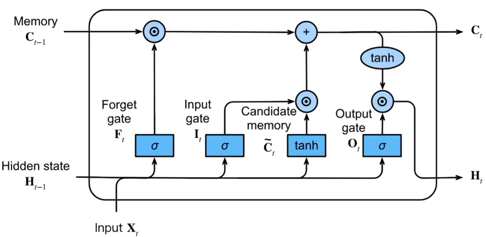
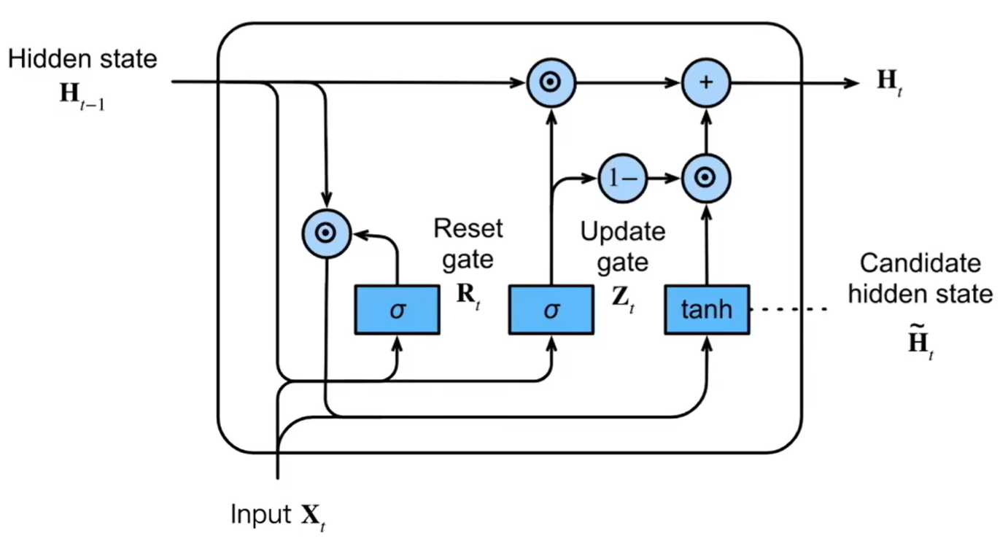
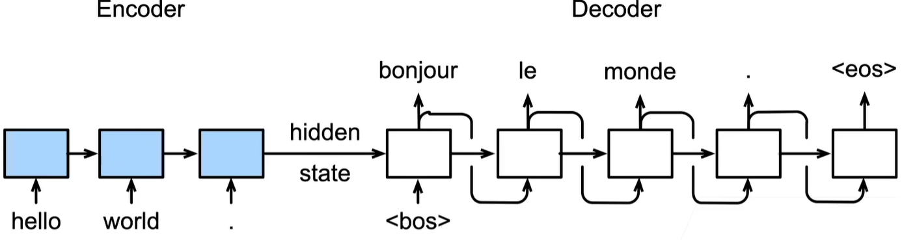
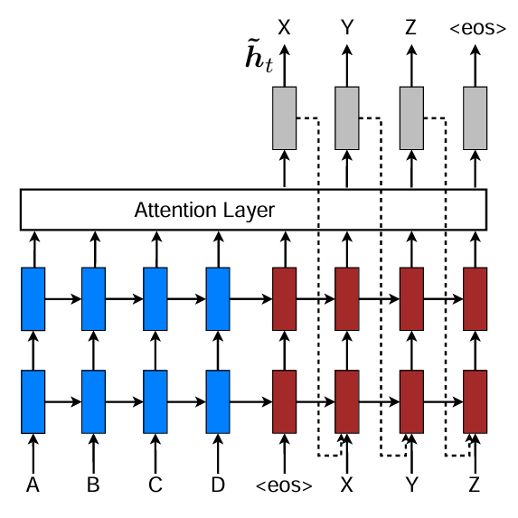
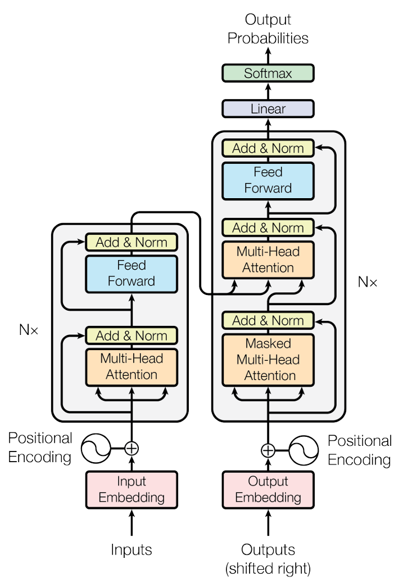

# 深度学习 {#dl}

这一章节主要介绍深度学习领域各个神经网络的原理及实现方法——参考《动手学深度学习：PyTorch版》。

> 鉴于神经网络的可解释性完全不如其他机器学习方法，故一开始对其并不感冒，但没办法，它太powerful了，得学。

参考资料：

[菜鸟教程](https://www.runoob.com/pytorch/pytorch-tutorial.html)

[PyTorch文档](https://docs.pytorch.org/docs/stable/index.html)

## 预备知识 {#dl_1}

### 数据操作 {#dl_1_1}


``` default
import torch
```

1. 形状

   - `shape`
      
      输出形状
   
   - `reshape()`
      
      更改形状，`-1`表示自适应。默认按行排列，必要时可先改变形状，后转置得到按列排列的结果
      
   - `numel()`
   
      元素数量有多少
   
2. 拼接

   - `torch.cat()`
      
      在已有维度上拼接
   
   - `torch.stack()` `torch.vstack()` `torch.stack()`
   
      在新的维度上堆叠

3. 逐元素操作

   - 传统运算符`+ - * / **`
   
   - `sum()`
   
      若为空则对所有元素求和；`dim`指定轴方向，`0,1,2...`表示维度从外到内
      

``` default
x = torch.arange(24).reshape(2,3,-1)
x

"""
tensor([[[ 0,  1,  2,  3],
         [ 4,  5,  6,  7],
         [ 8,  9, 10, 11]],

        [[12, 13, 14, 15],
         [16, 17, 18, 19],
         [20, 21, 22, 23]]])
"""

x.sum(dim=0)

"""
tensor([[12, 14, 16, 18],
        [20, 22, 24, 26],
        [28, 30, 32, 34]])
"""

x.sum(dim=1)

"""
tensor([[12, 15, 18, 21],
        [48, 51, 54, 57]])
"""

x.sum(dim=2)

"""
tensor([[ 6, 22, 38],
        [54, 70, 86]])
"""
```
   
   - 广播机制
   
      维度对齐，从尾部(最右边)开始逐维度比较，形状不足的张量在左边补1个维度
      
      维度大小为1的轴自动"复制"以匹配较大尺寸


``` default
A = torch.tensor([[1, 2, 3], 
                  [4, 5, 6]])  # (2, 3)
b = torch.tensor([10, 20, 30])  # (3,) 

result = A * b

"""
tensor([[ 10,  40,  90],
        [ 40, 100, 180]])
"""

# 广播过程：b → (1,3) → (2,3)
# 由于张量b维度为1，A的维度为2，相当于张量b先复制了一行，再与A逐元素相乘
```

4. 节省内存

   对于形如`X=X+Y`的操作，事实上赋值前的X和赋值后的X占用了两个地方的内存（即使变量名相同），建议改为`X[:]=X+Y`，这样前后X的内存地址就一致了
   
5. 类型转换

|类型|方法|备注|
|:---:|:---:|:---:|
|数组->张量|torch.from_numpy()|共享内存|
|数组->张量|torch.tensor()|仅复制|
|张量->数组|.numpy()|共享内存|
|张量->数组|.clone().numpy()|仅复制|
|数据框->数组|.values|内存高|
|数据框->数组|.to_numpy(copy=False)|内存低|
|数组->数据框|pd.DataFrame()|-|

> 默认张量在CPU上，若在GPU上，则先将其移到CPU上，再`.cpu().numpy()`
> 
> 存有梯度的张量不能直接转为数组，应`.detach().numpy()`或`.detach().cpu().numpy()`

### 自动微分 {#dl_1_2}

深度学习框架能够自动计算导数：先将梯度附加到想要计算偏导数的变量上，然后对目标值进行反向传播`backward()`，访问得到的梯度。


``` default
x = torch.arange(4)
x.requires_grad_(True)   # 等价于x = torch.arange(4, requires_grad=True)
x.grad     # 默认值为None
y = 2 * torch.dot(x,x)
y.backward()
x.grad
x.grad.zero_()     # 变量会累积梯度，在必要时需要清空
```

对于复合函数`y=f(x), z=g(y,x)`，有时想控制y直接计算z关于x的梯度，则需要将y剥离出来。


``` default
y = x * x
u = y.detach()
z = u * x
z.sum().backward()
x.grad == u
```

### 加载数据集 {#dl_1_3}


``` default
from torch.utils.data import TensorDataset, Dataset, DataLoader, random_split
```

1. 创建数据集对象

`TensorDataset(*tensor)`用于将内存中的多个张量包装为一个数据集对象。
   

``` default
x = torch.arange(12).reshape(3,4)   # 特征
y = torch.tensor([0, 1, 0])         # 标签
dataset = TensorDataset(x,y)        # 数据集对象
```

也可根据抽象类`Dataset`自定义数据集对象，切记一定要重写`__len__()`和`__getitem__()`。


``` default
# 自定义数据集类
class MyDataset(Dataset):
    def __init__(self, X_data, Y_data):
        """
        初始化数据集，X_data 和 Y_data 是两个列表或数组
        X_data: 输入特征
        Y_data: 目标标签
        """
        self.X_data = X_data
        self.Y_data = Y_data

    def __len__(self):
        """返回数据集的大小"""
        return len(self.X_data)

    def __getitem__(self, idx):
        """返回指定索引的数据"""
        x = torch.tensor(self.X_data[idx], dtype=torch.float32)  # 转换为 Tensor
        y = torch.tensor(self.Y_data[idx], dtype=torch.float32)
        return x, y
```
   
2. 加载数据集

`DataLoader()`用于从数据集中加载数据，并支持打乱、划分批次等操作。
   

``` default
loader = DataLoader(
    dataset,            # 数据集对象
    batch_size=128,     # 每个批次的样本数
    shuffle=True,       # 是否打乱数据顺序
    sampler=None,       # 抽样策略
    num_workers=4,      # 用于数据加载的进程数
    pin_memory=True,    # 是否使用固定内存(CUDA)
    drop_last=False     # 是否丢弃最后的不完整批次
)
```

3. 划分数据集

`random_split()`用于将一整个数据集分割为几个不重合的子集。


``` default
# generator用于精细化控制每个生成器的种子
# 也可设置全局随机数种子
# torch.manual_seed(132)

# 设置随机种子保证每次分割相同
generator = torch.Generator().manual_seed(42)  # 固定随机种子

train_set, val_set, test_set = random_split(
    dataset,
    [0.7, 0.15, 0.15],           # 子集大小
    generator=generator          # 传递随机数生成器
)
```

### 调参技巧 {#dl_1_4}

#### 优化器 {#dl_1_4_1}

1. SGD

每次仅使用一个样本或一个小批次的样本来估计梯度，从而加快训练速度。
   
$$
\theta_{t+1} = \theta_t - \eta \cdot \nabla_{\theta_t} L(\theta_t)
$$

**优点：**

- 简单、高效；

- 泛化能力较好。

**缺点：**

- 由于梯度估计的随机性，容易出现振荡；

- 对学习率敏感。

2. SGD + Momentum

引入“动量”概念，让参数更新时参考过去的梯度方向，从而减少震荡、加快收敛。

$$
v_t = \beta v_{t-1} + (1 - \beta) \nabla_{\theta_t} L(\theta_t)
$$

$$
\theta_{t+1} = \theta_t - \eta v_t
$$

3. Adagrad

为每个参数分配不同的学习率，出现频繁的参数自动降低学习率，从而在稀疏特征场景（如 NLP）表现良好。

$$
G_t = G_{t-1} + g_t^2
$$

$$
\theta_{t+1} = \theta_t - \frac{\eta}{\sqrt{G_t + \epsilon}} g_t
$$

4. RMSProp

为了解决 Adagrad 学习率“衰减过快”的问题，RMSProp用指数加权平均代替累积平方梯度。

$$
E[g^2]_t = \beta E[g^2]_{t-1} + (1 - \beta) g_t^2
$$

$$
\theta_{t+1} = \theta_t - \frac{\eta}{\sqrt{E[g^2]_t + \epsilon}} g_t
$$

5. Adam

结合了Momentum（动量）与RMSProp（自适应学习率）的优点，通过同时跟踪一阶矩（均值）与二阶矩（方差）来动态调整更新步长。

$$
m_t = \beta_1 m_{t-1} + (1 - \beta_1) g_t
$$

$$
v_t = \beta_2 v_{t-1} + (1 - \beta_2) g_t^2
$$

$$
\hat{m}_t = \frac{m_t}{1 - \beta_1^t}, \quad \hat{v}_t = \frac{v_t}{1 - \beta_2^t}
$$

$$
\theta_{t+1} = \theta_t - \eta \frac{\hat{m}_t}{\sqrt{\hat{v}_t} + \epsilon}
$$

6. AdamW

Adam 的改进版本，将L2权重衰减与梯度更新“解耦”，从而更好地控制正则化。

$$
\theta_{t+1} = (1 - \eta \lambda)\theta_t - \eta \frac{\hat{m}_t}{\sqrt{\hat{v}_t} + \epsilon}
$$

> 将权重衰减从梯度计算中分离出来，作为独立项直接应用于参数更新

## 线性神经网络 {#dl_2}

### 线性回归 {#dl_2_1}

`nn.Linear`是线性层，对输入数据进行仿射变换$y=XW^T+b$，其中$W$是权重矩阵，$b$是偏置。

对于简单的线性回归模型，故只需一层线性层即可。


``` default
import torch
import torch.nn as nn
import torch.optim as optim
from torch.utils.data import TensorDataset, DataLoader

torch.manual_seed(123)   # 设置全局随机数种子

X = torch.randn(100,2)   # 标准正态抽样
beta = torch.rand(2)     # 均匀分布[0,1)抽样
intercept = torch.rand(1)
y = intercept + torch.matmul(X, beta) + torch.randn(100)*0.1
y = y.reshape(-1,1)

dataset = TensorDataset(X,y)
dataloader = DataLoader(dataset, batch_size=10, shuffle=True)

# 搭建网络结构
linear_model = nn.Sequential(
    nn.Linear(2,1)
)

criterion = nn.MSELoss()
optimizer = optim.SGD(linear_model.parameters(), lr=0.05)   # lr为学习率

for epoch in range(100):       # 迭代50次
    linear_model.train()       # 训练模式
    for batch_X, batch_y in dataloader:
        y_pred = linear_model(batch_X)     # 前向传播，计算预测值
        loss = criterion(y_pred, batch_y)  # 计算损失
        optimizer.zero_grad()  # 清零梯度
        loss.backward()        # 反向传播，计算梯度
        optimizer.step()       # 更新模型参数
    linear_model.eval()        # 评估模式
    with torch.no_grad():
        epoch_loss = criterion(linear_model(X),y)
        if (epoch + 1) % 10 == 0:
            print(f'Epoch_{epoch + 1}: {epoch_loss.item():.6f}')

print(linear_model)                  # 查看网络结构
print(linear_model[0].weight.data)   # 查看第0层的权重
print(linear_model[0].bias.data)     # 查看第0层的偏置
```

说明：

1. `DataLoader()`将数据分批次，变为可迭代的对象，每次返回一个批次的数据。也可结合`enumerate()`适用。

2. `nn.Sequential()`**按顺序**组织多个神经网络层，相较自定义类无需定义`forward`方法，适用于简单场合的模型构建。

> 除了`nn.Sequential()`，还可以通过继承`nn.Module`来自定义模型架构，从而创建更复杂的模型

3. `nn.Linear()`是线性全连接层，用来实现仿射变换$y=XW^T+b$。

4. `nn.MSELoss()`定义了损失函数的类型，计算两个形状相同的张量之间的MSE

5. `optim.SGD()`定义了优化算法为随机梯度下降法，`linear_model.parameters()`用于传递需要优化的参数。

6. `.train()`、`.eval()`分别代表模型的训练模式和评估模式，不同模式下会影响部分层(如Dropout层)的行为，一般在训练时开始`.train()`，在计算相关指标时`.eval()`。特别的，在评估时还可配合`torch.no_grad()`来禁用梯度计算，节省内存和计算资源，从而提高计算速度。

### 二分类问题 {#dl_2_2}

对于二分类问题，输出层的维度应该为1，并且输出层的激活函数为Sigmoid函数，损失函数为`nn.BCELoss()`等适用于二分类场合的函数。

> `nn.BCELoss()`即$-y_i \log \hat y_i - (1-y_i)\log (1-\hat y_i)$


``` default
import torch
import torch.nn as nn
import torch.optim as optim
from sklearn.datasets import make_classification
from sklearn.model_selection import train_test_split
from sklearn.preprocessing import StandardScaler
import numpy as np
from torch.utils.data import TensorDataset, DataLoader

# 设置随机数种子
torch.manual_seed(123)
np.random.seed(321)

def gen_data(n_samples=2000, n_features=10, n_classes=2):

    # 生成复杂的分类型数据（有重叠）
    X, y = make_classification(
        n_samples=n_samples,    # 样本数
        n_features=n_features,  # 特征数
        n_informative=8,        # 有信息量的特征数量
        n_redundant=2,          # 冗余特征数量
        n_repeated=0,           # 重复特征数量
        n_classes=n_classes,    # 类别数
        flip_y=0.15,            # 15%的噪声
        class_sep=0.8           # 类间分离程度
    )
    
    # 划分训练集和测试集
    X_train, X_test, y_train, y_test = train_test_split(
        X, y, test_size=0.2, random_state=42
    )
    
    # 数据标准化
    scaler = StandardScaler()
    X_train = scaler.fit_transform(X_train)
    X_test = scaler.transform(X_test)

    # 转换为PyTorch张量
    X_train = torch.tensor(X_train, dtype=torch.float32)
    y_train = torch.tensor(y_train, dtype=torch.float32).view(-1, 1)  # 二分类需要二维标签
    X_test = torch.tensor(X_test, dtype=torch.float32)
    y_test = torch.tensor(y_test, dtype=torch.float32).view(-1, 1)
    
    return X_train, X_test, y_train, y_test

# 生成数据
X_train, X_test, y_train, y_test = gen_data()

# 创建数据加载器
train_dataset = TensorDataset(X_train, y_train)
test_dataset = TensorDataset(X_test, y_test)

train_loader = DataLoader(train_dataset, batch_size=64, shuffle=True)
test_loader = DataLoader(test_dataset, batch_size=64, shuffle=False)

model = nn.Sequential(
    nn.Linear(10,64),
    nn.ReLU(),
    nn.BatchNorm1d(64),  # 对该批次数据进行标准化操作，并进行缩放和平移，可在一定程度上缓解“内部协变量偏移”情况
    nn.Dropout(0.2),     # 以一定概率丢弃某些神经元，从而缓解过拟合现象
    
    nn.Linear(64,32),
    nn.ReLU(),
    nn.BatchNorm1d(32),
    nn.Dropout(0.2),
    
    nn.Linear(32,1),
    nn.Sigmoid()
)

criterion = nn.BCELoss()
optimizer = optim.SGD(model.parameters(), lr=0.05)

# 将模型移到GPU上
device = torch.device('cuda' if torch.cuda.is_available() else 'cpu')
model.to(device)

# 存储训练指标
train_losses = []
train_accuracies = []
val_losses = []
val_accuracies = []

for epoch in range(100):
    # 训练模式
    model.train()
    running_loss = 0.0
    correct_train = 0
    total_train = 0
    
    for batch_x, batch_y in train_loader:
        # 移动数据到设备
        batch_x, batch_y = batch_x.to(device), batch_y.to(device)
        
        # 前向传播
        outputs = model(batch_x)
        
        # 计算损失
        loss = criterion(outputs, batch_y)
        
        # 反向传播和优化
        optimizer.zero_grad()
        loss.backward()
        optimizer.step()
        
        # 统计训练情况
        running_loss += loss.item()
        
        # 计算准确率
        predictions = (outputs > 0.5).float()
        correct_train += (predictions == batch_y).sum().item()
        total_train += batch_y.size(0)
    
    # 计算本轮训练的平均损失和准确率
    epoch_loss = running_loss / len(train_loader)
    epoch_acc = correct_train / total_train if total_train > 0 else 0
    train_losses.append(epoch_loss)
    train_accuracies.append(epoch_acc)
    
    # 验证评估
    model.eval()
    with torch.no_grad():
        # 移动测试数据到设备
        test_x, test_y = X_test.to(device), y_test.to(device)
        # 前向传播
        outputs = model(test_x)
        # 计算损失
        val_loss = criterion(outputs, test_y).item()
        # 计算预测结果
        predictions = (outputs > 0.5).float()
        # 计算准确率
        correct_val = (predictions == test_y).sum().item()
        total_val = test_y.size(0)
        val_acc = correct_val / total_val
        # 存储验证结果
        val_losses.append(val_loss)
        val_accuracies.append(val_acc)
    
    # 每10个epoch打印一次进度
    if (epoch + 1) % 10 == 0:
        print("="*10,
              f"Epoch_{epoch+1}",
              "="*10,
              f"\nTrain Loss: {epoch_loss:.4f}, Train Acc: {epoch_acc:.4f}\n",
              f"Val Loss: {val_loss:.4f}, Val Acc: {val_acc:.4f}")
```

说明：

1. 在将数据存储为张量时就要统一特征和标签的数据类型为浮点数，否则后续特征为浮点数，标签为整数会报错。同时，标签的形状也应变为二维的。

2. `nn.BatchNorm1d()`对该批次数据进行标准化操作，并进行缩放和平移，可在一定程度上缓解“内部协变量偏移”情况

3. `nn.Dropout()`在训练`model.train()`时会以一定概率丢弃某些神经元，从而缓解过拟合现象，是一种正则化技术。

4. 无论如何，模型和数据都要在同一设备上。张量数据必须重新赋值`batch_x = batch_x.to(device)`，而模型则可以直接`model.to(device)`

### 多分类问题 {#dl_2_3}

对于多分类问题，输出层维度为类别数，无需添加softmax函数，因为在交叉熵损失函数`nn.CrossEntropyLoss()`中自带了softmax运算。


``` default
import torch
import torch.nn as nn
import torch.optim as optim
from sklearn.datasets import make_classification
from sklearn.model_selection import train_test_split
from sklearn.preprocessing import StandardScaler
import numpy as np
from torch.utils.data import TensorDataset, DataLoader

# 设置随机数种子
torch.manual_seed(123)
np.random.seed(321)

def gen_data(n_samples=2000, n_features=10, n_classes=5):

    # 生成复杂的分类型数据（有重叠）
    X, y = make_classification(
        n_samples=n_samples,    # 样本数
        n_features=n_features,  # 特征数
        n_informative=8,        # 有信息量的特征数量
        n_redundant=2,          # 冗余特征数量
        n_repeated=0,           # 重复特征数量
        n_classes=n_classes,    # 类别数
        flip_y=0.15,            # 15%的噪声
        class_sep=0.8           # 类间分离程度
    )
    
    # 划分训练集和测试集
    X_train, X_test, y_train, y_test = train_test_split(
        X, y, test_size=0.2, random_state=42
    )
    
    # 数据标准化
    scaler = StandardScaler()
    X_train = scaler.fit_transform(X_train)
    X_test = scaler.transform(X_test)

    # 转换为PyTorch张量
    X_train = torch.tensor(X_train, dtype=torch.float32)
    y_train = torch.tensor(y_train, dtype=torch.long)     # 交叉熵损失函数要求标签为整数型
    X_test = torch.tensor(X_test, dtype=torch.float32)
    y_test = torch.tensor(y_test, dtype=torch.long)
    
    return X_train, X_test, y_train, y_test

# 生成数据，多分类任务
X_train, X_test, y_train, y_test = gen_data()

# 创建数据加载器
train_dataset = TensorDataset(X_train, y_train)
test_dataset = TensorDataset(X_test, y_test)

train_loader = DataLoader(train_dataset, batch_size=64, shuffle=True)
test_loader = DataLoader(test_dataset, batch_size=64, shuffle=False)

model = nn.Sequential(
    nn.Linear(10,128),
    nn.ReLU(),
    nn.BatchNorm1d(128),  # 对该批次数据进行标准化操作，并进行缩放和平移，可在一定程度上缓解“内部协变量偏移”情况
    nn.Dropout(0.2),     # 以一定概率丢弃某些神经元，从而缓解过拟合现象
    
    nn.Linear(128,64),
    nn.ReLU(),
    nn.BatchNorm1d(64),
    nn.Dropout(0.2),

    nn.Linear(64,32),
    nn.ReLU(),
    nn.BatchNorm1d(32),
    nn.Dropout(0.2),
    
    nn.Linear(32,5)      # 输出维度为类别数
)

criterion = nn.CrossEntropyLoss()
optimizer = optim.Adam(model.parameters(), lr=0.05)

device = torch.device('cuda' if torch.cuda.is_available() else 'cpu')
model.to(device)

# 存储训练指标
train_losses = []
train_accuracies = []
val_losses = []
val_accuracies = []

for epoch in range(100):
    # 训练模式
    model.train()
    running_loss = 0.0
    correct_train = 0
    total_train = 0
    
    for batch_x, batch_y in train_loader:
        # 移动数据到设备
        batch_x, batch_y = batch_x.to(device), batch_y.to(device)
        
        # 前向传播
        outputs = model(batch_x)
        
        # 计算损失
        loss = criterion(outputs, batch_y)
        
        # 反向传播和优化
        optimizer.zero_grad()
        loss.backward()
        optimizer.step()
        
        # 统计训练情况
        running_loss += loss.item()
        
        # 计算准确率
        predictions = torch.argmax(outputs, dim = 1)   # logits值最大的为预测类别
        correct_train += (predictions == batch_y).sum().item()
        total_train += batch_y.size(0)
    
    # 计算本轮训练的平均损失和准确率
    epoch_loss = running_loss / len(train_loader)
    epoch_acc = correct_train / total_train if total_train > 0 else 0
    train_losses.append(epoch_loss)
    train_accuracies.append(epoch_acc)
    
    # 验证评估
    model.eval()
    with torch.no_grad():
        # 移动测试数据到设备
        test_x, test_y = X_test.to(device), y_test.to(device)
        # 前向传播
        outputs = model(test_x)
        # 计算损失
        val_loss = criterion(outputs, test_y).item()
        # 计算预测结果
        predictions = torch.argmax(outputs, dim = 1)
        # 计算准确率
        correct_val = (predictions == test_y).sum().item()
        total_val = test_y.size(0)
        val_acc = correct_val / total_val
        # 存储验证结果
        val_losses.append(val_loss)
        val_accuracies.append(val_acc)
    
    # 每10个epoch打印一次进度
    if (epoch + 1) % 10 == 0:
        print("="*10,
              f"Epoch_{epoch+1}",
              "="*10,
              f"\nTrain Loss: {epoch_loss:.4f}, Train Acc: {epoch_acc:.4f}\n",
              f"Val Loss: {val_loss:.4f}, Val Acc: {val_acc:.4f}")
```

说明：

1. `nn.CrossEntropyLoss()`接收预测值logits（原值）与标签。其中logits为神经网络的原始输出，无需在输出时添加Softmax激活函数，`nn.CrossEntropyLoss()`的内部会自动进行Softmax计算，避免重复计算。同时，标签要求为整数型且维度为1，不需要独热编码。

2. 如果需要输出概率，可以在输出logits后手动计算`torch.softmax(outputs, dim=1)`。

3. 如果要输出预测类别，可以`torch.argmax(outputs, dim=1)`。

## RNN {#dl_9}

<div class="figure" style="text-align: center">

<p class="caption">(\#fig:dl-p5)RNN</p>
</div>

简单来说，RNN将隐状态在时间上依次传递，当前时间步的隐状态由当前时间步的输入与上一时间步的隐状态得到，当前时间步的输出由当前时间步的隐状态得到。

$$
\begin{gather}
s_t = f(W_s s_{t-1} + W_x x_t) \\
o_t = g(W_os_t)
\end{gather}
$$

但是在训练过程中，由于这种**循环**结构，容易导致梯度爆炸或消失问题。

对于一个简单的循环神经网络 (RNN)，隐藏状态的更新为：

$$
s_t = f(W_s s_{t-1} + W_x x_t)
$$

训练RNN时，需要对损失函数$L_T$关于参数$W_s$求导。  
梯度在时间维度上通过链式法则传播：

$$
\frac{\partial L_T}{\partial W_s}
= \sum_{t=1}^{T} \frac{\partial L_T}{\partial s_t} \frac{\partial s_t}{\partial W_s}
$$

关键项为梯度在时间维上的传播：

$$
\frac{\partial L_T}{\partial s_t}
= \frac{\partial L_T}{\partial s_T}
\prod_{k=t+1}^{T} \frac{\partial s_k}{\partial s_{k-1}}
$$

而每一步的梯度传递因子为：

$$
\frac{\partial s_k}{\partial s_{k-1}}
= W_s^T \cdot \text{diag}(f'(W_s s_{k-2} + W_x x_{k-1}))
$$

也就是说，RNN的梯度是由多个线性变换与激活函数导数的**连乘积**组成。

对于常见的激活函数，例如tanh，其导数位于[0,1]之间，因此在多次连乘下极容易梯度消失。而当权重矩阵$W_s$过大时，又容易产生梯度爆炸问题。

解决方法：

1. 梯度裁剪

   将梯度范数超过阈值时进行缩放，可抑制梯度爆炸。
   
2. 门控结构（LSTM/GRU）

   LSTM和GRU都是通过门控加法机制实现信息传递。以LSTM为例：
   
$$
C_t = f_t \odot C_{t-1} + i_t \odot \tilde{C}_t
$$

$$
\frac{\partial C_t}{\partial C_{t-1}} = f_t
$$

$$
\frac{\partial L}{\partial C_{t-1}}
= \frac{\partial L}{\partial C_t} \odot f_t
$$

   梯度只与门控值$f_t$相乘，而不涉及矩阵连乘。若$f_t \approx 1$，梯度几乎可恒等传播；若$f_t < 1$，梯度以可控方式衰减。
   
   矩阵乘法会改变梯度的方向与长度，导致非线性扰动；而逐元素标量乘法不会改变方向，只调整幅度。门控$f_t \in [0,1]$还可以**自适应地学习**需要保留的梯度比例，从而在数值上保持稳定传播。

## LSTM {#dl_3}

### 原理 {#dl_3_1}

在学习LSTM之前，可以先了解一下RNN，再去看LSTM。

[【循环神经网络】5分钟搞懂RNN，3D动画深入浅出](https://www.bilibili.com/video/BV1z5411f7Bm)

[【LSTM长短期记忆网络】3D模型一目了然，带你领略算法背后的逻辑](https://www.bilibili.com/video/BV1Z34y1k7mc)

<div class="figure" style="text-align: center">

<p class="caption">(\#fig:dl-p1)LSTM</p>
</div>

LSTM的原理简单表示为下面几个公式。

记输入为$X$，隐状态为$H$，记忆元为$C$，输入门为$I$，遗忘门为$F$，输出门为$O$，则有

> 记忆元代表长期记忆，隐状态代表短期记忆

$$
\begin{aligned}
I_t &= \sigma (X_tW_{xi}+H_{t-1}W_{hi}+b_i) \\
F_t &= \sigma (X_tW_{xf}+H_{t-1}W_{hf}+b_f) \\
O_t &= \sigma (X_tW_{xo}+H_{t-1}W_{ho}+b_o) \\
\tilde C_t &= \tanh(X_tW_{xc}+H_{t-1}W_{hc}+b_c) \\
C_t &= F_t \odot C_{t-1} + I_t \odot \tilde C_t \\
H_t &= O_t \odot \tanh (C_t)
\end{aligned}
$$

其中$W,b$分别代表权重与偏置，$\sigma$表示sigmoid函数，值域为[0,1]，代表着信息剩余的比例，$\tanh$表示双曲正切函数，值域为[-1,1]，代表着信息的大小及方向。

简单来看，$X$和$H$是对短期内的信息进行加工，然后将其上传到长期记忆中，而长期记忆也会遗忘部分信息，因此更新后的长期记忆表现为剩余的长期记忆与短期信息的和。而短期记忆又是长期记忆部分的一部分，并且会受到长期记忆的影响，因此$H$又可以由$C$产生。在这个过程中，就由输入门、遗忘门和输出门来控制信息损耗的比例。

### 示例 {#dl_3_2}


``` default
import torch
import torch.nn as nn
import numpy as np
from torch.utils.data import Dataset, DataLoader

# 设置随机种子以确保结果可复现
torch.manual_seed(42)
np.random.seed(42)

# 1. 生成正弦波数据
total_length = 1000
time_steps = np.linspace(0, 20 * np.pi, total_length)
data_sequence = np.sin(time_steps) + np.random.normal(0, 0.1, total_length)

# 2. 划分训练集和测试集
split_idx = int(total_length * 0.8)  # 80%训练集，20%测试集
train_data = data_sequence[:split_idx]
test_data = data_sequence[split_idx:]

# 3. 创建序列数据集类
class SequenceDataset(Dataset):
    def __init__(self, data, seq_length=20):
        self.data = torch.FloatTensor(data)
        self.seq_length = seq_length
        
    def __len__(self):
        return len(self.data) - self.seq_length
    
    def __getitem__(self, idx):
        input_seq = self.data[idx:idx+self.seq_length]
        target = self.data[idx+self.seq_length]
        return input_seq.view(self.seq_length, 1), target.view(1)  # 添加特征维度

# 创建数据集和数据加载器
seq_length = 20
batch_size = 32

# 训练集
train_dataset = SequenceDataset(train_data, seq_length)
train_loader = DataLoader(train_dataset, batch_size=batch_size, shuffle=True, drop_last=True)

# 测试集
test_dataset = SequenceDataset(test_data, seq_length)
test_loader = DataLoader(test_dataset, batch_size=batch_size, shuffle=False, drop_last=True)

# 4. 定义LSTM模型
class LSTMModel(nn.Module):
    def __init__(self, input_size=1, hidden_size=32, output_size=1, num_layers=1):
        super().__init__()
        self.num_layers = num_layers
        self.hidden_size = hidden_size
        
        # LSTM层
        self.lstm = nn.LSTM(
            input_size=input_size,       # 默认为1即时序的自回归结构
            hidden_size=hidden_size,
            num_layers=num_layers,
            batch_first=True
        )
        
        # 输出层
        self.linear = nn.Linear(hidden_size, output_size)
        
    def forward(self, x, hidden=None):
        # 初始化隐藏状态
        h0 = torch.zeros(self.num_layers, x.size(0), self.hidden_size).to('cuda')
        c0 = torch.zeros(self.num_layers, x.size(0), self.hidden_size).to('cuda')
        hidden = (h0, c0)
        
        # 前向传播LSTM
        # 需要将输入形状调整为 [batch, seq_len, features]
        x = x.reshape(x.size(0), -1, 1) if x.dim() == 2 else x
        # out表示LSTM最后一层所有时间步的输出
        # hidden表示LSTM所有层在最后一个时间步的最终状态
        out, hidden = self.lstm(x, hidden) 
        
        # 只取最后一个时间步的输出(batch, seq, features)
        out = self.linear(out[:, -1, :])
        return out, hidden

# 5. 实例化模型
input_size = 1
hidden_size = 64
output_size = 1
num_layers = 1

model = LSTMModel(input_size, hidden_size, output_size, num_layers)
# 将模型移到GPU上
model.to('cuda')

# 6. 定义损失函数和优化器
criterion = nn.MSELoss()
optimizer = torch.optim.Adam(model.parameters(), lr=0.001)

# 7. 训练模型
num_epochs = 50
train_losses = []
test_losses = []

for epoch in range(num_epochs):
    # --- 训练阶段 ---
    model.train()
    epoch_train_loss = 0.0
    
    for inputs, targets in train_loader:
        # 输入形状: [batch_size, seq_length, 1]
        # 目标形状: [batch_size, 1]
        optimizer.zero_grad()

        inputs, targets = inputs.to('cuda'), targets.to('cuda')
        
        # 前向传播
        outputs, _ = model(inputs)
        loss = criterion(outputs, targets)
        
        # 反向传播和优化
        loss.backward()
        optimizer.step()
        
        epoch_train_loss += loss.item()
    
    # 计算平均训练损失
    avg_train_loss = epoch_train_loss / len(train_loader)
    train_losses.append(avg_train_loss)
    
    # --- 测试阶段 ---
    model.eval()
    epoch_test_loss = 0.0
    
    with torch.no_grad():
        for inputs, targets in test_loader:
            inputs, targets = inputs.to('cuda'), targets.to('cuda')
            outputs, _ = model(inputs)
            loss = criterion(outputs, targets)
            epoch_test_loss += loss.item()
    
    # 计算平均测试损失
    avg_test_loss = epoch_test_loss / len(test_loader)
    test_losses.append(avg_test_loss)
    
    # 每5个epoch打印一次进度
    if (epoch+1) % 5 == 0 or epoch == 0:
        print(f"Epoch [{epoch+1}/{num_epochs}], Train Loss: {avg_train_loss:.6f}, Test Loss: {avg_test_loss:.6f}")
```

说明：

1. 对于时序数据，给定t个数据后，t+1时刻的值即为响应变量。除了目标变量的自回归结构，还可以添加其他预测变量，记得要修改`input_size`。

2. 关于h和c的初始状态，绝大部分场景下都需要进行重置，即不同序列之间的初始状态是独立的。同时，初始状态也不是需要学习的参数，除特殊任务外，一般都无需设置梯度。

3. 如果要进行预测，则需要根据特定步长的窗口序列来预测下一时刻的目标值。**单步预测**直接让全连接层的输出维度为1；**多步预测**可以让全连接层的输出维度为目标维度，这等价于把未来步间的依赖压缩在最后的隐状态里，亦或者采取**滚动预测**的方式进行多步输出；除此之外，可考虑**Seq2Seq**的方法进行多步预测。

### 拓展 {#dl_3_3}

1. 多层LSTM

   多层LSTM将第一层LSTM的输出序列（通常是每个时间步的隐藏状态）作为输入，相较于单层LSTM能够提取更为复杂的特征。对于简单任务还是使用单层LSTM，一般层数也不宜超过4层。

2. 单向与双向

   常规的LSTM都是从历史数据出发，由老及新，根据历史去预测未来。而双向LSTM则包含了两个LSTM层，一个在时间上从前到后，另一个在时间上从后到前。这使得模型能够捕捉序列的“历史信息”与“未来信息”，在输出时融合这两个LSTM层的隐藏状态作为最终输出。
   
   对于时间序列的预测任务只能使用单向LSTM。

3. 可与注意力机制结合起来提升性能。

## GRU {#dl_4}

### 原理 {#dl_4_1}

GRU是LSTM的简化版本，仅有两个门控——重置门（遗忘）与更新门，同时也缺少记忆元，这使得GRU在训练时更加快捷。

<div class="figure" style="text-align: center">

<p class="caption">(\#fig:dl-p2)GRU</p>
</div>

$$
\begin{aligned}
R_t &= \sigma(X_t W_{xr} + H_{t-1} W_{hr} + b_r) \\
Z_t &= \sigma(X_t W_{xz} + H_{t-1} W_{hz} + b_z) \\
\tilde{H}_t &= \tanh(X_t W_{xh} + (R_t \odot H_{t-1}) W_{hh} + b_h) \\
H_t &= Z_t \odot H_{t-1} + (1 - Z_t) \odot \tilde{H}_t
\end{aligned}
$$

重置门$R_t$用于控制过去的隐藏状态有多少内容被用于生成当前候选隐藏状态，更新门$Z_t$用于控制生成当前隐藏状态时过去隐藏状态和候选隐藏状态的权重。

### 示例 {#dl_4_2}


``` default
import torch
import torch.nn as nn
import torch.optim as optim
import numpy as np
import matplotlib.pyplot as plt


# ------------------------------
# 1. 生成模拟数据
# ------------------------------
# 我们造一个简单的任务：输入一个时间序列（正弦+噪声），预测最后一个时刻的值
np.random.seed(42)
torch.manual_seed(42)

def generate_data(num_samples=200, seq_len=20):
    X = []
    y = []
    for _ in range(num_samples):
        freq = np.random.uniform(0.5, 1.5)
        phase = np.random.uniform(0, np.pi)
        noise = np.random.normal(0, 0.1, seq_len)
        seq = np.sin(np.linspace(0, 2 * np.pi * freq, seq_len) + phase) + noise
        X.append(seq)
        y.append(seq[-1])  # 预测最后一个点
    X = np.expand_dims(np.array(X), axis=2)  # (N, T, 1)
    y = np.expand_dims(np.array(y), axis=1)  # (N, 1)
    return torch.tensor(X, dtype=torch.float32), torch.tensor(y, dtype=torch.float32)

X, y = generate_data(num_samples=300, seq_len=30)
train_X, test_X = X[:240], X[240:]
train_y, test_y = y[:240], y[240:]


# ------------------------------
# 2. 定义 GRU 模型
# ------------------------------
class GRUNet(nn.Module):
    def __init__(self, input_size, hidden_size, num_layers, output_size,
                 dropout=0.2, bidirectional=False):
        super(GRUNet, self).__init__()
        self.hidden_size = hidden_size
        self.num_layers = num_layers
        self.bidirectional = bidirectional

        self.gru = nn.GRU(
            input_size=input_size,
            hidden_size=hidden_size,
            num_layers=num_layers,
            dropout=dropout if num_layers > 1 else 0.0,
            bidirectional=bidirectional,
            batch_first=True
        )
        # 如果是双向GRU，需要乘2
        direction_factor = 2 if bidirectional else 1
        self.fc = nn.Linear(hidden_size * direction_factor, output_size)

    def forward(self, x):
        out, h = self.gru(x)              # out: (batch, seq, hidden*direction)
        out = self.fc(out[:, -1, :])      # 取最后一个时间步的输出
        return out


# ------------------------------
# 3. 初始化模型与优化器
# ------------------------------
model = GRUNet(
    input_size=1,       # 每个时间步输入1个特征
    hidden_size=32,     # 隐层维度
    num_layers=1,       # 堆叠1层GRU
    output_size=1,      # 输出一个数（预测值）
    dropout=0.2,
    bidirectional=False  # 是否使用双向GRU
)

criterion = nn.MSELoss()
optimizer = optim.Adam(model.parameters(), lr=0.005)


# ------------------------------
# 4. 训练模型
# ------------------------------
epochs = 100
train_losses = []

for epoch in range(epochs):
    model.train()
    optimizer.zero_grad()
    output = model(train_X)
    loss = criterion(output, train_y)
    loss.backward()
    optimizer.step()

    train_losses.append(loss.item())
    if (epoch + 1) % 20 == 0:
        print(f"Epoch [{epoch+1}/{epochs}], Loss: {loss.item():.6f}")

# 绘制训练损失曲线
plt.figure(figsize=(6,4))
plt.plot(train_losses)
plt.title("Training Loss Curve")
plt.xlabel("Epoch")
plt.ylabel("MSE Loss")
plt.show()


# ------------------------------
# 5. 测试与可视化
# ------------------------------
model.eval()
with torch.no_grad():
    pred = model(test_X).squeeze().numpy()
    truth = test_y.squeeze().numpy()

plt.figure(figsize=(8,5))
plt.plot(truth, label="True")
plt.plot(pred, label="Predicted")
plt.legend()
plt.title("GRU Prediction on Test Set")
plt.show()

# 计算误差指标
mse = np.mean((pred - truth)**2)
mae = np.mean(np.abs(pred - truth))
print(f"Test MSE: {mse:.6f}, MAE: {mae:.6f}")
```

### 拓展 {#dl_4_3}

同[LSTM](#dl_3_3)。

## Seq2Seq {#dl_5}

### 原理 {#dl_5_1}

<div class="figure" style="text-align: center">

<p class="caption">(\#fig:dl-p3)seq2seq</p>
</div>

> 当然对于翻译任务，应当有个词嵌入环节

Seq2Seq由编码器和解码器组成，二者均是RNN（包括LSTM和GRU）结构，用于解决由原始序列输出目标序列的任务，两个序列可以不等长。

在编码器部分，由于输入序列已知，因此可以使用**双向RNN结构**用于提取信息，然后在最后一个时间步输出隐状态，并将此隐状态作为上下文向量***context vector***，记为$c$。

> 上下文向量相当于是对原始序列信息的一个浓缩

在解码器部分，若记解码器的隐状态为$s$，则

$$
s_t = f(s_{t-1}, y_{t-1}, c)
$$

即解码器t时刻的隐状态由上一步的隐状态、上一步的预测值、编码器的上下文向量共同输入得到。

> 在训练时，采取$Teacher Forcing$策略，即每次输入的$y$值为真实值，这有助于模型训练。但在预测时则接收上一步的预测值作为输入

但是，Seq2Seq有很明显的缺陷，即在解码器中使用的上下文向量是固定的，而由于编码器的RNN结构，导致这个上下文向量难以记住更早的重要信息。于是，提出**Seq2Seq+注意力机制**的方法。

下面介绍Luong的论文[*Effective Approaches to Attention-based Neural Machine Translation*](https://arxiv.org/pdf/1508.04025)。

> 这篇论文可以说是对Bahdanau的[NEURAL MACHINE TRANSLATION BY JOINTLY LEARNING TO ALIGN AND TRANSLATE](https://arxiv.org/pdf/1409.0473)这篇论文的改进，有细微差异，例如这篇论文用$s_{t-1}$来更新$c_t$，而Luong用$s_t$

<div class="figure" style="text-align: center">

<p class="caption">(\#fig:dl-p4)Seq2Seq与注意力机制（Input-Feeding）</p>
</div>

计算流程为：

1. 编码阶段

输入序列 $(x_1, x_2, \ldots, x_S)$ 经双向LSTM编码得到：

$$
h_1, h_2, \ldots, h_S = \text{EncoderRNN}(x_1, \ldots, x_S)
$$

每个$h_s$是源序列中第$s$个词的隐状态输出。

2. 解码器状态更新

在时间步$t$，解码器根据上一步输出的目标词$y_{t-1}$与前一隐藏状态 $s_{t-1}$，更新当前解码器状态：

$$
s_t = \text{DecoderRNN}(y_{t-1}, s_{t-1})
$$

此时 $s_t$ 表示“当前要生成第 $t$ 个词”的语义状态。

论文还提出了**Input-Feeding**机制，即在生成$s_t$时也用到了$\tilde{s}_{t-1}$的信息，$\tilde{s}_{t-1}$后续会介绍。

$$
s_t = \text{DecoderRNN}(y_{t-1}, \tilde{s}_{t-1}, s_{t-1})
$$

3. 注意力机制

通过相似度函数计算$s_t$与每个$h_s$的匹配程度，论文中介绍了三种计算方法：

$$
\text{score}(s_t, h_s) =
\begin{cases}
s_t^\top h_s, & \text{(Dot)} \\
s_t^\top W_a h_s, & \text{(General)} \\
v_a^\top \tanh(W_a [s_t; h_s]), & \text{(Concat)}
\end{cases}
$$

> Bahdanau的论文中使用$e_{t,i}= v_a^{T} \text{tanh}(W_ss_{t-1}+W_hh_i)$加性注意力函数来计算相似度得分

之后通过softmax归一化得到每个源词的注意力权重：

$$
a_t(s) = \frac{\exp(\text{score}(s_t, h_s))}
{\sum_{s'=1}^{S} \exp(\text{score}(s_t, h_{s'}))}
$$

其中$a_t(s)$ 表示当前解码器在生成第$t$个词时，关注源序列$s$个位置的程度。

4. 计算上下文向量

对编码器输出进行加权求和，得到上下文向量：

$$
c_t = \sum_{s=1}^{S} a_t(s)\, h_s
$$

$c_t$是源端信息的加权摘要，代表模型在第$t$步“看到”的输入信息。

5. 信息融合

Luong 定义了**attentional hidden state**：

$$
\tilde{s}_t = \tanh(W_c [c_t; s_t])
$$

该向量综合了当前目标语义与注意到的源端信息。

6. 输出词预测

通过线性层与 softmax 计算目标词概率分布：

$$
p(y_t \mid y_{<t}, x) = \text{softmax}(W_o \tilde{s}_t)
$$

取概率最大的词作为预测输出：

$$
\hat{y}_t = \arg\max_y p(y_t)
$$

## BNN {#dl_6}

### 原理 {#dl_6_1}

在传统神经网络中，模型参数（权重$w$）被视为固定值，通过最小化损失函数获得最优点估计：

$$
\hat{w} = \arg\max_w p(D|w)
$$

其中$D=\{(x_1​,y_1​),(x_2​,y_2​),…,(x_N​,y_N​)\}$表示数据集。

然而，在现实问题中，数据噪声与异质性会导致模型存在显著**不确定性**。**贝叶斯神经网络（Bayesian Neural Network,BNN）**的核心思想是将模型参数$w$看作**随机变量**，并通过贝叶斯推断来量化模型不确定性。

BNN 的关键思想源于贝叶斯定理：

$$
p(w|D) = \frac{p(D|w)p(w)}{p(D)}
$$

其中：

- $p(w)$：参数的**先验分布**；
- $p(D|w)$：数据在给定参数下的**似然函数**；
- $p(w|D)$：参数的**后验分布**；
- $p(D)$：边际似然（证据）。

因此，BNN不再求单点参数$\hat{w}$，而是学习整个参数分布$p(w|D)$。

给定新输入$x^*$，预测输出$y^*$的分布为：

$$
p(y^*|x^*, D) = \int p(y^*|x^*, w) \, p(w|D) \, dw
$$

由于该积分难以解析计算，通常采用**近似推断方法**求解，如：

- **变分推断**
- **马尔科夫链蒙特卡洛**
- **Monte Carlo Dropout**
- **深度集合**

在这里仅介绍变分推断和MC Dropout方法。

-----

变分推断法就是用一个可学习分布$q(w|\theta)$来近似后验分布$p(w|D)$，通过最小化两者的KL散度实现优化。经过一系列推导可知，最小化KL散度等价于最大化ELBO：

> 详细推导可见[什么是变分推断](https://www.bilibili.com/video/BV1MnbEzXEnc/?spm_id_from=333.337.search-card.all.click&vd_source=1ff1a8ac5564814fec4d27cae552f90e)

$$
ELBO = \mathbb{E}_{q(w|\theta)}[\log p(D|w)] - KL(q(w|\theta)\;||\;p(w))
$$

若令先验分布$p(w)$为标准正态分布，近似后验分布为正态分布，则：

$$
KL(\mathcal{N}(\mu,\sigma^2)\;||\;\mathcal{N}(0,1))
= \frac{1}{2}(\sigma^2 + \mu^2 - 1 - \log\sigma^2)
$$

据此可用重参数化技巧$w = \mu + \sigma \epsilon, \epsilon \sim N(0,1)$来对$w$进行MC抽样。

-----

MC Dropout是一种**近似贝叶斯推断**方法：

- 在训练和预测阶段**都启用 Dropout**；
- 每次前向传播都会随机丢弃部分神经元；
- 多次采样预测结果，计算均值与方差。

$$
p(y|x, D) \approx \frac{1}{M} \sum_{i=1}^{M} f(x; \hat{w}_i)
$$

每个$\hat{w}_i$对应一次随机Dropout后的网络参数。

### 示例 {#dl_6_2}

变分推断法：


``` default
# ===============================================
# 贝叶斯神经网络 (Bayesian Neural Network) 示例
# 使用变分近似 + 多次采样预测不确定性
# ===============================================

import torch
import torch.nn as nn
import torch.nn.functional as F
import torch.optim as optim
import matplotlib.pyplot as plt


# ------------------------------------------------
# 1. 生成模拟数据：y = sin(x) + 噪声
# ------------------------------------------------
torch.manual_seed(42)

N = 100
x = torch.linspace(-3, 3, N).unsqueeze(1)
y_true = torch.sin(x)
y = y_true + 0.2 * torch.randn_like(y_true)  # 添加噪声

plt.figure(figsize=(7, 4))
plt.scatter(x, y, label="Noisy observations", s=15)
plt.plot(x, y_true, color='orange', label="True function")
plt.legend()
plt.title("Training Data (sin function + noise)")
plt.show()


# ------------------------------------------------
# 2. 定义贝叶斯线性层
# ------------------------------------------------
class BayesianLinear(nn.Module):
    def __init__(self, in_features, out_features):
        super().__init__()
        # 均值与log方差参数
        self.w_mu = nn.Parameter(torch.Tensor(out_features, in_features).normal_(0, 0.1))
        self.w_logvar = nn.Parameter(torch.Tensor(out_features, in_features).normal_(-3, 0.1))
        self.b_mu = nn.Parameter(torch.Tensor(out_features).normal_(0, 0.1))
        self.b_logvar = nn.Parameter(torch.Tensor(out_features).normal_(-3, 0.1))

    def forward(self, x, sample=True):
        if sample:
            w = self.w_mu + torch.exp(0.5 * self.w_logvar) * torch.randn_like(self.w_mu)
            b = self.b_mu + torch.exp(0.5 * self.b_logvar) * torch.randn_like(self.b_mu)
        else:
            w, b = self.w_mu, self.b_mu
        return F.linear(x, w, b)
    
    def kl_loss(self):
        # KL 散度项：衡量权重分布与先验 N(0,1) 的距离
        return 0.5 * torch.sum(
            torch.exp(self.w_logvar) + self.w_mu**2 - 1.0 - self.w_logvar
        ) + 0.5 * torch.sum(
            torch.exp(self.b_logvar) + self.b_mu**2 - 1.0 - self.b_logvar
        )


# ------------------------------------------------
# 3. 定义贝叶斯神经网络模型
# ------------------------------------------------
class BayesianNN(nn.Module):
    def __init__(self):
        super().__init__()
        self.fc1 = BayesianLinear(1, 20)
        self.fc2 = BayesianLinear(20, 20)
        self.fc3 = BayesianLinear(20, 1)

    def forward(self, x, sample=True):
        x = torch.relu(self.fc1(x, sample))
        x = torch.relu(self.fc2(x, sample))
        return self.fc3(x, sample)

    def kl_loss(self):
        return self.fc1.kl_loss() + self.fc2.kl_loss() + self.fc3.kl_loss()


# ------------------------------------------------
# 4. 训练模型
# ------------------------------------------------
model = BayesianNN()
optimizer = optim.Adam(model.parameters(), lr=0.01)
epochs = 2000

for epoch in range(epochs):
    optimizer.zero_grad()
    y_pred = model(x, sample=True)
    
    # 似然项 (MSE)
    likelihood = F.mse_loss(y_pred, y, reduction='sum')
    
    # KL 散度项
    kl = model.kl_loss()
    
    # 总损失 = 似然项 + KL权重
    loss = likelihood + 1e-3 * kl
    loss.backward()
    optimizer.step()

    if (epoch + 1) % 200 == 0:
        print(f"Epoch [{epoch+1}/{epochs}], Loss: {loss.item():.4f}")


# ------------------------------------------------
# 5. 多次采样预测，计算不确定性
# ------------------------------------------------
model.eval()
x_test = torch.linspace(-3, 3, 200).unsqueeze(1)
pred_samples = []

with torch.no_grad():
    for _ in range(100):  # 采样100次
        pred = model(x_test, sample=True)
        pred_samples.append(pred)

pred_stack = torch.stack(pred_samples)   # (100, 200, 1)
y_mean = pred_stack.mean(0).squeeze()
y_std = pred_stack.std(0).squeeze()


# ------------------------------------------------
# 6. 可视化预测结果与置信区间
# ------------------------------------------------
plt.figure(figsize=(8,5))
plt.plot(x_test, torch.sin(x_test), 'orange', label='True function')
plt.scatter(x, y, color='gray', s=15, label='Training data')
plt.plot(x_test, y_mean, 'b', label='Predicted mean')
plt.fill_between(
    x_test.squeeze().numpy(),
    (y_mean - 2*y_std).numpy(),
    (y_mean + 2*y_std).numpy(),
    color='lightblue', alpha=0.4, label='±2 std (uncertainty)'
)
plt.legend()
plt.title("Bayesian Neural Network Prediction with Uncertainty")
plt.show()

```

-----------

Droptout法：


``` default
# ===========================================================
# Monte Carlo Dropout 版 贝叶斯神经网络 (Bayesian NN)
# ===========================================================
import torch
import torch.nn as nn
import torch.nn.functional as F
import torch.optim as optim
import matplotlib.pyplot as plt

# -------------------------------------------------
# 1. 生成模拟数据：y = sin(x) + 噪声
# -------------------------------------------------
torch.manual_seed(42)

N = 100
x = torch.linspace(-3, 3, N).unsqueeze(1)
y_true = torch.sin(x)
y = y_true + 0.2 * torch.randn_like(y_true)

plt.figure(figsize=(7,4))
plt.scatter(x, y, label="Noisy observations", s=15)
plt.plot(x, y_true, color='orange', label="True function")
plt.legend()
plt.title("Training Data (sin function + noise)")
plt.show()


# -------------------------------------------------
# 2. 定义 Dropout 版神经网络
# -------------------------------------------------
class MCDropoutNN(nn.Module):
    def __init__(self, input_dim=1, hidden_dim=64, output_dim=1, dropout_p=0.2):
        super(MCDropoutNN, self).__init__()
        self.fc1 = nn.Linear(input_dim, hidden_dim)
        self.fc2 = nn.Linear(hidden_dim, hidden_dim)
        self.fc3 = nn.Linear(hidden_dim, output_dim)
        self.dropout = nn.Dropout(p=dropout_p)
        
    def forward(self, x):
        x = torch.relu(self.fc1(x))
        x = self.dropout(x)
        x = torch.relu(self.fc2(x))
        x = self.dropout(x)
        x = self.fc3(x)
        return x


# -------------------------------------------------
# 3. 训练模型
# -------------------------------------------------
model = MCDropoutNN(input_dim=1, hidden_dim=64, dropout_p=0.2)
optimizer = optim.Adam(model.parameters(), lr=0.01)
criterion = nn.MSELoss()

epochs = 2000
for epoch in range(epochs):
    model.train()
    optimizer.zero_grad()
    y_pred = model(x)
    loss = criterion(y_pred, y)
    loss.backward()
    optimizer.step()

    if (epoch + 1) % 200 == 0:
        print(f"Epoch [{epoch+1}/{epochs}], Loss: {loss.item():.4f}")


# -------------------------------------------------
# 4. 测试阶段：启用 Dropout，多次采样预测
# -------------------------------------------------
def mc_dropout_predict(model, x_test, n_samples=100):
    model.train()  # 关键！保持 Dropout 激活状态
    preds = []
    with torch.no_grad():
        for _ in range(n_samples):
            pred = model(x_test)
            preds.append(pred)
    preds = torch.stack(preds)  # (n_samples, N, 1)
    return preds

x_test = torch.linspace(-3, 3, 200).unsqueeze(1)
preds = mc_dropout_predict(model, x_test, n_samples=100)
y_mean = preds.mean(0).squeeze()
y_std = preds.std(0).squeeze()


# -------------------------------------------------
# 5. 可视化结果
# -------------------------------------------------
plt.figure(figsize=(8,5))
plt.plot(x_test, torch.sin(x_test), 'orange', label='True function')
plt.scatter(x, y, color='gray', s=15, label='Training data')
plt.plot(x_test, y_mean, 'b', label='Predicted mean')
plt.fill_between(
    x_test.squeeze().numpy(),
    (y_mean - 2*y_std).numpy(),
    (y_mean + 2*y_std).numpy(),
    color='lightblue', alpha=0.4, label='±2 std (uncertainty)'
)
plt.legend()
plt.title("MC Dropout Bayesian Neural Network (Uncertainty Estimation)")
plt.show()
```

## GNN {#dl_7}

[零基础多图详解图神经网络（GNN/GCN）【论文精读】](https://www.bilibili.com/video/BV1iT4y1d7zP/?spm_id_from=333.337.search-card.all.click&vd_source=1ff1a8ac5564814fec4d27cae552f90e)

### 原理 {#dl_7_1}

1. 图的结构

   图由边与节点构成，即$G=\{V,E\}$，有时还会附带全局信息$\text{Master Node(U)}$。无论是节点、边还是全局信息，都可通过向量来存储数据。而对于图的连接信息，则可通过**邻接列表**（二维列表，每个子列表代表谁与谁连接）来存储。
   
2. 信息聚合

   边、节点亦或是全局信息都可通过信息聚合的方式从邻居（三者都可以）处获取信息。可通过求和、求平均、取最大值的形式完成信息聚合。
   
   > sum、mean、max的操作没有显著差异

3. 输入与输出

   图神经网络的输入与输出都是图，每个GNN层都是一次信息聚合，从而完成节点、边或全局信息的更新。堆叠层数越多就是让元素能够逐步整合更大范围的图结构信息。
   
### 图神经网络的类型 {#dl_7_2}

1. GCN（图卷积神经网络）

   GCN以节点为研究单位，根据连接关系从邻居节点处聚合特征。

2. GAT（图注意力网络）

   引入注意力机制，使得GCN能够根据注意力得分对邻居特征进行加权。

3. ST-GNN（时空图神经网络）

   利用图神经网络从空间角度建模，也就是说可以用图神经网络对具有网络结构的数据进行特征提取。之后可将提取后的特征代入到时序模型，例如LSTM、GRU等。通过同时捕捉节点间拓扑依赖和时间动态变化，实现对时空关联数据的精准预测。

### 示例 {#dl_7_3}

图神经网络建模可通过`torch_geometric`实现。基本建模过程就是定义图数据结构（确定每个节点的特征、构建边关系），之后再定义图神经网络模型即可。

> 注意图神经网络的视角是空间视角，抓住数据中的结构关系即可


``` default
import torch
import torch.nn.functional as F
from torch_geometric.data import Data
from torch_geometric.nn import GCNConv

# ===============================
# 1️⃣ 定义图结构
# ===============================

# 图的边 (source, target)，采用 COO 格式
# 例如：0↔1, 1↔2, 2↔3, 3↔4, 4↔0
edge_index = torch.tensor([
    [0, 1, 2, 3, 4, 1, 2, 3, 4, 0],  # source
    [1, 2, 3, 4, 0, 0, 1, 2, 3, 4]   # target
], dtype=torch.long)

# 每个节点的特征（这里每个节点3维）
x = torch.randn((5, 3))

# 如果是节点分类任务，可加上节点标签
y = torch.tensor([0, 1, 0, 1, 0], dtype=torch.long)

# 构建图数据对象
data = Data(x=x, edge_index=edge_index, y=y)

print("图信息：")
print(data)
print("节点特征形状:", data.x.shape)
print("边数量:", data.edge_index.shape[1])

# ===============================
# 2️⃣ 定义 GCN 模型
# ===============================
class GCN(torch.nn.Module):
    def __init__(self, in_channels, hidden_channels, out_channels):
        super(GCN, self).__init__()
        self.conv1 = GCNConv(in_channels, hidden_channels)
        self.conv2 = GCNConv(hidden_channels, out_channels)

    def forward(self, x, edge_index):
        # 第一层：图卷积 + ReLU
        x = self.conv1(x, edge_index)
        x = F.relu(x)
        # 第二层：图卷积 + Softmax 输出（用于分类）
        x = self.conv2(x, edge_index)
        return x

# ===============================
# 3️⃣ 实例化模型并前向传播
# ===============================
model = GCN(in_channels=3, hidden_channels=4, out_channels=2)
out = model(data.x, data.edge_index)

print("\n输出特征形状:", out.shape)
print("输出节点嵌入：\n", out)

# 若是分类任务：
pred = out.argmax(dim=1)
print("\n节点类别预测：", pred)

```

## Diffusion Model {#dl_8}

扩散模型（Diffusion Model）是一类生成模型，其核心思想是通过逐步添加噪声再逐步去噪，从而学习到复杂数据的分布并生成新的样本。

### 原理 {#dl_8_1}

在前向过程中，设原始样本为$x_0$，通过$T$步逐步加噪，得到$x_1, x_2, \dots, x_T$。

每一步定义为：

$$
q(x_t | x_{t-1}) = \mathcal{N}\left(x_t; \sqrt{1 - \beta_t}x_{t-1}, \, \beta_t I \right)
$$

即：

$$
x_t = \sqrt{1-\beta_t}\,x_{t-1} + \sqrt{\beta_t}\,\epsilon_t, \quad \epsilon_t \sim \mathcal{N}(0, I)
$$

其中：

- $\beta_t \in (0, 1)$ 为每步噪声强度；
- $I$ 为单位协方差矩阵。

设上一时刻$x_{t-1}$ 的方差为1，则：

$$
\text{Var}(x_t)
= (1-\beta_t)\text{Var}(x_{t-1}) + \beta_t\text{Var}(\epsilon_t)
= (1-\beta_t) + \beta_t = 1
$$

因此，若使用系数$\sqrt{1-\beta_t}$，可以保证每一步加噪后整体方差不变，  
从而避免分布在时间上传递时**发散或塌缩**。

> $\sqrt{1-\beta_t}$表示保留上一时刻信号的能量比例，$\sqrt{\beta_t}$表示注入噪声的能量比例

记$\alpha_t = 1-\beta_t, \quad \bar{\alpha}_t= \prod_{s=1}^t\alpha_s$，通过递归展开

$$
\begin{aligned}
x_t &= \sqrt{\alpha_t}x_{t-1}+\sqrt{1-\alpha_t}\epsilon_{t-1} \\
&= \sqrt{\alpha_t\alpha_{t-1}}x_{t-2}+\sqrt{\alpha_t(1-\alpha_{t-1})}\epsilon_{t-2}+\sqrt{1-\alpha_t}\epsilon_{t-1} \\
&= \cdots \\
&= \sqrt{\bar{\alpha}_t}\,x_0 + \sqrt{1-\bar{\alpha}_t}\,\epsilon
\end{aligned}
$$

其中$\epsilon \sim \mathcal{N}(0,I)$。噪声独立同分布于正态分布，根据正态分布的可加性，可以将所有高斯噪声合并为一个噪声，期望显然为0，注意到方差为

$$
\begin{aligned}
Var(\sqrt{\alpha_t(1-\alpha_{t-1})}\epsilon_{t-2}+\sqrt{1-\alpha_t}\epsilon_{t-1}) &= \alpha_t(1-\alpha_{t-1})+(1-\alpha_{t}) \\
&=1-\alpha_t \alpha_{t-1}
\end{aligned}
$$


通过多步叠加，最终数据会趋近标准高斯分布：

$$
x_T \sim \mathcal{N}(0, I)
$$

利用高斯链式性质，可以直接写出任意时刻 $t$ 的显式表达式：

$$
q(x_t | x_0) = \mathcal{N}\left(x_t; \sqrt{\bar{\alpha_t}}x_0, \, (1 - \bar{\alpha_t})I \right)
$$

这意味着我们可以**一次性**将任意样本 $x_0$ 加噪为第 $t$ 步状态 $x_t$，无需逐步生成。

之后在反向过程中，从纯噪声 $x_T \sim \mathcal{N}(0, I)$ 开始，学习反向马尔可夫链：

$$
p_\theta(x_{t-1} | x_t) = \mathcal{N}\left(x_{t-1}; \mu_\theta(x_t, t), \, \Sigma_\theta(x_t, t)\right)
$$

由于真实的 $q(x_{t-1}|x_t)$ 不可得，我们用神经网络 $\epsilon_\theta(x_t, t)$ 来近似噪声分布，
并将均值项重写为：

$$
\mu_\theta(x_t, t) = \frac{1}{\sqrt{\alpha_t}} \left( x_t - \frac{1 - \alpha_t}{\sqrt{1 - \bar{\alpha_t}}} \, \epsilon_\theta(x_t, t) \right)
$$

训练目标是最小化模型预测噪声与真实噪声之间的均方误差：

$$
L(\theta) = \mathbb{E}_{x_0, t, \epsilon}\left[ \| \epsilon - \epsilon_\theta(x_t, t) \|^2 \right]
$$

即让模型在任意加噪程度下，准确预测噪声成分。

**实现逻辑：**

1. 随机采样时间步 $t$；
2. 采样噪声 $\epsilon \sim \mathcal{N}(0, I)$；
3. 一次性计算加噪样本：
   $$
   x_t = \sqrt{\bar{\alpha_t}}x_0 + \sqrt{1 - \bar{\alpha_t}}\epsilon
   $$
4. 训练模型预测噪声：
   $$
   \epsilon_\theta(x_t, t) \approx \epsilon
   $$
5. 最小化预测误差。

训练完成后，从标准高斯噪声开始逆向去噪：

$$
x_{t-1} = \frac{1}{\sqrt{\alpha_t}} \left( x_t - \frac{1 - \alpha_t}{\sqrt{1 - \bar{\alpha_t}}} \epsilon_\theta(x_t, t) \right)
+ \sigma_t z, \quad z \sim \mathcal{N}(0, I)
$$

循环从 $t = T$ 到 $t = 1$，即可生成新的样本 $x_0$。

### 示例 {#dl_8_2}

1. 对嵌入时间步$t$，让模型知道此时处于第几个时间步（噪声强度如何）

> 若是单纯的整数，神经网络不会将其视作连续变量，无法通过梯度下降学习到时间变化趋势


``` default
import torch
import torch.nn as nn
import torch.nn.functional as F
import matplotlib.pyplot as plt

# ========================
# 1️⃣ 定义超参数
# ========================
device = "cuda" if torch.cuda.is_available() else "cpu"
T = 1000                       # 扩散步数
beta_start, beta_end = 1e-4, 0.02
betas = torch.linspace(beta_start, beta_end, T).to(device)
alphas = 1.0 - betas
alpha_bars = torch.cumprod(alphas, dim=0)

# ========================
# 2️⃣ 构造一个简单数据集（1维高斯分布）
# ========================
N = 1000
x0 = torch.randn(N, 1).to(device) * 2 + 3  # 数据分布：N(3, 4)
plt.hist(x0.cpu().numpy(), bins=50, density=True)
plt.title("Training data distribution")
plt.show()

# ========================
# 3️⃣ 前向加噪函数 q(x_t | x_0)
# ========================
def q_sample(x0, t, noise=None):
    if noise is None:
        noise = torch.randn_like(x0)
    sqrt_ab = torch.sqrt(alpha_bars[t]).view(-1, 1)
    sqrt_one_minus_ab = torch.sqrt(1 - alpha_bars[t]).view(-1, 1)
    return sqrt_ab * x0 + sqrt_one_minus_ab * noise

# ========================
# 4️⃣ 定义去噪网络 ε_θ(x_t, t)
# ========================
class DenoiseNet(nn.Module):
    def __init__(self):
        super().__init__()
        self.net = nn.Sequential(
            nn.Linear(2, 128),
            nn.ReLU(),
            nn.Linear(128, 128),
            nn.ReLU(),
            nn.Linear(128, 1)
        )
    def forward(self, x_t, t):
        # 将时间步归一化后拼接输入
        t_embed = t.float().unsqueeze(1) / T
        x_in = torch.cat([x_t, t_embed], dim=1)
        return self.net(x_in)

model = DenoiseNet().to(device)
optimizer = torch.optim.Adam(model.parameters(), lr=1e-3)

# ========================
# 5️⃣ 训练过程
# ========================
epochs = 1000
for epoch in range(epochs):
    t = torch.randint(0, T, (N,), device=device)  # 随机时间步
    noise = torch.randn_like(x0)
    x_t = q_sample(x0, t, noise)

    noise_pred = model(x_t, t)
    loss = F.mse_loss(noise_pred, noise)

    optimizer.zero_grad()
    loss.backward()
    optimizer.step()

    if epoch % 100 == 0:
        print(f"Epoch {epoch}, Loss: {loss.item():.4f}")

# ========================
# 6️⃣ 采样（从纯噪声逆扩散生成）
# ========================
@torch.no_grad()
def p_sample(model, x_t, t):
    beta_t = betas[t]
    alpha_t = alphas[t]
    alpha_bar_t = alpha_bars[t]
    noise_pred = model(x_t, torch.tensor([t]*x_t.shape[0], device=device))
    mean = (1 / torch.sqrt(alpha_t)) * (
        x_t - (1 - alpha_t) / torch.sqrt(1 - alpha_bar_t) * noise_pred
    )
    if t > 0:
        z = torch.randn_like(x_t)
    else:
        z = 0
    return mean + torch.sqrt(beta_t) * z

@torch.no_grad()
def sample(model, n_samples=1000):
    x_t = torch.randn(n_samples, 1).to(device)
    for t in reversed(range(T)):
        x_t = p_sample(model, x_t, t)
    return x_t

samples = sample(model, n_samples=1000).cpu().numpy()

# ========================
# 7️⃣ 可视化结果
# ========================
plt.figure(figsize=(8,5))
plt.hist(x0.cpu().numpy(), bins=50, density=True, alpha=0.5, label="Real data")
plt.hist(samples, bins=50, density=True, alpha=0.5, label="Generated data")
plt.legend()
plt.title("DDPM training vs sampling result")
plt.show()
```

## Transformer {#dl_10}

[Attention Is All You Need](https://proceedings.neurips.cc/paper/2017/file/3f5ee243547dee91fbd053c1c4a845aa-Paper.pdf)

### 原理 {#dl_10_1}

在Transformer之前，自然语言处理的主流方法是RNN等循环神经网络，存在

- 序列依赖强 → 无法并行训练

- 长距离依赖弱 → 远距离词之间信息传递困难

- 训练慢 → 不适合大规模语料

等问题。而Transformer完全使用注意力机制来处理序列，从而解决了这些问题。

<div class="figure" style="text-align: center">

<p class="caption">(\#fig:dl-p6)Transformer</p>
</div>

#### 整体结构 {#dl_10_1_1}

Transformer采用**编码器-解码器**架构。

> 原始论文中采用6层编码器和6层解码器

1. 编码器

- 多头注意力机制

- 前馈神经网络

- 残差连接+层归一化

2. 解码器

- 掩码多头自注意力机制

- 多头自注意力机制

- 前馈神经网络

- 残差连接+层归一化

#### 注意力机制 {#dl_10_1_2}

1. 自注意力机制

$$
\begin{gather}
Q = XW_Q, \quad K = XW_K, \quad V=XW_V \\
\text{Attention}(Q,K,V) = \text{softmax}(\frac{QK^T}{\sqrt{d_k}})V 
\end{gather}
$$

自注意力机制中，Q，K，V都是由X线性变换得到。

> Q，K，V，X的每一行都是一个词的词向量

- Q：Query，当前位置元素的查询请求

- K：Key，其他词提供什么样的信息，用于计算与Q的相似度

- V：Value，最终实际提供的信息内容

也就是说，$QK^T$是为了计算Query向量与Key向量之间的相似度，并通过softmax进行归一化，从而得到权重矩阵（行和为1），与V相乘得到差异化的信息（而不是对每个位置一视同仁）。

> $QK^T$的点积结果与维度相关，除以$d_k$可将方差控制为1，有效避免因数值较大导致softmax过度关注某个位置而忽略其他位置

2. 多头注意力机制

而多头注意力机制则是多个自注意力机制的叠加。

$$
\begin{gather}
\text{head}_i = \text{Attention}(Q_i, K_i, V_i) \\
\text{MultiHead}(Q,K,V) = \text{Concat}(\text{head}_1, \dots, \text{head}_h)W^O
\end{gather}
$$

将每个自注意力机制的输出拼接在一起，再通过$W^O$重新映射回与X相同的维度。

3. 掩码注意力机制

在解码器部分，当捕捉序列的上下文信息时，我们是没法看到当前元素之后的其他元素信息，因此在计算注意力得分前需要构造Mask矩阵来掩盖当前元素之后的元素仅在当前元素及之前元素上计算注意力得分。

4. 交叉注意力机制

在解码器部分，为了获取编码器输出的上下文信息，交叉注意力机制中设置Q为解码器第一个注意力机制的输出，而K和V都设置为编码器输出的隐状态向量，这样就能获取到与当前序列相关的编码器部分的上下文信息。

#### 位置编码 {#dl_10_1_3}

Transformer不像RNN等循环神经网络那样，能够自然而然的体现出先后顺序。为了捕捉元素的先后顺序关系，Transformer采用位置编码来提取位置信息。

$$
PE_{pos,2i} = \sin{(\frac{pos}{10000^{2i/d}})} \\
PE_{pos,2i+1} = \cos{(\frac{pos}{10000^{2i/d}})}
$$

> 对于第pos位置的元素，其位置编码为交替的sin和cos函数值，并且维度分为两两一对，每对中的频率是一样的

这样设置能够在较低维度（频率高变化快）捕捉局部位置信息，在较高维度（频率低变化慢）捕捉全局位置信息。

此外，根据正弦函数的性质，$PE_{pos+k}$能够表示为$PE_{pos}$的线性函数，也就是能够表示相对位置关系。

#### 前馈神经网络 {#dl_10_1_4}

Transformer中的前馈神经网络采取如下形式

$$
FFN(x) = \max{(0,xW_1+b1)}W_2+b_2
$$

两层MLP用于增加模型的非线性表达能力。

> 两层的维度先升后降

#### 残差连接与层归一化 {#dl_10_1_5}

1. 残差连接

残差连接即

$$
output = x + f(x)
$$

通常用于解决多层网络训练的问题，可以让网络只关注当前差异的部分。

好处：

- 帮助梯度顺畅流动

- 让每一层学习增量（差异）信息，而不是完整变换

- 让深层网络更加稳定

2. 层归一化

层归一化(LN)即

$$
LN(x) = \frac{x-\mu}{\sigma}\cdot \gamma+\beta
$$

是对每个token的特征维度进行归一化处理。

而批归一化(BN)则是对每个特征在样本维度进行归一化处理。

> 由于句子有长有短，不适合BN

## BERT {#dl_11}

[BERT: Pre-training of Deep Bidirectional Transformers for Language Understanding](https://aclanthology.org/N19-1423.pdf)

### 原理 {#dl_11_1}

简而言之，BERT在预训练阶段提取通用的语义特征，再在下游任务处根据需要进行微调。

#### 整体结构 {#dl_11_1_1}

BERT只用了Transformer的Encoder部分，并且堆叠多个Encoder。

$$
x_l' = x_l + \text{Attention}(\text{LN}(x_l)) \\
x_{l+1} = x_l'+\text{FFN}(\text{LN}(x_l'))
$$

> Encoder中的注意力机制能够看到上下文信息，体现“双向”

#### 模型输入 {#dl_11_1_2}

BERT相较于Transformer，除了词嵌入和位置编码外，还有Segment Embedding。

1. Token Embedding

   采用WordPiece的方法进行词嵌入。
   
2. Position Embedding

   可学习的绝对位置向量。

> 对序列长度有要求，不能外推更长的序列

3. Segment Embedding

   可学习的向量，用来标记句子属于第一句还是第二句。
   
最后模型输入表示为

$$
E= E_{token}+E_{position}+E_{segment}
$$

<div class="figure" style="text-align: center">

<p class="caption">(\#fig:dl-p7)input</p>
</div>

#### 预训练 {#dl_11_1_3}

实际中有大量无标签文本，要从中学习到通用的语义特征，就要采取子监督学习的方法。

1. Masked Language Modeling

   随机抽取一部分token记为`[Mask]`，对其采取三种策略：(1)记为`[Mask]`；(2)替换为其他随机词；(3)保留为原词。
   
   这样做是因为在推理时不会存在`[Mask]`，去掉一部分`[Mask]`有助于训练-推理保持一致性。

> MLM任务就是预测`[Mask]`处的原始token，即使它是随机token还是原token
> 
> Mask时能够看到上下文信息，也体现了“双向”

2. Next Sentence Prediction

   输入A+B的句子，其中B有50%是真实的A的下一个句子，50%是随机的句子。并使用特殊的隐状态C用于NSP任务的分类预测。

#### 微调 {#dl_11_1_4}

根据下游任务的不同，添加对应的输出层与损失函数即可。在实际训练时反向传播BERT与任务层。

以文本的情感分类为例，取`[CLS]`的隐状态向量，进行一层线性变换即可通过softmax进行分类。

$$
\begin{gather}
h_{CLS} = H_{[CLS]} \\
\hat{y} = \text{softmax}(Wh_{CLS}+b)
\end{gather}
$$

## GPT {#dl_12}

### GPT-1 {#dl_12_1}

[Improving Language Understanding by Generative Pre-Training](https://www.mikecaptain.com/resources/pdf/GPT-1.pdf)

<div class="figure" style="text-align: center">

<p class="caption">(\#fig:dl-p8)GPT-1</p>
</div>

#### 整体结构 {#dl_12_1_1}

仅采用Transformer的Decoder部分。由于没有编码器部分，所以去除了其中的交叉注意力机制。

#### 模型输入 {#dl_12_1_2}

根据下游任务的不同有不同的输入方式，但基本都包含Token Embedding和Position Embedding。

> 此处的PE采取可学习的绝对位置编码

#### 预训练 {#dl_12_1_3}

GPT在无标记文本上进行预训练，采用标准语言模型的目标函数，即似然函数，根据给定的前k个词预测下一个词。

$$
L_1 = \sum_i \log{P(u_i|u_{i-k}, \cdots,u_{i-1};\Theta)}
$$

其网络结构为

$$
\begin{gather}
h_0 = UW_e+W_p \\
h_l = \text{transformer_block}(h_{l-1}) \\
P(u) = \text{softmax}(h_nW_e^T)
\end{gather}
$$

其中$W_e$和$W_p$分别表示词嵌入矩阵、位置编码矩阵。

> 输出的时候也经过$W_e$的线性变换，是为了找到$h_n$与已有词表的哪个词最为相似

#### 微调 {#dl_12_1_4}

对于有标记的样本对x和y，每次输入序列为x，标签为y，损失函数为

$$
L_2=\sum_{x,y}\log{P(y|x^1, \dots, x^m)}
$$

则总体损失函数为

$$
L_3 = L_2+\lambda \cdot L_1
$$

其中$\lambda$是调节参数。

不同下游任务可更换不同的输入形式，并适当调整输出结构。

### GPT-2 {#dl_12_2}

GPT-2除了规模上比GPT-1更大外，主要的改变就是Zero-shot。

Zero-shot，零样本学习，指模型在没有见过该任务训练数据的情况下，仅通过自然语言指令（prompt）就能执行任务。

> 不用微调

例如

> 翻译为英文：我喜欢猫

其中“翻译为英文”就是提示词。

为什么提示词有效？

- GPT采取语言自回归结构，提示词（Prompt）本身就是一种描述性自然语言上下文

- 预训练数据规模巨大，任务模式隐含其中

- **大规模**模型具有任务泛化能力

> 提示词工程:(1)指令提示；(2)零样本提示；(3)少样本提示；(4)思维链提示；(5)角色提示

### GPT-3 {#dl_12_3}

GPT-3的训练规模进一步扩大。

GPT-2基于Zero-shot理念，而GPT-3除了Zero-shot外还有Few-shot，也称之为**In-context Learning**。

GPT-3在预训练之后，只要给模型提示词、任务描述、几个示例，模型就能够输出相应的结果，这个过程不会进行梯度更新。

> 不用微调
