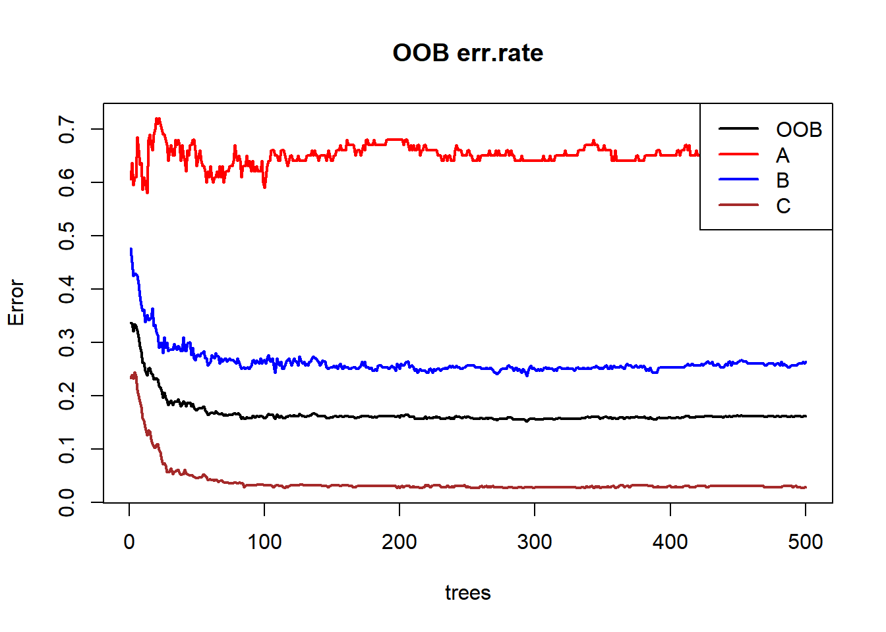
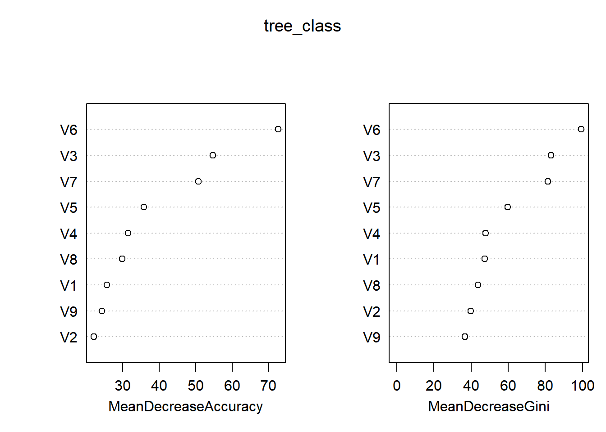
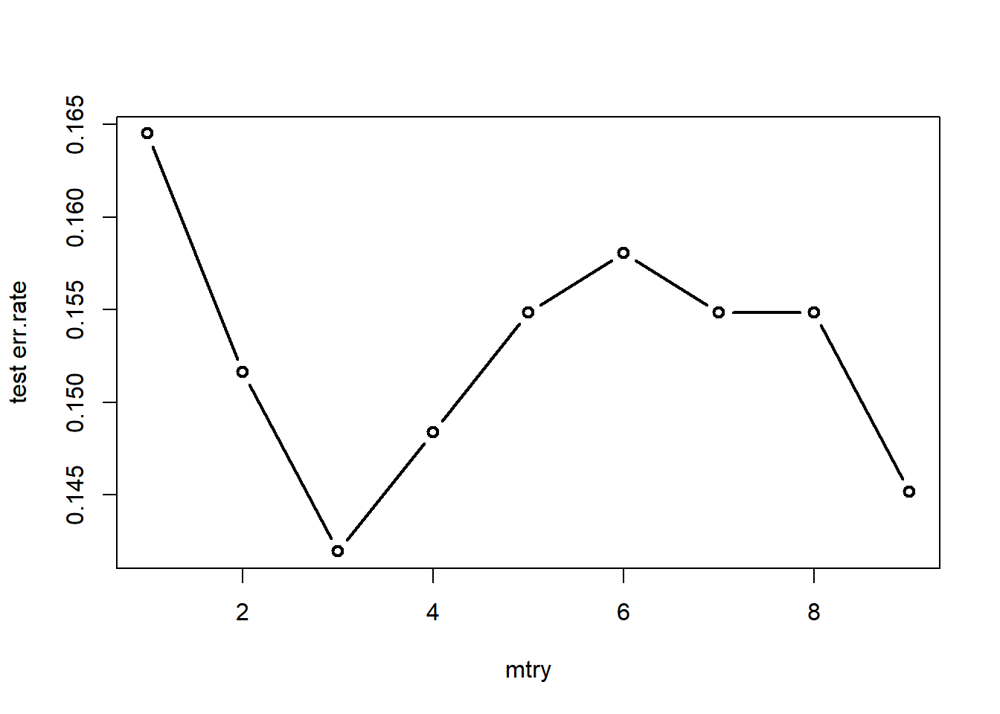
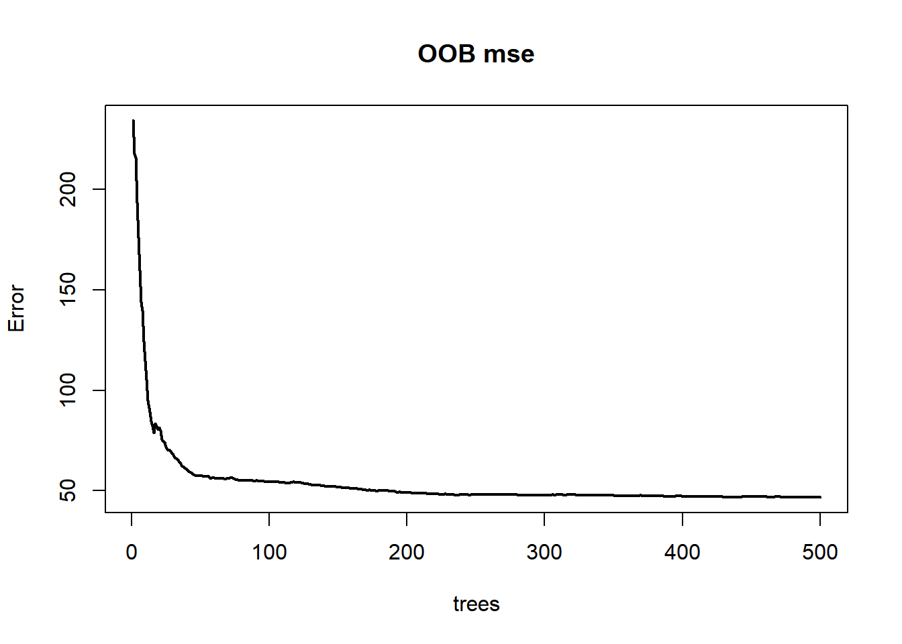
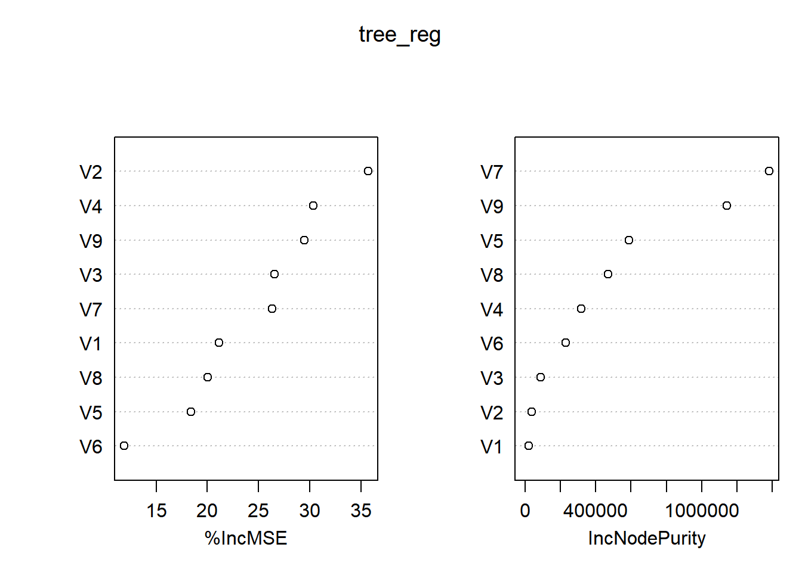
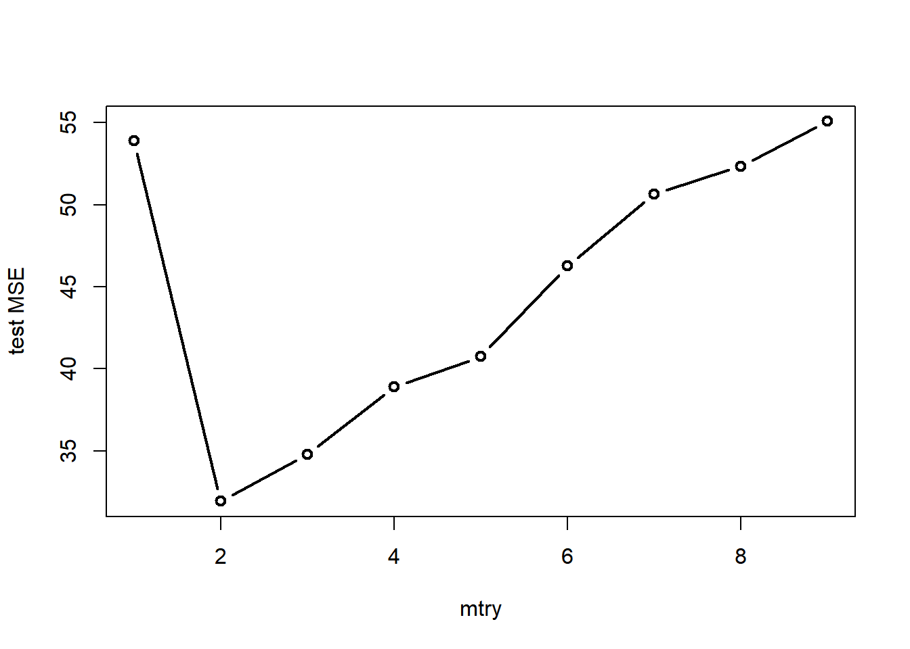

# 机器学习 {#ml}

这个章节介绍一下常用的机器学习算法。

## 基础知识 {#ml_1}

### 偏差-方差权衡 {#ml_1_1}

记$y=f(x)+\varepsilon, \; E(\varepsilon)=0$，$f$表示真实模型，$\hat f$是模型某次训练得到的结果，$E(\hat f)$表示训练模型的期望表现。

$$
\begin{aligned}
E[(\hat f-y)^2] &= E[(\hat f - E(\hat f) + E(\hat f)-y)^2] \\
&= E[(\hat f - E(\hat f))^2] + E[(E(\hat f)-y)^2] + 2E[(\hat f - E(\hat f))(E(\hat f)-y)] \\
&= E[(\hat f - E(\hat f))^2] + E[(E(\hat f)-y)^2] \\
&= E[(\hat f - E(\hat f))^2] + E[(E(\hat f)-f-\varepsilon)^2] \\
&= E[(\hat f - E(\hat f))^2] + E[(E(\hat f) - f)^2] + \varepsilon^2
\end{aligned}
$$

故模型的期望泛化错误率可拆解为**方差+偏差+噪声**

### 评价指标 {#ml_1_2}

1. 分类问题

- 准确率

$$
Accuracy = \frac{TP + TN}{TP + TN + FP +FN}
$$

- 精确率（查准率）：有没有误报

$$
Precision = \frac{TP}{TP+FP}
$$

- 召回率（查全率）：有没有漏报

$$
Recall = \frac{TP}{TP+FN}
$$

- F1与$F_\beta$

$$
F1 = \frac{2*Precision*Recall}{Precision + Recall} \\
F_\beta = \frac{(1+\beta^2)*Precision*Recall}{\beta^2*Precision + Recall}
$$

> $0<\beta<1$时精确率有更大影响，$\beta>1$时召回率有更大影响

- ROC曲线与AUC：横轴假阳率FPR，纵轴真阳率TPR，全局性能评估

$$
TPR = \frac{TP}{TP+FN} \\
FPR = \frac{FP}{FP+TN}
$$

- PR曲线与AUC：横轴召回率，纵轴精确率，更关注正样本预测质量

> 当存在类别不平衡情况时，PR曲线相较ROC曲线更敏感，能捕捉到异常

- 代价曲线：引入误判代价

- 宏平均：对于多个混淆矩阵，先计算各个混淆矩阵的指标，再求平均

- 微平均：对于多个混淆矩阵，先平均各个混淆矩阵，再求指标

2. 回归问题

- 均方误差：对异常值敏感

- 均方根误差：量纲与目标变量一致

- 平均绝对误差：对异常值不敏感

- $R^2$与$R^2_{adj}$

3. 其他

- AIC

$$
AIC = -2L(\hat \theta)_{max} + 2k
$$

> k是参数数量

- BIC

$$
BIC = -2L(\hat \theta)_{max}+ k\ln(n)
$$

### 特征工程 {#ml_1_3}

特征工程：从原始数据中创建、选择、变换或组合特征，以提高机器学习模型性能的过程。

#### 探索性数据分析 {#ml_1_3_1}

了解数据在**分布、类型、统计量、缺失值、异常值、实际含义**等方面的基本信息。

**方法：**

1. 数据可视化

   注意**辛普森悖论**，引入分层变量进行探索

2. 描述性统计

3. 专家的先验知识

4. 相关性分析

   皮尔逊相关系数、斯皮尔曼秩相关系数（非参）、肯德尔秩相关系数（非参，有序变量）、列联表检验
   
#### 数据清洗 {#ml_1_3_2}

1. 缺失值

   - 删除：删除记录或者直接删除特征
   
   - 填充：用均值、中位数、众数、模型预测值、插值等方法进行填充

> `naniar`包用于可视化缺失值，如`vis_miss()`、`miss_var_summary()`、`miss_case_summary()`

2. 异常值

   先要检查**指标的口径与定义**是否不一致。
   
   - 识别：箱线图与四分位距IQR、Z-score
   
   - 处理：删除、用分位数替换、数据分箱
   
#### 特征创建 {#ml_1_3_3}

基于已有特征创建新的特征，往往要结合专家建议

- 取对数、取平方等数学变换

- 融合特征，如根据总量指标与人数指标构建人均指标

- 数据分箱

#### 特征变换 {#ml_1_3_4}

改变特征的尺度、编码方式。

- 中心标准化

- 极差标准化

- 哑变量编码

- 独热编码

- 序数编码：适用于顺序变量

#### 特征选择 {#ml_1_3_5}

剔除无关或冗余的特征。

- 惩罚函数法，如单变量选择、群组变量选择

- 基于统计指标（AIC、BIC、R方）等的模型选择

- 树模型的重要性得分

- SHAP值

- 降维方法：PCA、t-SNE、UMAP、自编码器

## 决策树 {#ml_2}

决策树(Decision Tree)可用于分类和回归任务。决策树从根结点出发，在一定的判断标准下，决策树在每个内部结点上寻找合适的特征来划分样本，使得划分后的结点之间具有最大的区分度。对内部结点重复上述操作，便可得到多层结点，直至达到各个叶结点（终止结点）。

### 分类树 {#ml_2_1}

分类树考虑响应变量为分类变量的情形，以叶结点处数量最多的类别作为叶结点的类别标签。首先考虑决策树是如何“生长”的，也就是根据什么准则来分裂结点。我们总是希望分裂后的结点中的样本尽可能的属于同一类别，即该结点有着较高的“纯度”。**一言以蔽之，划分的过程就是从混乱走向有序的过程。**

1. 信息增益

   考虑在结点$D$中的所有样本共属于$M$个类别，考虑信息熵$Ent(D)$
   
   $$
   \textrm{Ent}(D)=-\sum_{m=1}^Mp_m \log_2p_m (\#eq:tree-eq1)
   $$
   
   如何理解信息熵？可以这样简单理解：对于不确定的、离谱的事情，人们就会拿不准，从而产生疑惑，想要知道更多的信息，此时信息熵就大；而对于确定的、理所应当的事情，人们就会很有把握，不会多问，此时信息熵就小。举个例子，一枚正常硬币猜正反，无论猜正面朝上还是猜反面朝上，概率都是0.5，因此只能瞎猜，没有什么把握。但对于一枚有特殊倾向的硬币，即正面朝上概率为0.9，那么大家自然都会猜正面朝上，并且有很大的把握。**因此，信息熵是对不确定性的度量，信息熵越大，越不确定。**
   
   由此可得**信息增益**的定义：
   
   $$
   \textrm{Gain}(D,x)=\textrm{Ent}(D)-\sum_{v=1}^V\frac{n_v}{n}\textrm{Ent}(D^v) (\#eq:tree-eq2)
   $$
   
   其中$x$表示某个特征，$V$表示该特征有多少个取值，$n$和$n_v$分别表示原结点与各个分支结点的样本量。
   
   > 若$x$是连续变量，则可将其离散化，并且连续变量可以在后续划分中进一步细分，而离散变量只能使用一次。
   
   我们要寻求合适的特征使得划分后的子结点与原结点相比信息熵平均下降得最多。这就是信息增益的准则。
   
   > 代表算法：ID3决策树
   
2. 增益率

   信息增益准则对取值数目较多的特征有所偏好。由此引入**增益率**，其定义为
   
   $$
   \textrm{Gain_ratio}(D,x)=\frac{\textrm{Gain}(D,x)}{\textrm{IV(x)}} (\#eq:tree-eq3)
   $$
   
   其中
   
   $$
   \textrm{IV}(x)=-\sum_{v=1}^V\frac{n_v}{n}\textrm{log}_2\frac{n_v}{n} (\#eq:tree-eq4)
   $$
   
   事实上，$\textrm{IV}(x)$就是信息熵的形式，可以视作某种对$x$取值数量的惩罚。
   
   > 代表算法：C4.5决策树（先选信息增益高的，再选增益率高的）
   
3. 基尼系数

   定义基尼系数
   
   $$
   \textrm{Gini}(D)=\sum_{m=1}^Mp_m(1-p_m)=1-\sum_{m=1}^Mp_m^2 (\#eq:tree-eq5) 
   $$
   
   直观来看，基尼系数衡量的就是从结点$D$中随机抽取两个样本，其类别不一致的概率。因此基尼系数越小，该结点纯度越高。
   
   > 代表算法：CART决策树
   


正如园艺里需要对植物进行修剪一样，决策树也能进行**剪枝**。决策树的剪枝策略分为**预剪枝**和**后剪枝**。

- 预剪枝

   在决策树的生成过程中，对每个结点在分裂前进行估计，若对该结点划分不能提高泛化能力，则停止划分并将该结点设置为叶结点。
   
   **预剪枝降低了过拟合的风险，但存在欠拟合的可能。**
   
- 后剪枝

   先完整地生成决策树，然后自下而上地对所有非叶结点进行考察。若将该非叶结点替换为叶结点后能够提升泛化性能，则进行替换。
   
   **后剪枝消耗的时间比预剪枝长，但欠拟合的风险较小，其泛化性能往往优于预剪枝策略。**
   


### 回归树 {#ml_2_2}

回归树考虑响应变量为连续变量的情形，以叶结点的响应变量平均值作为该叶结点的预测值。

回归树划分结点的准则多种多样，但都是类似的，如最小化平方误差MSE、最小化均方根误差RMSE、最小化平均绝对误差MAE等。

同样，回归树也能进行**剪枝**操作。

- 预剪枝

   回归树的预剪枝策略可以设置一个样本量阈值，当结点分裂后的样本量小于该阈值，则不进行分裂。
   
- 后剪枝

   后剪枝可以采取**代价复杂性剪枝**的策略，即先生成一棵完整的树，然后考虑如下的惩罚残差平方和函数
   
   $$
   \textrm{SSE}+\lambda|T|  (\#eq:tree-eq6) 
   $$
   
   其中$|T|$表示该棵决策树叶结点的数量。$\lambda$的值可通过交叉验证的方法进行确定。
   
### 实现 {#ml_2_3}

`rpart`包中的`rpart()`函数可以用来构建回归树和分类树。

> 树的形式为二叉树

1. `rpart()`参数

   - formula
   
      模型公式，看看谁是响应变量谁是预测变量。
      
   - data
   
      数据框。
      
   - weights
   
      设置权重。
      
   - subset
   
      指示数据框中的哪些样本会被用于建模。
      
   - na.action
   
      如何对待缺失值。默认使用`na.rpart()`函数，即删除缺失响应变量的样本或者缺失所有预测变量的样本（缺失部分预测变量也会被保留）。
      
   - method
   
      可选值为`anova`、`poisson`、`class`、`exp`。其中`anova`对应构建回归树，`class`对应构建分类树。
      
   - model
   
      是否在结果中保存模型框架。
      
      > 感觉用不上
      
   - x
   
      是否在结果中保存预测变量，默认为`FALSE`。
      
   - y 
   
      是否在结果中保存响应变量，默认为`TRUE`。
      
   - parms
   
      添加到分裂函数中的额外参数。对于回归树而言，不用额外添加。对于分类树，可传入一个列表，列表中分为三个元素：`prior`、`loss`、`split`，分别表示先验概率（正数，且总和需为1）、损失矩阵（规定了错分时的损失，要求对角线元素为0，非对角线元素为正）、划分标准（可选值为基尼系数`gini`、信息增益`information`）。
      
   - control
   
      为`rpart.control()`函数以列表形式传入的参数。
      
      > 详情建议问ai，懒癌犯了0.0
      
   - cost
   
      一个向量长度为预测变量数的非负向量，在拆分预测变量时用作缩放比例，默认为1。若该值越大，则对应预测变量的重要性程度越低。在量纲不一致的情形，该参数可用于减轻量纲带来的影响，因为算法会倾向于选择尺度较大的预测变量。
      
2. 其余函数

   - `rpart.control()`
   
      可更为细致地控制决策树的生长逻辑，如设置结点的最小训练样本数。
      
   - `prune()`
   
      用于剪枝。
      
   - `predict()`
   
      用于预测。
      
   - `rpart.plot`包
   
      用于绘制决策树的结果，是对`plot.rpart()`函数的拓展。

## 随机森林 {#ml_3}

在介绍随机森林前，先介绍**装袋法Bagging**。

Bagging基于自助采样法bootstrap来抽取多个具有相同样本量的训练集，然后在各个训练集上对基学习器进行训练，最终将这些基学习器结合起来。而对于那些没有被纳入到训练集中的样本，可以作为测试集来计算测试误差，称为**袋外误差OOB-error**。

> 结合策略可以是投票法、简单平均法、加权平均法等策略。

随机森林，顾名思义，基于Bagging的方法构建多棵决策树形成森林，其“随机”不仅体现在训练集的随机，还体现在每棵决策树的初始特征也是随机选取的。这使得随机森林相较决策树有更加优秀的泛化能力。

### 实现{#ml_3_1}

`randomForest`包是R中专门用来构建随机森林模型的包。下面将详细介绍包中的核心函数`randomForest()`，并罗列其余函数的作用。

1. 用途

   该函数使用Breiman的随机森林算法进行回归与分类任务。
   
2. 参数

   - x
   
      存储预测变量的数据框或矩阵。
      
   - y
   
      响应变量向量。若为因子型变量，则视为分类树，否则视为回归树。若为省略，则为无监督模式。
      
   - xtest
   
      预测变量的测试集，为数据框或矩阵格式。
      
   - ytest
   
      响应变量的测试集，向量格式。
      
   - ntree
   
      决策树的数目，默认为500。
      
   - mtry
   
      随机属性子集的大小。分类任务为属性总量的平方根，回归任务为属性总量三分之一。
      
   - weights
   
      权重向量，在采样时为训练集中的不同观测点设置权重。
      
   - replace
   
      是否为有放回抽样，默认为`TRUE`。
      
   - classwt
   
      在分类任务中，设置类的先验概率。注意传入的是一个向量，向量的分量表示不同类别的比例，这些分量无须加总为1。
      
   - cutoff
   
      在分类任务中，设置投票法的阈值，即超过多少比例才认为该观测点属于特定的一类。
      
   - strata
   
      一个被用于分层抽样的因子型变量。
      
   - sampsize
   
      样本容量。在分类任务中，若其为与`strata`相同长度的向量，则表示不同层的样本容量。
      
   - nodesize
   
      表示叶结点位置的最小样本数，默认分类任务为1，回归任务为5。
      
   - maxnodes
   
      表示叶结点的最大个数，若不指定，则决策树将会尽可能地生长。
      
   - importance
   
      是否评估预测变量的重要性，默认为`FALSE`。
      
   - localImp
   
      是否需要计算重要性度量，默认为`FALSE`。若为`TRUE`，则会覆盖掉`importance`参数。
      
      > 该参数和`importance`参数的区别貌似在于前者用于局部重要性度量，后者用于全局重要性度量。
      
   - nPerm
   
      在回归任务中，该参数用于评估变量重要性时对每棵树的袋外数据进行排列的次数。
      
   - proximity
   
      是否计算观测点之间的相似度。
      
   - oob.prox
   
      是否计算袋外数据观测点之间的相似度。
      
   - norm.votes
   
      在分类任务中，若为`TRUE`，则以比例形式展示最终的投票结果；若为`FALSE`，则展示原始票数。默认为`TRUE`。
      
   - do.trace
   
      是否在控制台输出详细的运行过程，默认为`FALSE`。若为整数，则表示每构建多少棵树就输出一次详情。
      
   - keep.forest
   
      是否在输出结果中保留森林。若给定了`xtest`，则默认为`FALSE`。
      
   - corr.bias
   
      在回归任务中，是否对回归结果进行偏差校正。
      
      > 该参数是实验性的，风险自担。
      
   - keep.inbag
   
      是否返回$n \times ntree$矩阵用以记录哪些观测点在哪棵树中被使用。
   

3. 输出

   - call
   
      模型的输入信息。
      
   - type
   
      树的类别，回归任务还是分类任务还是无监督模式。
      
   - predicted
   
      基于袋外样本的预测值。
   
   - importance
   
      重要性度量矩阵，返回所有变量的平均下降精度、平均下降基尼系数或者平均下降MSE。
      
   - importanceSD
   
      重要性度量的标准误矩阵。
      
   - localImp
   
      局部重要性度量矩阵，返回变量对观测点重要性的度量。
      
   - ntree
   
      决策树的数量。
      
   - mtry
   
      每个结点上随机属性子集的大小。
      
   - forest
   
      包含整个森林的列表。当`randomForest()`处于无监督模式或者`keep.forest`为`FALSE`时为NULL值。
      
   - err.rate
   
      在分类任务中，第i棵树及之前所有树在袋外数据中的分类错误率。
      
   - confusion
   
      在分类任务中，分类结果的混淆矩阵。
      
   - votes
   
      在分类任务中，显示得票比例或者得票数。
      
   - oob.times
   
      观测点归为袋外数据的次数。
      
   - proximity
   
      接近度矩阵，根据观测点在同一结点出现的频率来计算观测点之间的相似性。
      
   - mse
   
      回归任务中的均方误差。
      
   - rsq
   
      伪R方，$1-\frac{mse}{Var(y)}$
      
   - test
   
      若在输入中给出了测试集的数据，则在结果中会以列表形式存储关于测试集的有关结果。

`randomForest`包中的其余函数的作用如下表所示。


|        函数名        |                 用途                 |
|:--------------------:|:------------------------------------:|
|     classCenter      |          返回不同类别的原型          |
|       combine        |      将多个森林合并为一个大森林      |
|       getTree        |        从森林中提取一棵决策树        |
|         grow         |           为森林新添决策树           |
|      importance      |          提取变量重要性度量          |
|      imports85       |        一个UCI机器学习数据集         |
|        margin        |          计算或绘制分类边界          |
|       MDSplot        |      绘制接近度矩阵的多维尺度图      |
|     na.roughfix      |     利用中位数或众数来估算缺失值     |
|       outlier        |       根据接近度矩阵计算离群点       |
|     partialPlot      |             绘制偏依赖图             |
|  plot.randomForest   |   绘制随机森林的分类错误率或者MSE    |
| predict.randomForest |           用测试集进行预测           |
|        treecv        |      利用交叉验证法进行特征选择      |
|      treeImpute      | 利用接近度矩阵来估算自变量中的缺失值 |
|       treeNews       |     查看randomForest包的更新文件     |
|       treesize       |    查看每棵树的叶结点数或总结点数    |
|       tunetree       |      调优以寻找mtry的最优参数值      |
|      varImpPlot      |        可视化变量的重要性度量        |
|       varUsed        |   查看随机森林实际用到了哪些自变量   |

------

下面生成随机数据供随机森林进行模拟。


``` r
library(tidyverse)
library(randomForest)
library(MASS)  # 用到多元正态随机数
```

首先自定义函数，用于生成模拟数据。


``` r
# 自定义函数——生成多元正态数据
gen_data <- function(level, size, mu, sigma) {
    # 初始化数据框
    df = data.frame()

    # 生成每个类别的数据
    for (i in 1:level) {
        # 生成类别标签
        category_label = rep(LETTERS[i], size[i])

        # 生成数据
        category_data = as.data.frame(mvrnorm(n = size[i], mu = mu[[i]], Sigma = sigma[[i]]))

        # 添加类别标签
        category_data$category = factor(category_label)

        # 将数据添加到数据框
        df = rbind(df, category_data)
    }

    # 返回数据框
    return(df)
}
```


``` r
# 自定义函数——生成协方差矩阵
gen_sigma <- function(n) {
    # 生成一个n x n的随机矩阵
    L = matrix(runif(n * n, min = 1, max = 2), ncol = n)
    diag(L) = abs(diag(L))  # 确保对角线上的元素为正

    # 填充上三角部分为0
    L[upper.tri(L)] = 0

    # 计算Cholesky分解
    A = L %*% t(L)

    return(A)
}
```

1. 分类任务

这里生成具有3个水平的响应变量和9个预测变量。注意到不同类别之间的样本量存在一定的差异。


``` r
set.seed(123)
mu <- list(runif(9, min = 1, max = 4), runif(9, min = 1, max = 4), runif(9, min = 1,
    max = 4))
sigma <- list(gen_sigma(9), gen_sigma(9), gen_sigma(9))
df_train <- gen_data(level = 3, size = c(100, 300, 600), mu = mu, sigma = sigma)
df_test <- gen_data(level = 3, size = c(30, 100, 180), mu = mu, sigma = sigma)
```

接着运行模型。


``` r
tree_class <- randomForest(x = df_train[, -10], y = df_train$category, importance = T)
print(tree_class)
```

```
## 
## Call:
##  randomForest(x = df_train[, -10], y = df_train$category, importance = T) 
##                Type of random forest: classification
##                      Number of trees: 500
## No. of variables tried at each split: 3
## 
##         OOB estimate of  error rate: 16.2%
## Confusion matrix:
##    A   B   C class.error
## A 34  35  31  0.66000000
## B  3 221  76  0.26333333
## C  0  17 583  0.02833333
```

可以看到，袋外数据的分类错误率为16.2%。其中A类的分类错误率高达66%，这可能和训练集中的类别比例有关。

进一步地，绘制出分类错误率随决策树增加的变化趋势，可以更清晰地看到分类错误率的收敛情况。


``` r
plot(tree_class, col=c('black','red','blue','brown'), 
    lty=1, lwd=2, main='OOB err.rate')
legend('topright', legend=colnames(tree_class$err.rate), 
      col=c('black','red','blue','brown'),
      lty=1, lwd=2)
```

<div class="figure" style="text-align: center">

<p class="caption">(\#fig:tree-p1)袋外数据的分类错误率</p>
</div>

再来看看不同特征的重要程度。对于一棵树，在随机打乱某个特征的值的顺序之后，可以作差得到前后预测精度的下降情况，对于所有树取平均即可得到平均下降精度(MDA)。显然，如果MDA越大，说明该特征就越重要。同理，平均下降基尼系数(MDI)通过计算每个特征在所有树上节点分裂时导致的基尼系数平均下降量来评估特征的重要性。基尼系数反映了不纯度，下降得越多说明结点越容易从“不纯”走向了“纯”，意味着该特征在区分不同类别时能够较为显著地发挥作用。由图可知，两种评价准则得到的结果较为一致。


``` r
varImpPlot(tree_class)
```

<div class="figure" style="text-align: center">

<p class="caption">(\#fig:tree-p2)分类_重要性度量</p>
</div>

下面关注如何缓解类不平衡问题及如何选取最优参数`mtry`。

注意到训练集中类别的比例为1:3:6，存在一定程度的类不平衡问题。对此，在运行随机森林模型时可以设置`classwt`参数来设定各个类别的先验概率。


``` r
tree_class_prior <- randomForest(x = df_train[, -10], y = df_train$category, importance = T,
    proximity = T, classwt = c(1, 3, 6))
print(tree_class_prior)
```

```
## 
## Call:
##  randomForest(x = df_train[, -10], y = df_train$category, classwt = c(1,      3, 6), importance = T, proximity = T) 
##                Type of random forest: classification
##                      Number of trees: 500
## No. of variables tried at each split: 3
## 
##         OOB estimate of  error rate: 15.8%
## Confusion matrix:
##    A   B   C class.error
## A 32  37  31        0.68
## B  5 228  67        0.24
## C  0  18 582        0.03
```

而对于参数`mtry`的选取，除了可以使用`randomForest`包自带的`tunetree()`函数进行调参，还可以自己写个循环，直接根据测试集来选取最优参数。


``` r
err.rate <- c(1:9)
for (i in 1:9) {
    tree = randomForest(x = df_train[, -10], y = df_train$category, mtry = i)
    fit_test = predict(tree, df_test[, -10])
    err.rate[i] <- sum(fit_test != df_test$category)/nrow(df_test)
}
plot(1:9, err.rate, type = "b", lwd = 2, xlab = "mtry", ylab = "test err.rate")
```

<div class="figure" style="text-align: center">

<p class="caption">(\#fig:tree-p3)分类_mtry调优</p>
</div>

由图可知，当mtry=3时，在测试集上的袋外数据分类错误率达到最小，为14.2%。

2. 回归任务

这里首先生成自变量数据，然后在自变量的线性组合的基础上添加噪声，得到因变量数据。


``` r
set.seed(111)
mu <- list(runif(9, min = 1, max = 4))
sigma <- list(gen_sigma(9))
df_train <- gen_data(level = 1, size = c(1000), mu = mu, sigma = sigma)
df_train$epsilon <- rnorm(1000, sd = 3)
df_train <- df_train %>%
    mutate(y = 2 * V1 + 3 * V2 + V3 + 4 * V4 + 3 * V5 + V6 + 2 * V7 + 3 * V8 + 4 *
        V9 + epsilon)

df_test <- gen_data(level = 1, size = c(100), mu = mu, sigma = sigma)
df_test$epsilon <- rnorm(100, sd = 3)
df_test <- df_test %>%
    mutate(y = 2 * V1 + 3 * V2 + V3 + 4 * V4 + 3 * V5 + V6 + 2 * V7 + 3 * V8 + 4 *
        V9 + epsilon)
```

接着直接运行模型。


``` r
tree_reg <- randomForest(x = df_train[, 1:9], y = df_train$y, importance = T)
print(tree_reg)
```

```
## 
## Call:
##  randomForest(x = df_train[, 1:9], y = df_train$y, importance = T) 
##                Type of random forest: regression
##                      Number of trees: 500
## No. of variables tried at each split: 3
## 
##           Mean of squared residuals: 46.75519
##                     % Var explained: 98.91
```

从结果中可以看到，均方误差为46.7551872，自变量能解释的变异程度为98.91%。

进一步地，下面给出了模型的袋外数据MSE。


``` r
plot(tree_reg, main='OOB mse', lwd=2)
```

<div class="figure" style="text-align: center">

<p class="caption">(\#fig:tree-p4)袋外数据MSE</p>
</div>

再来看看特征的重要性度量。其中`%IncMSE`表示重排某个特征前后袋外数据MSE的上升百分比，上升的幅度越大，说明该特征对模型更加重要。`IncNodePurity`则表示结点分列时残差平方和的下降情况。


``` r
varImpPlot(tree_reg)
```

<div class="figure" style="text-align: center">

<p class="caption">(\#fig:tree-p5)回归_重要性度量</p>
</div>

最后，给模型参数`mtry`调调优。


``` r
mse <- c(1:9)
for (i in 1:9) {
    tree = randomForest(x = df_train[, 1:9], y = df_train$y, mtry = i)
    fit_test = predict(tree, df_test[, 1:9])
    mse[i] <- sum((fit_test - df_test$y)^2)/nrow(df_test)
}
plot(1:9, mse, type = "b", lwd = 2, xlab = "mtry", ylab = "test MSE")
```

<div class="figure" style="text-align: center">

<p class="caption">(\#fig:tree-p6)回归_mtry调优</p>
</div>

由图可知，当mtry=2时，在测试集上的袋外数据MSE达到最小，为31.9。

## XGBoost {#ml_4}

文献：[XGBoost: A Scalable Tree Boosting System](https://arxiv.org/pdf/1603.02754v1)

### 原理 {#ml_4_1}

1. 基础思想

采用boosting的思想，串行训练多个弱学习器，当前弱学习器从上一个弱学习器的残差中进行学习，最后加权综合各个弱学习器，即$\hat y_i=\phi(x_i)=\sum_{k=1}^Kf_k(x_i)$。

2. 目标函数

$$
L(\phi) = \sum_{i=1}^n L(y_i, \hat y_i) + \sum_{k=1}^K \Omega(f_k)
$$

$L(\cdot)$表示损失函数，用于度量$y_i$和$\hat y_i$之间的差异，回归任务可以为均方误差，分类任务可以为交叉熵。

$\Omega(f_k)$表示对第k棵树复杂度的惩罚，用于防止过拟合，定义为$\Omega(f) = \gamma T+\frac{1}{2}\lambda ||w||^2$，其中$T$为叶子节点数，$w$为叶子权重（**即对应叶子节点的输出值**），$\gamma$和$\lambda$为惩罚系数（超参数）。

3. 计算损失函数

与梯度提升树只利用梯度信息不一样，XGBoost还利用二阶泰勒展开（利用了黑塞矩阵的信息）来更为精准地近似损失函数。

当模型训练到第**t**棵树时，我们需要最小化下面的损失函数

$$
\begin{aligned}
L^{(t)}&=\sum_{i=1}^n L(y_i, \hat y_i^{(t)})+\Omega (f_t) \\
&=\sum_{i=1}^n L(y_i, \hat y_i^{(t-1)}+f_t(x_i))+\Omega (f_t) \\
&\approx \sum_{i=1}^n [L(y_i, \hat y_i^{(t-1)})+g_if_t(x_i)+\frac{1}{2}h_if_t^2(x_i)]+\Omega (f_t) \\
& \propto \sum_{i=1}^n [g_if_t(x_i)+\frac{1}{2}h_if_t^2(x_i)]+\Omega (f_t)
\end{aligned}
$$

- 由于前t-1棵树的结构已经确定，因此$\sum_{i=1}^{t-1}\Omega (f_i)$也随之确定，即为常数

- $g_i$和$h_i$分别表示损失函数的一阶导和二阶导

- $L(y_i, \hat y_i^{(t-1)})$为常数

记$I_j=\{i|q(x_i)=j\}$，表示落在叶子节点$j$上的观测集合，其中$q(\cdot)$表示从样本到叶子节点的映射，即为树的结构。则有

$$
\begin{aligned}
\tilde L^{(t)} &= \sum_{i=1}^n [g_if_t(x_i)+\frac{1}{2}h_if_t^2(x_i)]+\gamma T + \frac{1}{2}\lambda \sum_{j=1}^T w_j^2 \\
&= \sum_{j=1}^T[(\sum_{i \in I_j}g_i)w_j + \frac{1}{2}(\sum_{i \in I_j}h_i + \lambda)w_j^2] + \gamma T
\end{aligned}
$$

> 引入$I_j$的目的就是为了把$f_t(x_i)$转化为对应叶子节点的预测值

之后便可将$\tilde L^{(t)}$视作关于$w_j$的二次函数，故最优权重$w_j^*$为

$$
w_j^* = -\frac{\sum_{i \in I_j}g_i}{\sum_{i \in I_j}h_i + \lambda}
$$

对应的目标函数最小值为

$$
\tilde L^{(t)}(q)=-\frac{1}{2}\sum_{j=1}^T \frac{(\sum_{i \in I_j}g_i)^2}{\sum_{i \in I_j} h_i + \lambda} + \gamma T
$$

因此，可根据$\tilde L^{(t)}(q)$来判断当前树模型的好坏，值越小，结构越好。

4. 树的分裂

我们没办法遍历各种树的结构，因此采用贪心算法进行分裂，记$I_L$和$I_R$分别为分裂后左右叶子节点的样本集合，则损失函数减少量为

$$
L_{split} = \frac{1}{2}[\frac{(\sum_{i \in I_L}g_i)^2}{\sum_{i \in I_L} h_i + \lambda} + \frac{(\sum_{i \in I_R}g_i)^2}{\sum_{i \in I_R} h_i + \lambda} - \frac{(\sum_{i \in I_j}g_i)^2}{\sum_{i \in I_j} h_i + \lambda}] - \gamma
$$

> 注意符号，$L_{split}$是分裂前的损失函数值减去分裂后的损失函数值，$L_{split}$越大，越倾向于分裂

此处的$\gamma$同样用于惩罚，能够使得差值达到一定程度时才选择分裂。

5. 收缩与列采样

除了在目标函数中增加正则项以防止过拟合，还采取收缩与列采样的技术防止过拟合。

引入收缩因子$\eta$用于减少每棵树的影响，即$\eta f_t(x_i)$，从而为后续的树留有改善空间。这里的收缩因子类似学习率。

列采样就是在训练每棵树时随机从所有特征中抽取一个子集用于训练。

6. 缺失值处理

当某个特征中存在缺失值时，首先删掉所有缺失值对应的观测，将完整的观测按正常操作进行分裂。之后，比较把所有缺失值样本放到左子节点及右子节点的增益大小，将这些缺失值对应的观测分配到能获得更大增益的子节点，并记录分配节点作为默认方向。在测试集上的缺失值则分配到默认方向。

### 实现 {#ml_4_2}

python的`xgboost`库，示例如下。

```
param_dist_xgb = {
    'max_depth': stats.randint(3, 10),
    'min_child_weight': stats.randint(1, 6),
    'gamma': stats.uniform(0, 0.5),
    'subsample': stats.uniform(0.6, 0.4),
    'colsample_bytree': stats.uniform(0.6, 0.4),
    'reg_lambda': stats.uniform(0, 1.0),
    'reg_alpha': stats.uniform(0, 1.0),
    'learning_rate' : stats.uniform(0.01, 0.29),
    'n_estimators': [50,100,150,200,250,300]
}

model_xgb = xgb.XGBRegressor(objective='reg:squarederror', random_state=527)
random_search_xgb = RandomizedSearchCV(
    model_xgb, 
    param_dist_xgb, 
    n_iter=100,
    cv=5, 
    scoring='neg_mean_squared_error',
    n_jobs=-1,
    random_state=135
)
random_search_xgb.fit(X, Y)
best_score_xgb = -random_search_xgb.best_score_
print(f"最优模型的交叉验证均方误差（MSE）: {best_score_xgb:.2f}")
best_param_xgb = random_search_xgb.best_params_
print(best_param_xgb)
best_model_xgb = random_search_xgb.best_estimator_
```

超参数详见[官方手册](https://xgboost.readthedocs.io/en/release_3.0.0/parameter.html)

## 因果森林 {#ml_5}

### 原理 {#ml_5_1}

1. 无混杂条件

在无混杂条件下，方可进行准确的因果推断。

对于$\{X_i, Y_i, W_i\}$的数据，其中$W_i$表示是否接受处理，处理效应表示为

$$
\tau(x) = E[Y_i^{(1)}-Y_i^{(0)}|X_i = x]
$$

由于在现实中没法同时观测到$Y_i^{(1)}$和$Y_i^{(0)}$，在无混杂条件

$$
\{Y_i^{(0)}, Y_i^{(1)}\} \perp W_i | X_i
$$

> 无混杂条件说明了在控制$X$的情况下，对象是否接受干预是随机的，正是因为这种随机性使得我们可以根据现实观测来估计处理效应

成立的情况下，传统方法可以通过倾向得分$e(x) = E(W_i|X_i=x)$来估计处理效应

$$
E[Y_i(\frac{W_i}{e(x)} - \frac{1-W_i}{1-e(x)})|X_i = x]=\tau(x)
$$

2. 诚实树与因果森林

在高维场合下，树和森林可被视作具有**自适应距离度量的NearestNeighbor方法**。落在相同叶节点的观测具有高度相似性，当叶节点足够小时可以相信这些观测独立同分布。

> KNN算法是基于某种距离度量找到邻居，而树中叶节点里的观测都是邻居

对此，根据树模型得到的处理效应估计为

$$
\begin{aligned}
\hat \tau(x) &= \frac{1}{|\{i:W_i = 1, X_i \in L\}|}\sum_{\{i:W_i = 1, X_i \in L\}}^{Y_i} \\ &-\frac{1}{|\{i:W_i = 0, X_i \in L\}|}\sum_{\{i:W_i = 0, X_i \in L\}}^{Y_i}
\end{aligned}
$$

若是森林，则综合B棵树的估计结果

$$
\hat \tau(x) = B^{-1}\sum_{b=1}^B \hat \tau_b(x)
$$

为了能够实现上述的估计，树模型也需要满足无混杂条件，因此需要引入**诚实树**的概念。**对于任一观测，该观测要么用来分裂，要么用来估计因果效应**。只有这样，对因果效应的估计才有一致性和渐近正态性。

对于诚实树，有两种构建方法——**双重样本树**和**倾向树**。

双重样本树，顾名思义，将样本分为两个独立子集，一个子集用于分裂（仅使用X和W），另一个子集用于在叶节点内估计处理效应（使用X，W，Y）。

倾向树，将指示变量W视为分类目标的响应变量，构建分类树，即用X去预测W（某种程度上就是在做倾向得分的事），然后再在生成的叶节点内基于Y估计处理效应。

### 实现 {#ml_5_2}

R语言`grf`包。

- causal_forest()：构建因果森林

- multi_arm_causal_forest()：适用于W为多分类水平的因果森林

- average_treatment_effect()：输出平均处理效应，支持统计推断，可获得置信区间

- $predictions：输出每个观测的预测处理效应值

## 贝叶斯方法 {#ml_6}

### 贝叶斯判别法 {#ml_6_1}

详见[应用多元统计](#ms_5_2)

### 朴素贝叶斯分类器 {#ml_6_2}


