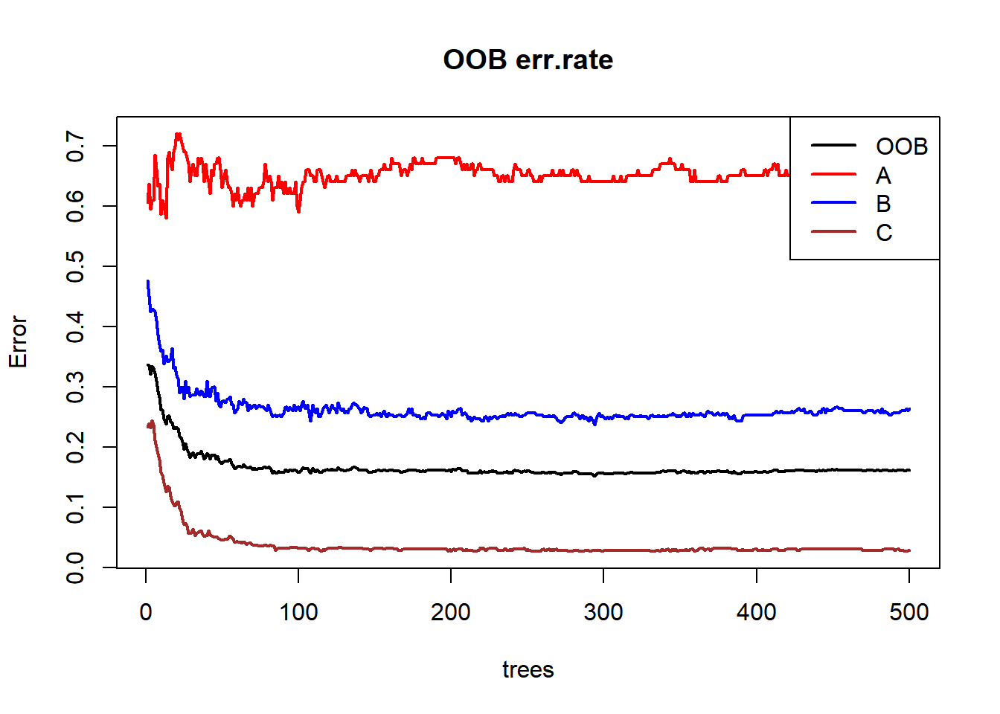
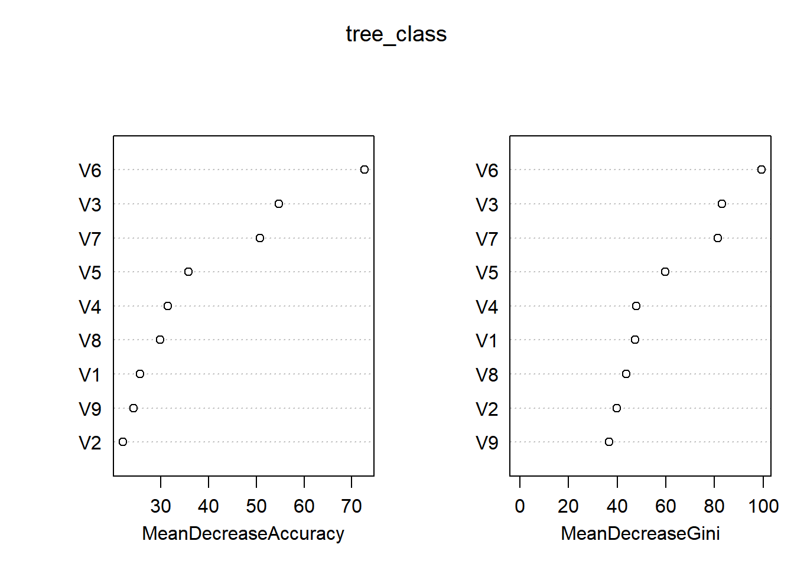
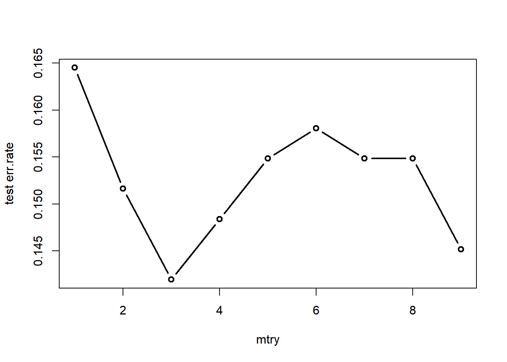
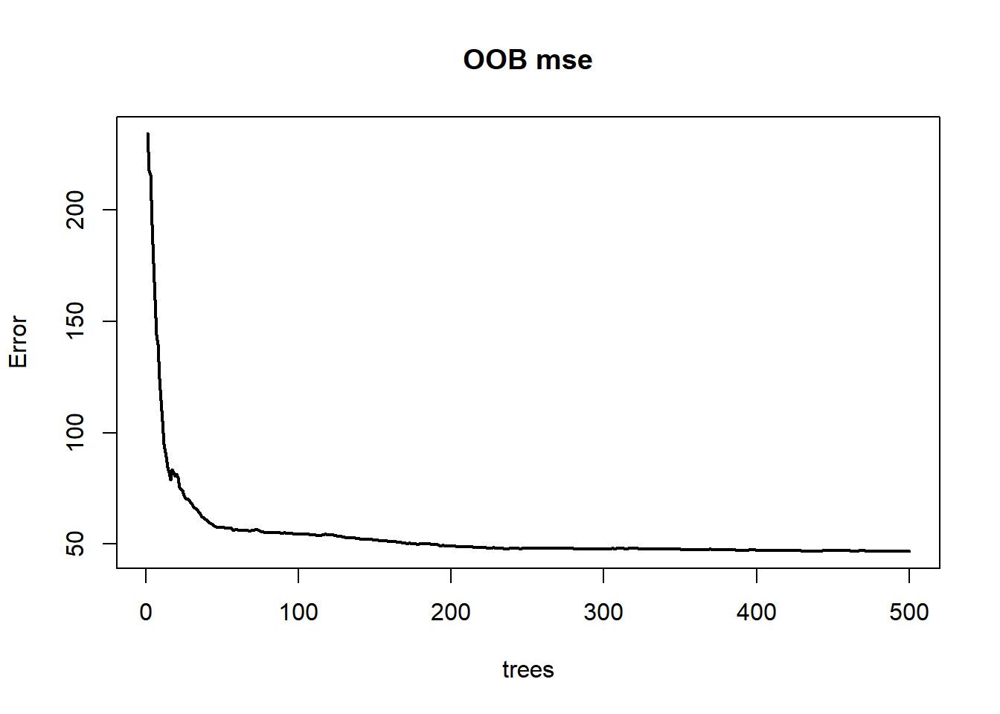
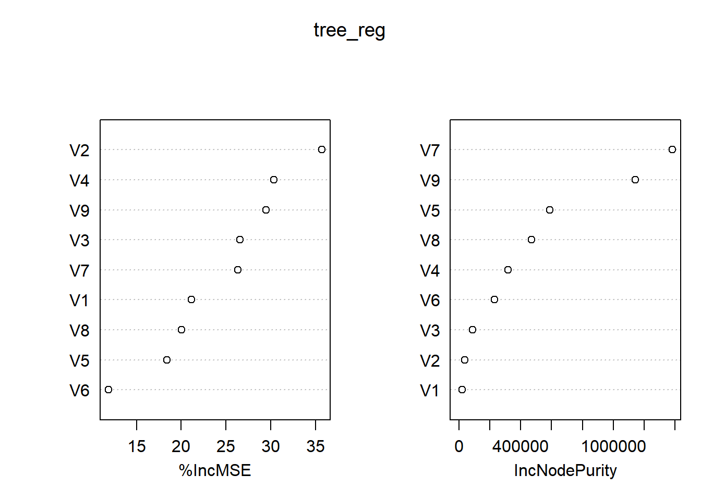

# 机器学习 {#ml}

这个章节介绍一下常用的机器学习算法。

## 基础知识 {#ml_1}

### 偏差-方差权衡 {#ml_1_1}

记$y=f(x)+\varepsilon, \; E(\varepsilon)=0$，$f$表示真实模型，$\hat f$是模型某次训练得到的结果，$E(\hat f)$表示训练模型的期望表现。

$$
\begin{aligned}
E[(\hat f-y)^2] &= E[(\hat f - E(\hat f) + E(\hat f)-y)^2] \\
&= E[(\hat f - E(\hat f))^2] + E[(E(\hat f)-y)^2] + 2E[(\hat f - E(\hat f))(E(\hat f)-y)] \\
&= E[(\hat f - E(\hat f))^2] + E[(E(\hat f)-y)^2] \\
&= E[(\hat f - E(\hat f))^2] + E[(E(\hat f)-f-\varepsilon)^2] \\
&= E[(\hat f - E(\hat f))^2] + E[(E(\hat f) - f)^2] + \varepsilon^2
\end{aligned}
$$

故模型的期望泛化错误率可拆解为**方差+偏差+噪声**

### 评价指标 {#ml_1_2}

1. 分类问题

- 准确率

$$
Accuracy = \frac{TP + TN}{TP + TN + FP +FN}
$$

- 精确率（查准率）：有没有误报

$$
Precision = \frac{TP}{TP+FP}
$$

- 召回率（查全率）：有没有漏报

$$
Recall = \frac{TP}{TP+FN}
$$

- F1与$F_\beta$

$$
F1 = \frac{2*Precision*Recall}{Precision + Recall} \\
F_\beta = \frac{(1+\beta^2)*Precision*Recall}{\beta^2*Precision + Recall}
$$

> $0<\beta<1$时精确率有更大影响，$\beta>1$时召回率有更大影响

- ROC曲线与AUC：横轴假阳率FPR，纵轴真阳率TPR，全局性能评估

$$
TPR = \frac{TP}{TP+FN} \\
FPR = \frac{FP}{FP+TN}
$$

- PR曲线与AUC：横轴召回率，纵轴精确率，更关注正样本预测质量

> 当存在类别不平衡情况时，PR曲线相较ROC曲线更敏感，能捕捉到异常

- 代价曲线：引入误判代价

- 宏平均：对于多个混淆矩阵，先计算各个混淆矩阵的指标，再求平均

- 微平均：对于多个混淆矩阵，先平均各个混淆矩阵，再求指标

2. 回归问题

- 均方误差：对异常值敏感

- 均方根误差：量纲与目标变量一致

- 平均绝对误差：对异常值不敏感

- $R^2$与$R^2_{adj}$

3. 其他

- AIC

$$
AIC = -2L(\hat \theta)_{max} + 2k
$$

> k是参数数量

- BIC

$$
BIC = -2L(\hat \theta)_{max}+ k\ln(n)
$$

### 特征工程 {#ml_1_3}

通俗地说，模型性能的上限由“数据与特征”决定，而算法只是尽可能逼近这个上限。因此，特征工程是把“原始数据”转化为“有信息量的特征”的过程，核心目标是让模型更容易学习到规律、提高预测精度与泛化能力。

#### 探索性数据分析 {#ml_1_3_1}

了解数据在**分布、类型、统计量、缺失值、异常值、实际含义**等方面的基本信息。

**方法：**

1. 数据可视化

   注意**辛普森悖论**，引入分层变量进行探索

2. 描述性统计

3. 专家的先验知识

4. 相关性分析

   皮尔逊相关系数、斯皮尔曼秩相关系数（非参）、肯德尔秩相关系数（非参，有序变量）、列联表检验
   
#### 数据预处理 {#ml_1_3_2}

1. 缺失值

   - 删除：删除记录或者直接删除特征
   
   - 填充：用均值、中位数、众数、模型预测值、插值等方法进行填充

> `naniar`包用于可视化缺失值，如`vis_miss()`、`miss_var_summary()`、`miss_case_summary()`

2. 异常值

   先要检查**指标的口径与定义**是否不一致。
   
   - 识别：箱线图与四分位距IQR、Z-score、孤立森林
   
   - 处理：删除、裁剪、数据分箱
   
#### 特征构造 {#ml_1_3_3}

通过组合、聚合或数学操作生成新的特征。

- 取对数、取平方等数学变换

- 统计特征：如取均值、中位数、最值等

- 业务特征，如根据总量指标与人数指标构建人均指标

> 例如美团比赛中，给出骑手的基础指标（准时单量、拒绝单量、完成单量、开工时长、有单时长），就可以额外拓展出更能评价骑手表现的指标（准时率、拒绝率、工作效率、有单时长占比等指标）
>
> 又如要想让xgboost具有时序预测能力，可在特征中添加因变量的滞后项

- 数据分箱

#### 特征变换 {#ml_1_3_4}

改变特征的尺度、编码方式。

- 中心标准化

- 极差标准化

- 哑变量编码：无多重共线性，适合线性模型

- 独热编码：适合树模型

- 标签编码：整数，但数字大小无意义

- 序数编码：整数，适用于顺序变量

- 目标编码：将分类变量与目标值的统计特征联系在一起

- WOE编码：适用于风控建模场景，能够反映类别对目标的区分度

#### 特征选择 {#ml_1_3_5}

剔除无关或冗余的特征。

- 惩罚函数法，如单变量选择、群组变量选择

- 基于统计指标（AIC、BIC、R方）等的模型选择（前向、后向选择）

- 递归特征消除（RFE）：重复训练模型，依次剔除最不重要的特征，直到特征数降到一定数量

- 树模型的重要性得分

- SHAP值

- 降维方法：PCA、t-SNE、UMAP、自编码器

> 最后可根据交叉验证来评价给定模型在不同特征子集上的表现

## pandas与sklearn {#ml_2}

### 导入数据集 {#ml_2_1}


``` default
import pandas as pd

# 读取CSV文件
df = pd.read_csv(path)

# 读取Excel文件
df = pd.read_excel(path)
# 读取Excel文件中的多个sheet，存储为字典
df = pd.read_excel(path, sheet_name=['Sheet1', 'Sheet2'])
# 读取Excel文件中所有sheet，存储为字典
df = pd.read_excel(path, sheet_name=None)
```

### 数据预处理 {#ml_2_2}

1. 缺失值处理


``` default
# 各列缺失值数量
df.count()
df.isna().sum()   # df.notna()

# 各列缺失值比例
df.isnull().mean() * 100

# 缺失值可视化
import missingno as msno
import matplotlib.pyplot as plt
msno.matrix(df) # 矩阵图：直观展示缺失值在数据中的分布
plt.show()

msno.bar(df)    # 条形图：按列展示完整数据比例
plt.show()

# 删除缺失值
# axis表示要压缩的维度。若axis=0，则压缩行，保留列方向的操作结果
df = df.dropna()                         # 删除包含任何缺失值的行
df = df.dropna(axis=1, how='all')        # 删除全是缺失值的列
df = df.dropna(subset=["col1", "col2"])  # 删除特定列缺失值所在的行

# 填充缺失值
df_filled = df.fillna(0)                    # 用固定值填充
df['A'] = df['A'].fillna(df['A'].mean())    # 均值
df['B'] = df['B'].fillna(df['B'].median())  # 中位数
df = df.ffill()                             # 前向填充
df = df.bfill()                             # 后向填充
df = df.interpolate()                       # 用插值法填充（更平滑的填充方式）
```

2. 异常值处理


``` default
# Z-score
df_num = df.select_dtypes(include=['number'])   # 筛选数值列
df_zscore = df_num.apply(lambda col:(col-col.mean())/col.std(), axis = 0) # df_zscore是数据框
df[(df_zscores.abs() > 2).any(axis = 1)]

# 四分位距
Q1 = num_df.quantile(0.25)
Q3 = num_df.quantile(0.75)
IQR = Q3 - Q1
outliers = ((num_df < (Q1 - 1.5 * IQR)) | (num_df > (Q3 + 1.5 * IQR)))
df[df_num.columns] = df_num.clip(lower=Q1, upper=Q3, axis = 1)
```

3. 标准化


``` default
from sklearn.preprocessing import StandardScaler
# from sklearn.preprocessing import MinMaxScaler

# 选取数值列
numeric_cols = df.select_dtypes(include=['number']).columns
# 标准化并替换
scaler = StandardScaler()    # scaler = MinMaxScaler()
df[numeric_cols] = scaler.fit_transform(df[numeric_cols])
```

4. 编码


``` default
# 独热编码
df = pd.get_dummies(df, dtype = int)
# 也可考虑from sklearn.preprocessing import OneHotEncoder

# 哑变量编码
df = pd.get_dummies(df, dtype = int, drop_first=True)

# 频率编码
frequency = df['A'].value_counts(normalize=True)
df['A'] = df['A'].map(frequency)

# 有序变量编码
df['评分'] = pd.Categorical(
    df['评分'], 
    categories=['低', '中', '高', '极高'], 
    ordered=True
)
df['评分编码'] = df['评分'].cat.codes

# 自定义编码
edu_map = {'小学': 1, '中学': 2, '大学': 3, '硕士': 4, '博士': 5}
df['edu'] = df['edu'].map(edu_map)
```

5. 表的连接与拼接


``` default
# on表示主键
# how表示连接方式：inner、outer、left、right
df_merge = df1.merge(df2, on='id', how='inner')
df_merge = pd.merge(df1, df2, on='id', how='inner')
# 当键名不同时
df = pd.merge(df1, df2, left_on='id', right_on='user_id', how='inner')

# 表拼接
# ignore_index=True表示充值索引
df_concat = pd.concat([df1, df2], axis = 0) # 纵向堆叠
df_concat = pd.concat([df1, df2], axis = 1) # 横向堆叠
```

6. 数据透视表

`.pivot()`和`pd.melt()`都不会保留未用到的列，得注意。


``` default
# 长表变宽表
wide = df.pivot(index='name', columns='subject', values='score').reset_index()  # 将索引列转化为第一列
wide = wide.merge(df[['name', 'age']].drop_duplicates(), on='name', how='left') # 保留原始列
# 若index存在重复值，则考虑pivot_table()，可以指定处理重复值的聚合函数


# 宽表变长表
# 参数value_vars是个列表，存储需要压缩的列名，如果不填，默认除id_vars外的所有列
pd.melt(wide, id_vars=['name', 'age'], var_name='subject', value_name='score')
```

7. 分组聚合


``` default
# 核心表达式
DataFrame.groupby(keys)[columns].agg(func) # 如果是多个列则columns应该再用列表嵌套

# 单函数聚合
df.groupby('region')['revenue'].agg('sum')

# 多函数聚合
df.groupby('region')[['revenue', 'unit']].agg(['sum', 'mean'])

# 字典映射（只对特定列进行聚合）：列名为键，函数为值
df.groupby('region').agg({
    'revenue': 'sum',
    'units': 'mean'
})

# 命名聚合：新列名=('旧列名', '函数名')
df.groupby('region').agg(
    total_revenue=('revenue', 'sum'),
    avg_units=('units', 'mean'),
    max_revenue=('revenue', 'max')
)

# 自定义函数
df.groupby('region')['revenue'].agg(lambda x: x.max() - x.min())
```


### 分割数据集 {#ml_2_3}


``` default
from sklearn.model_selection import train_test_split

# 训练集和测试集
X_train, X_test, y_train, y_test = train_test_split(X, y, test_size=0.2, random_state=42)
# 训练集和验证集
X_train, X_val, y_train, y_val = train_test_split(X_train, y_train, test_size=0.25, random_state=42)

# 分层分割
X_train, X_test, y_train, y_test = train_test_split(X, y, test_size=0.2, random_state=42, stratify= categorical_var)

# 交叉验证
from sklearn.model_selection import KFold
kf = KFold(n_splits=10, shuffle=True, random_state=42)
for train_index, test_index in kf.split(X, y):
    # 获取分割后的训练集和测试集
    X_train, X_test = X[train_index], X[test_index]
    y_train, y_test = y[train_index], y[test_index]
    ...
# 也可使用cross_val_score及cross_validate来简化交叉验证流程
cross_val_score(model, X, y, cv=5, scoring='accuracy')   # 单个评估指标
cross_validate(model, X, y, cv=5, scoring=['accuracy', 'f1_macro'], return_train_score=True) # 多个评估指标
```


## 决策树 {#ml_3}

决策树(Decision Tree)可用于分类和回归任务。决策树从根结点出发，在一定的判断标准下，决策树在每个内部结点上寻找合适的特征来划分样本，使得划分后的结点之间具有最大的区分度。对内部结点重复上述操作，便可得到多层结点，直至达到各个叶结点（终止结点）。

### 分类树 {#ml_3_1}

分类树考虑响应变量为分类变量的情形，以叶结点处数量最多的类别作为叶结点的类别标签。首先考虑决策树是如何“生长”的，也就是根据什么准则来分裂结点。我们总是希望分裂后的结点中的样本尽可能的属于同一类别，即该结点有着较高的“纯度”。**一言以蔽之，划分的过程就是从混乱走向有序的过程。**

1. 信息增益

   考虑在结点$D$中的所有样本共属于$M$个类别，考虑信息熵$Ent(D)$
   
   $$
   \textrm{Ent}(D)=-\sum_{m=1}^Mp_m \log_2p_m (\#eq:tree-eq1)
   $$
   
   如何理解信息熵？可以这样简单理解：对于不确定的、离谱的事情，人们就会拿不准，从而产生疑惑，想要知道更多的信息，此时信息熵就大；而对于确定的、理所应当的事情，人们就会很有把握，不会多问，此时信息熵就小。举个例子，一枚正常硬币猜正反，无论猜正面朝上还是猜反面朝上，概率都是0.5，因此只能瞎猜，没有什么把握。但对于一枚有特殊倾向的硬币，即正面朝上概率为0.9，那么大家自然都会猜正面朝上，并且有很大的把握。**因此，信息熵是对不确定性的度量，信息熵越大，越不确定。**
   
   由此可得**信息增益**的定义：
   
   $$
   \textrm{Gain}(D,x)=\textrm{Ent}(D)-\sum_{v=1}^V\frac{n_v}{n}\textrm{Ent}(D^v) (\#eq:tree-eq2)
   $$
   
   其中$x$表示某个特征，$V$表示该特征有多少个取值，$n$和$n_v$分别表示原结点与各个分支结点的样本量。
   
   > 若$x$是连续变量，则可将其离散化，并且连续变量可以在后续划分中进一步细分，而离散变量只能使用一次。
   
   我们要寻求合适的特征使得划分后的子结点与原结点相比信息熵平均下降得最多。这就是信息增益的准则。
   
   > 代表算法：ID3决策树
   
2. 增益率

   信息增益准则对取值数目较多的特征有所偏好。由此引入**增益率**，其定义为
   
   $$
   \textrm{Gain_ratio}(D,x)=\frac{\textrm{Gain}(D,x)}{\textrm{IV(x)}} (\#eq:tree-eq3)
   $$
   
   其中
   
   $$
   \textrm{IV}(x)=-\sum_{v=1}^V\frac{n_v}{n}\textrm{log}_2\frac{n_v}{n} (\#eq:tree-eq4)
   $$
   
   事实上，$\textrm{IV}(x)$就是信息熵的形式，可以视作某种对$x$取值数量的惩罚。
   
   > 代表算法：C4.5决策树（先选信息增益高的，再选增益率高的）
   
3. 基尼系数

   定义基尼系数
   
   $$
   \textrm{Gini}(D)=\sum_{m=1}^Mp_m(1-p_m)=1-\sum_{m=1}^Mp_m^2 (\#eq:tree-eq5) 
   $$
   
   直观来看，基尼系数衡量的就是从结点$D$中随机抽取两个样本，其类别不一致的概率。因此基尼系数越小，该结点纯度越高。
   
   > 代表算法：CART决策树
   


正如园艺里需要对植物进行修剪一样，决策树也能进行**剪枝**。决策树的剪枝策略分为**预剪枝**和**后剪枝**。

- 预剪枝

   在决策树的生成过程中，对每个结点在分裂前进行估计，若对该结点划分不能提高泛化能力，则停止划分并将该结点设置为叶结点。
   
   **预剪枝降低了过拟合的风险，但存在欠拟合的可能。**
   
- 后剪枝

   先完整地生成决策树，然后自下而上地对所有非叶结点进行考察。若将该非叶结点替换为叶结点后能够提升泛化性能，则进行替换。
   
   **后剪枝消耗的时间比预剪枝长，但欠拟合的风险较小，其泛化性能往往优于预剪枝策略。**
   


### 回归树 {#ml_3_2}

回归树考虑响应变量为连续变量的情形，以叶结点的响应变量平均值作为该叶结点的预测值。

回归树划分结点的准则多种多样，但都是类似的，如最小化平方误差MSE、最小化均方根误差RMSE、最小化平均绝对误差MAE等。

同样，回归树也能进行**剪枝**操作。

- 预剪枝

   回归树的预剪枝策略可以设置一个样本量阈值，当结点分裂后的样本量小于该阈值，则不进行分裂。
   
   常见规则：
   
   - 当前节点的样本数小于阈值；

   - 当前节点的纯度高于阈值；

   - 划分后信息增益（或增益率）小于阈值；

   - 使用验证集判断：若划分后准确率没有提高，则停止划分。
   
- 后剪枝

   后剪枝可以采取**代价复杂性剪枝**的策略，即先生成一棵完整的树，然后考虑如下的惩罚残差平方和函数
   
   $$
   \textrm{SSE}+\lambda|T|  (\#eq:tree-eq6) 
   $$
   
   步骤：
   
   1. 从最完整的树$T_0$开始；
   
   2. 逐步增加$lambda$，找到每次最优剪枝节点；
   
   3. 生成一系列子树序列$T_0, T_1, ...$
   
   4. 在验证集或交叉验证下选择最优$\lambda$对应的树
   
   其中$|T|$表示该棵决策树叶结点的数量。$\lambda$的值可通过交叉验证的方法进行确定。
   
### 实现 {#ml_3_3}

`rpart`包中的`rpart()`函数可以用来构建回归树和分类树。

> 树的形式为二叉树

1. `rpart()`参数

   - formula
   
      模型公式，看看谁是响应变量谁是预测变量。
      
   - data
   
      数据框。
      
   - weights
   
      设置权重。
      
   - subset
   
      指示数据框中的哪些样本会被用于建模。
      
   - na.action
   
      如何对待缺失值。默认使用`na.rpart()`函数，即删除缺失响应变量的样本或者缺失所有预测变量的样本（缺失部分预测变量也会被保留）。
      
   - method
   
      可选值为`anova`、`poisson`、`class`、`exp`。其中`anova`对应构建回归树，`class`对应构建分类树。
      
   - model
   
      是否在结果中保存模型框架。
      
      > 感觉用不上
      
   - x
   
      是否在结果中保存预测变量，默认为`FALSE`。
      
   - y 
   
      是否在结果中保存响应变量，默认为`TRUE`。
      
   - parms
   
      添加到分裂函数中的额外参数。对于回归树而言，不用额外添加。对于分类树，可传入一个列表，列表中分为三个元素：`prior`、`loss`、`split`，分别表示先验概率（正数，且总和需为1）、损失矩阵（规定了错分时的损失，要求对角线元素为0，非对角线元素为正）、划分标准（可选值为基尼系数`gini`、信息增益`information`）。
      
   - control
   
      为`rpart.control()`函数以列表形式传入的参数。
      
      > 详情建议问ai，懒癌犯了0.0
      
   - cost
   
      一个向量长度为预测变量数的非负向量，在拆分预测变量时用作缩放比例，默认为1。若该值越大，则对应预测变量的重要性程度越低。在量纲不一致的情形，该参数可用于减轻量纲带来的影响，因为算法会倾向于选择尺度较大的预测变量。
      
2. 其余函数

   - `rpart.control()`
   
      可更为细致地控制决策树的生长逻辑，如设置结点的最小训练样本数。
      
   - `prune()`
   
      用于剪枝。
      
   - `predict()`
   
      用于预测。
      
   - `rpart.plot`包
   
      用于绘制决策树的结果，是对`plot.rpart()`函数的拓展。

## 随机森林 {#ml_4}

在介绍随机森林前，先介绍**装袋法Bagging**。

Bagging基于自助采样法bootstrap来抽取多个具有相同样本量的训练集，然后在各个训练集上对基学习器进行训练，最终将这些基学习器结合起来。而对于那些没有被纳入到训练集中的样本，可以作为测试集来计算测试误差，称为**袋外误差OOB-error**。

> 结合策略可以是投票法、简单平均法、加权平均法等策略。

随机森林，顾名思义，基于Bagging的方法构建多棵决策树形成森林，其“随机”不仅体现在训练集的随机，还体现在每棵决策树的初始特征也是随机选取的。这使得随机森林相较决策树有更加优秀的泛化能力。

### 实现{#ml_4_1}

`randomForest`包是R中专门用来构建随机森林模型的包。下面将详细介绍包中的核心函数`randomForest()`，并罗列其余函数的作用。

1. 用途

   该函数使用Breiman的随机森林算法进行回归与分类任务。
   
2. 参数

   - x
   
      存储预测变量的数据框或矩阵。
      
   - y
   
      响应变量向量。若为因子型变量，则视为分类树，否则视为回归树。若为省略，则为无监督模式。
      
   - xtest
   
      预测变量的测试集，为数据框或矩阵格式。
      
   - ytest
   
      响应变量的测试集，向量格式。
      
   - ntree
   
      决策树的数目，默认为500。
      
   - mtry
   
      随机属性子集的大小。分类任务为属性总量的平方根，回归任务为属性总量三分之一。
      
   - weights
   
      权重向量，在采样时为训练集中的不同观测点设置权重。
      
   - replace
   
      是否为有放回抽样，默认为`TRUE`。
      
   - classwt
   
      在分类任务中，设置类的先验概率。注意传入的是一个向量，向量的分量表示不同类别的比例，这些分量无须加总为1。
      
   - cutoff
   
      在分类任务中，设置投票法的阈值，即超过多少比例才认为该观测点属于特定的一类。
      
   - strata
   
      一个被用于分层抽样的因子型变量。
      
   - sampsize
   
      样本容量。在分类任务中，若其为与`strata`相同长度的向量，则表示不同层的样本容量。
      
   - nodesize
   
      表示叶结点位置的最小样本数，默认分类任务为1，回归任务为5。
      
   - maxnodes
   
      表示叶结点的最大个数，若不指定，则决策树将会尽可能地生长。
      
   - importance
   
      是否评估预测变量的重要性，默认为`FALSE`。
      
   - localImp
   
      是否需要计算重要性度量，默认为`FALSE`。若为`TRUE`，则会覆盖掉`importance`参数。
      
      > 该参数和`importance`参数的区别貌似在于前者用于局部重要性度量，后者用于全局重要性度量。
      
   - nPerm
   
      在回归任务中，该参数用于评估变量重要性时对每棵树的袋外数据进行排列的次数。
      
   - proximity
   
      是否计算观测点之间的相似度。
      
   - oob.prox
   
      是否计算袋外数据观测点之间的相似度。
      
   - norm.votes
   
      在分类任务中，若为`TRUE`，则以比例形式展示最终的投票结果；若为`FALSE`，则展示原始票数。默认为`TRUE`。
      
   - do.trace
   
      是否在控制台输出详细的运行过程，默认为`FALSE`。若为整数，则表示每构建多少棵树就输出一次详情。
      
   - keep.forest
   
      是否在输出结果中保留森林。若给定了`xtest`，则默认为`FALSE`。
      
   - corr.bias
   
      在回归任务中，是否对回归结果进行偏差校正。
      
      > 该参数是实验性的，风险自担。
      
   - keep.inbag
   
      是否返回$n \times ntree$矩阵用以记录哪些观测点在哪棵树中被使用。
   

3. 输出

   - call
   
      模型的输入信息。
      
   - type
   
      树的类别，回归任务还是分类任务还是无监督模式。
      
   - predicted
   
      基于袋外样本的预测值。
   
   - importance
   
      重要性度量矩阵，返回所有变量的平均下降精度、平均下降基尼系数或者平均下降MSE。
      
   - importanceSD
   
      重要性度量的标准误矩阵。
      
   - localImp
   
      局部重要性度量矩阵，返回变量对观测点重要性的度量。
      
   - ntree
   
      决策树的数量。
      
   - mtry
   
      每个结点上随机属性子集的大小。
      
   - forest
   
      包含整个森林的列表。当`randomForest()`处于无监督模式或者`keep.forest`为`FALSE`时为NULL值。
      
   - err.rate
   
      在分类任务中，第i棵树及之前所有树在袋外数据中的分类错误率。
      
   - confusion
   
      在分类任务中，分类结果的混淆矩阵。
      
   - votes
   
      在分类任务中，显示得票比例或者得票数。
      
   - oob.times
   
      观测点归为袋外数据的次数。
      
   - proximity
   
      接近度矩阵，根据观测点在同一结点出现的频率来计算观测点之间的相似性。
      
   - mse
   
      回归任务中的均方误差。
      
   - rsq
   
      伪R方，$1-\frac{mse}{Var(y)}$
      
   - test
   
      若在输入中给出了测试集的数据，则在结果中会以列表形式存储关于测试集的有关结果。

`randomForest`包中的其余函数的作用如下表所示。


|        函数名        |                 用途                 |
|:--------------------:|:------------------------------------:|
|     classCenter      |          返回不同类别的原型          |
|       combine        |      将多个森林合并为一个大森林      |
|       getTree        |        从森林中提取一棵决策树        |
|         grow         |           为森林新添决策树           |
|      importance      |          提取变量重要性度量          |
|      imports85       |        一个UCI机器学习数据集         |
|        margin        |          计算或绘制分类边界          |
|       MDSplot        |      绘制接近度矩阵的多维尺度图      |
|     na.roughfix      |     利用中位数或众数来估算缺失值     |
|       outlier        |       根据接近度矩阵计算离群点       |
|     partialPlot      |             绘制偏依赖图             |
|  plot.randomForest   |   绘制随机森林的分类错误率或者MSE    |
| predict.randomForest |           用测试集进行预测           |
|        treecv        |      利用交叉验证法进行特征选择      |
|      treeImpute      | 利用接近度矩阵来估算自变量中的缺失值 |
|       treeNews       |     查看randomForest包的更新文件     |
|       treesize       |    查看每棵树的叶结点数或总结点数    |
|       tunetree       |      调优以寻找mtry的最优参数值      |
|      varImpPlot      |        可视化变量的重要性度量        |
|       varUsed        |   查看随机森林实际用到了哪些自变量   |

------

下面生成随机数据供随机森林进行模拟。


``` r
library(tidyverse)
library(randomForest)
library(MASS)  # 用到多元正态随机数
```

首先自定义函数，用于生成模拟数据。


``` r
# 自定义函数——生成多元正态数据
gen_data <- function(level, size, mu, sigma) {
    # 初始化数据框
    df = data.frame()

    # 生成每个类别的数据
    for (i in 1:level) {
        # 生成类别标签
        category_label = rep(LETTERS[i], size[i])

        # 生成数据
        category_data = as.data.frame(mvrnorm(n = size[i], mu = mu[[i]], Sigma = sigma[[i]]))

        # 添加类别标签
        category_data$category = factor(category_label)

        # 将数据添加到数据框
        df = rbind(df, category_data)
    }

    # 返回数据框
    return(df)
}
```


``` r
# 自定义函数——生成协方差矩阵
gen_sigma <- function(n) {
    # 生成一个n x n的随机矩阵
    L = matrix(runif(n * n, min = 1, max = 2), ncol = n)
    diag(L) = abs(diag(L))  # 确保对角线上的元素为正

    # 填充上三角部分为0
    L[upper.tri(L)] = 0

    # 计算Cholesky分解
    A = L %*% t(L)

    return(A)
}
```

1. 分类任务

这里生成具有3个水平的响应变量和9个预测变量。注意到不同类别之间的样本量存在一定的差异。


``` r
set.seed(123)
mu <- list(runif(9, min = 1, max = 4), runif(9, min = 1, max = 4), runif(9, min = 1,
    max = 4))
sigma <- list(gen_sigma(9), gen_sigma(9), gen_sigma(9))
df_train <- gen_data(level = 3, size = c(100, 300, 600), mu = mu, sigma = sigma)
df_test <- gen_data(level = 3, size = c(30, 100, 180), mu = mu, sigma = sigma)
```

接着运行模型。


``` r
tree_class <- randomForest(x = df_train[, -10], y = df_train$category, importance = T)
print(tree_class)
```

```
## 
## Call:
##  randomForest(x = df_train[, -10], y = df_train$category, importance = T) 
##                Type of random forest: classification
##                      Number of trees: 500
## No. of variables tried at each split: 3
## 
##         OOB estimate of  error rate: 16.2%
## Confusion matrix:
##    A   B   C class.error
## A 34  35  31  0.66000000
## B  3 221  76  0.26333333
## C  0  17 583  0.02833333
```

可以看到，袋外数据的分类错误率为16.2%。其中A类的分类错误率高达66%，这可能和训练集中的类别比例有关。

进一步地，绘制出分类错误率随决策树增加的变化趋势，可以更清晰地看到分类错误率的收敛情况。


``` r
plot(tree_class, col=c('black','red','blue','brown'), 
    lty=1, lwd=2, main='OOB err.rate')
legend('topright', legend=colnames(tree_class$err.rate), 
      col=c('black','red','blue','brown'),
      lty=1, lwd=2)
```

<div class="figure" style="text-align: center">

<p class="caption">(\#fig:tree-p1)袋外数据的分类错误率</p>
</div>

再来看看不同特征的重要程度。对于一棵树，在随机打乱某个特征的值的顺序之后，可以作差得到前后预测精度的下降情况，对于所有树取平均即可得到平均下降精度(MDA)。显然，如果MDA越大，说明该特征就越重要。同理，平均下降基尼系数(MDI)通过计算每个特征在所有树上节点分裂时导致的基尼系数平均下降量来评估特征的重要性。基尼系数反映了不纯度，下降得越多说明结点越容易从“不纯”走向了“纯”，意味着该特征在区分不同类别时能够较为显著地发挥作用。由图可知，两种评价准则得到的结果较为一致。


``` r
varImpPlot(tree_class)
```

<div class="figure" style="text-align: center">

<p class="caption">(\#fig:tree-p2)分类_重要性度量</p>
</div>

下面关注如何缓解类不平衡问题及如何选取最优参数`mtry`。

注意到训练集中类别的比例为1:3:6，存在一定程度的类不平衡问题。对此，在运行随机森林模型时可以设置`classwt`参数来设定各个类别的先验概率。


``` r
tree_class_prior <- randomForest(x = df_train[, -10], y = df_train$category, importance = T,
    proximity = T, classwt = c(1, 3, 6))
print(tree_class_prior)
```

```
## 
## Call:
##  randomForest(x = df_train[, -10], y = df_train$category, classwt = c(1,      3, 6), importance = T, proximity = T) 
##                Type of random forest: classification
##                      Number of trees: 500
## No. of variables tried at each split: 3
## 
##         OOB estimate of  error rate: 15.8%
## Confusion matrix:
##    A   B   C class.error
## A 32  37  31        0.68
## B  5 228  67        0.24
## C  0  18 582        0.03
```

而对于参数`mtry`的选取，除了可以使用`randomForest`包自带的`tunetree()`函数进行调参，还可以自己写个循环，直接根据测试集来选取最优参数。


``` r
err.rate <- c(1:9)
for (i in 1:9) {
    tree = randomForest(x = df_train[, -10], y = df_train$category, mtry = i)
    fit_test = predict(tree, df_test[, -10])
    err.rate[i] <- sum(fit_test != df_test$category)/nrow(df_test)
}
plot(1:9, err.rate, type = "b", lwd = 2, xlab = "mtry", ylab = "test err.rate")
```

<div class="figure" style="text-align: center">

<p class="caption">(\#fig:tree-p3)分类_mtry调优</p>
</div>

由图可知，当mtry=3时，在测试集上的袋外数据分类错误率达到最小，为14.2%。

2. 回归任务

这里首先生成自变量数据，然后在自变量的线性组合的基础上添加噪声，得到因变量数据。


``` r
set.seed(111)
mu <- list(runif(9, min = 1, max = 4))
sigma <- list(gen_sigma(9))
df_train <- gen_data(level = 1, size = c(1000), mu = mu, sigma = sigma)
df_train$epsilon <- rnorm(1000, sd = 3)
df_train <- df_train %>%
    mutate(y = 2 * V1 + 3 * V2 + V3 + 4 * V4 + 3 * V5 + V6 + 2 * V7 + 3 * V8 + 4 *
        V9 + epsilon)

df_test <- gen_data(level = 1, size = c(100), mu = mu, sigma = sigma)
df_test$epsilon <- rnorm(100, sd = 3)
df_test <- df_test %>%
    mutate(y = 2 * V1 + 3 * V2 + V3 + 4 * V4 + 3 * V5 + V6 + 2 * V7 + 3 * V8 + 4 *
        V9 + epsilon)
```

接着直接运行模型。


``` r
tree_reg <- randomForest(x = df_train[, 1:9], y = df_train$y, importance = T)
print(tree_reg)
```

```
## 
## Call:
##  randomForest(x = df_train[, 1:9], y = df_train$y, importance = T) 
##                Type of random forest: regression
##                      Number of trees: 500
## No. of variables tried at each split: 3
## 
##           Mean of squared residuals: 46.75519
##                     % Var explained: 98.91
```

从结果中可以看到，均方误差为46.7551872，自变量能解释的变异程度为98.91%。

进一步地，下面给出了模型的袋外数据MSE。


``` r
plot(tree_reg, main='OOB mse', lwd=2)
```

<div class="figure" style="text-align: center">

<p class="caption">(\#fig:tree-p4)袋外数据MSE</p>
</div>

再来看看特征的重要性度量。其中`%IncMSE`表示重排某个特征前后袋外数据MSE的上升百分比，上升的幅度越大，说明该特征对模型更加重要。`IncNodePurity`则表示结点分列时残差平方和的下降情况。


``` r
varImpPlot(tree_reg)
```

<div class="figure" style="text-align: center">

<p class="caption">(\#fig:tree-p5)回归_重要性度量</p>
</div>

最后，给模型参数`mtry`调调优。


``` r
mse <- c(1:9)
for (i in 1:9) {
    tree = randomForest(x = df_train[, 1:9], y = df_train$y, mtry = i)
    fit_test = predict(tree, df_test[, 1:9])
    mse[i] <- sum((fit_test - df_test$y)^2)/nrow(df_test)
}
plot(1:9, mse, type = "b", lwd = 2, xlab = "mtry", ylab = "test MSE")
```

<div class="figure" style="text-align: center">

<p class="caption">(\#fig:tree-p6)回归_mtry调优</p>
</div>

由图可知，当mtry=2时，在测试集上的袋外数据MSE达到最小，为31.9。

## XGBoost {#ml_5}

文献：[XGBoost: A Scalable Tree Boosting System](https://arxiv.org/pdf/1603.02754v1)

[官方文档](https://xgboost.readthedocs.io/en/release_3.0.0/index.html)

### 原理 {#ml_5_1}

1. 基础思想

采用boosting的思想，串行训练多个弱学习器，当前弱学习器从上一个弱学习器的残差中进行学习，最后加权综合各个弱学习器，即$\hat y_i=\phi(x_i)=\sum_{k=1}^Kf_k(x_i)$。

2. 目标函数

$$
L(\phi) = \sum_{i=1}^n L(y_i, \hat y_i) + \sum_{k=1}^K \Omega(f_k)
$$

$L(\cdot)$表示损失函数，用于度量$y_i$和$\hat y_i$之间的差异，回归任务可以为均方误差，分类任务可以为交叉熵。

$\Omega(f_k)$表示对第k棵树复杂度的惩罚，用于防止过拟合，定义为$\Omega(f) = \gamma T+\frac{1}{2}\lambda ||w||^2$，其中$T$为叶子节点数，$w$为叶子权重（**即对应叶子节点的输出值**），$\gamma$和$\lambda$为惩罚系数（超参数）。

3. 计算损失函数

与梯度提升树只利用梯度信息不一样，XGBoost还利用二阶泰勒展开（利用了黑塞矩阵的信息）来更为精准地近似损失函数。

当模型训练到第**t**棵树时，我们需要最小化下面的损失函数

$$
\begin{aligned}
L^{(t)}&=\sum_{i=1}^n L(y_i, \hat y_i^{(t)})+\Omega (f_t) \\
&=\sum_{i=1}^n L(y_i, \hat y_i^{(t-1)}+f_t(x_i))+\Omega (f_t) \\
&\approx \sum_{i=1}^n [L(y_i, \hat y_i^{(t-1)})+g_if_t(x_i)+\frac{1}{2}h_if_t^2(x_i)]+\Omega (f_t) \\
& \propto \sum_{i=1}^n [g_if_t(x_i)+\frac{1}{2}h_if_t^2(x_i)]+\Omega (f_t)
\end{aligned}
$$

- 由于前t-1棵树的结构已经确定，因此$\sum_{i=1}^{t-1}\Omega (f_i)$也随之确定，即为常数

- $g_i$和$h_i$分别表示损失函数的一阶导和二阶导

- $L(y_i, \hat y_i^{(t-1)})$为常数

记$I_j=\{i|q(x_i)=j\}$，表示落在叶子节点$j$上的观测集合，其中$q(\cdot)$表示从样本到叶子节点的映射，即为树的结构。则有

$$
\begin{aligned}
\tilde L^{(t)} &= \sum_{i=1}^n [g_if_t(x_i)+\frac{1}{2}h_if_t^2(x_i)]+\gamma T + \frac{1}{2}\lambda \sum_{j=1}^T w_j^2 \\
&= \sum_{j=1}^T[(\sum_{i \in I_j}g_i)w_j + \frac{1}{2}(\sum_{i \in I_j}h_i + \lambda)w_j^2] + \gamma T
\end{aligned}
$$

> 引入$I_j$的目的就是为了把$f_t(x_i)$转化为对应叶子节点的预测值

之后便可将$\tilde L^{(t)}$视作关于$w_j$的二次函数，故最优权重$w_j^*$为

$$
w_j^* = -\frac{\sum_{i \in I_j}g_i}{\sum_{i \in I_j}h_i + \lambda}
$$

对应的目标函数最小值为

$$
\tilde L^{(t)}(q)=-\frac{1}{2}\sum_{j=1}^T \frac{(\sum_{i \in I_j}g_i)^2}{\sum_{i \in I_j} h_i + \lambda} + \gamma T
$$

因此，可根据$\tilde L^{(t)}(q)$来判断当前树模型的好坏，值越小，结构越好。

4. 树的分裂

我们没办法遍历各种树的结构，因此采用贪心算法进行分裂，记$I_L$和$I_R$分别为分裂后左右叶子节点的样本集合，则损失函数减少量为

$$
L_{split} = \frac{1}{2}[\frac{(\sum_{i \in I_L}g_i)^2}{\sum_{i \in I_L} h_i + \lambda} + \frac{(\sum_{i \in I_R}g_i)^2}{\sum_{i \in I_R} h_i + \lambda} - \frac{(\sum_{i \in I_j}g_i)^2}{\sum_{i \in I_j} h_i + \lambda}] - \gamma
$$

> 注意符号，$L_{split}$是分裂前的损失函数值减去分裂后的损失函数值，$L_{split}$越大，越倾向于分裂

此处的$\gamma$同样用于惩罚，能够使得差值达到一定程度时才选择分裂。

5. 收缩与列采样

除了在目标函数中增加正则项以防止过拟合，还采取收缩与列采样的技术防止过拟合。

引入收缩因子$\eta$用于减少每棵树的影响，即$\eta f_t(x_i)$，从而为后续的树留有改善空间。这里的收缩因子类似学习率。

列采样就是在训练每棵树时随机从所有特征中抽取一个子集用于训练。

6. 缺失值处理

当某个特征中存在缺失值时，首先删掉所有缺失值对应的观测，将完整的观测按正常操作进行分裂。之后，比较把所有缺失值样本放到左子节点及右子节点的增益大小，将这些缺失值对应的观测分配到能获得更大增益的子节点，并记录分配节点作为默认方向。在测试集上的缺失值则分配到默认方向。

### 实现 {#ml_5_2}

超参数详见[官方手册](https://xgboost.readthedocs.io/en/release_3.0.0/parameter.html)

调参技巧：

1. 控制模型复杂度（最优先）

模型复杂度过高容易过拟合；过低则欠拟合。  
重点调整以下三个参数：

- **max_depth**：树的最大深度  

  -默认值：6  
  
  - 建议范围：3 ~ 10  
  
  - 越大模型越复杂；过拟合时应减小  

- **min_child_weight**：每个叶子节点的最小样本权重和（这里的权重指的是二阶梯度）  
  - 默认值：1  
  
  - 建议范围：1 ~ 10  
  
  - 越大模型越保守，可防止过拟合  

- **gamma (min_split_loss)**：节点分裂所需的最小损失减少量  

  - 默认值：0  
  
  - 建议范围：0 ~ 5  
  
  - 增大 gamma 可减少分裂、抑制过拟合

2. 学习率与迭代次数

学习率决定每棵树对最终模型的贡献；迭代次数决定累积学习量，两者必须配合使用。

- **eta (learning_rate)**：学习率  

  - 默认值：0.3  
  
  - 建议范围：0.01 ~ 0.2  
  
  - 小 eta + 大 n_estimators = 稳定、效果好，但训练时间长

- **n_estimators**：迭代次数（树的数量）  

  - 建议范围：500 ~ 5000  
  
  - 通常配合 early_stopping_rounds 使用  

3. 子采样与特征采样（防止过拟合）

通过随机采样样本或特征来增加模型的泛化能力。

- **subsample**：每棵树训练使用的样本比例  

  - 默认值：1  
  
  - 建议范围：0.6 ~ 0.9  
  
  - 值太低可能欠拟合，太高容易过拟合  

- **colsample_bytree**：每棵树随机选择的特征比例  

  - 默认值：1  
  
  - 建议范围：0.6 ~ 0.9  

4. 正则化参数（进一步防过拟合）

控制叶子权重的惩罚力度，提升模型稳定性。

- **lambda (reg_lambda)**：L2 正则项（权重平方惩罚） 

  - 默认值：1  
  
  - 建议范围：1 ~ 10  
  
  - 增大能提升模型泛化性  

- **alpha (reg_alpha)**：L1 正则项（稀疏化）  

  - 默认值：0  
  
  - 建议范围：0 ~ 10  
  
  - 增大能进行特征筛选（部分特征权重归零）  

python的`xgboost`库，示例如下。


``` default
import optuna
def obj_fun(trial):
    params = {
        'n_estimators':trial.suggest_int('n_estimators', 100, 300),
        'max_depth':trial.suggest_int('max_depth', 3, 10),
        'learning_rate':trial.suggest_float('learning_rate', 0.01, 0.05, log = True),
        'subsample': trial.suggest_float('subsample', 0.5, 1.0),
        'colsample_bytree': trial.suggest_float('colsample_bytree', 0.5, 1.0),
        'eval_metric': 'auc',
        'random_state': 42
    }
    # from xgboost.callback import EarlyStopping
    # early_stop_callback = EarlyStopping(rounds=50, metric_name='auc', save_best=True)
    # model = XGBClassifier(**params, callbacks=[early_stop_callback])
    model = XGBClassifier(**params, early_stopping_rounds=50)
    
    model.fit(
        X_train, y_train,
        eval_set = [(X_val, y_val)],
        verbose = False
    )
    
    y_pred_prob = model.predict_proba(X_val)[:,1]
    auc = roc_auc_score(y_val, y_pred_prob)
    return auc

study = optuna.create_study(
    direction="maximize",  # 我们希望最大化 AUC
    study_name="xgb_optuna_tuning"
)
study.optimize(obj_fun, n_trials=50, n_jobs=-1)

print("最优参数：", study.best_params)
print("最优 AUC：", study.best_value)

best_params = study.best_params
best_model = XGBClassifier(
    **best_params,
    eval_metric='auc',
    early_stopping_rounds=50,
    random_state=42
)
best_model.fit(X_trainval, y_trainval, verbose=True)
y_pred_prob = best_model.predict_proba(X_test)[:, 1]
auc = roc_auc_score(y_test, y_pred_prob)
print("Test AUC:", auc)
```

## LightGBM {#ml_6}

文献：[LightGBM: A Highly Efficient Gradient Boosting Decision Tree](https://dl.acm.org/doi/pdf/10.5555/3294996.3295074)

[官方文档](https://lightgbm.readthedocs.io/en/latest/index.html)

LightGBM的核心目标是通过**减少数据量和特征维度**来加速训练，同时保持模型精度。其创新点主要体现在GOSS（梯度单边采样）和EFB（互斥特征捆绑）两项技术上。

**LightGBM相较于XGBoost，更适合在大数据或高维特征场合使用**。

### 原理 {#ml_6_1}

1. Gradient-based One-Side Sampling

传统GBDT需扫描所有数据计算信息增益，计算成本高。而GOSS保留了梯度大的样本，并随机采样梯度小的样本，通过权重补偿修正数据分布偏差。如此，大梯度样本就能够主导信息增益计算，同时这种加权修正也能够近似原始分布。

2. Exclusive Feature Bundling

在高维特征场合，存在“**特征互斥**”的现象，即**某些特征永远不会同时非零**（如独热编码）。鉴于此，将这些互斥的特征捆绑为单一特征，减少特征数量。

3. 生长策略

LightGBM采用Leaf-wise的树生长策略，每次选择**损失下降最大**的叶子节点分裂，深度优先。因此，LightGBM能够更快降低损失，生成更复杂的不对称树。

> XGBoost采取Level-wise的树生长策略，逐层分裂树，每层分裂所有叶子节点，广度优先。

4. 直方图算法

LightGBM对连续特征离散化为直方图，降低计算复杂度。

> XGBoost既支持预排序特征值，又支持直方图算法

### 实现 {#ml_6_2}

调参技巧：

1. 控制树模型复杂度

- **num_leaves**：叶子节点数量（最重要的参数）

  - 默认值：31
  
  - 建议范围：31 ~ 255
  
  - 越大模型越复杂，过拟合风险上升  
  
  - 通常应满足：`num_leaves <= 2^(max_depth)`  

- **max_depth**：最大树深度

  - 默认值：-1（不限制）
  
  - 建议范围：3 ~ 10  
  
  - 限制树深度可显著降低过拟合

- **min_data_in_leaf**：叶子节点最小样本数

  - 默认值：20
  
  - 建议范围：20 ~ 100
  
  - 增大能平滑模型、提升泛化能力

- **min_sum_hessian_in_leaf**：叶子节点最小Hessian和

  - 默认值：1e-3
  
  - 建议范围：1e-3 ~ 1e-1
  
  - 数据量大时可适度增大，防止过拟合

2. 学习率与迭代次数（核心控制）

- **learning_rate**

  - 默认值：0.1
  
  - 建议范围：0.01 ~ 0.1
  
  - 越小训练越慢但泛化更好  

- **n_estimators**

  - 默认值：100
  
  - 建议范围：500 ~ 5000
  
  - 通常与 learning_rate 组合调节  
  
  - 建议开启早停：`early_stopping_rounds = 50~200`

3. 防止过拟合的随机采样

- **feature_fraction**（列采样率）

  - 默认值：1.0
  
  - 建议范围：0.6 ~ 0.9
  
  - 每棵树随机使用部分特征  

- **bagging_fraction**（样本采样率）

  - 默认值：1.0
  
  - 建议范围：0.6 ~ 0.9
  
  - 每次建树使用部分样本  

- **bagging_freq**

  - 默认值：0（禁用）
  
  - 建议值：5  
  
  - 表示每 5 次迭代重新随机采样一次  

4. 正则化参数（控制权重大小）

- **lambda_l1**：L1 正则化（稀疏化）

  - 默认值：0
  
  - 建议范围：0 ~ 10  

- **lambda_l2**：L2 正则化（平滑化）

  - 默认值：0
  
  - 建议范围：0 ~ 10  

- **min_gain_to_split**：节点分裂所需的最小增益

  - 默认值：0
  
  - 建议范围：0 ~ 0.2
  
  - 限制无效分裂，提高泛化能力 


``` default
import numpy as np
import pandas as pd
import lightgbm as lgb
from sklearn.model_selection import train_test_split
from sklearn.metrics import mean_squared_error
import matplotlib.pyplot as plt
import logging

# 关闭 LightGBM 日志输出
logging.getLogger("lightgbm").setLevel(logging.ERROR)

# ==============================================
# 1️⃣ 生成模拟数据
# ==============================================
np.random.seed(42)
n_samples = 2000
n_features = 10

# 生成特征矩阵
X = np.random.randn(n_samples, n_features)

# 构造非线性目标变量
y = (
    5 * np.sin(X[:, 0])
    + 3 * X[:, 1] ** 2
    + 2 * X[:, 2]
    + np.random.normal(0, 0.5, n_samples)  # 添加噪声
)

# 转换为DataFrame，带列名
feature_names = [f"f{i}" for i in range(n_features)]
X = pd.DataFrame(X, columns=feature_names)
y = pd.Series(y, name="target")

# ==============================================
# 2️⃣ 划分训练 / 验证 / 测试集
# ==============================================
X_train_val, X_test, y_train_val, y_test = train_test_split(X, y, test_size=0.2, random_state=42)
X_train, X_valid, y_train, y_valid = train_test_split(X_train_val, y_train_val, test_size=0.25, random_state=42)
# → 训练:60%，验证:20%，测试:20%

print(f"训练集: {X_train.shape}, 验证集: {X_valid.shape}, 测试集: {X_test.shape}")

# ==============================================
# 3️⃣ 构建 LightGBM 模型（sklearn 风格）
# ==============================================
model = lgb.LGBMRegressor(
    objective="regression",
    metric="rmse",
    learning_rate=0.05,
    n_estimators=2000,
    num_leaves=63,
    max_depth=6,
    min_child_samples=30,
    feature_fraction=0.8,
    bagging_fraction=0.8,
    bagging_freq=5,
    lambda_l2=1.0,
    verbose=-1  # 静默模式
)

# ==============================================
# 4️⃣ 模型训练（含 early stopping）
# ==============================================
model.fit(
    X_train, y_train,
    eval_set=[(X_valid, y_valid)],
    eval_metric="rmse",
    callbacks=[
        lgb.early_stopping(stopping_rounds=100, verbose=False),
        lgb.log_evaluation(period=0)
    ]
)

# ==============================================
# 5️⃣ 模型评估
# ==============================================
y_pred = model.predict(X_test)
rmse = np.sqrt(mean_squared_error(y_test, y_pred))
print(f"✅ 测试集 RMSE: {rmse:.4f}")

# ==============================================
# 6️⃣ 可视化预测结果
# ==============================================
plt.figure(figsize=(8, 6))
plt.scatter(y_test, y_pred, alpha=0.6)
plt.plot([y_test.min(), y_test.max()], [y_test.min(), y_test.max()], "r--")
plt.xlabel("True Values")
plt.ylabel("Predicted Values")
plt.title("LightGBM (sklearn-style, DataFrame) - Prediction vs True")
plt.grid(True)
plt.show()

# ==============================================
# 7️⃣ 特征重要性（可选）
# ==============================================
plt.figure(figsize=(8, 5))
lgb.plot_importance(model, max_num_features=10)
plt.title("Feature Importance (LightGBM)")
plt.tight_layout()
plt.show()
```


## 因果森林 {#ml_7}

### 原理 {#ml_7_1}

1. 无混杂条件

在无混杂条件下，方可进行准确的因果推断。

对于$\{X_i, Y_i, W_i\}$的数据，其中$W_i$表示是否接受处理，个体处理效应表示为

$$
\tau(x) = E[Y_i^{(1)}-Y_i^{(0)}|X_i = x]
$$

> 传统因果推断考虑平均处理效应ATE，即处理组与对照组平均结果的差

由于在现实中没法同时观测到$Y_i^{(1)}$和$Y_i^{(0)}$，在无混杂条件

$$
\{Y_i^{(0)}, Y_i^{(1)}\} \perp W_i | X_i
$$

> 无混杂条件说明了在控制$X$的情况下，对象是否接受干预是随机的，正是因为这种随机性使得我们可以根据现实观测来估计处理效应

成立的情况下，传统方法可以通过倾向得分$e(x) = E(W_i|X_i=x)$来估计处理效应

$$
\begin{gather}
\tilde Y = Y_i(\frac{W_i}{e(x)} - \frac{1-W_i}{1-e(x)}) \\
E[\tilde Y|X_i = x]=\tau(x)
\end{gather}
$$

> 倾向得分可以通过logistic回归得到
> 
> 倾向得分可以用于匹配对照组和实验组的样本（PSM），也可用于加权从而修正样本选择偏差

2. 诚实树与因果森林

在高维场合下，树和森林可被视作具有**自适应距离度量的NearestNeighbor方法**。落在相同叶节点的观测具有高度相似性，当叶节点足够小时可以相信这些观测独立同分布。

> KNN算法是基于某种距离度量找到邻居，而树中叶节点里的观测都是邻居

对此，根据树模型得到的局部处理效应估计为

$$
\begin{aligned}
\hat \tau(x) &= \frac{1}{|\{i:W_i = 1, X_i \in L\}|}\sum_{\{i:W_i = 1, X_i \in L\}}Y_i \\ &-\frac{1}{|\{i:W_i = 0, X_i \in L\}|}\sum_{\{i:W_i = 0, X_i \in L\}}{Y_i}
\end{aligned}
$$

> 范围局限在一个叶节点中，故为**局部**

若是森林，则综合B棵树的估计结果

$$
\hat \tau(x) = B^{-1}\sum_{b=1}^B \hat \tau_b(x)
$$

为了能够实现上述的估计，树模型也需要满足无混杂条件，因此需要引入**诚实树**的概念。**对于任一观测，该观测要么用来分裂，要么用来估计因果效应**。只有这样，对因果效应的估计才有一致性和渐近正态性。

对于诚实树，有两种构建方法——**双重样本树**和**倾向树**。

双重样本树，顾名思义，将样本分为两个独立子集，一个子集用于分裂（使用X，W和$\tilde Y$），另一个子集用于在叶节点内估计处理效应（使用X，W，Y）。

> 双重样本树每次分裂的目标是最大化左右两个子节点的平均处理效应差异

倾向树，将指示变量W视为分类目标的响应变量，构建分类树，即用X去预测W（某种程度上就是在做倾向得分的事），然后再在生成的叶节点内基于Y估计处理效应。

### 实现 {#ml_7_2}

R语言`grf`包。

- causal_forest()：构建因果森林

- multi_arm_causal_forest()：适用于W为多分类水平的因果森林

- average_treatment_effect()：输出平均处理效应，支持统计推断，可获得置信区间

- predictions：输出每个观测的预测处理效应值

## SVM {#ml_8}

关于支持向量机SVM的介绍参见[视频](https://www.bilibili.com/video/BV16T4y1y7qj/)。

`e1071`包的`tune()`函数能够对超参数进行网格搜索，并保留最优模型。


``` r
library(e1071)

# 设置参数范围，进行网格搜索
tune_grid <- list(
  cost = c(0.1, 0.5, 1, 5),
  gamma = c(0.01, 0.1, 1, 10),
  kernel = c('radial', 'linear')
)
set.seed(123)
# tune()函数能够自行调优
model_tune_svm <- tune(
  METHOD = svm,
  train.x = label ~ score + departure,
  data = train_set,
  ranges = tune_grid,
  tunecontrol = tune.control(
    sampling = "cross",             # 交叉验证
    cross = 5,                      # 5折交叉验证
    best.model = TRUE               # 保留最佳模型
  )
  )

summary(model_tune_svm)
model_tune_svm$best.parameters            # 最优参数组合
model_svm <- model_tune_svm$best.model    # 提取最优模型
fit_svm <- predict(model_svm, train_set)  # 测试集预测
```

## 聚类分析 {#ml_9}

### 聚类结果评价 {#ml_9_1}

1. 轮廓系数

   轮廓系数综合考虑了样本在自身簇内的**紧密程度**和与其他簇的**分离程度**。
   
$$
a(i) = \frac{1}{|C_i| - 1} \sum_{j \in C_i, j \neq i} d(i, j)
$$

$$
b(i) = \min_{k \neq i} \frac{1}{|C_k|} \sum_{j \in C_k} d(i, j)
$$

其中：
- $a(i)$：样本 $i$ 到**同簇中其他样本**的平均距离；
- $b(i)$：样本 $i$ 到**最近其他簇**的平均距离。

轮廓系数定义为：

$$
s(i) = \frac{b(i) - a(i)}{\max(a(i), b(i))}
$$

整体平均轮廓系数：

$$
S = \frac{1}{N} \sum_{i=1}^{N} s(i)
$$

**取值范围：** $[-1, 1]$，越接近 1 表示聚类效果越好。

2. CH指数

   CH指数衡量**类间方差**与**类内方差**的比值，类似于方差分析（ANOVA）中的 F 统计量。

设共有$N$个样本、$K$个簇，第$k$个簇的样本数为$n_k$，簇中心为$c_k$，全局中心为$c$。

定义：

$$
B_k = n_k \| c_k - c \|^2
$$

$$
W_k = \sum_{x_i \in C_k} \| x_i - c_k \|^2
$$

则CH指数为：

$$
CH = \frac{\text{Tr}(B)}{\text{Tr}(W)} \times \frac{N - K}{K - 1}
$$

其中：

$$
\text{Tr}(B) = \sum_{k=1}^{K} B_k, \quad \text{Tr}(W) = \sum_{k=1}^{K} W_k
$$

**取值方向：** 越大越好，表示类间分离更明显、类内更加紧密。

3. Dunn指数

   Dunn指数衡量聚类结果的“最差情况”，即**最小簇间距离**与**最大簇内直径**的比值。

定义：

$$
\delta(C_i, C_j) = \min_{x \in C_i, y \in C_j} d(x, y)
$$

$$
\Delta(C_k) = \max_{x, y \in C_k} d(x, y)
$$

Dunn 指数为：

$$
D = \frac{\min_{i \neq j} \delta(C_i, C_j)}{\max_{k} \Delta(C_k)}
$$

**取值方向：** 越大越好，表示簇间更远、簇内更紧密。  
但对噪声较敏感。

### Kmeans {#ml_9_2}

Kmeans是一种基于距离的划分式聚类算法。其目标是将样本划分为$K$个簇，使得同一簇内的样本尽可能相似，不同簇之间的样本尽可能不同。

算法流程：

1. 随机选择$K$个样本作为初始中心

2. 对每个样本$x_i$，计算其到各中心的距离：

$$
\text{assign } x_i \text{ to } C_k \text{ if } \|x_i - \mu_k\|^2 \le \|x_i - \mu_j\|^2, \forall j
$$

3. 对每个簇$C_k$更新中心

$$
\mu_k = \frac{1}{|C_k|}\sum_{x_i \in C_k}x_i
$$

4. 重复迭代步骤2、3，直至簇分配不再变化或达到最大迭代次数

> 对初始中心敏感，容易陷入局部最优
>
> 需要指定K
> 
> 只能处理凸形簇

如何确定参数K？

1. 手肘法。计算不同K值下的簇内误差平方和

   随着K增大，SSE会逐渐减小，但减小速度在某点后变缓。该“拐点”即为最佳K值。
   
$$
\text{SSE}(K)=\sum_{k=1}^{K}\sum_{x_i \in C_k}\|x_i-\mu_k\|^2
$$

2. 轮廓系数法

   $a_i$表示样本与同簇内其他点的平均距离，$b_i$表示样本与最近邻簇中所有点的平均距离。轮廓系数$S$越大表示聚类效果越好。

$$
\begin{gather}
s_i = \frac{b_i - a_i}{\max(a_i, b_i)} \\
S = \frac{1}{n}\sum_{i=1}^{n}s_i, \quad S \in [-1,1]
\end{gather}
$$

### Kmeans++ {#ml_9_3}

Kmeans的核心问题在于——对初始簇中心的选择非常敏感：

- 若初始中心选得不好，算法可能陷入**局部最优**；

- 聚类结果依赖随机性，稳定性差；

- 可能导致“簇塌缩”（多个中心聚到同一区域）。

因此Kmeans++让初始中心尽可能远离彼此，从而覆盖数据空间的主要区域。

算法流程：

1. 给定数据集$X = \{x_1, x_2, \ldots, x_n\}$，以及目标簇数$K$，随机选择第一个中心：

$$
\mu_1 = x_i, \quad x_i \text{ 从 } X \text{ 中随机选取}
$$

2. 计算每个点到已有最近中心的距离平方，当前已有中心集合为$\{\mu_1, \ldots, \mu_m\}$。

$$
D(x_i)^2 = \min_{1 \le j \le m} \|x_i - \mu_j\|^2
$$

   

3. 按距离加权概率选择下一个中心，距离当前中心越远的点被选为新中心的概率越大。

$$
P(x_i) = \frac{D(x_i)^2}{\sum_j D(x_j)^2}
$$

4. 重复步骤2、3，直到选出K个中心。

5. 之后就开始正常的kmeans迭代。

### DBSCAN {#ml_9_4}

DBSCAN是一种基于密度的聚类算法，能够在**任意形状**的数据分布中识别出高密度区域，并自动识别噪声点。

DBSCAN有两个参数：邻域半径$\varepsilon$（定义多远的距离算作邻居）与最小样本数minPts（邻域内至少多少个点才算稠密）。

$\varepsilon$-邻域定义为

$$
N_\varepsilon(x_i) = \{x_j \mid \text{dist}(x_i, x_j) \le \varepsilon\}
$$


| 点类型 | 条件 | 含义 |
|---------|------|------|
| **核心点（Core Point）** | $|N_\varepsilon(x_i)| \ge \text{minPts}$ | 位于高密度区域 |
| **边界点（Border Point）** | $|N_\varepsilon(x_i)| < \text{minPts}$，但与核心点相邻 | 位于簇的边缘 |
| **噪声点（Noise Point）** | 不属于任何核心点的邻域 | 离群样本 |

- **直接密度可达**：  

  若$x_j \in N_\varepsilon(x_i)$，且$x_i$是核心点，则$x_j$对$x_i$**直接密度可达**。

> 圆心的影响力

- **密度可达**：  

  若存在一系列核心点$x_1, x_2, ..., x_n$，其中$x_{i+1}$对$x_i$直接密度可达，则$x_n$对$x_1$密度可达。

> 圆心相连

- **密度相连**：  

  若存在核心点$x_k$，使得$x_i, x_j$都密度可达于$x_k$，则 $x_i$与$x_j$密度相连。

> 圆的并集内都是密度相连的
  
<div class="figure" style="text-align: center">

<p class="caption">(\#fig:ml-p1)密度</p>
</div>

算法流程：

1. 根据$\varepsilon$和minPts找到样本中所有的核心点。

2. 随机取一个核心点，在其邻域中找到所有密度可达点，在从这些密度可达点出发不断拓展，直至拓展后的邻域中再无密度可达点。将这些密度可达点及其邻域内的点归为一个簇。

3. 从剩下的尚未归类的核心点中重新抽取一个核心点，重复步骤2.

4. 当所有核心点已归类时，尚未归类的样本点记为噪声点。

DBSCAN如何调参：

1. 绘制K-距离图： 

   - 对每个点计算到第minPts个最近邻的距离；  
   
   - 将这些距离排序并绘制曲线；  
   
   - 曲线的“拐点”即为较优的$\varepsilon$值。

2️. 经验规则：  

   - minPts ≈ 2 × 数据维度；  
   
   - 二维数据常取 4~6，高维数据取 10~20。


### HDBSCAN {#ml_9_5}

HDBSCAN是一种基于密度的层次聚类算法，是DBSCAN的改进版本。它通过构建多尺度密度层次结构**自动识别不同密度**的簇并剔除噪声点，从而克服了DBSCAN需要固定$\varepsilon$参数、难以处理不同密度区域的缺陷。

传统**DBSCAN**存在两大局限：

- **需要手动设定 ε（邻域半径）**：不同密度簇无法用同一$\varepsilon$表示。  

- **无法发现不同密度的簇**：固定半径会导致稠密区域被过分细分，稀疏区域被忽略。

**HDBSCAN** 的核心改进思路是：

- 不固定$\varepsilon$，而是从所有可能的$\varepsilon$值构建层次结构，  

- 然后通过分析“簇的稳定性”自动剪枝，选出最稳定的聚类结果。

算法流程：

1. **计算核心距离（Core Distance）**  

   对每个点$x_i$，计算其到第`min_samples`个最近邻的距离：
   
$$
\text{core}_k(x_i) = \text{distance to the } k\text{-th nearest neighbor of } x_i
$$

2.  **计算互相可达距离（Mutual Reachability Distance）**  
   
   对任意两点$a, b$定义：

$$
d_{\text{reach}}(a,b) = \max\{\text{core}_k(a), \text{core}_k(b), d(a,b)\}
$$
   这样可以防止高密度点“误连接”低密度簇。

3. **构建最小生成树MST**  
   
   以互相可达距离为边权构造最小生成树（Minimum Spanning Tree）。

4. **构建层次聚类树（Condensed Cluster Tree）**  
   
   逐步增加距离阈值，相当于逐层“切割” MST，每当一条边被移除，一个簇可能分裂成多个子簇，形成一棵密度树。

5.  **计算簇稳定性**  

   对每个簇，计算其在不同密度尺度下的持续时间（即“生存时间”）：

$$
\text{stability}(C) = \sum_{x_i \in C} (\lambda_{\text{death}} - \lambda_{\text{birth}})
$$
  
   其中$\lambda = 1/\varepsilon$，表示密度水平。

6. **提取最稳定簇**  

   根据簇的稳定性评分，剪枝层次树并输出最稳定的聚类结构。

| 参数 | 含义 | 作用 |
|------|------|------|
| **`min_cluster_size`** | 最小簇大小 | 控制簇的最小规模 |
| **`min_samples`** | 最小样本数 | 控制密度估计的平滑度（可近似为 DBSCAN 的 minPts） |
| **`metric`** | 距离度量 | 默认为欧氏距离，可改为曼哈顿、余弦等 |
| **`cluster_selection_method`** | 簇选择方式 | `"eom"`（Excess of Mass）或 `"leaf"`（选择层次树的叶节点） |
