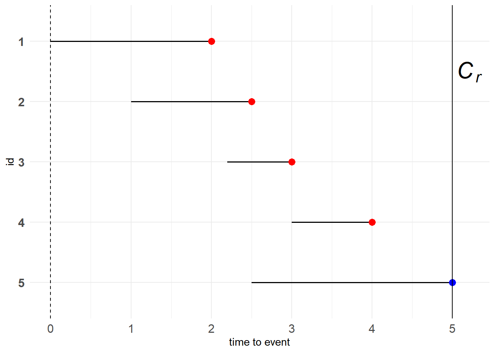

# 生存分析 {#survival}

生存分析方法研究一个感兴趣的事件发生的时间。该事件可以是死亡、离婚、戒烟、设备故障等等。因此，“生存”二字不应与狭义上的“死亡”绑定，应当将“生存”视作一种“持续”，“死亡”则对应“事件的发生”。

## 基本概念 {#survival_1}

在生存分析中，我们最关心的数据是从某个起始点开始到一个特定事件发生所经过的时间间隔，即**time to event**，也称“生存时间数据”。不妨令$X$表示观测对象真实的生存时间，令$T$表示观测到的并记录下来的生存时间。在实际研究中，由于多种因素的影响，我们不一定能够获取完整的生存时间数据，即$X \neq T$，因此有必要对数据类型进行区分，以便构建相应的模型。

### 删失数据 {#survival_1_1}

#### 右删失 {#survival_1_1_1}

1. Type I censoring

   人为预先设置右删失时间点$C_r$，则$T$的表达式为

   $$
   T = \begin{cases} 
   X, &\text{if } X \leq C_r \\
   C_r, &\text{if } X \gt C_r
   \end{cases}  (\#eq:survival-eq1)
   $$

   为方便记录，令$\delta=I\{X \leq C_r\}$，则数据对为$(T, \delta)$。

   <div class="figure" style="text-align: center">
   
   <p class="caption">(\#fig:survival-p1)Type I censoring</p>
   </div>
   
   图中<span style='color:red'>红点</span>代表目标事件在观察期内发生，<span style='color:blue'>蓝点</span>代表右删失数据。
   
   > 红、蓝点的含义下同
   
      
   **例子：**就像一个水桶，我们能观测到的水量肯定小于等于水桶的容量，倘若接的水比水桶的容量还要多，那么就会溢出来，我们也就观测不到了，只会留下一个印象——水满了。

2. Progressive Type I censoring

   Progressive Type I censoring相较Type I censoring，人为预先设置了多个右删失时间点，因次也称“逐步删失”。这种设置有个好处，就是能够控制成本。

   <div class="figure" style="text-align: center">
   
   <p class="caption">(\#fig:survival-p2)Progressive Type I censoring</p>
   </div>
   
   **例子：**假如你一开始招募了多个志愿者参与研究。让志愿者参与到研究当中是有成本的，而你的预算是有上限的。因此，当试验进行了一段时间后，你发现你的资金不足以支持你同时对多名志愿者进行观察，于是在某天），你决定让某些志愿者退出研究，仅留下部分志愿者继续观察。当然，其中有志愿者会自然地退出研究，因为他们的目标事件已经发生了。

3. Generalized Type I censoring

   此前的右删失数据都有相同的时间起点，而Generalized Type I censoring允许观测对象在不同时间点被纳入到研究当中，但具有统一的删失时间点。
   
   <div class="figure" style="text-align: center">
   
   <p class="caption">(\#fig:survival-p3)Generalized Type I censoring</p>
   </div>
   
   由于我们更加关心生存时间的长度，不在乎什么时候开始，因此图\@ref(fig:survival-p3)可变形为下图
   
   <div class="figure" style="text-align: center">
   
   <p class="caption">(\#fig:survival-p4)Generalized Type I censoring</p>
   </div>
   
   注意到该图仅用蓝点表示右删失数据点，而没有统一的竖线表示$C_r$。
   
   如果你还是想知道观测对象什么时候加入到研究中，图\@ref(fig:survival-p3)还可变形为下图
   
   <div class="figure" style="text-align: center">
   
   <p class="caption">(\#fig:survival-p5)Generalized Type I censoring</p>
   </div>
   
   纵坐标记录了观测对象参与到研究中的时长，即**time to event**；横坐标记录了观测对象什么时候加入到研究中；最右边的黑色实线表示研究预先设定的右删失时间点。显然，对于Generalized Type I censoring数据，右删失数据点必定落在右边的黑色实线上。
   
   
   **例子：**就像一个公司从创立到倒闭，考虑“职工辞职”这个目标事件，那么总会有人中途加入或中途离开。其中“公司创立”对应着研究开始，“公司倒闭”对应着删失时间点$C_r$。而**time to event**对应的就是该职工在公司工作的时长，也就是我们感兴趣的“资历”，而不在乎他什么时候加入到这个公司。
   
4. Type II censoring

   Type II相较Type I并没有直接设置右删失时间点，而是预先设置有$r$个观测对象发生目标事件，将剩余的尚未发生目标事件的观测对象都记为右删失数据。也就是说Type II censoring的右删失时间点与次序统计量$T_{(r)}$有关。这种设置能够有效地节约时间和控制成本。
   
   若共有5个观测对象，设置$r=3$，则如下图所示
   
   <div class="figure" style="text-align: center">
   
   <p class="caption">(\#fig:survival-p6)Type II censoring</p>
   </div>
   
   **例子：**就像在一场选拔性比赛中，看谁能最快任务。现在共有100位参赛者，需要筛选出3名种子选手。于是当季军产生时这个比赛就已经结束了。
   
5. Progressive Type II censoring

   Type II表示该类型数据需要预先设置参数$r$，Progressive表示需要预先设置多个$r$。考虑两次删失的情形，我们预先设置了$r_1$和$r_2$，当总共$n$个观测对象中有$r_1$个观测对象率先发生了目标事件，那么这$r_1$个观测对象的**time to event**将会被记录下来，同时出于对成本的考虑，我们还会将$n_1-r_1$个观测对象移除研究，继续观察剩余的$n-n_1$个观测对象，直到又有$r_2$个观测对象发生目标事件，此时则有$n-n_1-r_2$个观测对象被记录为右删失数据。也就是说，Progressive Type II censoring的删失时间点与次序统计量$T_{(r_1)}$、$T_{(n_1+r_2)}$有关。
   
   > 务必与Progressive Type I censoring联系起来
   
   对于10个观测对象，我们设置$r_1=r_2=2$，同时出于成本的考虑，在出现$r_1$个目标事件时主动去除2个观测对象，则剩下6个观测对象进入到第二轮中。如下所示
   
   <div class="figure" style="text-align: center">
   
   <p class="caption">(\#fig:survival-p7)Progressive Type II censoring</p>
   </div>
   
   **例子：**想不出了。

6. Random censoring

   出于某些原因，部分观测对象可能会观测不到，也就不知道其具体的生存时间，于是被记为右删失数据。
   
   可能的原因：
   
   - 观测对象失联，丢失了
   - 观察对象终止于其他事件
   - ...
   
   <div class="figure" style="text-align: center">
   
   <p class="caption">(\#fig:survival-p8)Random censoring</p>
   </div>
   
   **例子：**例如我们对“肺癌”感兴趣，但患者还患有其他疾病，可能因其他疾病而死亡，此时也算是右删失。
   
#### 左删失 {#survival_1_1_2}

对于左删失时间点$C_l$，则$T$的表达式为

$$
T = \begin{cases} 
C_l, &\text{if } X \lt C_l \\
X, &\text{if } X \geq C_l
\end{cases} (\#eq:survival-eq2)
$$

为方便记录，令$\varepsilon=I\{X\geq C_l\}$，则数据对为$(T,\varepsilon)$

**例子：**考虑疾病的发生，当一个人进医院进行体检时，若检测出患有某种疾病，则肯定是在体检之前就已经染上了疾病，但不知道是什么时候染上的，那么在医院体检的时间点就是左删失时间点$C_l$。

#### 双删失 {#survival_1_1_3}

根据右删失和左删失的概念，考虑研究中可能同时存在右删失数据和左删失数据，即双删失。

> 双删失更像是一种现象（右删失与左删失同时在某些研究中出现的现象），而不是数据类型

记数据对为$(T, \delta)$，其中$T=max(min(X, C_r), C_l)$。$\delta$定义为$\delta=I\{X \leq C_r\} - 2I\{X \lt C_l\}$，当$\delta=1$时，表示正常的生存时间，当$\delta=0$时，表示右删失数据，当$\delta=-1$时，表示左删失数据。

> 如果左删失的定义没错的话，感觉应该是$X \lt C_l$而不是$X \leq C_l$

**例子：**假如你问某人什么时候开始打的羽毛球，你可能得到的回答有：1.我20年11月13号开始打的；2.不记得了，至少大学前就开始打了；3.我还没打过。这三个回答分别对应正常的生存时间、左删失数据和右删失数据（还没打过说明目标事件尚未发生，以后可能会打，即为右删失）。

#### 区间删失 {#survival_1_1_4}

对于观测对象$i$，只记得$X$是落在区间$(L_i,R_i]$中，但不知道具体的时间点，此时即为“区间删失”。

区间删失是右删失、左删失的一般化。例如右删失可表示为$(C_r,+\infty)$，左删失可表示为$(0,C_l)$

> 这里貌似也涉及到左删失的定义问题，别再过分纠结区间的开闭问题了

**例子：**在测核酸的时候，第一次为阴性，第二次为阳性，说明是在第一次和第二次检测之间感染的。

### 截断数据 {#survival_1_2}

对于删失数据，虽然我们不知道具体的生存时间，但至少我们是接触到了观测对象，并且掌握了生存时间的部分信息（可能大于或小于某个值，或者在某个区间内）。**而对于截断数据，研究对象并没有进入到我们的观察窗口，更谈不上其携带的生存时间信息。**

设置一个观察窗口$(Y_L,Y_R)$，当$Y_R=+\infty$时，只有$X \gt Y_L$的研究对象才能被纳入到我们的研究中；当$Y_L=0$时，只有$X \leq Y_R$的研究对象才能被纳入到我们的研究中。也就是说，进入到我们的研究中是需要门槛的、有条件的，而且这种条件往往与系统性原因有关（例如研究设计）。

**例子1：**如果要研究老人的预期寿命，并在退休中心开展调查。该研究忽略了那些年龄未到退休中心准入门槛的老人，但这些老人也应该属于本研究的范畴之中。这属于**左截断数据**。

**例子2：**利用天文望远镜观测天体。100年前观测到的天体数量和如今能观测到的天体数量绝对是不一样的。只是以前设备落后，精度有限，观测不到那么多的天体。因此这属于**右截断数据**。

### 函数 {#survival_1_3}

1. 生存函数

   记$X$为代表生存时间的随机变量，则其密度函数$f(x)$为
   
   $$
   f(x)=\lim_{\Delta x \rightarrow 0} \frac{P(x \leq X \leq x+\Delta x)}{\Delta x} (\#eq:survival-eq3)
   $$
   
   记其累积分布函数为
   
   $$
   F(x)=P(X \leq x) (\#eq:survival-eq4)
   $$
   
   定义**生存函数**为
   
   $$
   S(x)=P(X \gt x)=1-F(x)=\int_x^\infty f(t)dt (\#eq:survival-eq5)
   $$
   
   > $T \gt t$具有“生存”的意味
   
   则
   
   $$
   f(x)=-\frac{dS(x)}{dx} (\#eq:survival-eq6)
   $$
   
   当$X$是离散随机变量时，记$P(X=x_j)=p(x_j),j=1,2,\dots$。此时的生存函数为
   
   $$
   S(x)=P(X \gt x)=\sum_{x_j \gt x}p(x_j) (\#eq:survival-eq7)
   $$
   
2. 风险函数

   $$
   \begin{aligned}
   b(x)&=\lim_{\Delta x \rightarrow 0}\frac{P(x \leq X \leq x+\Delta x \mid X \geq x)}{\Delta x} \\
   &= \lim_{\Delta x \rightarrow 0}\frac{F(x+\Delta x)-F(x)}{(1-F(x))\Delta x} \\
   &= \frac{f(x)}{S(x)} \\
   &= \frac{d}{dx}(-\ln S(x))
   \end{aligned} (\#eq:survival-eq8)
   $$
   
   > 这种导函数与原函数在分子分母的情况可以考虑为对数函数求导
   
   由定义可知，风险函数代表了目标事件的即时发生率。
   
   根据风险函数可得累积风险函数
   
   $$
   H(x)=\int_0^x b(u)du=-\ln S(x)  (\#eq:survival-eq9)
   $$
   
   则
   
   $$
   S(x)=\exp\{-H(x)\}=\exp\{-\int_0^x b(u)du\} (\#eq:survival-eq10)
   $$
   
   当$X$是离散随机变量时，则
   
   $$
   b(x_j)=P(x_j \leq X \lt x_{j+1}|X \geq x_j)=\frac{p(x_j)}{S(x_{j-1})},\quad j=1,2,\dots (\#eq:survival-eq11)
   $$
   
   注意$S(x)=P(X \gt x)$、$S(x_0)=1$、$p(x_j)=S(x_{j-1})-S(x_j)$，则
   
   $$
   b(x_j)=1-\frac{S(x_j)}{S(x_{j-1})} (\#eq:survival-eq12)
   $$
   
   则
   
   $$
   \begin{aligned}
   S(x)&=\prod_{x_j \leq x} \frac{S(x_j)}{S(x_{j-1})} \\
   &=\prod_{x_j \leq x}(1-(1-\frac{S(x_j)}{S(x_{j-1})})) \\
   &=\prod_{x_j \leq x}(1-b(x_j))
   \end{aligned} (\#eq:survival-eq13)
   $$
   
3. 平均剩余寿命

$$
\begin{aligned}
mrl(x)=E(X-x|X \gt x)&=\int_x^\infty(t-x)f(t|X \gt x)dt \\ &=\int_x^\infty\frac{(t-x)f(t)}{S(x)}dt \\
&=\frac{\int_x^\infty(x-t)dS(t)}{S(x)} \\
&=\frac{S(t)(x-t)|^\infty_x+\int_x^\infty S(t)dt}{S(x)} \\
&=\frac{\int_x^\infty S(t)dt}{S(x)}
\end{aligned} (\#eq:survival-eq14)
$$

> 注意$dS(x)=-f(x)dx$

### 似然函数 {#survival_1_4}

对于完整的生存时间，其密度函数为$f(x)$。而对于删失数据和截断数据，则有另外的表达。

$$
\begin{aligned}
Right-censored &: S(C_r) \\
Left-censored &: 1-S(C_l) \\
Interval-censored &: S(L)-S(R) \\
Left-truncated &: f(x)/S(Y_L) \\
Right-truncated &: f(x)/(1-S(Y_R)) \\
Interval-truncated &: f(x)/(S(Y_L)-S(Y_R))
\end{aligned} (\#eq:survival-eq15)
$$

> 注意$f/S$的形式是条件概率的含义

以删失数据为例，似然函数可以表示为

$$
L \propto \prod_{i \in D}f(x_i)\prod_{i \in R}S(C_r)\prod_{i \in L}(1-S(C_l))\prod_{i \in I}[S(L_i)-S(R_i)] (\#eq:survival-eq16)
$$

其中$D$、$R$、$L$、$I$都是对应的数据类型集合。

根据数据类型写出对应的元素即可。下面举个例子。

假设$X_i \stackrel{i.i.d}{\sim} Exp(\lambda)$，观测数据为$(T_i,\delta_i)$，其中$\delta_i=I(T_i \leq C_i)$表示是否为右删失数据。则似然函数为

$$
L(\lambda)=\prod_{i=1}^n \{\lambda \exp(-\lambda T_i)\}^{\delta_i}\{\exp (-\lambda T_i)\}^{(1-\delta_i)} (\#eq:survival-eq17)
$$

可得极大似然估计为

$$
\hat \lambda=\frac{\sum_{i=1}^n \delta_i}{\sum_{i=1}^nX_i} (\#eq:survival-eq18)
$$

## 参数估计 {#survival_2}

这里主要对右删失数据进行讨论，以此来对第[6.1.3](#survival_1_3)节中的函数进行估计。因此，数据结构为$(T,\delta)$，并假设各个对象的删失时间与其**time to event**无关。

假如有$n$个观测样本，并且允许重复数据(ties)的出现，那么有$D$个不同的**time to event**$t_1 \lt t_2 \lt \cdots \lt t_D$。在$t_i$上有$d_i$个$\delta=1$的个体，并且此时还有$Y_i=\sum_{j=1}^nI(X_j \geq t_i)=|R_i|$个个体存在，则此时的风险函数可估计为$b_i(x)=d_i/Y_i$。

> $R_i$表示$t_i$时刻的风险集合，即在时刻$t_i$时刻还存活的个体

例子如下所示


<table class="kable_wrapper">
<tbody>
  <tr>
   <td> 

Table: (\#tab:survival-t1)原始数据

| subject | time | delta |
|:-------:|:----:|:-----:|
|    a    |  2   |   1   |
|    b    |  5   |   0   |
|    c    |  3   |   0   |
|    d    |  4   |   1   |
|    e    |  2   |   1   |
|    f    |  3   |   1   |

 </td>
   <td> 

Table: (\#tab:survival-t1)排序后的数据

| subject | time | delta |
|:-------:|:----:|:-----:|
|    a    |  2   |   1   |
|    e    |  2   |   1   |
|    c    |  3   |   0   |
|    f    |  3   |   1   |
|    d    |  4   |   1   |
|    b    |  5   |   0   |

 </td>
  </tr>
</tbody>
</table>

- $t_1=2;\; d_1=2; \; R(t_1)=\{a,e,f,c,d,b\}; \; Y_1=6$

- $t_2=3;\; d_2=1; \; R(t_2)=\{f,c,d,b\}; \; Y_2=4$

- $t_3=4;\; d_3=1; \; R(t_3)=\{d,b\}; \; Y_3=2$

### KM估计 {#survival_2_1}

Kaplan和Meier提出了KM估计，也称Product-Limit estimator。

根据式\@ref(eq:survival-eq13)，KM估计给出了生存函数的估计

$$
\hat S(t)=\begin{cases}
1, & \textrm{if} \; t \lt t_1 \\
\prod_{t_i \leq t}[1-\frac{d_i}{y_i}], & \textrm{if} \; t_1 \leq t
\end{cases} (\#eq:survival-eq19)
$$

注意到，当最大的观测值是完整生存时间时，$\hat S(t)=0$；当最大的观测值是右删失时，$\hat S(t)$则为一个常数，此时就很难定义取值大于该点时对应的生存函数。

对此，当$t \gt t_{max}$时，有如下三种备选方法：

- $\hat S(t)=0$

- $\hat S(t)=\hat S(t_{max})$

- $\hat S(t)=\exp\{\frac{t\ln[\hat S(t_{max})]}{t_{max}}\}$

> 第三种方法对应的生存函数是衰减的并趋于零

$\hat S(t)$的方差估计为

$$
\hat{V}[\hat S(t)]=\{\hat S(t)\}^2 \sum_{t_i \leq t} \frac{d_i}{Y_i(Y_i-d_i)} (\#eq:survival-eq20)
$$

> 可以直接记

考虑式\@ref(eq:survival-eq9)，有

$$
\hat H(t)=-\ln [\hat S(t)] (\#eq:survival-eq21)
$$

-----

在计算$\hat V[\hat H(t)]$前介绍$\delta$方法：

已知:$\hat \beta - \beta_0 \stackrel{d}{\rightarrow} N(0, V(\hat \beta))$，若$f(x)$是连续的且一阶导不为0，求$f(\hat \beta)-f(\beta_0)$的渐近分布。

首先对$f(\hat \beta)$进行一阶泰勒展开

$$
\begin{aligned}
f(\hat \beta) &\approx f(\beta_0)+f'(\beta_0)(\hat \beta-\beta_0) \\
f(\hat \beta)-f(\beta_0) & \approx f'(\beta_0)(\hat \beta-\beta_0)
\end{aligned}
(\#eq:survival-eq22)
$$

则

$$
\begin{aligned}
V(f(\hat \beta)-f(\beta_0))&\approx V(f'(\beta_0)(\hat \beta-\beta_0)) \\
&\approx \{f'(\beta_0)\}^2V(\hat \beta)
\end{aligned} (\#eq:survival-eq23)
$$

故

$$
f(\hat \beta)-f(\beta_0) \stackrel{d}{\rightarrow} N(0, \{f'(\beta_0)\}^2V(\hat \beta)) (\#eq:survival-eq24)
$$

-----

则

$$
\hat V(\hat H(t))=\frac{1}{\{\hat S(t)\}^2}\hat{V}[\hat S(t)]= \sum_{t_i \leq t} \frac{d_i}{Y_i(Y_i-d_i)} (\#eq:survival-eq25)
$$

### NA估计 {#survival_2_2}

NA估计由Nelson和Aalen提出，该方法首先给出了累积风险函数的估计

$$
\tilde H(t)=\begin{cases}
0, & \textrm{if} \; t \lt t_1 \\
\sum_{t_i \leq t} \frac{d_i}{Y_i}, &\textrm{if} \; t_1 \leq t 
\end{cases} (\#eq:survival-eq26)
$$

> $\hat b(t_i)=d_i/Y_i$

给出该估计量的方差

$$
\tilde V(\tilde H(t))=\sum_{t_i \leq t} \frac{d_i}{Y_i^2} (\#eq:survival-eq27)
$$

根据式\@ref(eq:survival-eq10)，有

$$
\tilde S(t)=\exp[- \tilde H(t)] (\#eq:survival-eq28)
$$

由$\delta$方法可知

$$
\tilde V(\tilde S(t))=\{-\exp[-\tilde H(t)]\}^2 \tilde V(\tilde H(t))=\{\tilde S(t)\}^2\sum_{t_i \leq t}\frac{d_i}{Y_i^2} (\#eq:survival-eq29)
$$

## 置信区间与置信带 {#survival_3}

在这一节，根据KM估计来构建置信区间和置信带。

### 置信区间 {#survival_3_1}

#### Linear CI {#survival_3_1_1}

记

$$
\sigma^2_S(t)=\frac{\hat V[\hat S(t)]}{\hat S^2(t)} (\#eq:survival-eq30)
$$

则

$$
\hat V[\hat S(t)]=\hat S(t)^2\sigma^2_S(t) (\#eq:survival-eq31)
$$

则可得KM估计的渐近正态分布为

$$
\frac{\hat S(t)-S(t)}{\sqrt{\hat V[\hat S(t)]}} \sim N(0,1) (\#eq:survival-eq32)
$$

易得$S(t)$在$t_0$时刻的$1-\alpha$置信区间为

$$
\hat S(t_0) \mp Z_{1-\alpha/2}\sigma_S(t_0)\hat S(t_0) (\#eq:survival-eq33)
$$

> 该区间是对称区间

#### Log-Transformed CI {#survival_3_1_2}

考虑累积风险函数的对数形式$\ln [-\ln \hat S(t_0)]$，根据$\delta$方法，可得其渐近分布为

$$
\ln [-\ln \hat S(t)]-\ln [-\ln S(t)] \sim N(0,\frac{\sigma_S^2(t)}{\ln^2 \hat S(t)}) (\#eq:survival-eq34)
$$

故$t_0$时刻的置信区间为

$$
\ln [-\ln\hat S(t_0)] \mp Z_{1-\alpha/2}(-\sigma_S(t_0)/\ln \hat S(t_0)) (\#eq:survival-eq35)
$$

> $\ln \hat S(t_0) \lt 0$

由于我们关注$S(t_0)$的置信区间，则需要对该置信区间进行转化，转化后的置信区间为

$$
\begin{array}{c}
\ln [-\ln \hat S(t_0)]-Z(-\frac{\sigma_S(t_0)}{\ln \hat S(t_0)}) \leq \ln [-\ln S(t_0)] \leq \ln [-\ln \hat S(t_0)]+Z(-\frac{\sigma_S(t_0)}{\ln \hat S(t_0)}) \\
-\ln \hat S(t_0) \cdot \exp\{\frac{Z\sigma_S(t_0)}{\ln \hat S(t_0)}\} \leq -\ln S(t_0) \leq -\ln \hat S(t_0) \cdot \exp\{-\frac{Z\sigma_S(t_0)}{\ln \hat S(t_0)}\} \\
-\ln \hat S(t_0) \cdot \theta \leq -\ln S(t_0) \leq -\ln \hat S(t_0) \cdot \theta^{-1} \\
\ln \hat S(t_0)^\theta \geq \ln S(t_0) \geq \ln \hat S(t_0)^{\theta^{-1}} \\
\hat S(t_0)^{\theta^{-1}} \leq S(t_0) \leq \hat S(t_0)^\theta
\end{array} (\#eq:survival-eq36)
$$

其中$\theta=\exp\{\frac{Z\sigma_S(t_0)}{\ln \hat S(t_0)}\}$。

#### Arcsine-Square Root Transformed CI {#survival_3_1_3}

考虑$\arcsin\{\hat S^{\frac{1}{2}}(x)\}$，则其渐近分布为

$$
\arcsin\{\hat S^{\frac{1}{2}}(t)\}-\arcsin\{S^{\frac{1}{2}}(t)\} \sim N(0,\frac{\sigma^2_S(t)\hat S(t)}{4(1-\hat S(t))}) (\#eq:survival-eq37)
$$

同样也可将置信区间进行转化

$$
\begin{array}{c}
L \leq \arcsin\{S^{\frac{1}{2}}(t_0)\} \leq R \\
\sin \{\max [0,L]\} \leq S^{\frac{1}{2}}(t_0) \leq \sin \{\min [\frac{\pi}{2},R]\} \\
\sin^2 \{\max [0,L]\} \leq S(t_0) \leq \sin^2 \{\min [\frac{\pi}{2},R]\}
\end{array} (\#eq:survival-eq38)
$$

> 注意$\arcsin x$的定义域与值域

其中

$$
\begin{array}{c}
L=\arcsin\{\hat S^{\frac{1}{2}}(t_0)\}-\frac{Z\sigma_S(t_0)}{2}\sqrt \frac{\hat S(t_0)}{1-\hat S(t_0)} \\
R=\arcsin\{\hat S^{\frac{1}{2}}(t_0)\}+\frac{Z\sigma_S(t_0)}{2}\sqrt \frac{\hat S(t_0)}{1-\hat S(t_0)}
\end{array} (\#eq:survival-eq39)
$$

### 置信带 {#survival_3_2}

置信区间给出了$t$在某点处的一个$1-\alpha$区间。而置信带则给出了$t$在某个区间内的一个$1-\alpha$区间，即$1-\alpha=P(L(t)\leq S(t) \leq U(t)), \; \forall t \in (t_L, t_U)$，则称区间$[L(t),U(t)]$为置信带。

由于置信带需要查表才能得到，故不多做介绍，仅了解即可。

### 平均生存时间的置信区间 {#survival_3_3}

平均生存时间定义为

$$
\mu = E(x)=\int_0^\infty tf(t)dt=\int_0^\infty S(t)dt (\#eq:survival-eq40)
$$

> 利用分部积分即可转化为$S(t)$

故区间$[0, \tau]$上的平均生存时间估计为

$$
\hat \mu_\tau=\int_0^\tau \hat S(t)dt (\#eq:survival-eq41)
$$

其中$\tau$是$t_{max}$或最大的删失值。

而$\hat \mu_\tau$的方差为

$$
\hat V(\hat \mu_\tau)=\sum_{i=1}^D \{[\int_{t_i}^\tau \hat S(t)dt]^2\frac{d_i}{Y_i(Y_i-d_i)}\} (\#eq:survival-eq42)
$$

相应的置信区间为

$$
[\hat \mu_\tau-Z_{1-\alpha/2}\sqrt{\hat V(\hat \mu_\tau)},\hat \mu_\tau+Z_{1-\alpha/2}\sqrt{\hat V(\hat \mu_\tau)}] (\#eq:survival-eq43)
$$

### 分位数的置信区间 {#survival_3_4}

生存函数的分位数定义为$x_p = \inf\{t:S(t) \leq 1-p \}$，则$x_p$的km估计为$\hat x_p=\inf\{t:\hat S(t) \leq 1-p \}$。

进一步的，Brookmeyer和Crowley给出了分位数置信区间的三种形式。

$$
\begin{array}{c}
-Z_{1-\alpha/2} \leq \frac{\hat S(t)-(1-p)}{\hat V^{1/2}[\hat S(t)]} \leq Z_{1-\alpha/2} \\
-Z_{1-\alpha/2} \leq \frac{\{\ln [-\ln (\hat S(t))]-\ln [-\ln(1-p)]\}\hat S(t)\ln (\hat S(t))}{\hat V^{1/2}[\hat S(t)]} \leq Z_{1-\alpha/2} \\
-Z_{1-\alpha/2} \leq \frac{2[arcsin(\hat S^{\frac{1}{2}}(t))-arcsin(1-p)^{\frac{1}{2}}][\hat S(t)(1-\hat S(t))]^{1/2}}{\hat V^{1/2}[\hat S(t)]} \leq Z_{1-\alpha/2}
\end{array} (\#eq:survival-eq44)
$$

### 左截断数据的置信区间 {#survival_3_5}

不妨先举个例子


在这个例子中，A、B都是在一开始就进入到研究中的，而C是中途加进来的。也就是说，我们一开始是观测不到C的。因此在原有的计算规则下，我们有如下结果

- $t_1=2;\; d_1=1; \; R(t_1)=\{A,B\}; \; Y_1=2; \; \hat S(t_1)=1/2$
- $t_2=3;\; d_2=1; \; R(t_2)=\{B\}; \; Y_2=1; \; \hat S(t_2)=0$
- $t_3=6;\; d_3=1; \; R(t_3)=\{C\}; \; Y_3=1; \; \hat S(t_3)=0$

明明C能够生存到$t_2$之后，只是之前没有观测到，但生存函数的估计却在$t_2$时刻估计为0，存在一些问题。

鉴于此，我们需要拓展$Y_i$的定义：**在$t_i$时刻前进入到研究中并在$t_i$时刻仍存活的个体，或者在$t_i$时刻之后进入到研究中并且其生存时长大于等于$t_i$的个体都会被计入。**

- $t_1=2;\; d_1=1; \; R(t_1)=\{A,B,C\}; \; Y_1=3; \; \hat S(t_1)=2/3$
- $t_2=3;\; d_2=1; \; R(t_2)=\{B,C\}; \; Y_2=2; \; \hat S(t_2)=1/3$
- $t_3=6;\; d_3=1; \; R(t_3)=\{C\}; \; Y_3=1; \; \hat S(t_3)=0$

这样，对于生存函数的估计我们就得考虑条件概率，即$P(X \gt t |X \geq L)=S(t)/S(L)$。当然，当对象一开始就纳入到研究中，那么$L=0$，按以前的操作来就行。这里只是将研究工具拓展到左截断数据。

$$
\hat S_L(t)=S(t)/S(L)=\prod_{L \leq t_i \leq t}[1-\frac{d_i}{Y_i}] (\#eq:survival-eq45)
$$

左截断数据需要对改变生存函数的估计，其他构造置信区间的操作同正常情况。

## 假设检验 {#survival_4}

### 单样本检验 {#survival_4_1}

在时间段$0 < t\leq \tau$内，考虑如下假设检验

$$
\begin{aligned}
&H_0: b(t)=b_0(t) \quad \textrm{for all} \; t \\
&H_1: b(t) \neq b_0(t) \quad \textrm{for some} \; t
\end{aligned}
$$

> $\tau$为最大的非右删失生存时间

一个自然的想法就是看看$b(t)$与$b_0(t)$之间的差距大不大，如果较大的话就说明应当拒绝原假设。于是给出下面的检验统计量

$$
\begin{aligned}
Z(\tau)&=O(\tau)-E(\tau) \\
&=\sum_{i=1}^D W(t_i)\frac{d_i}{Y(t_i)}-\int_0^\tau W(t)b_0(t)dt
\end{aligned} (\#eq:survival-eq46)
$$

其中$O(\tau)$为观测到的加权累积风险函数，$E(\tau)$为原假设下的加权累积风险函数，$W(t)$为权重函数。特别地，当$Y(t)=0$时$W(t)=0$。

在原假设下，$Z(\tau)$的方差为

$$
V[Z(\tau)]=\int_0^\tau W^2(t)\frac{b_0(t)}{Y(t)}dt (\#eq:survival-eq47)
$$

**在大样本下，当$H_0$为真时，统计量$\frac{Z(\tau)^2}{V[Z(\tau)]}$服从卡方分布。**

统计量$\frac{Z(\tau)}{V[Z(\tau)]^{1/2}}$被用于进行$b(t)>b_0(t)$的单侧检验。当原假设为真且样本量较大时，该统计量就服从标准正态分布。

> 为什么只能右侧？

- Log-Rank Test

   **设置权重函数为$W(t)=Y(t)$**。不失一般性，考虑可能存在的[左截断数据](#survival_3_5)，记$T_j$为第$j$个对象在研究中发生目标事件时的时间，$L_j$为第$j$个对象进入到研究时的时间。

   那么$O(\tau)=\sum_{i=1}^D d_i$表示在$\tau$时刻及之前观测到的事件总数，并且有

$$
\begin{aligned}
E(\tau) &= \int_0^\tau W(t)b_0(t)dt \\
&= \int_0^\tau Y(t)b_0(t)dt \\
&= \int_0^\tau \sum_{j=1}^n I(X_j \geq t)b_0(t)dt \\
&= \sum_{j=1}^n \int_{L_j}^{T_j} b_0(t)dt \\
&= \sum_{j=1}^n [H_0(T_j)-H_0(L_j)]
\end{aligned} (\#eq:survival-eq48)
$$

   > 对于第$j$个对象，他不一定存活到$\tau$时刻，在$T_j$到$\tau$的时间段里是不存在该对象的，因此直接取$T_j$。若不是左截断数据，则$L_j$=0。

   同理可得

$$
V[Z(\tau)]=\int_0^\tau W^2(t)\frac{b_0(t)}{Y(t)}dt=\int_0^\tau W(t)b_0(t)dt=E(\tau) (\#eq:survival-eq49)
$$

- Fleming-Harrington Test

   Harrington和Fleming提出了如下权重函数族

$$
W_{HF}(t)=Y(t)S_0(t)^p [1-S_0(t)]^q, \;\; p \geq 0 \;\; \textrm{and} \;\; q \geq 0 (\#eq:survival-eq50)
$$

   其中$S_0(t)=\exp[-H_0(t)]$是原假设下的生存函数。注意到生存函数是一个递减的函数，因此当$p>q$时会给予前面的数据较大的权重，当$p<q$时会给予后面的数据较大的权重，当$p=q\neq0$时前后一视同仁，当$p=q=0$时就是log-rank权重。

   > 权重函数就是一个调节器，可根据实际需要来放大或缩小对应时间段的差异。

### 多样本检验 {#survival_4_2}

对于$K(K \geq 2)$个组别，给出如下假设

$$
H_0: b_1(t)=b_2(t)=\cdots=b_K(t)=b(t), \quad \textrm{for all } t \leq \tau \\
H_1: \textrm{at least one of the } b_j(t) \textrm{ is different for some } t \leq \tau 
$$

> 这里的$\tau$是各个组别中最大生存时间的最小值，即$\tau = \min\{\tau_1, \tau_2, \cdots, \tau_K\}$

数据处理流程：

1. 混合多组样本，得到$t_1 \lt t_2 \lt \cdots \lt t_D$

2. 记录第$j$组样本中各个时点的事件发生数，得到$d_{1j},\, d_{2j} \cdots, \, d_{Dj}$

3. 记录第$j$组样本中各个时点处于风险集的人数，得到$Y_{1j},\, Y_{2j} \cdots, \, Y_{Dj}$

4. 记录混合样本中各个时点的事件发生数，即$d_i=\sum_{j=1}^K d_{ij}$

5. 记录混合样本中各个时点处于风险集的人数，即$Y_i=\sum_{j=1}^K Y_{ij}$

据此得到如下检验统计量

$$
Z_j(\tau)=\sum_{i=1}^D W_j(t_i)(\frac{d_{ij}}{Y_{ij}}-\frac{d_i}{Y_i}), \quad j=1, \cdots, K (\#eq:survival-eq51)
$$

这个统计量度量了第$j$组样本的风险率和总体风险率之间的差距。如果原假设为真的话，那么对于每一组样本而言这个差距应该会很小。同样，当$Y_{ij}=0$时有$W_j(t_i)=0$。

一般，权重函数被设置为$W_j(t_i)=Y_{ij}W(t_i)$，则

$$
Z_j(\tau)=\sum_{i=1}^D W(t_i)[d_{ij}-Y_{ij}(\frac{d_i}{Y_i})], \quad j=1, \cdots, K (\#eq:survival-eq52)
$$

> $W_j(t_i)$中的$j$意味着每组有不同的权重函数；$W_j(t_i)=Y_{ij}W(t_i)$则假设各个组的权重函数有公共的部分，即$W(t_i)$，不同之处在于$Y_{ij}$

可得$Z_j(\tau)$的方差为

$$
\hat \sigma_{jj}=\sum_{i=1}^D W(t_i)^2 \frac{Y_{ij}}{Y_i}(1-\frac{Y_{ij}}{Y_i})(\frac{Y_i-d_i}{Y_i-1})d_i, \; j=1, \cdots, K (\#eq:survival-eq53)
$$

$Z_j(\tau)$与$Z_g(\tau)$的协方差为

$$
\hat \sigma_{jg} = -\sum_{i=1}^D W(t_i)^2 \frac{Y_{ij}}{Y_i}\frac{Y_{ig}}{Y_i}(1-\frac{Y_{ij}}{Y_i})(\frac{Y_i-d_i}{Y_i-1})d_i, \; g\neq j (\#eq:survival-eq54)
$$

> 注意到不同组的统计量$Z(\tau)$之间不独立，因为都用到了$d_i$和$Y_i$，而$d_i$和$Y_i$又集合了不同组的信息

因此在原假设下有

$$
\begin{pmatrix}
Z_1(\tau) \\
\vdots \\
Z_K(\tau)
\end{pmatrix} \stackrel{d}\longrightarrow N(0, \Sigma) (\#eq:survival-eq55)
$$

于是我们可以对其进行标准化处理，并求其平方和，根据卡方分布进行检验。但需注意到

$$
\begin{aligned}
\sum_{j=1}^K Z_j(\tau)&=\sum_{j=1}^K\sum_{i=1}^D W(t_i)(d_{ij}-\frac{d_iY_{ij}}{Y_i}) \\
&=\sum_{i=1}^D W(t_i)\sum_{j=1}^K(d_{ij}-\frac{d_iY_{ij}}{Y_i}) \\
&= \sum_{i=1}^D W(t_i)(d_i-d_i) \\
&= 0
\end{aligned} (\#eq:survival-eq56)
$$

因此$\Sigma$是不满秩的，于是我们仅需其中$K-1$个统计量。方便起见，取其前$K-1$个统计量来构造卡方分布，则

$$
\begin{pmatrix} Z_1(\tau),\cdots,Z_{K-1}(\tau) \end{pmatrix} \Sigma_{(-K)}^{-1}\begin{pmatrix} Z_1(\tau) \\ \vdots \\ Z_{K-1}(\tau)\end{pmatrix} \sim \chi^2(K-1) (\#eq:survival-eq57)
$$

其中$\Sigma_{(-K)}^{-1}$表示去掉第$K$个统计量后的协方差阵。

> 例如当$K=2$时，就可以直接选择其中一个$Z(\tau)$根据标准正态分布进行假设检验

- Log-Rank Test

   当$W(t)=1$时，即为log-rank test。当K个不同群体的风险率彼此成比例时，该方法具有最佳的检测能力。

- Gehan's Test (Wilcoxon-Breslow-Gehan Test)

   设置权重函数为$W(t_i)=Y_i$。不难发现，当时间越早，$Y_i$越大，对应的权重越大，也就是说该权重函数会对靠前时间段的差异会更为敏感。

> 需要关注目标事件发生的时间及删失时间的分布情况，但不同组的删失状况不同时，可能会导致错误的结果

- Tarone-Ware test

   设置权重函数为$W(t_i)=Y_i^{\frac{1}{2}}$。和Gehan's test类似的效果，都会给靠前时间段的差异较大的权重。
   
- Peto-Peto test

设置权重函数为$W(t_i)=\tilde S(t_i)$，其中$\tilde S(t)=\prod_\limits{t_i \leq t}(1-\frac{d_i}{Y_i+1})$。由于$\tilde S(t)$类似混合后的KM估计生存函数，因此这个权重函数是递减的，会给前面时间段较大的权重。

- Modified Peto-Peto test

   设置权重函数为$W(t_i)=\frac{\tilde S(t_i)Y_i}{Y_i+1}$。
   
- Fleming-Harrington test

   权重函数为$W_{p,q}(t_i)=\hat S(t_{i-1})^p[1-\hat S(t_{i-1})]^q$，其中$p , q \geq 0$，$\hat S(t)$是混合样本的KM估计生存函数。
   
   当$p=q=0$时，即为Log-Rank Test。
   
   当$p=1, \;q=0$时，即为Mann-Whitney-Wilcoxon Test。
   
   当$q=0, \;p>0$时，会给前面时间段较大的权重。
   
   当$p=0, \;q>0$时，会给后面时间段较大的权重。
   
> 最核心的问题还是权重函数的选择。一般采用Log-Rank Test或Gehan's Test。但还是得根据实际需要来选择。

### 趋势性检验 {#survival_4_3}

若想要检验各个组别的风险函数是否存在某种趋势，给出如下假设

$$
H_0: b_1(t)=b_2(t)=\cdots=b_K(t)=b(t), \quad \textrm{for } t \leq \tau \\
H_A:b_1(t)\leq b_2(t) \leq \cdots \leq b_K(t), \quad \textrm{for } t \leq \tau
$$

还是考虑式\@ref(eq:survival-eq52)的检验统计量

$$
Z_j(\tau)=\sum_{i=1}^D W(t_i)[d_{ij}-Y_{ij}(\frac{d_i}{Y_i})], \quad j=1, \cdots, K
$$

> 前面定义的方差、协方差、权重函数都是适用的

若备择假设成立，较小的风险函数对应的$Z(\tau)$统计量会更容易为负，因为和混合样本得到的$\frac{d_i}{Y_i}$相比，$\frac{d_{ij}}{Y_{ij}}$会更小。同理，对于较大的风险函数对应的$Z(\tau)$统计量会更容易为正。

现引入一个scores序列$a_1 < a_2 < \cdots < a_K$，一般取$a_j=j$。构造如下检验统计量

$$
Z=\frac{\sum_{j=1}^K a_j Z_j(\tau)}{\sqrt{\sum_{j=1}^K \sum_{g=1}^K a_ja_g \hat \sigma_{jg}}}  (\#eq:survival-eq58)
$$

> 分母的存在主要是为了让他为标准正态分布。关键是分子，$a_j$的作用相当于一个递增的放大器

当原假设为真时，在大样本下检验统计量$Z$服从标准正态分布。若$Z> Z_{1-\alpha}$，则拒绝原假设。正如前面说的，风险函数较小的$Z(\tau)$容易为负，风险函数较大的$Z(\tau)$容易为正，再加上递增序列$a$的放大作用，为正的部分放大的倍数要比为负的部分大，因此检验统计量$Z$总体表现为较大的正值，因此是右侧检验。

> 趋势性检验仅在已知备择假设具体大小顺序的时候才能适用

### 分层检验 {#survival_4_4}

考虑“辛普森悖论”的影响，有时需要根据分层变量来对样本先进行分层，再进行假设检验。

假设样本可根据某分层变量分成M个水平，给出如下假设

$$
H_0: b_{1s}(t)=b_{2s}(t)=\cdots=b_{Ks}(t), \; \textrm{for } s=1, \cdots, M, \; t < \tau \\
H_A: \textrm{at least one of the } h_{js}(t) \textrm{ is different for some } s \textrm{ and } t < τ
$$

于是每一层的检验统计量、方差、协方差分别为

$$
Z_{js}(\tau)=\sum_{i=1}^D W(t_i)[d_{ijs}-Y_{ijs}(\frac{d_{is}}{Y_{is}})] (\#eq:survival-eq59)
$$

$$
\hat \sigma_{jjs}=\sum_{i=1}^D W(t_i)^2 \frac{Y_{ijs}}{Y_{is}}(1-\frac{Y_{ijs}}{Y_{is}})(\frac{Y_{is}-d_{is}}{Y_{is}-1})d_{is}, \; j=1, \cdots, K (\#eq:survival-eq60)
$$

$$
\hat \sigma_{jgs}=-\sum_{i=1}^D W(t_i)^2 \frac{Y_{ijs}}{Y_{is}}\frac{Y_{igs}}{Y_{is}}(\frac{Y_{is}-d_{is}}{Y_{is}-1})d_{is}, \; j \neq g (\#eq:survival-eq61)
$$

据此得到总的检验统计量、方差和协方差

$$
Z_{j \cdot}(\tau) = \sum_{s=1}^M Z_{js}(\tau) (\#eq:survival-eq62)
$$

$$
\hat \sigma_{jj \cdot}=\sum_{s=1}^M \hat \sigma_{jjs} (\#eq:survival-eq63)
$$

$$
\hat \sigma_{jg \cdot} = \sum_{s=1}^M \hat \sigma_{jgs} (\#eq:survival-eq64)
$$

同理构造卡方统计量进行检验

$$
\begin{pmatrix} Z_{1\cdot}(\tau), \cdots, Z_{K-1 \cdot}(\tau) \end{pmatrix} \Sigma_{\cdot}^{-1} \begin{pmatrix} Z_{1\cdot}(\tau) \\ \vdots \\ Z_{K-1 \cdot}(\tau) \end{pmatrix} \sim \chi^2(K-1) (\#eq:survival-eq65)
$$

> 在原假设为真且为大样本的条件下

## Cox比例风险模型 {#survival_5}

对于数据$X_i=(X_{i1},\dots, X_{ip})^T$，风险函数被定义为

$$
h_i(t)=h_0(t)\exp\{x_{i1}\beta_1+\dots+x_{ip}\beta_p\}=h_0(t)e^{X_i^T\beta} (\#eq:survival-eq66)
$$

其中$h_0(t)$被称为基线风险函数。

> 截距项被归到$h_0(t)$里了

考虑$h_i(t|x)=h_0(t)e^{x_{i1}\beta_1}$，称

$$
\frac{h_i(t|x+1)}{h_i(t|x)}=\frac{h_0(t)e^{x_{i1}\beta_1}e^{\beta_1}}{h_0(t)e^{x_{i1}\beta_1}}=e^{\beta_1} (\#eq:survival-eq67)
$$
这样的关系为“比例”关系。

### 偏对数似然函数 {#survival_5_1}

现有数据$(T_i,\delta_i, Z_i)$，其中$T_i$表示记录的生存时间，$\delta_i$表示删失状态（1为非删失，0为删失），$Z_i$表示协变量。

回顾式\@ref(eq:survival-eq15)，写出Cox比例风险模型的似然函数。

$$
\begin{aligned}
L(\theta)&=\prod_{i=1}^n \{f(\tau_i)\}^{\delta_i}\{S(\tau_i)\}^{1-\delta_i} \\
&= \prod_{i=1}^n \{h(\tau_i)\}^{\delta_i}S(\tau_i) \\
&= \prod_{i=1}^n [\{h_0(\tau_i)\exp(\beta^TZ_i)\}^{\delta_i}\exp\{-H_0(\tau_i)\exp(\beta^TZ_i)\}] \\
&= [\prod_{i=1}^n \{h_0(\tau_i)\exp(\beta^TZ_i)\}^{\delta_i}][\prod_{i=1}^n\exp\{-H_0(\tau_i)\exp(\beta^TZ_i)\}] \\
&= [\prod_{j=1}^D h_0(\tau_j)\exp(\beta^TZ_{(j)})] \exp\{-\sum_{i=1}^n\sum_{t_j \leq T_i}h_0(\tau_j)\exp(\beta^TZ_i)\} \\
&= [\prod_{j=1}^D h_0(\tau_j)\exp(\beta^TZ_{(j)})] \exp\{-\sum_{j=1}^D\sum_{i \in R_j}h_0(\tau_j)\exp(\beta^TZ_i)\}
\end{aligned}
$$

> $h(t)=\frac{f(t)}{S(t)},\; S(t)=\exp\{-H(t)\}$
> 
> D表示非删失的对象数，指数处的$\delta_i$等价于就是对非删失的对象累乘
> 
> $H_0(t)=\int_0^t h_0(x)dx$，在实际中就是对不同死亡时刻的$h_0(\tau)$累加
> 
> $R_j$表示$T_i \geq T_j$的$i$的集合


------

### Regularization Paths for Cox’s Proportional Hazards Model via Coordinate Descent {#survival_5_x}

下面的内容是对Simon等人[@survival_1]论文的复现。

观测对象的数据结构为$(y_i,x_i,\delta_i)$，分别表示生存时间、自变量向量、生存结局。其中$\delta_i$取值为1: failure time或0: censoring time。将$\delta=1$的failure time进行排序得到$t_1 \leq t_2 \leq \cdots \leq t_m$。

> 在有结点情况时才有可能取到等号

#### 推导 {#survival_5_x_1}

> 以下内容为个人推导，与原文略有出入

**1. 无结点情况**

$$
L(\beta)=\prod_{i=1}^m \frac{e^{x_{j(i)}^T\beta}}{\sum_{j \in R_i }e^{x_j^T\beta}}
$$

其中$R_i$表示$t_i \leq y_j$的$j$的集合，$j(i)$表示第$i$个failure time对应的观测对象$j$。

$$
\frac{2}{n}l(\beta)=\frac{2}{n}\begin{bmatrix}\sum_{i=1}^mx_{j(i)}^T\beta-\sum_{i=1}^m\log(\sum_{j \in R_i}e^{x_j^T\beta})\end{bmatrix}
$$

> 这里的1/n相当于是权重，2是为了消掉泰勒展开中的1/2

令$\eta=X\beta$，对对数似然函数进行二阶泰勒展开

$$
\begin{aligned}
l(\beta)&\approx l(\tilde \beta)+(\beta-\tilde \beta)^T\dot l(\tilde \beta)+(\beta-\tilde \beta)^T\ddot l(\tilde \beta)(\beta-\tilde \beta)/2 \\
&=l(\tilde \beta)+(X\beta-\tilde \eta)^Tl'(\tilde \eta)+(X\beta-\tilde \eta)^Tl''(\tilde \eta)(X\beta-\tilde \eta)/2
\end{aligned}
$$

其中

$$
\frac{\partial l(\eta)}{\partial \beta}=(X^T)_{p \times n}l'(\eta)_{n \times 1}=\dot l(\beta)_{p \times1}
$$

> $(X_{\cdot k})^Tl'(\eta)=\dot l(\beta)_k$ 

整理可得

$$
l(\beta)\approx\frac{1}{2}(z(\tilde \eta)-X\beta)^Tl''(\tilde \eta)(z(\tilde \eta)-X\beta)+C(\tilde \eta,\tilde \beta)\\
z(\tilde \eta)=\tilde \eta-l''(\tilde \eta)^{-1}l'(\tilde \eta)
$$

> 经检验，原文该表达式没错

则

$$
\frac{2}{n}l(\beta)\approx\frac{1}{n}(z(\tilde \eta)-X\beta)^Tl''(\tilde \eta)(z(\tilde \eta)-X\beta)+\frac{2}{n}C(\tilde \eta,\tilde \beta)
$$

原文指出，为了计算方便，仅取黑塞矩阵的对角线元素而无视其他元素，其余元素对最终结果的影响也较小。

故目标函数为

$$
M(\beta)=-\frac{1}{n}\sum_{i=1}^nw(\tilde \eta)_i(z(\tilde \eta)_i-x_i^T\beta)^2+\lambda(\alpha\sum_{k=1}^p|\beta_k|+\frac{1}{2}(1-\alpha)\sum_{k=1}^p\beta_k^2)
$$

其中$w(\tilde \eta)_i$是$l''(\tilde \eta)$的第$i$个对角线元素。

> 由于是最小化，对数似然函数得添负号

下面推导$w(\eta)_i$及$z(\eta)_i$的具体表达式

$$
l(\eta)=\sum_{i=1}^m (\eta_{j(i)}-\log(\sum_{j \in R_i}e^{\eta_j}))=\sum_{i=1}^m \eta_{j(i)}-\sum_{i=1}^m \log(\sum_{j \in R_i}e^{\eta_j})
$$

对$\eta_k$求偏导

$$
l'(\eta)_k=\delta_k-\sum_{i=1}^m \frac{e^{\eta_k}\textrm{I}_{\{y_k \geq t_i\}}}{\sum_{j \in R_i}e^{\eta_j}}=\delta_k-\sum_{i \in C_k}(\frac{e^{\eta_k}}{\sum_{j \in R_i}e^{\eta_j}})
$$

由于是对$\eta_k$求偏导，因此在$\sum_{i=1}^m \eta_{j(i)}$中，若有$\eta_k$则为1，反之为0。也就是说，只要$y_k$是failure time就为1，是删失数据即为0，等价于$\delta_k$。而对于给定的$i$，$\eta_k$不一定在$\sum_{j \in R_i}e^{\eta_j}$中，因此可根据$R_i$的定义添加示性函数。综合考虑$\sum_{i=1}^m$和$\textrm{I}_{\{y_k \geq t_i\}}$即可发现，$\eta_k$仅出现在$y_k \geq t_i$的$i$的集合中，也就是$C_k$的定义。

$$
\begin{aligned}
l''(\eta)_{kk}&=-[e^{\eta_k} \cdot \sum\limits_{i \in C_k}\frac{1}{\sum_{j \in R_i}e^{\eta_j}}+e^{\eta_k}(-\sum_{i \in C_k}\frac{e^{\eta_k}}{(\sum_{j \in R_i}e^{\eta_j})^2})] \\
&=-\sum_{i \in C_k}\frac{e^{\eta_k}\sum_{j \in R_i}e^{\eta_j}-(e^{\eta_k})^2}{(\sum_{j \in R_i}e^{\eta_j})^2}
\end{aligned}
$$

当$\sum_{i=1}^m$转化为$\sum_{i \in C_k}$后，此时$i$对应的$R_i$中必定包含$\eta_k$，因此不用再加示性函数。

> $w(\tilde \eta)_k$显然小于等于0，因为$R_i$中必定包含索引$k$

$$
z(\tilde \eta)_k=\tilde \eta_k-\frac{l'(\tilde \eta)_k}{l''(\tilde \eta)_{kk}}=\tilde \eta_k-\frac{\delta_k-\sum\limits_{i \in C_k}(\frac{e^{\eta_k}}{\sum_{j \in R_i}e^{\eta_j}})}{w(\tilde \eta)_k}
$$


**<span style='color:red'>事实上，这里有一个致命的错误。</span>**当$y_k \lt t_1$时，$C_k$为空集，对应的$w(\tilde \eta)_k=0$，不能取倒数！

之后，对$\beta_k$求偏导

$$
\frac{\partial M}{\partial \beta_k}=\frac{2}{n}\sum_{i=1}^nw(\tilde \eta)_ix_{ik}(z(\tilde \eta)_i-x_i^T\beta)+\lambda\alpha\cdot\textrm{sgn}(\beta_k)+\lambda(1-\alpha)\beta_k
$$

> 对于这个分子上的2，可以将其并到$\lambda$中从而忽略掉这个2，毕竟$\lambda$是数据驱动的参数。

令偏导为0，可得

$$
\frac{1}{n}\sum_{i=1}^nw_ix_{ik}(z_i-\sum_{j \neq k}x_{ij}\beta_j)-\frac{1}{n}\sum_{i=1}^nw_ix_{ik}^2\beta_k+\lambda\alpha\cdot \textrm{sgn}(\beta_k)+\lambda(1-\alpha)\beta_k=0
$$

> 行宽有限，这里简记$w(\tilde \eta)_i=w_i$、$z(\tilde \eta)_i=z_i$

> 再次强调，这里的1/n事实上就是权重，应该把$w_i/n$看出一个整体

此时可将不含$\beta_k$的第一项记作常数$C$，把后面的三项记作关于$\beta_k$的函数$f(\beta_k)$

$$
f(\beta_k)=(\lambda(1-\alpha)-\frac{1}{n}\sum_{i=1}^nw_ix_{ik}^2)\beta_k+\lambda\alpha\cdot\textrm{sgn}(\beta_k)
$$

由于$w_i \leq 0$，且$f(\beta_k)$为奇函数，则其图像大概为

<div class="figure" style="text-align: center">

<p class="caption">(\#fig:survival-px)函数图</p>
</div>

则该问题就转化为对$C$进行分类讨论，看看$f(\beta_k)$什么时候和横轴相交，求出相交时的横坐标即可。思路已经有了，这里就不展开说了，得到结果如下所示

$$
\hat\beta_k=-\frac{\textrm{S}(\frac{1}{n}\sum_{i=1}^nw_ix_{ik}(z_i-\sum_{j \neq k}x_{ij}\beta_j),\lambda\alpha)}{-\frac{1}{n}\sum_{i=1}^nw_ix_{ik}^2+\lambda(1-\alpha)}
$$

其中$\textrm{S}(x,\lambda)=\textrm{sgn}(x)(|x|-\lambda)_+$。

**2. 有结点情况**

有结点情况相较无结点情况就是多了权重，其余步骤都是一样的。

$$
L(\beta)=\prod_i^m\frac{\exp{(\sum_{j \in D_i}\omega_j\eta_j})}{(\sum_{j \in R_i}\omega_je^{\eta_j})^{d_i}}
$$

其中$D_i$表示结点为$t_i$的集合，$\omega_j$表示权重，$d_i=\sum_{j \in D_i}\omega_j$。

对数似然函数为

$$
l(\beta)=\sum_i^{m}[(\sum_{j \in D_i}\omega_j\eta_j)-d_i\log(\sum_{j \in R_i}\omega_je^{\eta_j})]
$$

对$\eta_k$求一阶导及二阶导

$$
l'(\eta)_k=\delta_k\omega_k-\sum_{i \in C_k}d_i\frac{\omega_ke^{\eta_k}}{\sum_{j \in R_i}\omega_je^{\eta_j}}
$$

$$
l''(\eta)_{kk}=-\sum_{i \in C_k}d_i\frac{\omega_ke^{\eta_k}(\sum_{j \in R_i}\omega_je^{\eta_j})-(\omega_ke^{\eta_k})^2}{(\sum_{j \in R_i}\omega_je^{\eta_j})^2}
$$

> 同样没有解决$w(\eta)_k$可能为0的问题。
> 
> 你可以试着将其代入到无结点的情况下，也就是把$\omega_j=d_i=1/n$带进去，就会发现无结点情况下的那个1/n就是权重，应该把那个1/n并到$l''(\tilde \eta)$中，这样无结点和有结点就一致了

则

$$
z(\tilde \eta)_k=\tilde \eta_k-\frac{\delta_k\omega_k-\sum_{i \in C_k}d_i\frac{\omega_ke^{\eta_k}}{\sum_{j \in R_i}\omega_je^{\eta_j}}}{w(\tilde \eta)_k}
$$

$\hat\beta_k$的表达式同无结点情形。

**3. 收敛条件**

定义$D(\beta)$为

$$
D(\beta)=2(l_{saturated}-l(\beta))
$$

则

$$
D_{null}=D(0)=2(l_{saturated}-l_{null})
$$

收敛条件为

$$
D(\beta_{current})-D_{null} \geq 0.99D_{null}
$$

特别地，原文提供了简单的计算公式。在无结点情况下

$$
l_{saturated}=0\\
$$

$$
l_{null}=-\sum_{i=1}^m \log|R_i|
$$

在有结点情况下

$$
l_{null}=-\sum_{i=1}^m d_i \log(\sum_{j \in R_i}w_j)
$$

$$
l_{saturated}=-\sum_{i=1}^m d_i \log(d_i)
$$

#### 自定义算法 {#survival_5_x_2}

<span style='color:blue'>*由于当前技术难以缩减计算时间，故自定义算法暂且放弃“正则化路径”功能*</span>


``` r
# **************参数输入**************
# y：矩阵，要求第一列为观测时间，第二列为状态
# X：自变量矩阵
# weight：权重向量，长度同样本量
# beta_0：迭代的初始值
# lambda/alpha：正则化参数
# max.iter：最大迭代次数
# trace：是否展示迭代过程
cox_cd <- function(y, X, weight=NULL, beta_0=NULL, lambda, alpha, max.iter=100, trace = FALSE){
  # 设置输出对象
  outcome = list(
    weight = NULL,
    lambda = NULL,
    alpha = NULL,
    beta = NULL,
    D_null = NULL,
    D_current = NULL
  )
  outcome$lambda = lambda
  outcome$alpha = alpha
  
  status = y[,2]
  y = y[,1]
  n = length(y)
  
  failure_t = y[status==1] %>% unique() %>% sort()
  R = map(failure_t, ~which(y>=.))   #R_i
  C = map(y, ~which(failure_t<=.))   #C_k
  
  # 根据是否有ties运行不同代码
  if(length(y)==length(unique(y))){
    # 无结点
    weight = 1/n #原文无ties情况的1/n就是有ties情况下权重为1/n的情形
    outcome$weight = weight
    
    # log_likelihood_beta用于精度判断
    log_likelihood_beta <- function(beta){
      term_1 = as.numeric(status %*% X %*% beta)   #在无结点情况下，j(i)与status等价
      term_2 = map_vec(R, function(R_i){
        map_vec(R_i, ~exp(X[.,] %*% beta)) %>% sum() %>% log()
      }) %>% sum()
      result = term_1 - term_2
      result
    }
    
    # 初始化beta
    if(is.null(beta_0)){
      beta = rep(0,dim(X)[2])
    }else{
      beta = beta_0
    }
    
    D_null = 2 * map_vec(R, ~length(.) %>% log()) %>% sum()   #用于判断精度
    outcome$D_null = D_null
    
    for (i in 1:max.iter) {
      if(trace == TRUE) cat(paste0("-----第", i, "次迭代-----\n"))
      
      eta = X %*% beta
      eta = scale(eta, TRUE, FALSE) # 源码有这个，为了保持一致我也加上去了
      hessian = map2_vec(C, c(1:length(C)), function(C_k, k){
        # 计算w_k
        C_k = C_k
        k = k   # .y提供位置索引
        eta_k = as.numeric(eta[k,])
        exp_eta_k = exp(eta_k)
        exp_eta_k_2 = exp_eta_k^2
        w_k = map_vec(C_k, function(i){
          sum_exp_eta_Ri = map_vec(R[[i]], ~exp(eta[.,])) %>% sum()
          sum_exp_eta_Ri_2 = sum_exp_eta_Ri^2
          value = (exp_eta_k * sum_exp_eta_Ri - exp_eta_k_2) / sum_exp_eta_Ri_2
          value
        }) %>% sum()
        w_k = -weight * w_k   # 无结点情况的1/n就相当于是权重
        w_k
      })
      grad = map2_vec(C, c(1:length(C)), function(.x, .y){
        # 计算w_k
        C_k = .x
        k = .y   # .y提供位置索引
        eta_k = as.numeric(eta[k,])
        exp_eta_k = exp(eta_k)
        w_prior_k = map_vec(C_k, function(i){
          sum_exp_eta_Ri = map_vec(R[[i]], ~exp(eta[.,])) %>% sum()
          value = exp_eta_k / sum_exp_eta_Ri
          value
        }) %>% sum()
        w_prior_k
      })
      grad = weight * (status - grad)
      if(any(hessian==0)){
        if(trace == TRUE) cat('=====w_k中有零=====\n')
        hessian[which(hessian == 0)] = 0.0000001
      }
      z = eta - grad / hessian
      
      last_beta = beta
      # 坐标下降法
      for (k in 1:length(beta)) {
        denominator = as.numeric(hessian %*% X[,k]^2 + lambda * (1-alpha))
        numerator = as.numeric(t(diag(hessian) %*% X[,k]) %*% (z - X[,-k] %*% beta[-k]))
        numerator = sign(numerator) * max(abs(numerator), lambda * alpha)
        beta[k] = numerator/denominator
      }
      # 精度判断
      # 无ties情况下，l_saturated = 0
      D_current = -2 * log_likelihood_beta(beta)
      outcome$D_current = D_current
      
      # 和原文的收敛条件不同，感觉这样更符合逻辑，详见“自定义算法检验”
      if(D_null - D_current >= 0.99 * D_null){
        if(trace == TRUE){
          cat(paste0(beta, '\n'))
          cat('<<<<<满足精度要求>>>>>\n')
        }
        break
      }
      if(all(round(last_beta, 7) == round(beta, 7))){
        if(trace == TRUE){
          cat(paste0(beta, '\n'))
          cat('<<<<<系数不再更新>>>>>\n')
        }
        break
      }
      if(trace == TRUE) cat(paste0(beta,'\n'))
    }
    outcome$beta = beta
    
    return(outcome)
  }else{
    # 有ties
    if(is.null(weight)){
      weight = rep(1, n)/n   #若不指定权重，则默认为1/n
    }else{
      if(length(weight) == n){
        if(sum(weight) == 1){
          weight   #若权重和为1，则可以
        }else{
          weight = weight/sum(weight)   #若权重和不为1，则标准化
        }
      }else{
        cat('权重向量长度不匹配\n')
      }
    }
    outcome$weight = weight
    
    D = map(failure_t, ~which(y == . & status==1))
    d = map_vec(D, ~sum(weight[.]))
    # log_likelihood_beta用于精度判断
    log_likelihood_beta <- function(beta){
      term_1 = as.numeric(status %*% diag(weight) %*% X %*% beta)   #第一项等价于所有的failure time的加权和
      term_2 = map_vec(R, function(R_i){
        map_vec(R_i, ~weight[.] * exp(X[.,] %*% beta)) %>% sum() %>% log()
      }) %*% d
      result = term_1 - as.numeric(term_2)
      result
    }
    
    # 初始化beta
    if(is.null(beta_0)){
      beta = rep(0,dim(X)[2])
    }else{
      beta = beta_0
    }
    
    # 用于精度判断
    l_null = -map_vec(R, function(R_i){
      map_vec(R_i, ~weight[.]) %>% sum() %>% log()
    }) %*% d %>% as.numeric()
    l_saturated = -as.numeric(d %*% log(d))
    D_null = 2 * (l_saturated - l_null)
    outcome$D_null = D_null
    
    for (i in 1:max.iter) {
      if(trace == TRUE) cat(paste0("-----第", i, "次迭代-----\n"))
      
      eta = X %*% beta
      eta = scale(eta, TRUE, FALSE)   #源码有这个，为了保持一致我也加上去了
      hessian = map2_vec(C, c(1:length(C)), function(C_k, k){
        # 计算w_k
        C_k = C_k
        k = k   # .y提供位置索引
        eta_k = as.numeric(eta[k,])
        weight_exp_eta_k = weight[k] * exp(eta_k)
        weight_exp_eta_k_2 = (weight_exp_eta_k)^2
        w_k = map_vec(C_k, function(i){
          weight_sum_exp_eta_Ri = map_vec(R[[i]], ~weight[.] * exp(eta[.,])) %>% sum()
          weight_sum_exp_eta_Ri_2 = weight_sum_exp_eta_Ri^2
          value = d[i] * (weight_exp_eta_k * weight_sum_exp_eta_Ri - weight_exp_eta_k_2) / weight_sum_exp_eta_Ri_2
          value
        }) %>% sum()
        w_k = -w_k   #权重已经包含在w_k里面了
        w_k
      })
      grad = map2_vec(C, c(1:length(C)), function(.x, .y){
        # 计算w_k
        C_k = .x
        k = .y   # .y提供位置索引
        eta_k = as.numeric(eta[k,])
        weight_exp_eta_k = weight[k] * exp(eta_k)
        w_prior_k = map_vec(C_k, function(i){
          weight_sum_exp_eta_Ri = map_vec(R[[i]], ~weight[.] * exp(eta[.,])) %>% sum()
          value = d[i] * weight_exp_eta_k / weight_sum_exp_eta_Ri
          value
        }) %>% sum()
        w_prior_k = status[k] * weight[k]-w_prior_k
        w_prior_k
      })
      
      if(any(hessian==0)){
        if(trace == TRUE) cat('=====w_k中有零=====\n')
        hessian[which(hessian == 0)] = 0.0000001
      }
      z = eta - grad / hessian
      
      last_beta = beta
      for (k in 1:length(beta)) {
        denominator = as.numeric(hessian %*% X[,k]^2 + lambda * (1-alpha))
        numerator = as.numeric(t(diag(hessian) %*% X[,k]) %*% (z - X[,-k] %*% beta[-k]))
        numerator = sign(numerator) * max(abs(numerator), lambda * alpha)
        beta[k] = numerator/denominator
      }
      # 精度判断
      D_current = 2 * (l_saturated - log_likelihood_beta(beta))
      outcome$D_current = D_current
      
      if(D_null - D_current >= 0.99 * D_null){
        if(trace == TRUE){
          cat(paste0(beta, '\n'))
          cat('<<<<<满足精度要求>>>>>\n')
        }
        break
      }
      if(all(round(last_beta, 7) == round(beta, 7))){
        if(trace == TRUE){
          cat(paste0(beta, '\n'))
          cat('<<<<<系数不再更新>>>>>\n')
        }
        break
      }
      if(trace == TRUE) cat(paste0(beta,'\n'))
    }
    outcome$beta = beta
    
    return(outcome)
  }
}
```

#### 自定义算法检验 {#survival_5_x_3}

模拟所用数据集来自`glmnet`包的`data(CoxExample)`数据集。

内容总结：

- 自定义算法的梯度向量、黑塞矩阵对角线元素与源码计算结果基本一致。其中黑塞矩阵对角线元素可能会出现0，因此为其加上非常小的数(0.0000001)。

- 对于收敛条件，对于无结点情况，自定义算法与原函数的结果完全一致，但在有结点情况则存在差异。同时有理由怀疑除了原文给出的收敛条件外，还有其他的收敛条件，并且原文的收敛条件可能有误。

- 对自定义算法随机选取初始值，发现均能收敛到相同结果，表明自定义算法具有一定的稳健性。但与原函数的结果还存在差异。

<span style='color:red'>综上，自定义算法是对论文内容的复刻，因此在未提及的细节处必定与原函数存在差异，从而导致结果的差异。但此次复刻不失为一次有益的探索。</span>

**1. 梯度向量与黑塞矩阵**


``` r
library(glmnet)
data(CoxExample)
X <- CoxExample[[1]][1:50,1:5]
y <- CoxExample[[2]][1:50,]
head(X)
```

```
##            [,1]       [,2]        [,3]       [,4]        [,5]
## [1,] -0.8767670 -0.6135224 -0.56757380  0.6621599  1.82218019
## [2,] -0.7463894 -1.7519457  0.28545898  1.1392105  0.80178007
## [3,]  1.3759148 -0.2641132  0.88727408  0.3841870  0.05751801
## [4,]  0.2375820  0.7859162 -0.89670281 -0.8339338 -0.58237643
## [5,]  0.1086275  0.4665686 -0.57637261  1.7041314  0.32750715
## [6,]  1.2027213 -0.4187073 -0.05735193  0.5948491  0.44328682
```

``` r
head(y)
```

```
##            time status
## [1,] 1.76877757      1
## [2,] 0.54528404      1
## [3,] 0.04485918      0
## [4,] 0.85032298      0
## [5,] 0.61488426      1
## [6,] 0.29860939      0
```


``` r
status = y[,2]
y = y[,1]
n = length(y)

failure_t = y[status==1] %>% sort()
R = map(failure_t, ~which(y>=.)) #R中每个元素对应原文的R_i
C = map(y, ~which(failure_t<=.))

# 无ties
weight = 1/n #原文无ties情况的1/n就是有ties情况下权重为1/n的情形
  
# 初始化beta
beta = rep(0,dim(X)[2])

eta = X %*% beta
eta = scale(eta, TRUE, FALSE)  #源码有这个中心化的操作，为了保持一致，这里也加上

# 梯度向量
my_grad = map2_vec(C, c(1:length(C)), function(.x, .y){
  # 计算w_k
  C_k = .x
  k = .y   # .y提供位置索引
  eta_k = as.numeric(eta[k,])
  exp_eta_k = exp(eta_k)
  w_prior_k = map_vec(C_k, function(i){
    sum_exp_eta_Ri = map_vec(R[[i]], ~exp(eta[.,])) %>% sum()
    value = exp_eta_k / sum_exp_eta_Ri
    value
  }) %>% sum()
  w_prior_k
})
my_grad = weight * (status - my_grad)

# 黑塞矩阵对角线元素
hessian = map2_vec(C, c(1:length(C)), function(C_k, k){
  # 计算w_k
  C_k = C_k
  k = k   # .y提供位置索引
  eta_k = as.numeric(eta[k,])
  exp_eta_k = exp(eta_k)
  exp_eta_k_2 = exp_eta_k^2
  w_k = map_vec(C_k, function(i){
    sum_exp_eta_Ri = map_vec(R[[i]], ~exp(eta[.,])) %>% sum()
    sum_exp_eta_Ri_2 = sum_exp_eta_Ri^2
    value = (exp_eta_k * sum_exp_eta_Ri - exp_eta_k_2) / sum_exp_eta_Ri_2
    value
  }) %>% sum()
  w_k = -weight * w_k   # 无结点情况的1/n就相当于是权重
  w_k
  })
my_hessian = hessian
```

下面是源码中关于梯度向量和黑塞矩阵的计算。


``` r
X <- CoxExample[[1]][1:50,1:5]
y <- CoxExample[[2]][1:50,]

fid <- function(x,index) {
  idup=duplicated(x)
  if(!any(idup)) list(index_first=index,index_ties=NULL)
  else {
    ndup=!idup
    xu=x[ndup]# first death times
    index_first=index[ndup]
    ities=match(x,xu)
    index_ties=split(index,ities)
    nties=sapply(index_ties,length)
    list(index_first=index_first,index_ties=index_ties[nties>1])
  }
}

w=rep(1,length(eta))
w=w/sum(w)
nobs <- nrow(y)
time <- y[, "time"]
d    <- y[, "status"]
eta <- scale(eta, TRUE, FALSE)
o <- order(time, d, decreasing = c(FALSE, TRUE))
exp_eta <- exp(eta)[o]
time <- time[o]
d <- d[o]
w <- w[o]
rskden <- rev(cumsum(rev(exp_eta*w)))
dups <- fid(time[d == 1],seq(length(d))[d == 1])
dd <- d
ww <- w
rskcount=cumsum(dd)
rskdeninv=cumsum((ww/rskden)[dd==1])
rskdeninv=c(0,rskdeninv)
grad <- w * (d - exp_eta * rskdeninv[rskcount+1])
grad[o] <- grad   #源码的梯度向量
rskdeninv2 <- cumsum((ww/(rskden^2))[dd==1])
rskdeninv2 <- c(0, rskdeninv2)
w_exp_eta <- w * exp_eta
diag_hessian <- w_exp_eta^2 * rskdeninv2[rskcount+1] - w_exp_eta * rskdeninv[rskcount+1]
diag_hessian[o] <- diag_hessian   #源码的黑塞矩阵对角线
```

梯度向量对比。


``` r
my_grad   #我的梯度向量
```

```
##  [1] -0.0014031776  0.0156521479 -0.0008699764 -0.0093888607  0.0141421764
##  [6] -0.0029439112  0.0000000000 -0.0404031776  0.0124726112 -0.0214031776
## [11]  0.0056201324  0.0163664336  0.0176275174 -0.0008699764 -0.0214031776
## [16] -0.0116179628 -0.0066578236  0.0024150042  0.0133421764 -0.0029439112
## [21]  0.0000000000 -0.0104414923  0.0186538332 -0.0029439112  0.0149114072
## [26] -0.0018461668 -0.0214031776  0.0195744681 -0.0054031776  0.0115635203
## [31] -0.0013461668 -0.0023724826  0.0106111393  0.0000000000  0.0070487038
## [36]  0.0191300236 -0.0214031776 -0.0029439112 -0.0004255319 -0.0204031776
## [41]  0.0170560888  0.0040816709 -0.0104031776  0.0005968224 -0.0304031776
## [46]  0.0095585077 -0.0023724826  0.0181538332  0.0083820372 -0.0029439112
```

``` r
grad      #源码的梯度向量
```

```
##  [1] -0.0014031776  0.0156521479 -0.0008699764 -0.0093888607  0.0141421764
##  [6] -0.0029439112  0.0000000000 -0.0404031776  0.0124726112 -0.0214031776
## [11]  0.0056201324  0.0163664336  0.0176275174 -0.0008699764 -0.0214031776
## [16] -0.0116179628 -0.0066578236  0.0024150042  0.0133421764 -0.0029439112
## [21]  0.0000000000 -0.0104414923  0.0186538332 -0.0029439112  0.0149114072
## [26] -0.0018461668 -0.0214031776  0.0195744681 -0.0054031776  0.0115635203
## [31] -0.0013461668 -0.0023724826  0.0106111393  0.0000000000  0.0070487038
## [36]  0.0191300236 -0.0214031776 -0.0029439112 -0.0004255319 -0.0204031776
## [41]  0.0170560888  0.0040816709 -0.0104031776  0.0005968224 -0.0304031776
## [46]  0.0095585077 -0.0023724826  0.0181538332  0.0083820372 -0.0029439112
```

黑塞矩阵对角线元素对比。


``` r
my_hessian    #我的黑塞矩阵对角线元素
```

```
##  [1] -0.0201293825 -0.0042256154 -0.0008510459 -0.0090531224 -0.0056785663
##  [6] -0.0028709660  0.0000000000 -0.0320793825 -0.0072783243 -0.0201293825
## [11] -0.0137285938 -0.0035368399 -0.0023158639 -0.0008510459 -0.0201293825
## [16] -0.0111576188 -0.0064465663 -0.0166764899 -0.0064465663 -0.0028709660
## [21]  0.0000000000 -0.0100503523 -0.0013158986 -0.0028709660 -0.0049389213
## [26] -0.0018033986 -0.0201293825 -0.0004164780 -0.0233293825 -0.0081460929
## [31] -0.0013158986 -0.0023158639 -0.0090531224  0.0000000000 -0.0124020632
## [36] -0.0008510459 -0.0201293825 -0.0028709660 -0.0004164780 -0.0320793825
## [41] -0.0028709660 -0.0151487122 -0.0270793825 -0.0183293825 -0.0270793825
## [46] -0.0100503523 -0.0023158639 -0.0018033986 -0.0111576188 -0.0028709660
```

``` r
diag_hessian  #源码的黑塞矩阵对角线元素
```

```
##  [1] -0.0201293825 -0.0042256154 -0.0008510459 -0.0090531224 -0.0056785663
##  [6] -0.0028709660  0.0000000000 -0.0320793825 -0.0072783243 -0.0201293825
## [11] -0.0137285938 -0.0035368399 -0.0023158639 -0.0008510459 -0.0201293825
## [16] -0.0111576188 -0.0064465663 -0.0166764899 -0.0064465663 -0.0028709660
## [21]  0.0000000000 -0.0100503523 -0.0013158986 -0.0028709660 -0.0049389213
## [26] -0.0018033986 -0.0201293825 -0.0004164780 -0.0233293825 -0.0081460929
## [31] -0.0013158986 -0.0023158639 -0.0090531224  0.0000000000 -0.0124020632
## [36] -0.0008510459 -0.0201293825 -0.0028709660 -0.0004164780 -0.0320793825
## [41] -0.0028709660 -0.0151487122 -0.0270793825 -0.0183293825 -0.0270793825
## [46] -0.0100503523 -0.0023158639 -0.0018033986 -0.0111576188 -0.0028709660
```

可见，二者基本一致。

> 当用`my_grad==grad`及`my_hessian==diag_hessian`比较是否一致时，小部分是`FALSE`，但单从展示的数值上来看，几乎是一致的，可见差异微乎其微。

需要注意的是，正如前面提到的，$w(\tilde \eta)_k$可能为0。**无论是自定义算法还是源码都输出了0（第7,21,34个对角线元素），但源码的函数能够运行下去，而自定义算法则不行，说明原文遗漏了一些细节。**

> 当$y_k \lt t_1$时，$C_k$即为空集，则对应的$w(\tilde \eta)_k=0$
> 
> 即使删掉$C_k$为空集的观测对象，结果也与原函数不一致

<span style='color:red'>**鉴于此，为$w(\tilde \eta)_k=0$的元素加上非常小的数(0.0000001)以确保代码能够正确运行。**</span>

**2. 收敛条件**

原文中使用$D(0)$与$D(\beta_{current})$作为收敛条件。$D(\cdot)$的内核就是对数似然函数，不妨先确定自定义算法中关于对数似然函数的定义是否正确。

先考虑无结点的情况。此时$l_{saturated}=0$

用自定义算法中的`log_likelihood_beta()`函数计算$D(0)$


``` r
X <- CoxExample[[1]][1:50,1:5]
y <- CoxExample[[2]][1:50,]
log_likelihood_beta <- function(beta){
  term_1 = as.numeric(status %*% X %*% beta)   #在无结点情况下，j(i)与status等价
  term_2 = map_vec(R, function(R_i){
    map_vec(R_i, ~exp(X[.,] %*% beta)) %>% sum() %>% log()
  }) %>% sum()
  result = term_1 - term_2
  result
}

status = y[,2]
y = y[,1]
n = length(y)
failure_t = y[status==1] %>% unique() %>% sort()   #t_i
R = map(failure_t, ~which(y>=.))   #R_i
D_null <- (-2) * log_likelihood_beta(rep(0,5))
D_null
```

```
## [1] 145.1673
```

原函数也会输出$D(0)$


``` r
X <- CoxExample[[1]][1:50,1:5]
y <- CoxExample[[2]][1:50,]
source_result <- glmnet(X,y,family = 'cox', lambda=0.02, alpha=0.5)
source_result$nulldev
```

```
## [1] 145.1673
```

可见二者是一致的。

再看看$D(\beta_{current})$。原函数输出的结果中有`dev.ratio`一项，其值为$dev.ratio = 1-D(\beta_{current})/D(0)$。因此可根据`dev.ratio`及`nulldev`两项输出值计算$D(\beta_{current})$


``` r
# 原函数输出的D_current
source_result$nulldev - source_result$dev.ratio * source_result$nulldev
```

```
## [1] 132.0468
```

``` r
# 自定义算法log_likelihood_beta()函数输出的D_current
-2 * log_likelihood_beta(source_result$beta@x)
```

```
## [1] 132.0468
```

因此无论是$D(0)$还是$D(\beta_{current})$，均表明自定义算法中的`log_likelihood_beta()`是正确的。

注意，$D(\beta_{current})=132$，$D(0)=145$，根本没法满足原文的收敛条件。进一步地，对数据集进行随机抽样，看看原函数是否有按原文的收敛条件停止迭代。


``` r
set.seed(111)

result <- rep(NA, 100)

for (i in 1:100) {
  obs <- sample(1:1000,500)
  index <- sample(1:30,15)
  
  X <- CoxExample[[1]][obs,index]
  y <- CoxExample[[2]][obs,]
  
  source_result <- glmnet(X,y,family = 'cox', lambda=0.02, alpha=0.5)
  
  D_beta = source_result$nulldev - source_result$dev.ratio * source_result$nulldev
  D_null = source_result$nulldev
  
  convergence = D_beta-D_null >= 0.99*D_null
  result[i] = convergence
}
sum(result)
```

```
## [1] 0
```

可见，在100次的随机抽样中，原函数没有一次根据原文所给的收敛条件停止迭代。下面，再来细看原文的收敛条件

$$
\begin{aligned}
D(\beta_{current})-D_{null} &\geq 0.99D_{null} \\
2(l_{saturated}-l(\beta))-2(l_{saturated}-l_{null}) &\geq 0.99 \ast 2(l_{saturated}-l_{null}) \\
l_{null}-l(\beta) &\geq 0.99(l_{saturated}-l_{null}) \\
\frac{l_{null}-l(\beta)}{l_{saturated}-l_{null}} &\geq 0.99
\end{aligned}
$$

注意到，$l_{saturated}$是对数似然函数在理论上的最大值，故$l_{saturated}-l_{null} \gt 0$。一般来说，如果引入$X\beta$有助于解释的话，那么$l(\beta) \gt l_{null}$，则原文的收敛条件必不可能满足。若分子改为$l(\beta)-l_{null}$则较为合理，表示引入$X\beta$后多解释的那一部分信息，那么收敛条件就变为考察这部分信息是否占$l_{saturated}-l_{null}$的绝大部分。

> 自定义算法的收敛条件已按$D_{null}-D(\beta_{current}) \geq 0.99D_{null}$设置

既然原文给出的收敛条件有问题，并且随机抽样的结果也表明不符合给出的收敛条件，但原函数却收敛了，说明原函数还设置了其他收敛条件。鉴于此，**自定义算法会在前后两次$\hat \beta$的变化微乎其微时停止迭代**。

> “微乎其微”是指保留7位小数后相等

而对于有结点的情况，则有点差异。


``` r
X <- CoxExample[[1]][1:50,1:5]
y <- CoxExample[[2]][1:50,]
y[36:50,] <- y[1:15,]   #设置重复数据

status = y[,2]
y = y[,1]
n = length(y)
weight = rep(1, n)/n

failure_t = y[status==1] %>% unique() %>% sort()
R = map(failure_t, ~which(y>=.))   #R_i

D = map(failure_t, ~which(y == . & status==1))
d = map_vec(D, ~sum(weight[.]))
# log_likelihood_beta用于精度判断
log_likelihood_beta <- function(beta){
  term_1 = as.numeric(status %*% diag(weight) %*% X %*% beta)   #第一项等价于所有的failure time的加权和
  term_2 = map_vec(R, function(R_i){
    map_vec(R_i, ~weight[.] * exp(X[.,] %*% beta)) %>% sum() %>% log()
  }) %*% d
  result = term_1 - as.numeric(term_2)
  result
}
```


``` r
# 自定义算法
l_null = log_likelihood_beta(rep(0,5))
l_null
```

```
## [1] 0.5402271
```

``` r
# 原文提到的简化算法
l_null_simple = -map_vec(R, function(R_i){
      map_vec(R_i, ~weight[.]) %>% sum() %>% log()
    }) %*% d %>% as.numeric()
l_null_simple
```

```
## [1] 0.5402271
```

原文提到的关于$l_{null}$的快速算法和自定义算法中的`log_likelihood_beta(0)`函数结果一致。接着计算$D_{null}$


``` r
# 自定义算法
l_saturated = -as.numeric(d %*% log(d))
D_null = 2 * (l_saturated - l_null)
D_null
```

```
## [1] 2.387955
```

``` r
D_null * 50
```

```
## [1] 119.3977
```

和原函数的$D_{null}$进行对比


``` r
X <- CoxExample[[1]][1:50,1:5]
y <- CoxExample[[2]][1:50,]
y[36:50,] <- y[1:15,]   #设置重复数据

source_result <- glmnet(X,y,family = 'cox', lambda=0.02, alpha=0.5)
source_result$nulldev
```

```
## [1] 119.3977
```

``` r
source_result$beta
```

```
## 5 x 1 sparse Matrix of class "dgCMatrix"
##            s0
## V1  0.1261175
## V2 -0.3690040
## V3  .        
## V4  0.1141002
## V5 -0.3313418
```

> 自定义算法输出的$\beta$向量为
> 
> 0.18386651 -0.43987813 -0.03533338  0.13130503 -0.36330350

自定义算法得到的$D_{null}$与原函数输出的结果差了50倍。既然原文提到的关于$l_{null}$的快速算法和自定义算法中的`log_likelihood_beta(0)`函数结果一致，那么说明原函数暗中调整了倍数。因此，对于收敛条件的判定，如果$D_{null}$与$D(\beta_{current})$都做了倍数调整的话，那么结果也是不变的，所以无需过分在意这里的倍数差异。另外，原函数没有输出第三个变量的$\hat \beta$，至少能看出来自定义算法和原函数还是存在差异（毕竟原函数没有输出第三个变量的系数，但自定义函数可以），归根结底还是论文提供的细节太少了。

**3. 随机化初始值**

上述自定义算法的结果都是基于$\beta=0$的初始值开始迭代，下面通过**随机化初始值**看看自定义算法的稳健性。


``` r
X <- CoxExample[[1]][1:50,1:5]
y <- CoxExample[[2]][1:50,]
set.seed(111)
for (i in 1:10) {
  cat(paste0("----------第", i, "次迭代----------"))
  cat('\n')
  beta_0 = runif(5,min=0,max=1)
  my_result = cox_cd(y, X, beta_0 = beta_0, lambda=0.02, alpha=0.5, trace = FALSE)
  cat(my_result$beta)
  cat('\n')
}
```

```
## ----------第1次迭代----------
## 0.395017 -0.8420384 -0.1444031 0.363653 -0.5357859
## ----------第2次迭代----------
## 0.395017 -0.8420384 -0.1444031 0.363653 -0.5357859
## ----------第3次迭代----------
## 0.395017 -0.8420384 -0.1444031 0.363653 -0.5357859
## ----------第4次迭代----------
## 0.395017 -0.8420384 -0.1444031 0.363653 -0.5357859
## ----------第5次迭代----------
## 0.395017 -0.8420384 -0.1444031 0.363653 -0.5357859
## ----------第6次迭代----------
## 0.395017 -0.8420385 -0.1444031 0.363653 -0.5357859
## ----------第7次迭代----------
## 0.395017 -0.8420385 -0.1444031 0.363653 -0.5357859
## ----------第8次迭代----------
## 0.395017 -0.8420384 -0.1444031 0.363653 -0.5357859
## ----------第9次迭代----------
## 0.395017 -0.8420384 -0.1444031 0.363653 -0.5357859
## ----------第10次迭代----------
## 0.395017 -0.8420384 -0.1444031 0.363653 -0.5357859
```


``` r
source_result <- glmnet(X,y,family = 'cox', lambda=0.02, alpha=0.5)
source_result$beta@x #原函数的结果
```

```
## [1]  0.2800404 -0.6870509 -0.1062398  0.3150430 -0.4588579
```

<span style='color:red'>**据此可知自定义算法具有一定的稳健性，但与原函数的结果存在一定差异。**</span>


