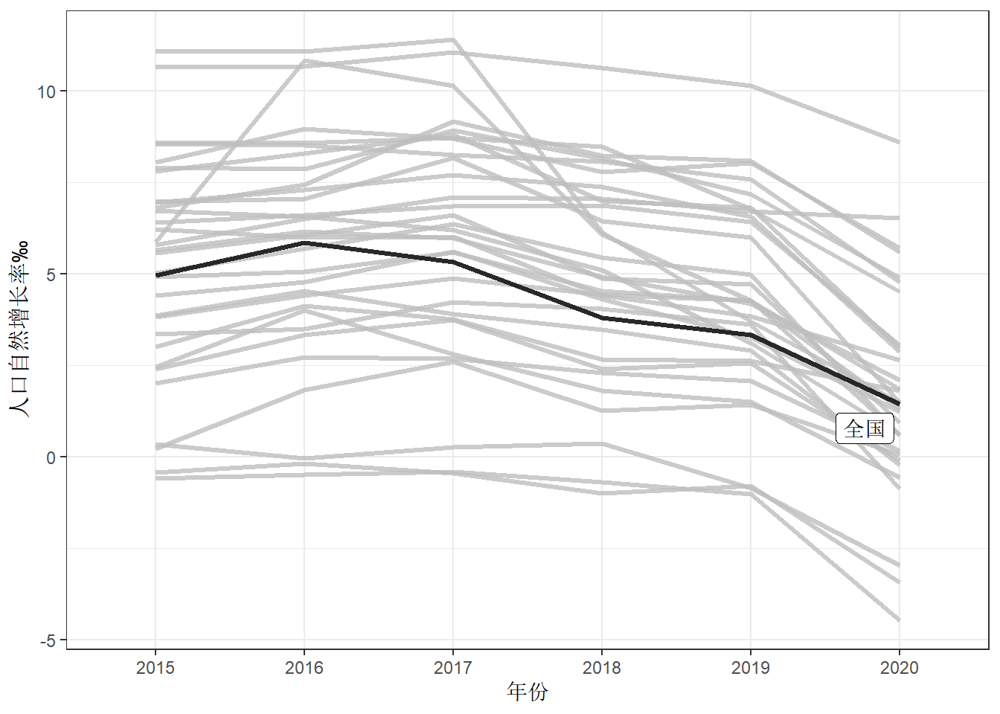

# 七普数据可视化 {#people}

## 数据来源及说明 {#people_1}

1. data_all.xlsx：全国人口状况

   - “自然增长率”：取自年鉴“1-6各地区人口出生率、死亡率和自然增长率”

   - “年龄结构”：取自七普上册“3-2各地区人口年龄构成(一)”

   - “一般年龄结构”：取自年鉴“1-3人口年龄结构和抚养比”

   - “人口流动”：取自七普下册“7-7全国按现住地和五年前常住地分的人口”

   - “人口迁移前十省”：根据表“人口流动”计算得到，不参与代码

   - “新生儿构成”：取自七普下册“6-1各地区分性别、孩次的出生人口”

   - “分时期分年龄分孩次生育率”：取自年鉴“2-40全国育龄妇女分年龄孩次的生育状况”

2. data_db.xlsx：东北人口状况

   - “自然增长率”：取自年鉴“1-6各地区人口出生率、死亡率和自然增长率”

   - “年龄结构与抚养比”：取自七普上册“3-2各地区人口年龄构成(一)”

   - “人口流动”：取自七普下册“7-7全国按现住地和五年前常住地分的人口”

   - “分年龄生育率”：取自七普下册“6-4各地区育龄妇女年龄别生育率”

   - “分孩次生育率”：由于没有各地区平均育龄妇女人数的数据，故取七普上册“1-5各地区分年龄、性别的人口”中的女性育龄人口数进行替代，并取七普下册“6-1各地区分性别、孩次的出生人口”中孩次人数，计算得到生育率，虽然存在一定误差，但仍具有一定的参考价值

## 全国人口状况 {#people_2}

### 人口自然增长率 {#people_2_1}

需要额外导入的包：


``` r
library(gghighlight)  # 元素高亮 gghighlight()函数
```

绘制全国及各省市的自然增长率轮廓图。


``` r
growth_df <- openxlsx::read.xlsx('./dataset/df_all.xlsx', sheet='自然增长率')
head(growth_df)
```

```
##   province ngr_15 ngr_16 ngr_17 ngr_18 ngr_19    ngr_20
## 1     全国   4.96   5.86   5.32   3.81   3.34  1.445681
## 2   北  京   3.01   4.12   3.76   2.66   2.63  1.800000
## 3   天  津   0.23   1.83   2.60   1.25   1.43  0.070000
## 4   河  北   5.56   6.06   6.60   4.88   4.71  0.940000
## 5   山  西   4.42   4.77   5.61   4.31   3.27  1.240000
## 6   内蒙古   2.40   3.34   3.73   2.40   2.57 -0.100000
```

``` r
# 数据预处理，为“全国”添加高亮标签
growth_df <- growth_df %>% mutate(highlight=c('1',rep('0',times=31)))
growth_df <- growth_df %>% pivot_longer(
  cols = c(2:7),names_to = 'year',values_to = 'value'
)

ggplot(growth_df)+
  geom_line(aes(x=year,y=value,group=province),
            linewidth=1.2,alpha=0.8)+
  gghighlight(highlight=='1',use_direct_label = T,
              label_key = province,use_group_by = F)+
  theme_bw()+
  labs(y='人口自然增长率‰',x='年份')+
  scale_x_discrete(labels = c('2015','2016','2017','2018','2019','2020'))
```

<div class="figure" style="text-align: center">

<p class="caption">(\#fig:pop-p1)全国及各省市的自然增长率轮廓图</p>
</div>

### 年龄结构 {#people_2_2}


``` r
age_df <- openxlsx::read.xlsx('./dataset/df_all.xlsx', sheet='年龄结构')
head(age_df)
```

```
##   province young middle   old
## 1     全国 17.97  68.50 13.52
## 2   北  京 11.84  74.86 13.30
## 3   天  津 13.47  71.77 14.75
## 4   河  北 20.22  65.85 13.92
## 5   山  西 16.35  70.74 12.90
## 6   内蒙古 14.04  72.90 13.05
```

``` r
age_demo <- age_df %>% pivot_longer(
  cols = 2:4,names_to = 'age',values_to = 'value'
)
age_demo$age <- factor(age_demo$age,levels = c('old','middle','young'))
age_demo$province <- factor(age_demo$province,levels = unique(as.vector(age_df$province)))

age_demo %>% ggplot(aes(x=fct_rev(province),y=value,fill=age))+
  geom_bar(stat = 'identity')+
  labs(y='比重%',x='',fill='')+
  theme(axis.text.y = element_text(face='bold'))+
  geom_hline(yintercept = 93,linetype='dashed',color='blue')+
  scale_y_continuous(breaks = c(0,10,20,30,40,50,60,70,80,90,93,100))+
  scale_fill_discrete(labels=c('65岁及以上','15-64岁','0-14岁'))+
  coord_flip()
```

<div class="figure" style="text-align: center">

<p class="caption">(\#fig:pop-p2)全国及各省市年龄结构</p>
</div>


``` r
age_series <- openxlsx::read.xlsx('./dataset/df_all.xlsx', sheet='一般年龄结构')
head(age_series)
```

```
##   year young middle  old gross_dep young_dep  old_dep
## 1 2015  16.5   73.0 10.5  36.96755  22.63329 14.33425
## 2 2016  16.7   72.5 10.8  37.90000  22.90000 15.00000
## 3 2017  16.8   71.8 11.4  39.27577  23.39833 15.87744
## 4 2018  16.9   71.2 11.9  40.44104  23.67523 16.76580
## 5 2019  16.8   70.6 12.6  41.50000  23.80000 17.80000
## 6 2020  17.9   68.6 13.5  45.90000  26.20000 19.70000
```

``` r
age_series <- age_series %>% pivot_longer(
  cols = c(2,4),names_to = 'age',values_to = 'value'
)
age_series %>% ggplot()+
  geom_line(aes(x=year,y=value,group=age,color=age))+
  geom_point(aes(x=year,y=value,group=age,color=age))+
  scale_y_continuous(breaks = seq(10,18,1))+
  scale_color_manual(values = c('blue','red'),
                     limits=c('young','old'),
                     labels=c('0-14岁','65岁及以上'))+
  labs(x='年份',y='比重%',color='')
```

<div class="figure" style="text-align: center">

<p class="caption">(\#fig:pop-p3)一般年龄结构</p>
</div>

### 人口流动 {#people_2_3}

需要导入额外的包：


``` r
library(pheatmap)  # 热力图
```


``` r
flow_df <- openxlsx::read.xlsx('./dataset/df_all.xlsx', sheet='人口流动')
head(flow_df)
```

```
##   province  北京 天津  河北  山西 内蒙古  辽宁  吉林 黑龙江 上海 江苏 浙江 安徽
## 1     北京     0 6809 60188 17719   8200 13080  8214  16134 2241 6327 3181 8262
## 2     天津  7417    0 21018  5354   3278  3792  3129   7121  383 1907 1000 3003
## 3     河北 23741 5064     0  6023   5240  5921  4466  11763  499 2822 1670 3947
## 4     山西  2959 1065  7134     0   2454  1256   777   1209  496 2024  936 1669
## 5   内蒙古  2970  937  6552  6866      0  4847  3239   4956  292 1294  693 1239
## 6     辽宁  4003 1317  5158  1897   7685     0 13076  21716  783 2042 1264 2528
##   福建 江西  山东  河南 湖北 湖南 广东 广西 海南 重庆 四川 贵州 云南 西藏 陕西
## 1 2494 3514 21008 28004 7460 4671 4164 1635  650 2682 7991 1867 2055  274 6301
## 2  723 1008  8357  8077 1776  967  733 1030  271  729 2412 1389  925  179 1326
## 3 1198 1524  7418 10851 3646 1668 1345  756  423 1567 4275 1299 1317   89 2785
## 4  959  674  3231  7463 1899  798  753  347  323 1267 4151  836  721   64 3960
## 5  534  490  4101  3539 1148  586  551  229  110  521 2172  434  415   25 5179
## 6  982  667  4908  4647 1131  920 1396  986  268  675 2277 1652  828  125  946
##   甘肃 青海 宁夏 新疆 总流入 总流出  净流出
## 1 5666  541 1005 2306 254643 126748 -127895
## 2 2912  382  384 1292  92274  40762  -51512
## 3 1951  463  427  949 115107 193487   78380
## 4 1132  350  315  424  51646 112519   60873
## 5 4825  388 1991  399  61522  63224    1702
## 6 1241  283  243 1319  86963  94028    7065
```

``` r
group <- c( '东部地区',
            '东部地区','东部地区','中部地区','西部地区','东北地区',
            '东北地区','东北地区','东部地区','东部地区','东部地区',
            '中部地区','东部地区','中部地区','东部地区','中部地区',
            '中部地区','中部地区','东部地区','西部地区','东部地区',
            '西部地区','西部地区','西部地区','西部地区','西部地区',
            '西部地区','西部地区','西部地区','西部地区','西部地区'
)
flow_demo <- flow_df %>% mutate(region=group) %>% relocate(region,.before = province)
flow_demo$region <- factor(flow_demo$region,levels = c('东部地区','东北地区','中部地区','西部地区'))
flow_demo <- flow_demo %>% arrange(region)
flow_demo <- flow_demo[,c(1,2,match(flow_demo$province,colnames(flow_demo)[3:33])+2)]

flow_mat <- as.matrix(flow_demo[,3:33] %>% mutate(across(1:31,~(.-min(.))/(max(.)-min(.)))))
rownames(flow_mat) <- colnames(flow_mat)
diag(flow_mat) <- NA

#会有一堆警告，没找到原因，猜测是编码问题，不影响正常使用
pheatmap(flow_mat,cluster_rows = F,cluster_cols = F,
         angle_col = 0,legend = F,fontsize_row = 8 ,fontsize_col = 8,
         gaps_row = c(10,13,19),gaps_col = c(10,13,19))
```

<div class="figure" style="text-align: center">

<p class="caption">(\#fig:pop-p4)全国人口流动</p>
</div>


