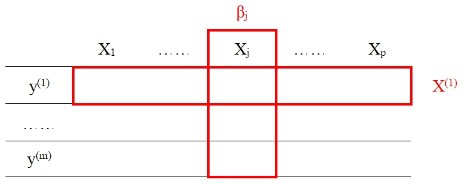

# 整合分析 {#integrative}

本章是对**《大数据的整合分析方法》**[@integrative_1]的讨论。

## 引言 {#integrative_1}

大数据背景下，有关同一问题的数据来源多种多样，这就决定了子样本之间存在**异质性**和**同质性**（矛盾的“对立统一”）。由于都是对同一问题的描述，因此子样本之间必然存在同质性（矛盾的“普遍性”）。又由于数据来源各不相同，在数据采集的过程中必然受到时间、地点、调查方式等诸多因素的影响，从而使得子样本具有独特的数据特征，即异质性（矛盾的“特殊性”）。对此，既不能将所有子样本合并为一个数据集来统一建模而无视差异，也不能对各个子样本各自建模而忽略相关性，**整合分析**应运而生。

同样，整合分析也是解决“大p小n”问题的有效方式。“大p小n”问题表现为大数据的**来源差异性、高维性和稀疏性**等特点。数据采集能力的提升拓宽了数据的来源渠道，即**来源差异性**；在这个过程中，数据维度也在不断增加，不可避免地会纳入与研究目的无关的变量，即**高维性**特征；信息的边际价值并未随数据量的增加而增加，即**稀疏性**。

鉴于此，本篇文章采用基于惩罚方法的整合分析对多个数据集进行分析。根据[前一章](#penalty)的内容，我们已经了解到惩罚函数在单个数据集上具有单个变量或群组变量筛选的功能，将其思想推广至整合分析领域，便是本篇文章的主要内容。

## 模型基本形式 {#integrative_2}

假设有$M$个数据集，$p$个解释变量。第$m$个数据集的样本量为$n^{(m)}$，因变量$y^{(m)}$为$n^{(m)} \times 1$向量，解释变量$X^{(m)}$为$n^{m} \times p$矩阵，假设数据已经被标准化。

对第$m$个数据集建立如下模型：

$$
y^{(m)}=X^{(m)}\beta^{(m)}+\epsilon^{(m)} (\#eq:integrative-eq1)
$$

其中，$\beta^{(m)}=(\beta_1^{(m)}, \cdots,\beta_p^{(m)})'$为回归系数，$\epsilon^{(m)}$满足$E(\epsilon^{(m)})=0$、$Var(\epsilon^{(m)})=\sigma^2_{(m)}$。

由此拓展到所有数据集中，则

$$
\beta=\textrm{argmin}\{L(X,y;\beta)+P(\beta;\lambda)\} (\#eq:integrative-eq2)
$$

其中$y=(y^{(1)'},\cdots,y^{(M)'})'$为$\sum\limits_{m=1}^M n^{(m)} \times 1$的因变量，$X=diag(X^{(1)},\cdots,X^{(m)})$为$\sum\limits_{m=1}^M n^{(m)} \times Mp$的设计矩阵，$\beta=(\beta^{(1)'},\cdots,\beta^{(M)'})'$为$Mp \times 1$的未知参数向量。$L(X,y;\beta)=\sum\limits_{i=1}^M L(X^{(m)},y^{(m)};\beta^{(m)})$是所有数据集上的损失之和，$L(\cdot)$可取平方损失或负向对数似然损失。$P(\lambda;\beta)$是惩罚函数，$\lambda$用于调控惩罚力度，$\lambda$越大，惩罚力度越大，$\beta$被压缩得越严重，估计为零的回归系数也就越多。

$$
\begin{pmatrix}
y^{(1)}\\
\vdots \\
y^{(m)}
\end{pmatrix}=
\begin{pmatrix}
X^{(1)}\beta^{(1)}+\epsilon^{(1)}\\
\vdots \\
X^{(m)}\beta^{(m)}+\epsilon^{(m)}
\end{pmatrix}=
\begin{pmatrix}
X^{(1)} & & \\
& \ddots & \\
 & & X^{(m)}
\end{pmatrix}
\begin{pmatrix}
\beta^{(1)} \\
\vdots \\
\beta^{(m)}
\end{pmatrix}+
\begin{pmatrix}
\epsilon^{(1)} \\
\vdots \\
\epsilon^{(m)}
\end{pmatrix}
$$

记$X_j$在所有数据集中的回归系数为$\beta_j=(\beta_j^{(1)},\cdots,\beta_j^{(m)})'$。在整合分析中，由于$\beta_j$归属于同一个自变量$X_j$，故$\beta_j$内部之间具有一定程度的关联性或相似性，即可将其视为**群组**。

(\#fig:integrative-p1)数据结构

## 同构数据的整合分析 {#integrative_3}

在同构数据中，常见于调查问卷相同、实验设计相同等数据收集方式一致的情形中，自变量在$M$个数据集中的显著性是一致的，即**若$X_j$在数据集$m$中显著，则它在所有数据集中都显著**。鉴于此，可以将$\beta_j$视作一个群组并采取[组变量的选择方法](@#penalty_3_3)进行筛选。

1. L~2~ Group Bridge

$L_2 \; Group \; Bridge$为组内$L_2$惩罚，组间$Bridge$惩罚，其惩罚函数为

$$
P(\beta;\lambda,\gamma)=\lambda\sum_{j=1}^p ||\beta_j||^\gamma=\lambda\sum_{j=1}^p((\sum_{i=1}^M (\beta_j^{(i)})^2)^{1/2})^\gamma (\#eq:integrative-eq3)
$$

若以$Group \; Lasso$估计作为初始值进行迭代估计，可以证明**$L_2 \; Group \; Bridge$满足选择一致性**。

2. L~2~ Group MCP

$L_2 \; Group \; MCP$组内为$L_2$惩罚，组间为$MCP$惩罚，其惩罚函数为

$$
P(\beta;\lambda,a)=\sum_{j=1}^p P_{MCP}(||\beta_j||;\lambda,a) (\#eq:integrative-eq4)
$$

关于$MCP$函数的介绍可以参见[Mnet](@#penalty_3_2_2)。

3. Group Lasso

$Group \; Lasso$组内和组间都是$L_1$惩罚，其惩罚函数形式为

$$
P(\beta;\lambda)=\lambda\sum_{j=1}^p ||\beta_j|| (\#eq:integrative-eq5)
$$

## 异构数据的整合分析 {#integrative_4}

在异构数据中，不同数据集中同一个自变量的显著性不一定相同，因此涉及到[双层变量选择](@#penalty_3_4)。

1. L~1~ Group MCP

$L_1 \; Group \; MCP$组内$L_1$惩罚，组间为$MCP$惩罚，其惩罚函数为

$$
P(\beta;\lambda,a)=\sum_{j=1}^p P_{MCP}(||\beta_j||_1;\lambda,a) (\#eq:integrative-eq6)
$$

经证明，$L_1 \; Group \; MCP$仅满足组间选择一致性。

2. Group MCP

$Group \; MCP$又称$Composite \; MCP$，组内、组间都是$MCP$惩罚，其惩罚函数为

$$
P(\beta;\lambda,a,b)=\sum_{j=1}^p P_{MCP}(\sum_{m=1}^M P_{MCP}(|\beta_j^{(m)}|;\lambda,a);\lambda,b) (\#eq:integrative-eq7)
$$

经证明，$Group \; MCP$在组内和组间均满足选择一致性。

3. L~1~ Group Bridge

$L_1 \; Group \; Bridge$组内为$L_1$惩罚，组间为$Bridge$惩罚，其惩罚函数为

$$
P(\beta;\lambda)=\lambda\sum_{j=1}^p p_j||\beta_j||_i^\gamma (\#eq:integrative-eq8)
$$

4. Sparse Group Lasso & Adaptive Sparse Group Lasso

$Sparse \; Group \; Lasso$与$Adaptive \; Sparse \; Group \; Lasso$都是基于$Lasso$的惩罚方法，两者的惩罚函数分别为

$$
P_{SGL}(\beta;\lambda_1,\lambda_2)=\lambda_1\sum_{j=1}^p ||\beta_j||+\lambda_2||\beta||_1 \\
P_{adSGL}(\beta;\lambda_1,\lambda_2)=\lambda_1\sum_{j=1}^p w_j||\beta_j||_2+\lambda_2\xi'|\beta| (\#eq:integrative-eq9)
$$

由于#SGL#是$Lasso$和$Group \; Lasso$的线性组合，两者在理论上都不满足$Oracle$性质，预期$SGL$也不满足$Oracle$性质。而$adSGL$通过引入组权重$w$和单个系数权重$\xi$，改进**选择一致性和估计一致性**。

## 具有网络结构关系的整合分析 {#integrative_5}

在同一个数据集中，不同解释变量之间可能存在相互作用关系（也意味着是系数间的相互作用关系），从而形成了一张网络结构图，此种关系称为“数据集内部结构”。针对网络结构的惩罚函数如下所示

$$
P(\beta;\lambda)=\lambda\sum_{1 \leq j,k \leq p}a_{jk}(\frac{||\beta_j||_2}{\sqrt{M_j}}-\frac{||\beta_k||_2}{\sqrt{M_k}})^2 (\#eq:integrative-eq10)
$$

其中$a_{jk}$由网络图得到，描述了两个节点之间是否相连以及链接的强度。若$X_j$和$X_k$越相似，则其惩罚越重($a_{jk}$越大)，从而拉近$\beta_j$和$\beta_k$之间的距离，它们的估计值越相近。

同一解释变量在不同数据集中的系数存在某种相似性，称之为“跨数据集结构”。对此有$Contrast$惩罚，惩罚函数如下所示

$$
P_C(\beta)=\lambda\sum_{j=1}^p \sum_{k \neq l} a_j^{(kl)}(\beta_j^{(k)}-\beta_j^{(l)})^2 (\#eq:integrative-eq11)
$$

其中$a_j^{(kl)}=I(sgn(\beta_j^{(k)})=sgn(\beta_j^{(l)}))$。简而言之，就是若$\beta_j^{(k)}$和$\beta_j^{(l)}$的符号相同，则$a_j^{(kl)}$取1，那么在最小化的目标下会拉近$\beta_j^{(k)}$和$\beta_j^{(l)}$之间的距离，反之为0。
